# Blockchain

## 1 Einleitung

### 1.1 Motivation

Bei der Blockchain handelt es sich um eine Technologie zur Speicherung von Daten, die über Schnittstellen gelesen und bearbeitet werden können. Im Gegensatz zu Datenbanken, die in der Regel über eine Client-Server-Architektur verfügen, bestehen Blockchain-Netzwerke aus mehreren gleichberechtigten Knoten, die ein Peer-to-Peer Netzwerk bilden und unabhängig voneinander eine gemeinsame Datenbasis pflegen.

Die Blockchain dient als grundlegende Technologie des Bitcoin und wurde erstmals in dem Paper "Bitcoin: A Peer-to-Peer Electronic Cash System" unter dem Pseudonym Satoshi Nakamoto veröffentlicht. Mit dem Bitcoin konnte erstmals die Machbarkeit eine elektronischen Währung ohne zentrale Kommunikationsstelle bestätigt werden. Durch die Blockchain wird hier ein vertrauenswürdiger Austausch zwischen zwei Parteien ermöglicht.

Während der Einsatz der Blockchain für digitale Währungen immer noch die zentrale Anwendung ist, gibt es mittlerweile auch andere Anwendungsbereiche in denen die Blockchain eingesetzt wird, wie zum Beispiel dem maschinellen lernen.

## 1.2 Umfang

Im folgenden Teil der Einleitung werden zunächst die der Blockchain zugrundeliegenden Technologien erläutert. Daraufhin wird die Funktionsweise der Blockchain selbst beschrieben und abschließend werden Smart-Contracts vorgestellt, die es ermöglichen, Operationen in Form von Algorithmen in der Blockchain zu hinterlegen. In Kapitel 2 werden verschiedene Anwendungsfälle der Blockchain außerhalb des Finanzbereiches dargestellt. In Kapitel 3 folgt eine Darstellung der Punkte in denen sich verschiedene Blockchain Anwendungen voneinander abgrenzen lassen. In Kapitel 4 die Architektur von Blockchain basierten Anwendung vorgestellt. Anschließend folgt in Kapitel 6 die Darstellung bereits existierender Blockchain Anwendungen, wie Bitcoin und Ethereum. Abschließend folgt in Kapitel 7 Darstellung von Beispielen für Smart-Contracts in Ethereum.

### 1.3 Grundlegende Technologien

Die der Blockchain zugrundeliegenden Technologien sind bereits gut erforscht und stammen aus der Informatik beziehungsweise der Kryptographie. Konkret handelt es sich bei diesen Technologien um Hash-Funktionen, kryptographische Puzzles, Hash-Bäume und digitale Signaturen für Nachrichten.

#### 1.3.1 Hash-Funktionen

Bei Hash-Funktionen handelt es sich um Funktionen, die eine Menge an Informationen beliebiger Größe als Eingabemenge auf einen Zielbereich fixer Größe abbilden können. Der Zielbereich ist dabei wesentlich kleiner als der Eingabereich und die Hash-Funktion soll so gestaltet sein, das es möglichst zu keinen Kollisionen im Zielbereich kommt. Die Hash-Funktion muss daher den Zielbereich möglichst gut ausnutzen können und dementsprechend für ähnliche Eingabewerte komplett unterschiedliche Zielwerte errechnen. Zusätzlich soll man aus dem Zielwert keine Rückschlüsse auf den Eingabewert ziehen können. Diese Eigenschaft Ermöglicht es, mithilfe des Zielwertes die Korrektheit des Eingabewertes sicherzustellen.

Sogenannte kryptographische Hash-Funktionen, die bei der Blockchain zum Einsatz kommen müssen zusätzlich unter anderem die folgenden Eigenschaften erfüllen:

- starke Kollisionsresistenz

- praktisch unmöglich von Zielwert auf Eingabewert zu schließen
- unmöglich durch Variation des Eingabewertes einen bestimmten Zielwert zu erzeugen

Eine Hash-Funktion, die diese Eigenschaften bietet der SHA-256-Hash-Algorithmus. In der folgenden Tabelle  werden Beispielhaft zwei Hash werte dargestellt, die mit diesem Algorithmus berechnet wurden. Dabei ist zu sehen, dass obwohl die Eingabewerte sich nur in einer Stelle unterscheiden nahezu komplett unterschiedliche Hash-Werte generiert wurden.

| Eingabewert             | SHA-256-Hash-Wert                                            |
| ----------------------- | ------------------------------------------------------------ |
| A bezahlt B 10 Bitcoin. | 30AF6E0870081E16E20BEC0923DF8CB3A0D49EB29CFB772B2DD6377CCBCB71B4 |
| A bezahlt B 11 Bitcoin. | 4AEFD39DA0278DA3383D67AC30E8CD0E53ACD7114DCA6337750EBE58E0999789 |

#### 1.3.2 Kryptographische Puzzle

In der Blockchain werden die oben beschriebenen Eigenschaften von Hash-Funktionen genutzt um kryptographische Puzzle zu erzeugen. Dabei geht es darum einen gegebenen Eingabewert so zu variieren, das der Ausgabewert in einem bestimmten Wertebereich liegt. Beispielswiese soll in der Eingabe "A bezahlt B 11 Bitcoin. XXXX" die Stelle XXXX so ersetzt werden, das ein SHA-256-Hash-Wert mit sieben führenden Nullen entsteht. Dies ist allerdings nur durch reines Ausprobieren verschiedener Möglichkeiten realisierbar.

Durch die kryptographischen Puzzle lässt sich eine zufällige Auswahl in einer Menge an Teilnehmern eines Netzwerkes treffen, ohne die Notwendigkeit einer zentralen Stelle. Dazu wir das Puzzle im Netzwerk Veröffentlicht und der Teilnehmer, der das Puzzle als erstes löst wird ausgewählt. Da jeder Teilnehmer nur verschiedene Möglichkeiten durchprobieren kann, hängt die Auswahl vom Zufall ab.

### 1.3.3 Hash-Bäume

Hash-Bäume, oder auch Merkle-Bäume genannt, dienen zur Überprüfung ob bestimmte Informationen innerhalb einer Ansammlung von Daten vorhanden sind. Dabei wird, wie in der unteren Abbildung gezeigt, für jede Information ein Hashwert berechnet, welche anschließend immer weiter zu einem Root-Hash kombiniert werden. Mithilfe des Root-Hash lässt sich anschließend überprüfen, ob die zugrundeliegenden Informationen verändert wurden. Um zu überprüfen, ob eine Information in den Daten vorhanden ist, muss ihr Hash-Wert berechnet werden und in Kombination mit den anderen Hash-Werten anschließend der Root-Wert berechnet werde. Gelingt die Berechnung des Root-Wertes, ist die Information Teil der Daten. 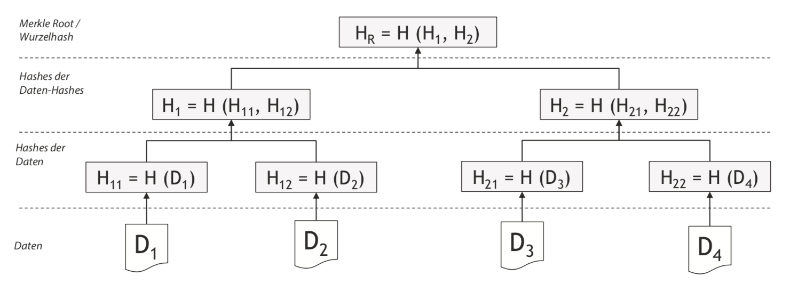

#### 1.2.4 Digitale Signaturen

Eine weitere Grundlegende Technologie der Blockchain, ist die der Digitalen Signaturen. Diese basiert auf asymmetrischen Verschlüsselungsverfahren. Bei diesen Verschlüsselungsverfahren verfügen die einzelnen Kommunikationspartner über jeweils einen öffentlichen und einen privaten Schlüssel. Der öffentliche Schlüssel ist dabei frei für jeden zugänglich und der private Schlüssel wird lokal gesichert. Nachrichten, die mit dem öffentlichen Schlüssel einer Person verschlüsselt werden, können von dieser Person mit dem privaten Schlüssel wieder entschlüsselt werden und umgekehrt. 

In der unten stehenden Abbildung wird der Vorgang einer Digitalen Signatur beschrieben. Dabei wird der Hash der zu übertragenen Nachricht von Alice mit ihrem privaten Schlüssel verschlüsselt beziehungsweise signiert. Anschließend kann der Empfänger der Nachricht, in diesem Falle Bob die Nachricht mit Alice öffentlichen Schlüssel wieder entschlüsseln und so sicherstellen, dass Alice der tatsächliche Sender der Nachricht ist.

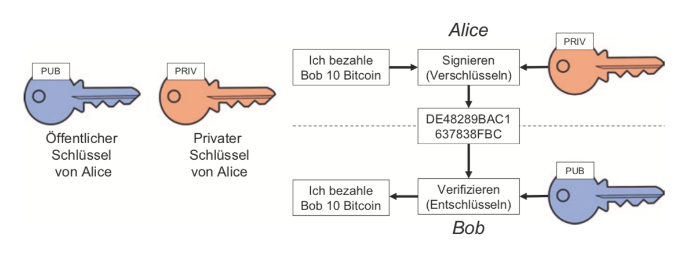

### 1.4 Aufbau und Funktionsweise von Blockchains

Mithilfe der Vorherigen Abschnitt vorgestellten Technologien lässt sich nun eine Blockchain aufbauen. Da es noch keinen einheitlichen Standard für Blockchains gibt muss jede Blockchain separat beschrieben werden. Im Folgenden wird der Aufbau und die Funktionsweise der Blockchain am Beispiel des Bitcoin vorgestellt.

In der unteren Abbildung ist dabei der Aufbau der einzelnen Blöcke zu sehen. Auf der untersten Ebene des Blockes befinden sich dabei die Daten zu einzelnen Transaktionen in der Blockchain. Im Falle des Bitcoin handelt es sich hierbei um die Übertragung der digitalen Währung, die als Übertragung von öffentlichen Schlüsseln der Teilnehmer dargestellt werden.

Aus diesen Transaktionen wird mithilfe der Hash-Bäume ein Root-Hash berechnet und in dem Block-Header gespeichert. Zudem befindet sich im Block-Header ein Zeitstemple, die Version der Blockchain Implementierung, den Hasch des vorherigen Blockes ,ein Traget Wert und ein Nonce-Wert. Über den Target Wert wird die Schwierigkeit eines kryptografischen Puzzles angegeben. Die Schwierigkeit wird dabei an die im Netzwerk zur Verfügung stehenden Rechenleistung angepasst. Bei dem Nonce-Wert handelt es sich um einen Zahlenwert, durch dessen Variation die einzelnen Knoten des Netzwerkes versuchen das kryptographische Puzzle zu lösen. Wenn ein Knoten eine Lösung des Problems findet sendet er diese an alle anderen Knoten im Netzwerk. Diese können durch Angabe des Nonce Wertes die Korrektheit der Lösung prüfen und den Block zu ihrer Blockchain hinzufügen. Dieses Verfahren zum generieren neuer Blöcke wird *proof-of-work* genannt.

Die Blockchain bildet sich dabei durch die Angabe des Hash-Wertes des vorherigen Blockes. Dadurch muss man, um die Transaktionen in einem Block zu verändern auch die Werte des Nachfolgenden Blöcke neu berechnen. Da dies durch die kryptographischen Puzzle mit einem hohen Rechenaufwand verbunden ist, können die Daten nicht manipuliert werden, solange ein Großteil der Rechenleistung des Netzes bei korrekt arbeitenden Knoten liegt.

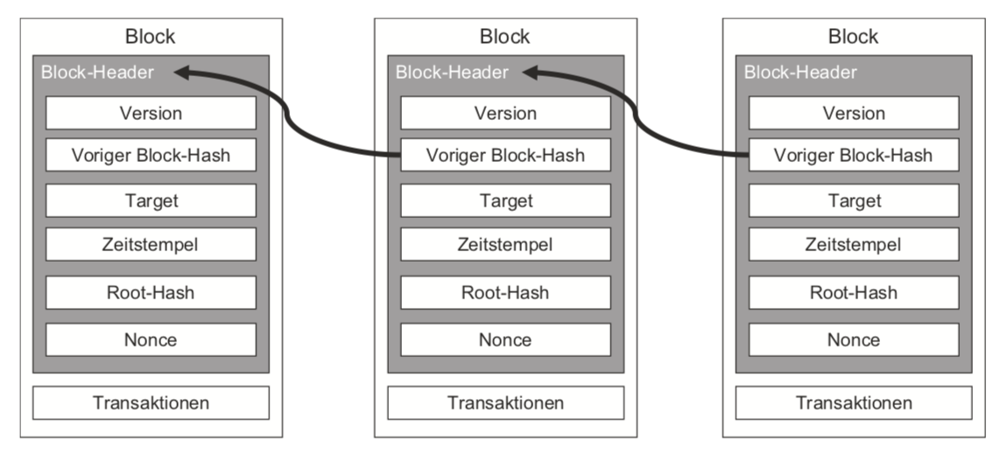

### 1.5 Smart-Contracts

Neben Transaktionen lassen sich in der Blockchain auch andere Informationen speichern. Bei Smart-Contracts war zunächst die Erfassung von digitalen Vertragsbedingungen vorgesehen, die ohne Einflussnahme Dritter algorithmisch ausgeführt werden. Heute können über Smart-Contracts Anweisungen hinterlegt werden, die bei Ausführung weiterer Transaktionen überprüft beziehungsweise Ausgeführt werden. So lassen sich komplexe Abläufe beschreiben, die auf den aktuellen Zustand der Blockchain reagieren. Die mögliche Komplexität der Anweisung hängt dabei allerdings stark von der zugrunde liegenden Blockchain-Plattform ab.

## 2 Anwendungsfälle

### 2.1 Landwirtschaftliche Wertschöpfungskette

In einer Wertschöpfungskette kann der Austausch von Informationen genauso wichtig sein, wie der Austausch der Waren selbst. In der landwirtschaftlichen Wertschöpfungskette für Nahrung ist es wichtig festzuhalten wo die Bestandteile Angebaut, verarbeitet und wie sie Verteilt wurden, um eine Lebensmittelsicherheit zu erreichen. Die Informationssysteme zur Unterstützung einer Wertschöpfungskette, werden normalerweise von den einzelnen Teilnehmern separat gepflegt. So kann jeder Teilnehmer der Kette nur die Informationen zu dem Schritt sehen, an dem er direkt beteiligt ist. Im Zuge der Digitalisierung wurde die Verteilung von Information geläufiger. Ein Möglichkeit zum Verteilen der Informationen ist das Einrichten eines Zentralen Servers in dem wichtige Ereignisse in der Wertschöpfungskette für alle Teilnehmer zentral gespeichert werden.

Eine alternative Lösung mit der Verwendung einer Blockchain, ist die Kontrolle des Wertschöpfungskette mithilfe von Smart-Contracts. Die Teilnehmer der gemeinsamen Wertschöpfungskette legen zunächst ein Design für den gemeinsamen Prozess fest und legen fest wie die Interaktionen untereinander ablaufen sollen. Die Kontrolle des Prozesses wird in Smart-Contracts implementiert und wird koordiniert, idem die Teilnehmer die Smart-Contracts abwechselnd aufrufen. Smart-Contracts den Prozess wie folgt stützen:

- Nachrichten werden abgewiesen, wenn sie an der falschen Stelle des Prozesses stehen
- Nachrichten werden nur von dem Teilnehmer angenommen, der autorisiert ist sie zu senden
- Bedingungen können im Prozess Model aufgeführt werden und direkt durch Smart-Contract-Code ausgeführt werden

Auf diese Weise können Prozesszweige automatisch angestoßen werden, wenn die dafür nötigen Bedingungen erfüllt sind. In dem daraus resultierenden System kommunizieren die einzelnen Teilnehmer der Wertschöpfungskette durch senden von Nachrichten über die Blockchain. Um die Kommunikation über die Blockchain zu erleichtern werden "Trigger" Komponenten verwendet, die konventionelle Service Aufrufe in Blockchain Transaktionen umwandeln können und umgekehrt.

Derzeit arbeitet IBM an einer Blockchain basierten Lösung für Wertschöpfungsketten. Diese Basiert auf Hyperledger Fabric.

Vor allem die Corona-Pandemie hat gezeigt, wie wichtig intakte Lieferketten sind. Um diese Lieferketten zu automatisieren und Informationen transparent zu gestalten, kann die Blockchain eingesetzt werden.

### 2.2 Open Data Registry

Register sind Sammlungen von Informationen, die Zentral, meist von Regierungseinheiten, verwaltet werden. In einem Register werden dabei Informationen zu einer bestimmte Klasse von Entitäten gespeichert. Hierbei kann es sich Beispielsweise um Personen oder Unternehmen handeln. Manche Regierungsregister sind öffentlich und können von jedem eingesehen werden, wie zum Beispiel das Handelsregister.

Bei Daten Portalen wie zum Beispiel data.gov.au wird einen Daten Register mit konventionellen Methoden implementiert. Das Register wird dabei zentral von der Regierung verwaltet und kann den Zugang auf die Daten individuell einstellen. Die Konsumenten der Daten können über das Register die verschiedenen Datensätze finden. Das Anfordern der eigentlichen Daten erfolgt anschließend direkt vom Data Provider. Die folgende Abbildung zeigt die grundlegende Architektur dieses Aufbaus.

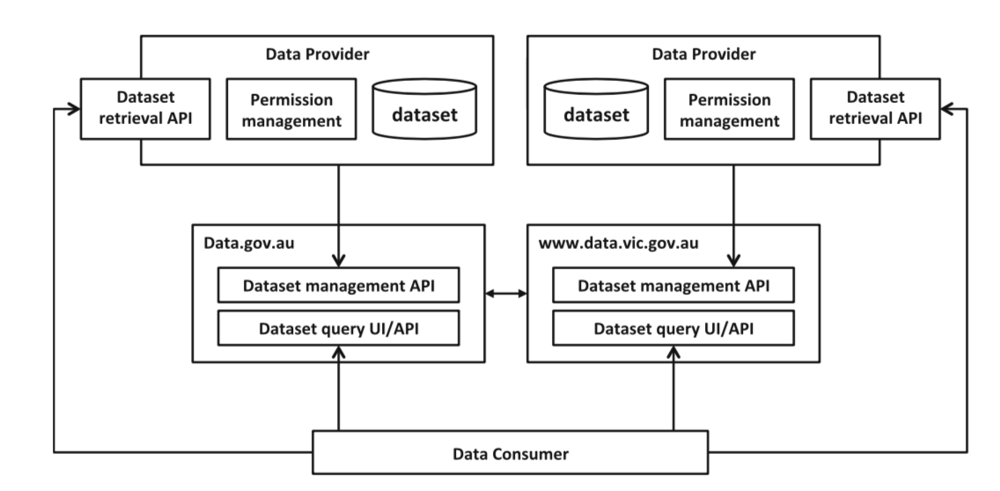

Eine mögliche Verwendungsmöglichkeit der Blockchain ist es nun, dass zentral Verwaltetet Register durch eine Blockchain zu ersetzen. Die daraus entstehende Architektur wird in der folgenden Abbildung grob dargestellt. Statt einer zentralen Verwaltungsstelle verwalten hier die Data Provider individuell den Datenzugang.

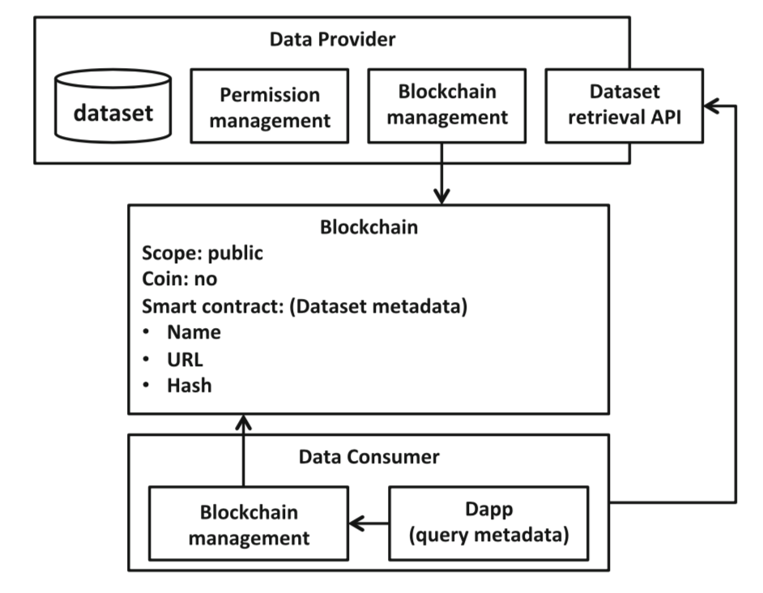

### 2.3 Blockchain und maschinelles Lernen

Die Blockchain und maschinelles lernen sind zwei der aktuell Erfolgversprechendsten Technologien. Wobei jede neue Technologien auch neue Herausforderungen mit sich bringt. Beim maschinellen Lernen liegt die Herausforderung im hohen Bedarf an Daten, Hardware-Ressourcen und menschlicher Expertise. Das zentrale Versprechen der Blockchain ist es nun gerade diese Ressourcen zu demokratisieren. Im Folgenden wird gezeigt, wie maschinelles Lernen genutzt werden kann um die Blockchain zu unterstützen und wie die Blockchain wiederum maschinelles Lernen unterstützen kann.

#### 2.3.1 Maschinelles Lernen zur Unterstützung der Blockchain

Da alle Transaktionen innerhalb der Blockchain öffentlich sind, kann maschinelles Lernen verwendet werden, um unnatürliches Verhalten frühzeitig zu erkennen. So lassen sich Angriffe auf die Blockchain vereiteln, die mögliche Fehler in Smart-Contracts oder anderen Bereichen ausnutzen.

Auch lässt sich mit maschinellem Lernen eine Administration einrichten, die Komponenten der Blockchain verändern kann. Auf diese wiese können Probleme in der Skalierung behoben werden, indem die Blockgröße auf die aktuelle Menge an Transaktionen angepasst werden kann. Nach aktuellem Stand, sind die Werte, in welcher Rate ein neuer Block erstellt wird und wie viele Transaktionen ein Block beinhaltet von der jeweiligen Blockchain-Plattform konstant festgelegt sind. Wenn maschinelles Lernen in die Software an jedem Knoten eingebettet wird, könnte eine dynamische transparente Anpassung erfolgen.

Eine andere Möglichkeit zum Einsatz des maschinellen Lernend auf die Blockchain, ist es bei Kryptowährungen Verhaltensmuster zu erkennen und so zusammenhängende Gruppierungen bilden zu können. Auf diese Weise kann Untersucht werden, wie Anonym die Transaktionen tatsächlich sind.

#### 2.3.2 Blockchain zur Unterstützung des maschinellen Lernens

Während der Einsatz des maschinellen Lernens zur Unterstützung der Blockchain am naheliegendsten ist, gibt es deutlich mehr Literatur für den umgekehrten Fall.

Zum einen lässt sich die Blockchain zur Sicherstellung der Integrität, Verfügbarkeit und Vertraulichkeit sicherstellen. Die eigentlichen Daten werden dabei außerhalb der Blockchain gespeichert und können über eine Blockchain verwaltet werden. Auf die Wiese können Nutzer Daten anbieten, ohne die Kontrolle über diese zu verlieren. Die Blockchain dient in diesem Fall als eine Identifizierungs- und Authentifizierungsplattform.

Mithilfe von Smart-Contracts lässt sich eine Automatisierung im Lernprozess erreichen. Da es sich bei Smart-Contracts um transparente automatisierte Skripte handelt, kann das Auftreten menschlicher Fehler reduziert werden.

Die Blockchain kann als Speicherung von Metadaten der eigentlichen Dateien dienen, die lokal gespeichert werden. In Branchen, wie dem medizinischen Bereich, wo es für Dritte schwierig ist auf diese Dateien zuzugreifen, könne dezentrale Blockchain Lösungen verwendet werden. Die Auswertung dezentral Verfügbarer Daten war bisher aus den folgenden Gründen erschwert:

- Fehlende Austauschmechanismen 

- Mangelnde Sicherheit und Schutz der Privatsphäre 
- Mangelnde Datenintegrität 
- Dateneigentum 
- Hohe Kosten für die zentrale Datenspeicherung 

Für ersten vier Punkte kann hierbei mit der Blockchain-Technologie und einer dezentralen Datenspeicherung eine gut Grundlage geschaffen werden.

## 3 Variationen der Blockchain

Seit der Entstehung von Bitcoin 2008 entstanden viele verschiedene Blockchains. Da Blockchains sich noch in einer frühen Phase der Entwicklung befinden, gibt es wenig verlässliche Technologien, um verschiedene Blockchains zu vergleichen. Beim Erstellen einer neuen Blockchain Anwendung, muss man zunächst die Eigenschaften herausarbeiten, die die Blockchain haben soll. In diesem Kapitel werden verschiedene Punkte vorgestellt, in denen Blockchains sich voneinander unterscheiden können.

### 3.1 Dezentralisierung

Dezentralisierung ist eine der grundlegenden Fähigkeiten der Blockchain. Allerding kann hier zwischen verschiedenen Stufen der Dezentralisierung unterschieden werden. In einem zentralen System liegt die zentrale Autorität auf einem Punkt und es gibt einen single Point of Failure. Im Gegensatz Dazu steht ein komplett dezentrales System, wie zum Beispiel Bitcoin, welches Personen ermöglicht festzustellen, welche Ressourcen wem gehören, ohne jemanden Vertrauen zu müssen. Diese Systeme haben eine hohe Verfügbarkeit, da jeder Knoten unabhängig arbeitetet und somit eine hohe Redundanz herrscht. Die folgende Tabelle zeigt ein Spektrum zwischen komplett zentralen und komplett dezentralen Systemen. In der Tabelle wird gezeigt, dass eine Kombination aus einem zentralen und einem dezentralen System möglich ist. So können Beispielsweise alle Knoten die Blockchain einsehen, aber nur eine bestimmte Menge Knoten auf dieser schreiben.

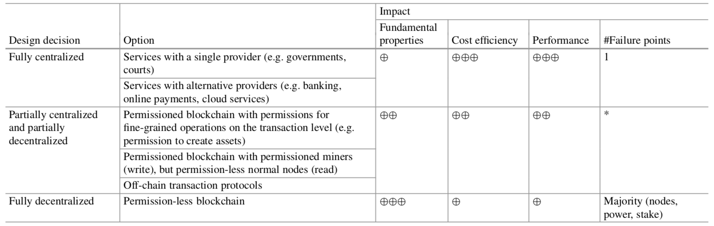

### 3.2 Ledger Struktur

Bei einer distributed Ledger handelt es sich um eine Sammlung von Transaktionen, bei der es nur möglich ist neue Daten hinzuzufügen. Diese Ledger wird an viele verschiedene Rechner verteilt. Bei einer Blockchain handelt es sich nun um eine spezielle Variante einer solchen distributed ledger. Es handelt sich um eine Ledger, die aus miteinander verknüpften Blöcken besteht. Es gibt nun verschiedene Arten diese Ledger aufzubauen. Die folgende Tabelle gibt einen Überblick über diese Varianten. Bei Bitcoin wird hierfür eine globale Liste von Blöcken verwendet.

Andere Blockchain und distributed Ledger Systeme verwenden andere     Datenstrukturen. Beispielsweise wird bei [Hashgraph](https://www.hedera.com/) ein directed acyclic graph (DAG) statt einer Liste verwendet.

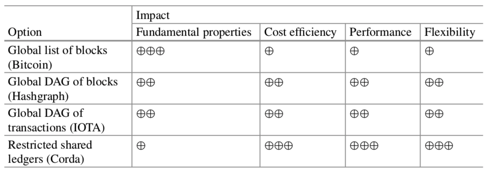

### 3.3 Consensus Protokoll

Wenn zwei Knoten gleichzeitig einen neuen Block erstellen und an die anderen Knoten im Netzwerk weiterleiten, können die Lösungen bei den einzelnen Knoten in einer unterschiedlichen Reihenfolge auftauchen. Die Entscheidung welche Lösung verwendet wird, beruht auf einem einheitlichen Consensus Protokoll innerhalb des Netzwerkes. Im Gegensatz dazu gibt es bei Hyperledger Fabric einen modularen Aufbau, der einen austauschbare Implementation des Protokolls bietet. Die folgende Tabelle stellt verschiedene Consensus Protokolle und ihre Auswirkungen dar. 

Der typische Ansatz wird Nakamoto Consensus genannt und beruht darauf, dass jeder Knoten immer die längste Blockkette auswählt, die er beobachtet hat. Eine alternative Nakamoto Consensus den Bitcoin verwendet, ist Beispielsweise der *proof-of-stake* Mechanismus. Hierbei wird die Lösung von dem Miner ausgewählt, der über die meisten Einheiten der digitalen Währung der Blockchain verfügt.

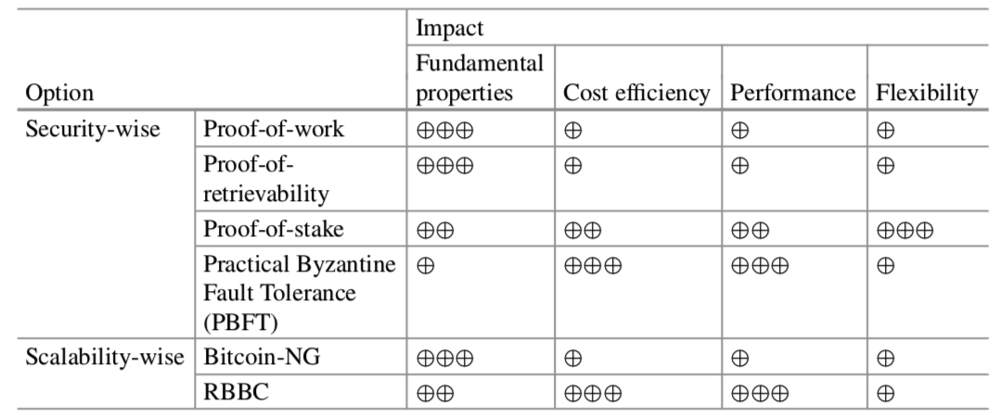

### 3.4 Block Konfiguration

Die Konfiguration eines Blockes betrifft die Anzahl und Komplexität der Transaktionen, die in einem Block gespeichert werden und die Frequenz mit der neue Blöcke erstellt werden. Die Verschiedenen Konfigurationsmöglichkeiten wirken sich dabei auf die Rate aus, in der Transaktionen verarbeitet werden können. Die folgende Tabelle gibt einen Überblick darüber. Eine Konfigurationsmöglichkeit wäre es Beispielsweise die Schwierigkeit des kryptographischen Puzzle zu senken, wodurch Blöcke schneller generiert werden können. Durch vergrößern eines Blockes können mehrere Transaktionen auf einmal bearbeitet werden, allerding sind große Blöcke schwerer zu replizieren.

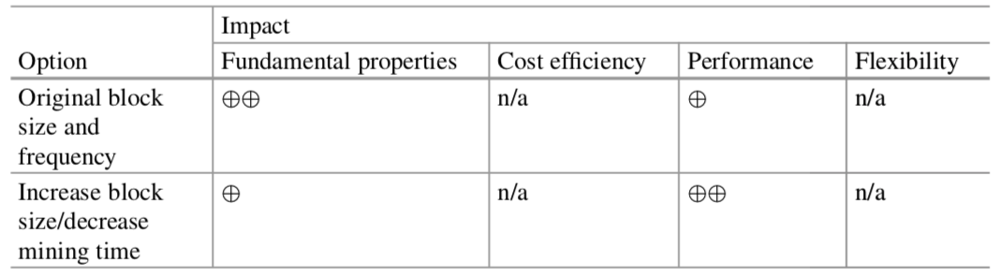

### 3.5 Anreize

Verschiedene Blockchain Plattformen bieten verschiedene Anreize dem Netzwerk beizutreten. Bei Bitcoin zum Beispiel erhalten Knoten die einen neuen Block erstellt haben, eine Belohnung für das
Erstellen in Form eines neuen Coins und einen Teil der Transaktionskosten. Knoten im Ethereum Netzwerk erhalten ebenfalls einen Belohnung für das ausführen einen Smart-Contracts in Form von Ether, der Währung der Ethereum Plattform.

## 4 Architektur Blockchain basierter Anwendugen

### 4.1 Blockchain in der Software Architektur

Die Architektur einer Anwendung lässt sich aus mehreren Software-Komponenten zusammensetzen. In Blockchain basierten Anwendung ist die Blockchain eine solche Komponente. Wie für jede Komponente muss auch für die Blockchain entscheiden werden, welche Funktionalitäten von ihr abgedeckt werden sollen. Die wichtigste Entscheidung ist dabei, welche Daten in der Kette in der Kette gespeichert werden sollen und welche nicht. Eine Blockchain kann dabei in der Anwendung verschiedene Funktionen erfüllen.

Eine Funktion ist es, die Blockchain als Speicherelement für Daten zu verwenden. Auch lassen sie sich als Rechenelement verwenden. In Ethereum wird Beispielweise erlaubt Smart-Contracts in einer Turing vollständigen Sprache einzubinden, die automatisch ausgeführt werden können. Des Weiteren lässt sich die Blockchain auch als Kommunikations-Komponente verwenden.

### 4.2 Design Prozess für Blockchain Anwendungen

Zu Beginn des Design Prozesses der Software Architektur muss entschieden werden, ob die Verwendung einer Blockchain für die Anwendung sinnvoll ist. Dieser Entscheidungsprozesss wird in
der folgenden Abbildung vereinfacht dargestellt. DLT steht dabei für Distributed Ledger Technologie. Multi-party meint dabei, ob das System von mehreren verschieden Parteien genutzt werden soll oder von einzelnen isolierten Nutzern. Bei einzelnen Nutzern wäre der Einsatz einer zentralen Datenbank
deutlich einfacher umzusetzen. Auch ist es für den Einsatz einer Blockchain wichtig, dass es keine vertrauenswürdige Autorität notwendig ist und die Operation nicht zentralisiert ist. Weitere Entscheidungskriterien sind Beispielsweise notwendige Transparenz oder ob Unveränderlichkeit der Daten gewünscht ist. 

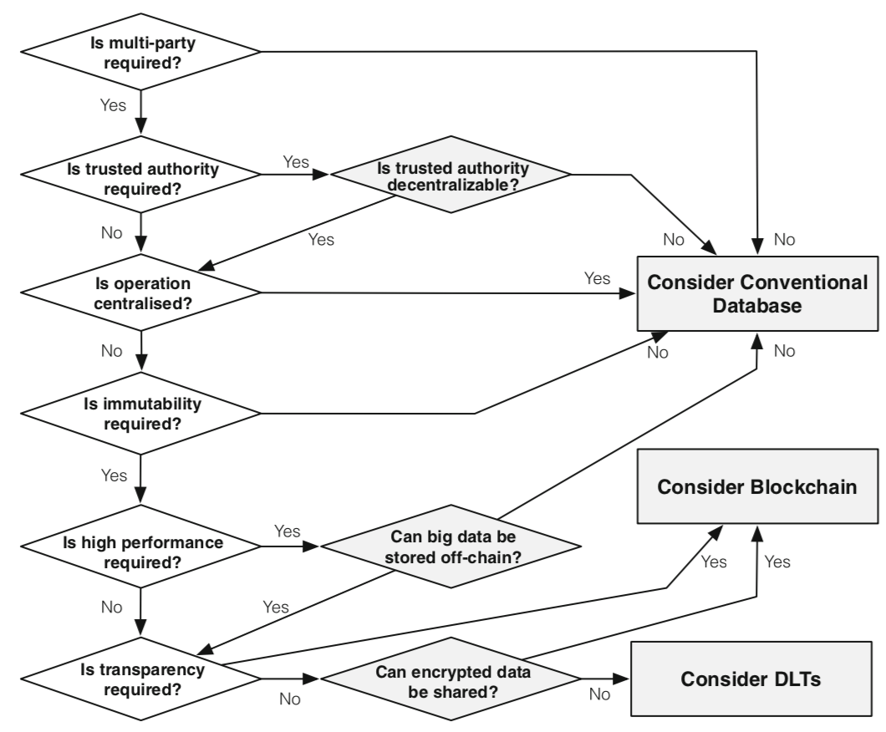

Nach der Evaluierung ob eine Blockchain verwendet werden sollt, folgt dar design Prozess der eigentlichen
Blockchain Komponente. Dieser Vorgang wird in der folgenden Abbildung dargestellt. Zunächst muss dabei entscheiden werden, wie eine Autorität dezentralisiert werden soll falls eine vorhanden ist. Anschließend muss entscheiden werde, welche Daten in der Blockchain gespeichert werden, welche Blockchain verwendet werden soll und wie die Blöcke konfiguriert werden sollen.

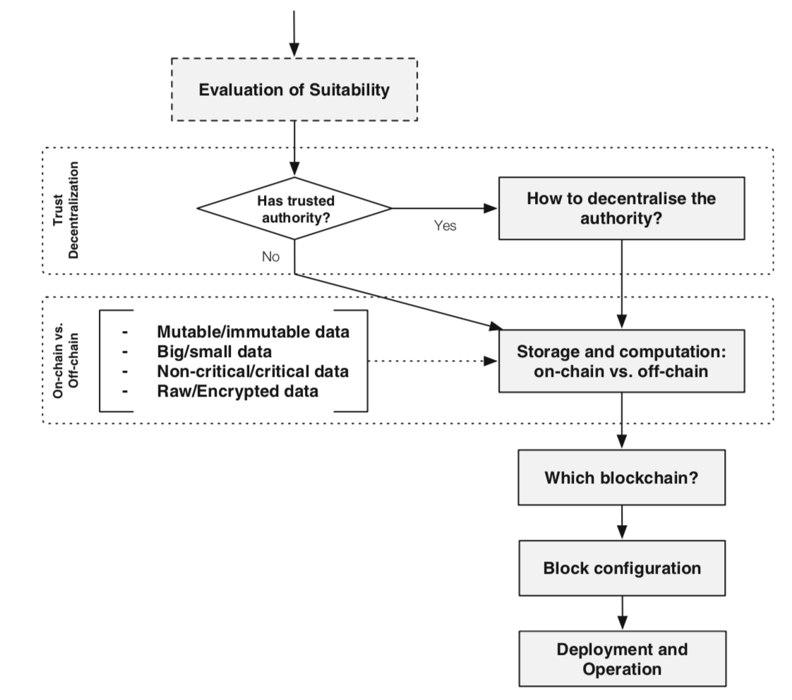

## 5 Existierende Blockchain Plattformen

### 5.1 Bitcoin

Bei Bitcoin handelt ist sich um eine sogenannte Kryptowährung, für die die Blockchain-Technologie erstellt wurde. Der Name Kryptowährung kommt daher, dass für sie Methoden aus der Kryptographie verwendet werden, die in der Einleitung vorgestellt wurden. Bei dieser digitalen Währungen handelt es sich nicht um eine Konkrete Datei, sondern vielmehr um eine Kette von digitalen Signaturen. Die folgende Abbildung zeigt den Aufbau dieser Kette.

Wie in der Abbildung zu sehen ist, spiegelt die Kette die einzelnen Übertragungen beziehungsweise Transaktionen des Coins dar. Möchte der Besitzer eines Coins diesen an eine andere Person übertragen, Signiert er zunächst einen Hash. Dieser Hash setzt sich aus dem Hashwert der vorherigen Transaktion und dem öffentlichen Schlüssel des Zahlungsempfängers zusammen. Die Signatur wird Anschließend an die Kette angefügt. Der Zahlungsempfänger kann anschließend mithilfe des öffentlichen Schlüssels die Besitzkette verifizieren.

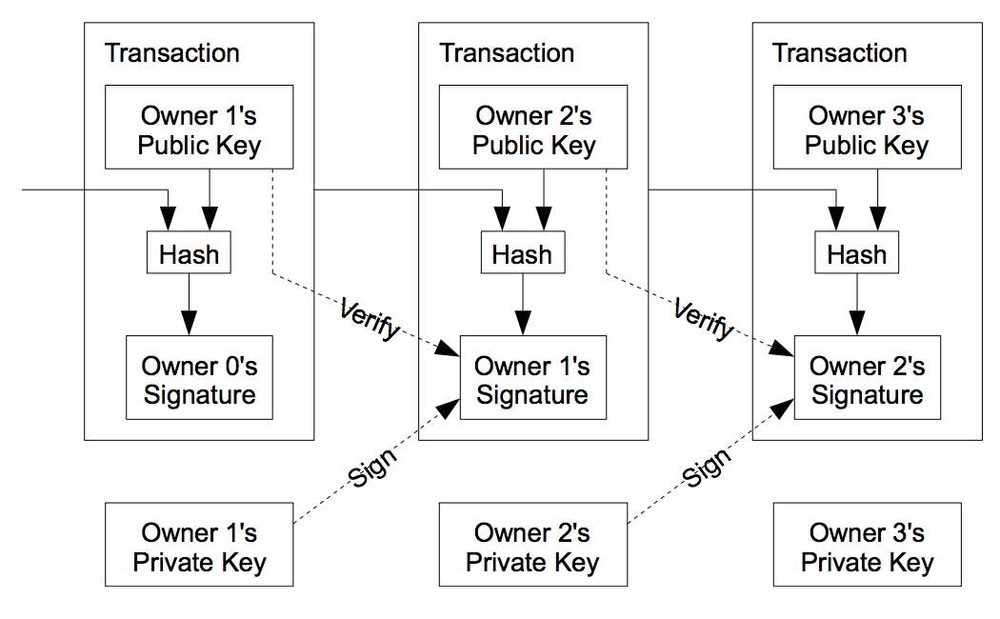

Das Problem besteht nun darin zu verhindern, dass der Besitzer eines Coins diesen mehrfach verwendet. Um diese Problem ohne die Einführung einer dritten Partei, wie einer Bank, zu lösen, wird die Blockchain verwendet. Der Aufbau und die Funktionsweise der resultierenden Blockchain ist in der Einleitung dargestellt. Der Zeitstempel in dem Block zeigt, das die Daten zu dem Zeitpunkt existiert haben müssen, um in den Hash des Blockes erstellen zu können. So kann eindeutig Nachvollzogen werden, wann welche Transaktion durchgeführt wurde. Das Blockchain Netzwerk arbeitet dabei vollkommen dezentral und der Grundlegende Ablauf im Netzwerk ist wie folgt:

1. Neue Transaktionen werden an alle Knoten übertragen
2. Jeder Knoten kombiniert die Transaktionen zu einen neuen Block
3. Jeder Knoten sucht nach einer Lösung für das kryptographische Puzzle
4. Wenn ein Block eine Lösung gefunden hat überträgt er diese an alle anderen Knoten
5. Knoten akzeptiren einen Block, wenn alle Transaktionen valide und keine doppelte Ausgabe vorliegt
6. Knoten dürcken die Akzeptanz eines Blockes aus, indem sie an dem nächsten Block weiterarbeiten und den Hash des akzeptirten Blockes als Hash für den vorgänger Knoten verwenden.

Die Bestätigung einer getätigten Transaktion dauert dabei Bitcoin 10-20 Minuten.

Die Implementierung der Blockchain für Bitcoin ist öffentlich und jeder kann Änderungen vorschlagen. Auf die Weise kann jeder die Sicherheit von Bitcoin überprüfen.

Das verwendete *proof-of-work* Verfahren erzeugt eine Mehrheitsentscheidung, bei der eine CPU eine Stimme hat. Die Wahl erfolgt auf Basis der CPU, da diese nicht künstlich erstellt werden kann. Wenn die Wahl Beispielsweise nach einer Stimme pro IP-Adresse ablaufen würde, könnte diese manipuliert werden, indem ein Angreifer mehrere IP-Adressen reserviert.

Die erste Transaktion eines neuen Blockes ist dabei die Erstellung eines neuen Coins, der dem Ersteller des Blockes zugeschrieben wird. Dies dient dazu einen Anreiz zu bieten, dem Netzwerk beizutreten und um Coins in Umlauf zu bringen. Das Erstellen eines neuen Blockes wird daher auch *mining* genannt. Auch soll dies dazu beitragen, dass die Knoten ehrlich arbeiten.

Das Speichern der Coins erfolgt in sogenannten Wallets, die es erlauben eine Sammlung an privaten Schlüsseln zu speichern. Die Wallet befindet sich dabei auf einen lokalen Datenträger des Besitzers des Coins. Einem Bitcoin Wallet kann eine Adresse ähnlich einer E-Mail Adresse zugewiesen werde, wobei jede Adresse für Transaktionen nur einmal verwendet werden sollte.

### 5.2 Ethereum

Bei Ethereum handelt es sich um eine Open-Sorce Platform zur Erstellung dezentraler Anwendungen. Es handelt sich dabei um ein Netzwerk, in das Geld und Zahlungen integriert sind. Bei diesem Geld handelt es sich um eine native Kryptowährung, die Ether genannt wird.

Im Gegensatz zu anderen Blockchain Anwendung erlaubt Etherium die Erstellung eigener Anwendungen auf Basis von Smart-Contracs. Ein Beispiel hierfür ist in Kapitel 6.1 zu finden.

Das Ethereum Protokoll wurde so konfiguriert, dass es eine möglichst kurze Zeit zwischen der Erstellung neuer Blöcke liegt. Diese beträgt hier 13-15 Sekunden, während sie bei Bitcoin bei 10 Minuten liegt. Durch diese kurze Zeit zischen den Erstellungen von Blöcken, kann es häufiger zur Kollisionen von verschiedenen Lösungen kommen. In der folgenden Abbildungen werden solche Kollisionen gezeigt. Zum Lösen dieses Problems wird eine modifizierten Version des Greedy Heaviest Observed Subtree (GHOST) Protokolls verwendet. Nach diesem Protokoll werden konkurrierende Lösungen von den Minern referenziert, um Gewicht das Geweicht der eigenen Kette zu erhöhen. Anschließend wird nach dem Ethereum Protokoll nicht die längste, sondern die am stärksten Gewichtetete Kette ausgewählt. Das referenzieren von anderen Minern erhöht dabei das Gewicht.

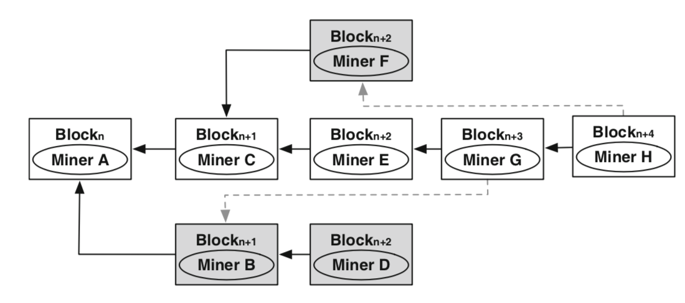

### 5.3 Hyperledger Fabric

Hyperledger Fabric ist eine Distributed ledger Software und dient dem Entwickeln von Anwendungen mit einem Modularen Aufbau. Die Blockchain ist bei Hyperledger Fabric privat und neue Knoten müssen zunächst von einem membership service provider autorisiert werden. Die Teilnehmer des Netzwerkes haben bei Hyperledger Fabric bekannte Identitäten öffentliche Schlüssel werden als kryptographische Zertifikate verwendet und werden mit einer Person, Organisation oder ähnlichem in Verbindung gebracht.

Hyperledger Fabric nutzt Container Technologie um Smart-Contracs zu hosten. Diese Smart-Contacts werden Chaincode genannt und können in Programmiersprachen wie Go und Java erstellt werden.

### 5.4 Facebook Libra

Bei Libra handelt es sich um eine von Facebook entwickelte Kryptowährung mit dem Ziel, eine globales Zahlungssystem zu erstellen. Das Zahlungssytem soll dabei für jeden zugänglich sein und Transaktionen sollen schnell abgewickelt werden können. Zudem soll das System flexibel Skalierbar und stabil gegenüber Kursschwankungen sein. Aktuell ist der Prototyp öffentlich verfügbar.

Smart-Contracts werden hier mit der dafür entwickelten Programmiersprache Move erstellt.

## 6 Beipiele für Smart-Contracts in Ethereum

Programme, die sich auf der Ethereum Virtual Machine befinden, werden hier als Smart-Contracts bezeichnet. Diese können in eigens dafür Verfassten Programmiersprachen verfasst werden. Ein Beispiel für eine solche Sprache ist Solidity, die von C++, Python und Javascript inspiriert wurde. Der folgende Codeblock zeigt ein einfaches
Beispiel für einen Smart-Contract:

```solidity
// SPDX-License-Identifier: GPL-3.0
pragma solidity >=0.4.16 <0.7.0;

contract SimpleStorage {
    uint storedData;

    function set(uint x) public {
        storedData = x;
    }

    function get() public view returns (uint) {
        return storedData;
    }
}
```

Ein Contract verhält sich dabei ähnlich zu einer Klasse in anderen Programmiersprachen. Die Variable storedData deklariert eine state Variable, die als einzelner Eintrag in der Datenbank betrachtet werden kann. Über die getter und setter Methoden kann dieser Wert von allen Nutzern eingesehen und geändert werden. Die verschiedenen Werte der Variable werden dabei in der Historie der Blockchain gespeichert.

Eine Beispiel für eine Anwendung, die auf Ethereum Entwickelt wurde ist das Spiel Gods Unchained. Das Spiel Nutzt die Blockchain, um zu ermitteln wo sich Karten befinden und wem sie gehören. Spieler haben dadurch die Möglichkeit ihre Karten für Echtgeld zu kaufen und wieder zu verkaufen.

Ein weiteres Beispiel für ein Projekt ist Decentarland. Hierbei handelt es sich um einen dezentrale virtuelle Welt, in der die Nutzer über Smart-Contracts Entscheidungen wählen können, wie die Welt funktionieren soll.

## 8 Quellen

**Literatur**

[Blockchain -  Grundlagen, Anwendungsszenarien und Nutzungspotenziale](https://link.springer.com/book/10.1007/978-3-658-28006-2)

[Blockchain und maschinelles Lernen - Wie das maschinelle Lernen und die Distributed-Ledger-Technologie voneinander profitieren](https://link.springer.com/book/10.1007/978-3-662-60408-3)

[Architecture for Blockchain Applications](https://link.springer.com/book/10.1007/978-3-030-03035-3)
**Internetquellen**

[Die Vorteile der Blockchain-Technologie](https://t3n.de/news/blockchain-statt-datenbank-diese-1063641)

[Bitcoin: A Peer-to-Peer Electronic Cash System](https://bitcoin.org/bitcoin.pdf)

https://github.com/bitcoin/bitcoin

[https://innovationsblog.dzbank.de/2017/07/03/bitcoin-in-zahlen-daten-und-fakten](https://innovationsblog.dzbank.de/2017/07/03/bitcoin-in-zahlen-daten-und-fakten)

https://ethereum.org/de/

https://www.hyperledger.org/use/fabric

https://www.informatik-aktuell.de/betrieb/virtualisierung/eine-blockchain-anwendung-mit-hyperledger-fabric-und-composer.html

https://solidity.readthedocs.io/en/v0.6.10/introduction-to-smart-contracts.html

https://www.heise.de/newsticker/meldung/Gods-Unchained-Eigene-Waehrung-und-Hype-um-digitale-Spielkarten-4469685.html

https://decentraland.org/

https://jaxenter.de/blockchain/blockchain-covid-19-corona-lieferketten-93881