# Cloud Computing Pattern
Tim Steven Meier | FH Bielefeld

# Gliederung

1. Availability und Performance
2. Data Management
3. Design und Implementation
4. Messaging
6. Resiliency
6. Management und Monitoring
7. Security

# Availability und Performance

Bei der Availability wird gemessen, wie lange der Server oder das System verfügbar ist. Dabei wird die Verfügbarkeit durch Systemfehler, hoher Nutzeranzahl und Angriffe beeinflusst. Verschiedene Pattern sollen dabei helfen die Verfügbarkeit des Systems zu maximieren.

Die Performance eines Systems geht einen Schritt weiter als die Availability, insofern, dass die Verfügbarkeit vorausgesetzt wird und die Antwortgeschwindigkeit des Systems möglich hoch ist. Um eine bessere Antwortgeschwindigkeit zu erreichen, kann man zum Beispiel das System zu skalieren und die Anzahl der Server und somit die Rechenleistung zu erhöhen

### Deployment Stamps
Wenn man einen Server auf einer einzelnen Instanz laufen lässt, dann bewirkt ein Absturz, dass man keinen der Services mehr benutzen kann.

Da der Server in einer Cloud Umgebung eine VM ist, lässt sich diese einfach kopieren. Wenn man den Server kopiert, dann kann man diesen mehrmals deployen, sodass bei einem Serverabsturz die anderen Server einspringen. Bei zu großer Last können die Server sich gegenseitig unterstützen. Es ist immer möglich mehr oder weniger Server zu deployen, um Peaks auszugleichen.

Allerdings erfordert eine höhere Anzahl Server auch mehr Maintainance und Kosten. Außerdem muss Routing eingerichtet werden, um die richtigen Stamps zu erreichen.

### Geoden

Eine einzelne Serverregion führt dazu, dass Nutzer in anderen Teilen der Welt eine schlechte Latenz haben.

Als Abhilfe kann man hierfür __Ge__ographical n**oden** einführen. Geoden sind ähnlich wie Deployment Stamps, welche in Gebiete mit vielen Nutzern auf der ganzen Welt verteilt werden. Ein globaler Loadbalancer übernimmt dabei dass Routing. Die Datenbank wird dabei repliziert, sodass diese auf der ganzen Welt konsistent ist.

Bei der Einrichtung von Geoden muss man überlegen, in welchen Regionen sich Geoden lohnen, da mehr Server auch höhere kosten bedeuten. Man kann auch überlegen in unterschiedlichen Regionen nicht die gleiche Datenbank zu benutzen.

### Throttling (Drosselung)

Wenn bei einem Service die Anzahl an Requests zu einem Peak kommen, dann kann der Service dadurch überlastet werden. Um eine höhere Anzahl an Requests zu bearbeiten kann man die Anzahl an Services erhöhen, die diese abarbeiten. Dabei gibt es allerdings das Problem, dass man nicht unbedingt weiß, wann diese Peaks auftauchen. Man kann die Anzahl an Services so hoch haben, dass diese bei einem Peak noch nicht voll ausgelastet sind, das kostet aber sehr viel Geld.

Das Throttling drosselt bei einem Traffic Peak die Services, damit diese nicht abstürzen. Währenddessen starten weitere Services als Unterstützung. Wenn die weiteren Services hochgefahren sind, benötigt man keine weitere Drosselung.

Es gibt mehrere Möglichkeiten um Throttling zu implementieren. Einerseits kann man einen Teil der Funktionalität des Services abschalten, wodurch dieser weniger zu tun hat. Ein weiteres Verfahren ist das Queue based Load Leveling.

Throttling sollte bereits bei der Planung eines Services beachtet werden, da eine nachträgliche Implementierung schwer ist.

### Queue-Based Load Levelings

Bei einem Service mit mehreren Nutzern ist die Anzahl an eingehenden Request jede Sekunde variabel. Peaks bei den Anfragen können Services überlasten. 

Abhilfe schafft hierbei eine Queue zwischen den Clients und den Services. Die Services können unabhängig von der Anzahl an Requests pro Sekunde die Queue in ihrem Tempo leeren, wodurch eine konsistente Bearbeitungsrate erreicht wird. Man muss beachten, dass eine Queue asynchron funktioniert und somit keine Antworten gegeben werden.

Als Folge davon kann man die Anzahl an Services verringern, da die Anzahl Services nicht für ein Anfragenpeak reichen muss. Ab einer bestimmten Anzahl Messages in der Queue kann man überlegen weitere Services zum bearbeiten der Queue hinzuzufügen, um die Queue zu lehren.

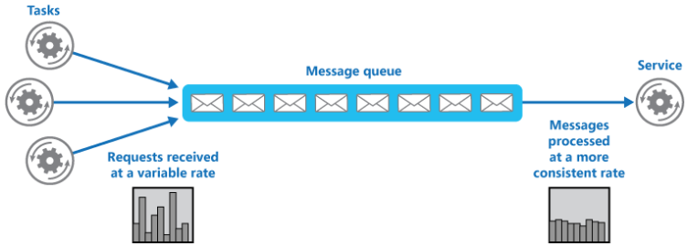

# Data Management

Damit die Performance und Verfügbarkeit bei Operationen mit Daten wie beim Downloaden und Uploaden von der Datenbank optimal ist gibt es Pattern, um diese zu verbessern. Bei dem Data Management ist außerdem die Konsistenz der Daten wichtig, wenn die Datenbank mehrmals existiert.

### Cache-Aside

Wiederholter Zugriff auf dieselben Daten ist eine unnötige Belastung der Datenbank und des Webservers. Um dies zu verhindern kann man heruntergeladene Daten in den Cache speichern.

Bei dem Cache-Aside Pattern überprüft man vor jedem Download von Daten erst, ob diese bereits im Cache liegen. Wenn sie das nicht tun fordert man diese man beim Webserver an. Die neu heruntergeladenen Daten werden daraufhin in den Cache gespeichert.

Dadurch ist der Zugriff auf Daten, die man bereits heruntergeladen hat wesentlich schneller und der Webserver erhält weniger Requests.

Bei Arbeiten mit einem Cache muss man allerdings aufpassen, dass dieser nicht immer aktuell ist. Sich schnell ändernde Daten sollte man vielleicht nicht im Cache speichern. Der Cache kann auch mit einem Ablaufdatum versehen werden, um die Daten gelegentlich neu herunterzuladen, für den Fall, dass sie sich geändert haben könnten.

### Sharding

Wenn man sehr viele Daten speichern muss, dann passen diese an irgendeinem Punkt nicht mehr in die Datenbank. Die Datenbank ist in der Cloud zwar nur eine virtuelle Maschine und lässt sich somit mehr Speicher zuweisen, aber auch der ist limitiert. Auf eine sehr große Datenbank dauern Queries länger und das Internet ist für die Übertragung bei zu vielen Daten zu langsam, wodurch es Performance Probleme geben kann. Wenn man die Datenbank repliziert lassen sich die Probleme mit der Performance beheben, aber das Speicherproblem bleibt bestehen.

Beim Sharding teilt man eine Datenbank in mehrere "Shards", also Datenbanken auf. Es gibt dabei verschiedene Möglichkeiten das Verfahren zu implementieren. Bei einer Möglichkeit fragt man bei einem Zugriff auf die Datenbank in einer zentralen Lookuptabelle nach, in welchem Shard die gewünschten Daten liegen. Mit der Antwort kann man die Daten von dem jeweiligen Shard bekommen. Bei einer anderen Möglichkeit kann man die Shards nach Jahreszahlen oder Monate aufteilen. In der Abbildung sieht man das als Beispiel.

Beim Sharding gibt es allerdings ein paar Probleme. Bei der Aufteilung der Datenbank in einzelne Shards muss man aufpassen, dass die häufigsten Queries nicht Daten aus mehreren Shards benötigen, da diese dadurch länger brauchen werden. Für das Problem kann das Index Table Pattern Abhilfe schaffen. Sharding zu implementieren und zu benutzen ist außerdem sehr aufwändig und man muss auch aufpassen, dass die Daten konsistent sind.

### Index Table

Wenn man Daten von einer Datenbank abfragen will, dann möchte man dies nicht immer über den Primärschlüssel machen. Wenn man Daten über andere Felder abfragen möchte, dann ist die Query meist sehr langsam.

Mit Index Tabellen kann man bei diesem Problem Abhilfe schaffen. Dabei gibt es verschiedene Möglichkeiten der Implementierung.

Ale erste Möglichkeit kann man eine Tabelle komplett kopieren und ein anderes Feld zum  Primärschlüssel machen. Allerdings wird dadurch die gesamte Tabelle doppelt gespeichert und das ist vor allem bei großen Datenmengen ungeeignet. Außerdem müssen Änderungen in jeder Tabelle gemacht werden, um Konsistenz zu erreichen.
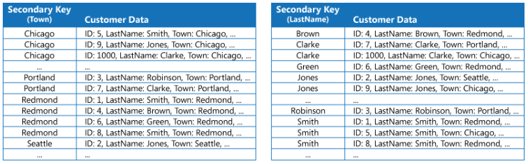

 

Als zweite Möglichkeit kann man eine Tabelle mit dem gewünschten Feld als Primärschlüssel anlegen und den eigentlichen Primärschlüssel als einziges Feld zuordnen. Dadurch gibt es viel weniger doppelte Daten. Allerdings müssen zwei Queries gemacht werden um an die Daten zu kommen.
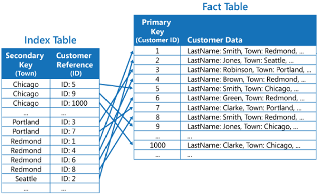

 

Als dritte Möglichkeit kann man beide Verfahren kombinieren. Zu der Tabelle aus der zweiten Möglichkeit werden weitere häufig benutzte Felder hinzugefügt. Die meisten Daten kann man so mit einer Query holen, während man andere Daten über zwei Queries erreichen kann.
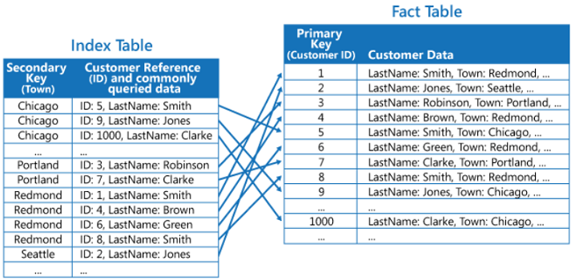

Bei allen Möglichkeiten erhöht man die Performance bei Zugriffen auf die Daten mit einem anderen als den Primärschlüssel.

Allerdings hat man immer einen Mehraufwand durch das Managen mehrerer Tabellen, eine erhöhte Speicherauslastung und mögliche Konsistenzprobleme, wenn man Updates nicht in jeder Tabelle ausführt.

### Materialized View

Manche Queries auf die Datenbank benötigen sehr lange, weil die Daten mehrere Tabellen umfassen. Um die Daten möglichst schnell zu bekommen kann man hierfür eine eigene Materialized View erstellen.

Hierbei wird eine neue Tabelle erstellt, die für die eine Query optimiert ist.

Man muss sich hierbei allerdings überlegen, dass sich die View bei Änderungen in der Datenbank auch ändern muss. Wenn sich die Datenbank allerdings zu oft ändert kann dies zu Performanceproblemen führen. Alternativ kann man die Materialized View regelmäßig updaten, wodurch sie allerdings nicht zu jedem Zeitpunkt auf dem aller neusten Stand ist.

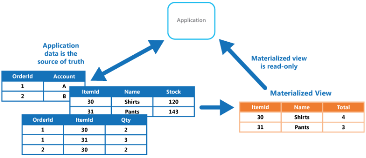

### Event Sourcing

Bei Gleichzeitigen Zugriffen auf eine Datenbank ist es schnell möglich Daten zu überschreiben.

Um Konflikte bei zugriffen auf die Daten zu vermeiden kann man das Event Sourcing benutzen. Hierbei werden Änderungen in der Datenbank nicht direkt geupdatet sondern als Event in den Speicher angehängt. Um den aktuellen Zustand der Datenbank zu bekommen muss man alle Events auf den Ursprung anwenden.

Durch die Speicherung von Events hat man der Vorteil, dass keine Konflikte in den Daten auftreten können und das jede Änderung direkt geloggt ist.

Um den aktuellen Zustand zu berechnen muss man alle Events auf den Ursprung anwenden, was allerdings bei einer sehr großen Anzahl irgendwann zu Performance Problemen führen kann. Man kann sich hierfür überlegen regelmäßig Snapshots zu erstellen um den Ursprung neu zu setzen.

Außerdem ist es nicht möglich ein Rollback durchzuführen, sodass man Änderungen über das Compensating Pattern rückgängig machen muss.

### Command and Query Responsibility Segregation (CQRS)

Um Konflikte bei gleichzeitigen Aktualisierungen der Datenbank zu beheben kann man CQRS verwenden.

Hierbei werden Read(Query) und Write(Command) durch separate Interfaces getrennt. Dadurch lassen sich Unstimmigkeiten zwischen der Darstellung für das Lesen und Schreiben verhindern. Außerdem ist es möglich Rechte nur für das Lesen oder das Schreiben zu verteilen, da man unterschiedliche Interfaces hat. Außerdem lassen sich die Interfaces getrennt skalieren und feintunen, wodurch eine Datenbank, auf der vermehrt gelesen wird, dieser Vorgang optimiert werden kann.

Allerdings muss man hierbei auf die Konsistenz der Daten achten weil es unterschiedliche Modelle für das Lesen und Schreiben gibt.

### Static Content Hosting
Die meisten Webserver beinhalten einige statische Inhalte, wie zum Beispiel Bilder. Der Client muss diese herunterladen, was den Client belastet.

Die statischen Inhalte können aber auch in einem Datenspeicher gespeichert werden. Wenn statische Daten bei dem Webserver angefordert werden, dann wird der Client an den Datenspeicher weitergeleitet. 

Dadurch senken sich auch die Kosten, da der Webserver teurer ist, nun aber weniger zu tun hat, da ein billiger Datenspeicher Teile seiner Arbeit übernimmt.

Man muss allerdings beachten , dass die Daten nicht mehr von dem Webserver personalisiert werden können, da der Client diese direkt herunterlädt. Außerdem muss man beachten, dass der Client nicht alle Daten von dem Speicher herunterladen kann, die eigentlich unter Verschluss bleiben sollen. Abhilfe kann dafür das Valet Key Pattern bringen.

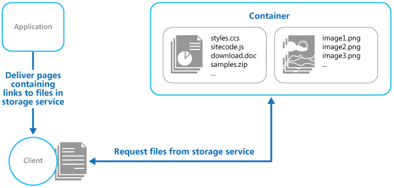

### Valet Key
Bei dem Valet Key Pattern sind wir in der gleichen Situation wie beim Static Content Hosting. Allerdings wird der Client nicht mehr einfach auf den Speicherort der Daten verwiesen, wenn diese angefragt werden.

Beim Valet Key Pattern wird auf eine Anfrage des Clients erst die Validität des Nutzers überprüft. Wenn das erfolgreich ist, wird dem Client ein Key und die Adresse der Ressource zurückgegeben. Mit dem Key kann der Client dir gewünschte Ressource bekommen.

Der Key sollte verschlüsselt an den Client versendet werden, damit dieser nicht abgefangen wird. Außerdem sollte der Key so wenig Rechte wie nötig verleihen und nach kurzer Zeit ablaufen, damit dieser nicht ausgenutzt werden kann.

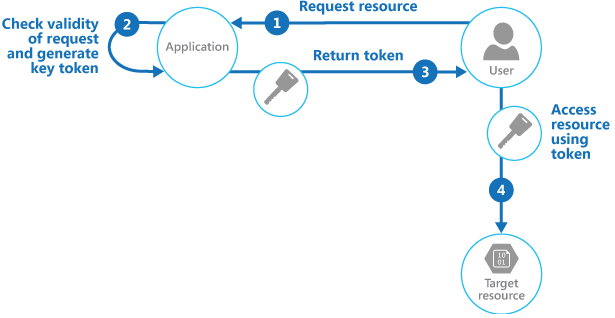

 

# Design und Implementierung

Gutes Design umfasst Faktoren, wie Wartbarkeit der Software und Wiederverwendbarkeit einzelner Komponenten.

Während der Implementierung können diese Muster helfen eine bessere Softwarequalität zu erreichen.

### Backends for Frontends

Wenn man einen Webservice über mehrere Frontends(Desktop Browser, Mobile Browser) anbietet, dann haben diese unterschiedliche Anforderungen an das Backend. Die Interfaces zwischen den Frontends und dem Backend behindern sich gegenseitig und neue Funktionen zu implementieren führt zu Konflikten auch zwischen den Entwicklern.

Man kann für jedes Frontend ein eigenes Backend schreiben, wodurch es bei der Entwicklung keine Konflikte mehr gibt. Dadurch ist es auch möglich das Backend genau auf die Anforderungen des Frontends anzupassen um eine höhere Performance zu ermöglichen. Dabei ist es auch möglich die verwendeten Technologien in den Backends zu ändern.

Allerdings muss man beachten, dass viel Code von den Backends dupliziert sein wird. Wenn dieses Pattern auf ein bestehendes System angewendet wird muss man beachten, dass eine Migration auf mehrere Backends sehr zeitaufwändig sein kann.

### Anti Corruption Layer
Wenn man von einem alten System auf ein neues System migrieren will, dann ist dies in der Regel nicht in einem Schlag möglich. Deshalb werden bei der Migration noch alte Teile der API und der Datenbank benötigt. Da die verwendeten Technologien nicht mehr übereinstimmen kann man eine neue Schicht dazwischen implementieren.

Die Anti Corruption Layer fungiert als Brücke zwischen den Systemen und wandelt dabei Requests mit neuen Technologien auf die alten Technologien um. 

Bei diesem Pattern muss allerdings beachtet werden, dass die Anti Corruption Layer erst implementiert werden muss und durch das umwandeln der Requests eine höhere Latenz bewirkt.

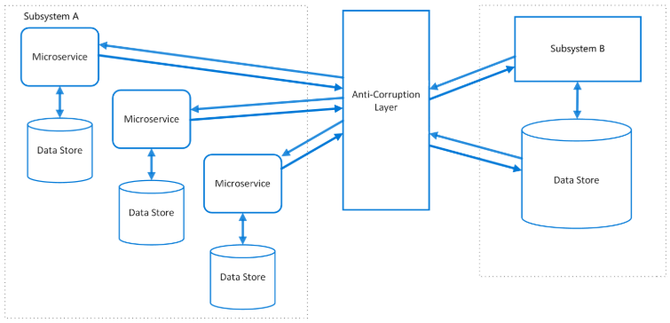

### Strangler
Ein veraltetes System vollständig neu aufzubauen ist sehr zeitaufwändig. Stattdessen kann man die Migration schrittweise durchführen.

Die Strangler Facade ist dabei eine Schicht, welche den alten Code mit dem neuen Code verbindet. Neben dem normalen Betrieb können dabei einzelne Komponenten in ein modernes System umgebaut werden. Neue Funktionen können dabei direkt mit modernen Technologien entwickelt werden. Schrittweise wird der Umfang des alten Systems kleiner, bis das gesamte System modernisiert wurde und die Strangler Facade überflüssig wird.

Man muss hierbei beachten, dass die Strangler Facade die Latenz erhöht und sich zu einem Bottleneck entwickeln kann.

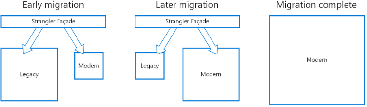

 

### External Configuration Store
Wenn man Services als VM deployed, dann benötigt man eine Konfigurationsdatei. Wenn man den Service skaliert und X mal deployed, dann hat man X Konfigurationsdateien.

Anstatt die Konfigurationsdatei lokal für jeden Service einzeln zu haben, kann man eine einzelne zentrale Datei ablegen, auf die alle zugreifen. Dadurch kann man Änderungen in der Konfiguration sehr schnell durchführen, da man nicht X Dateien ändern muss.

Hierbei muss beachtet werden, dass die Konfigurationsdatei immer erreichbar sein muss, damit die Services auf diese zugreifen können. Außerdem muss man die Sicherheit bei einer Datei beachten, auf die mehrere Services zugreifen können.

### Leader Election

Wenn man komplexe Probleme lösen will, dann werden häufig mehrere gleiche Instanzen gestartet, um die Rechenpower zu erhöhen. Diese arbeiten dabei häufig an den gleichen Ressourcen, was zu Konflikten führen kann.

Als Lösung wird ein Leader gewählt, welcher die anderen Instanzen koordiniert um die komplexen Berechnungen effizienter und mit weniger Fehlern durchzuführen. Da alle Instanzen den gleichen Code besitzen kann auch jede Instanz zum Leader gewählt werden. Als Beispielverfahren kann man die Instanz mit der niedrigsten Prozess ID zum Leader wählen.

Wenn der Leader aus irgendeinem Grund ausfallen sollte, muss man beachten, dass ein neuer Leader gewählt wird um weiterarbeiten zu können. Außerdem sollte man aufpassen, dass man den Leader nicht aus Versehen terminiert, wenn man die Anzahl an Instanzen wieder verringert.

### Compute Ressource Consolidation

Wenn man viele verschiedene Aufgaben hat, dann ist es am einfachsten jede Aufgabe mit einer eigenen Instanz zu bearbeiten. Der Nachteil dabei ist allerdings, dass die Kosten dabei steigen, da die Instanzen permanent aktiv sind, aber die Aufgaben nicht permanent arbeiten.

Man sollte den Instanzen deshalb mehrere Aufgaben verteilen. Dabei muss man allerdings mehrere Dinge beachten. Die Kommunikationsgeschwindigkeit zwischen Aufgaben in einer Instanz ist höher, was man positiv ausnutzen kann. Aber Aufgaben die die gleichen Ressourcen benutzen und gleichzeitig (in-)aktiv sind sollten nicht in dieselbe Instanz gepackt werden. Außerdem sollte man bedenken, was passiert, wenn der Traffic allgemein höher wird und Instanzen skaliert werden, also kopiert werden. Bei hohem Traffic muss nicht jede Aufgabe hochskaliert werden, sodass dabei manche Aufgaben unnötig viel Rechenpower bekommen. Wenn eine der Aufgaben in einer Instanz einen Fehler hat, dann kann es außerdem sein, dass dadurch die gesamte Instanz betroffen wird und anderen Aufgaben fehlschlagen lässt.

# Messaging

Im Cloud Computing gibt es in einem System häufig viele verschiedene Instanzen, die miteinander kommunizieren müssen. Deshalb ist eine gute Infrastruktur wichtig, um diese Dienste effizient zu verbinden.

### Asynchronous Request Reply

Wenn man ein Request an das Backend schickt, dann erwartet man eigentlich eine Antwort. Manchmal dauert die Bearbeitung eines Requests allerdings sehr lange, wodurch eine finale Antwort nicht direkt gegeben werden kann.

In so einem Fall kann man HTTP Polling verwenden. Dabei wird bei einem Request der Statuscode 202 zurückgegeben anstatt die Ressource. Man muss hierbei beachten, dass eigentlich ein 404 Code erwartet wird, wenn die Ressource nicht zurückgegeben wird. Mit dem 202 statuscode wird auch eine geschätzte Wartezeit und einen Ort an dem die Ressource erreicht werden kann mit gegeben. An den mitgegebenen Ort kann man einen weiteren Request senden von dem man dann eine Antwort erhält, ob die Ressource bereit steht. Wenn die Ressource bereit ist bekommt man Einen 302 Code zurück in dem der Ort der Ressource mit angegeben ist. An dem Ort bekommt man dann seine Ressource mit Einem 200 Code zurück.

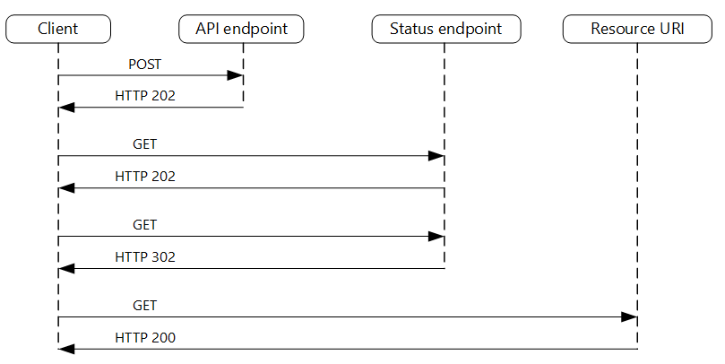

### Scheduler Agent Supervisor
Wenn in einer Applikation mit Remote Services oder mit Remote Ressourcen gearbeitet wird dann kann es häufig zu Fehlern kommen. Diese Fehler sind häufig kurzfristiger Natur und können mit dem Retry pattern erneut versucht werden. Wenn ein Problem allerdings längerfristig besteht dann kann sich die Applikation nicht davon erholen und stürzt möglicherweise ab. Bei einem Absturz muss auch mit beachtet werden welche Schritte bereits geschehen sind damit diese rückgängig gemacht werden können.

Als Lösung kann man das geht Scheduler Agent Supervisor pattern benutzen um sich diesen Problemen zu stellen. Der Scheduler organisiert Schritte Für den Workflow und schreibt die Zustände der jeweiligen Schritte in einen eigenen Datenspeicher. Der Supervisor überwacht den Scheduler dabei und schaut in dem Datenspeicher nach, welche Zustände die einzelnen Schritte haben. Bei einem Fehler greift der Supervisor ein und leitet Gegenmaßnahmen ein. Die Agenten kommunizieren Mit Remote Ressourcen oder Remote Services und geben die Informationen an den Scheduler weiter.

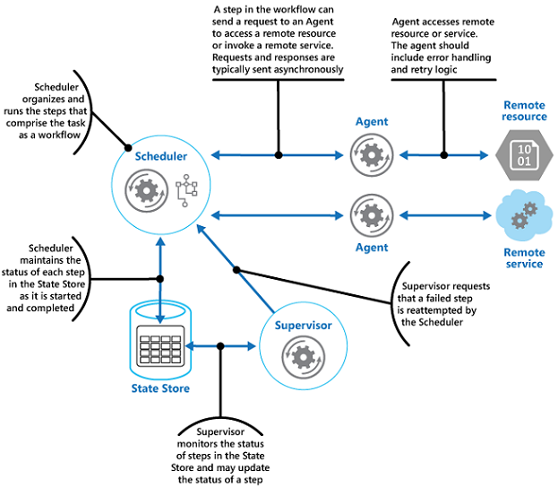

Ein Vorteil davon ist dass Fehler effektiver behandelt werden können. Außerdem kann, wenn ein Aktor ausfällt ein neuer gestartet werden, wodurch sich das System selber heilt. Problematisch dabei ist, dass das  pattern sehr kompliziert ist und deshalb schwer zu implementieren ist. Man benötigt viele Tests, damit dieses Pattern erfolgreich ist.

### Choreography
Für gewöhnlich steuert ein Orchestrator die Verteilung von Aufgaben an die einzelnen Services. Dadurch hat er eine enge Bindung an die Services und muss deswegen umgeschrieben werden wenn sich die Services ändern. 

Alternativ zu dem Orchestrator kann man auch eine Queue benutzen. In dieser Queue werden die Anfragen des Nutzers Gepackt Und von dort über einen Message Broker an die einzelnen Services verteilt. Die einzelnen Services können über das Publisher subscriber pattern einzelne Nachrichten abonnieren. Außerdem ist es dadurch möglich Einzelne Services ohne großen Aufwand hinzuzufügen, zu ändern oder zu entfernen.

Man muss dabei beachten dass Das behandeln von Fehlern dadurch komplizierter wird da es keine zentrale Steuereinheit mehr gibt die in diesem Fall eingegriffen hätte.

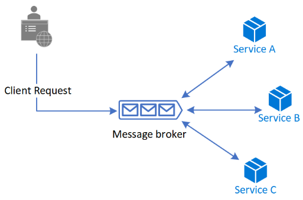

### Claim Check

Bei einer Architektur die auf einer Message Queue basiert, werden viele Messages über einen Message Broker verteilt. Allerdings Verlangsamen zu große Dateien diesen Service. 

Um dieses Problem zu umgehen kann man die Inhalte der Messages In einem Datenspeicher hochladen und stattdessen ein Claim Check In die Message Queue packen. Services die diese Message verarbeiten wollen können sich über diesen Abholschein den Inhalt selber aus dem Datenspeicher abholen. Dies ist allerdings nur bei großen Messages relevant. 

Dadurch wird der Message Broker nicht überlastet. Außerdem ist es dadurch möglich Authentifizierungs Regeln einzubringen so dass die Inhalte in den Datenspeicher sicherer sind als sie es im Message Broker wären. Man sollte sich allerdings überlegen, dass ein Datenspeicher benutzt wird und deshalb mehr Geld kostet. Darüber hinaus kostet das Laden und speichern von Daten zusätzliche Zeit.

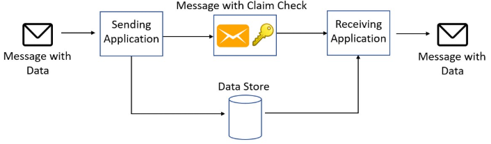

### Competing Consumers

Bei einem Webservice variiert die Anzahl an bezahlen zu jeder Zeit stark. Deshalb kann ein Service eventuell nicht mit der Menge an Nutzern mithalten.

Um dem entgegenzuwirken benutzt man eine Message Queue in der der Nutzer seine Anfrage hineingibt. Dadurch werden alle Nutzer nacheinander von den Services bearbeitet.

Bei einer Queue können die Services nicht überlastet werden, da sie immer dann etwas aus der Queue hinaus nehmen, wenn sie fertig sind mit der alten Aufgabe. Ein großer Vorteil dabei ist auch, dass die Anzahl an Nutzern, die die Anfragen in die Queue geben und die Anzahl an Services, die die Anfragen aus der Queue bearbeiten beliebig skalierbar ist. Immer wenn ein Service fehlschlägt mit einer Anfrage aus der Queue wird die Anfrage zurück in die Queue gefügt, so dass ein anderer Service diese übernehmen kann. Dabei muss man aufpassen, dass eine fehlerhafte Anfrage entfernt wird, wenn sie zu viele Services zum Absturz bringt. Bei einer Message Queue muss man auch aufpassen, dass eine große Anzahl an Nutzern zu einem Bottleneck führen kann.

 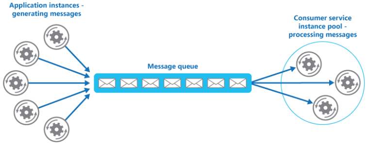

### Sequential Convoy
Das Sequential Convoy pattern ist ein Spezialfall von dem Competing Consumers pattern. Häufig gehören mehrere Messages zusammen und müssen deswegen von einem einzelnen System nacheinander bearbeitet werden. Eine Message Queue verteilt die Anfragen allerdings nacheinander auf verschiedene Services, wodurch diese fehlschlagen würden.

Um dem entgegenzuwirken kann man Messages, die zueinander gehören mit Kategorien versehen, so dass diese von einem einzelnen Service bearbeitet werden. Dadurch werden die einzelnen Messages in korrekter Reihenfolge bearbeitet und schlagen nicht fehl.

Bei diesem Pattern muss man sich überlegen wie man die verschiedenen messages überhaupt kategorisiert. Man könnte zum Beispiel die Messages von einem einzelnen Nutzer alle der gleichen Kategorie zuordnen.

### Priority Queue

Bei einer normalen Queue werden die Anfragen für gewöhnlich nacheinander abgearbeitet. Allerdings gibt es in manchen Anwendungsfällen Kunden mit einem besonderen Status, wodurch es nötig ist diesen Priorität zu geben.

Diesen besonderen Status kann man mit einer Priority Queue umsetzen. Es gibt verschiedene Möglichkeiten die Priority Queue zu implementieren.

Es ist zum Beispiel möglich eine einzige Queue zu verwenden, bei der man ankommende Messages einer Priorität zuweist. Bei jeder neuen Message wird die Queue nach Priorität sortiert. Dabei kann es allerdings dazu führen, dass Messages mit einer niedrigen Priorität niemals dran kommen.

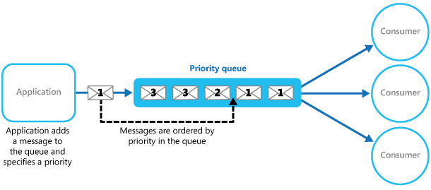

​    

  

Eine weitere Möglichkeit ist es, dass man mehrere Queues mit unterschiedlichen Prioritäten hat. Dabei haben die Services der Queue mit der höchsten Priorität mehr Rechenpower als die mit niedriger Priorität. Wenn eine Queue allerdings keine Messages mehr hat sind dessen Services nicht mehr am arbeiten, obwohl andere Queues mit anderer Priorität noch voll sind.
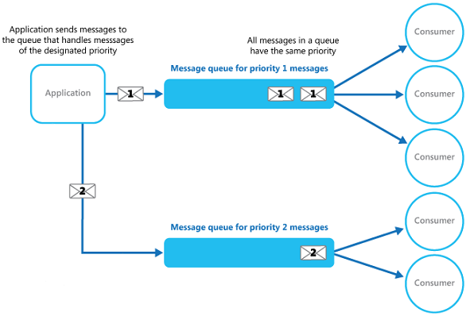

### Publisher/Subscriber

Einzelne Komponenten Systeme müssen im Falle eines Events andere Komponenten informieren. Events können über asynchrone Messages an alle Services verteilt werden, ohne auf Antworten warten zu müssen, wodurch der Service direkt wieder weiter arbeiten kann, nachdem es ein Event verschickt hat.

Mit dem Publisher Subscriber Pattern können Messages über einen Message Broker verteilt werden. Der Publisher gibt dabei ein Event an den Message Broker in einen Channel. Andere Services können diesem Channel subscriben um alle Events des Channels zu bekommen. Dadurch ist es einfach möglich die Messages zu verteilen, wobei sie gleichzeitig geloggt werden.

Allerdings muss man dabei aufpassen, dass nicht jeder Service jeden Channel wahllos subscriben darf, damit vertrauliche Daten nicht von jedem gelesen werden können. Außerdem kann man auf asynchrone Messages nicht antworten.

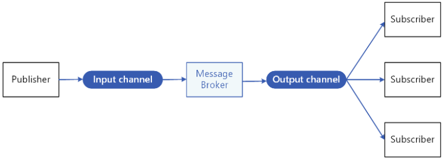

# Resiliency

Bei der Resiliency geht es darum, dass im Falle eines Fehlers das System nicht vollständig versagt, sondern es möglich ist, sich von solchen Fehlern zu erholen. Dabei ist es wichtig, einen Fehler zu erkennen und angemessen zu handeln.

### Retry
Wenn man auf Ressourcen zugreifen will, dann ist es möglich, dass die Datenbank auf der diese liegen kurz disconnected oder überlastet ist.

In so einem Fall muss man eine Aufgabe nicht direkt vollständig abbrechen, sondern kann einfach erneut versuchen auf die gewünschten Daten, oder Ressourcen zuzugreifen. Dabei kann man zum Beispiel linear alle X Sekunden versuchen eine neue Verbindung aufzubauen. Alternativ kann man den Timeout exponentiell erhöhen.

Dabei muss man beachten, dass ein überlasteter Remote Service länger braucht sich zu erholen, wenn er mit einer großen Anzahl Anfragen bombardiert wird. Den Timeout exponentiell könnte in dem Fall besser sein, allerdings kann es sein, dass man dadurch unnötig lange wartet, was mit dem linearen Timeout nicht der Fall wäre.

Außerdem ist es wichtig im Hinterkopf zu behalten, dass es nie sicher ist, ob die Ressource in naher Zukunft erreichbar ist, oder es ein langfristiges Problem gibt. Man sollte nach einer bestimmten Anzahl an Retries einen weiteren Versuch aufgeben.

### Circuit Breaker
Eine weitere Methode mit kurz oder langfristigen Verbindungsproblemen umzugehen ist das Circuit Breaker Pattern. Dabei wird ein Proxy verwendet, der mit 3 Zuständen arbeitet.

Im laufenden Betrieb ist der Closed Zustand der default. Dieser wird erst verlassen, bis ein Schwellwert erreicht wird bei der Anzahl an Fehlversuchen. Dann kommt man in den Open Zustand. Hier wird ein Timer gestartet, wodurch bei Ablauf der Zustand zu Half-Open gewechselt wird. Hier werden wieder Requests probiert. Wenn eine bestimmte Anzahl an Requests hintereinander erfolgreich ist, dann wechselt man zurück in den Closed Zustand. Bei einem Fehler wird man direkt in den Open Zustand und somit zu einem neuen Timeout geführt.

Wenn man die bisherigen Daten loggt, dann kann man vielleicht Muster entdecken, wie lange der andere Service disconnected war, um dementsprechend die Timeouts im Open Zustand zu optimieren. Dadurch ist, anders als beim Retry Pattern, die Anzahl an neuen Versuchen minimal. Es ist dabei aber auch möglich, dass der Circuit Breaker einen zu langen Timeout ausführt, obwohl sich der andere Service bereits erholt hat.

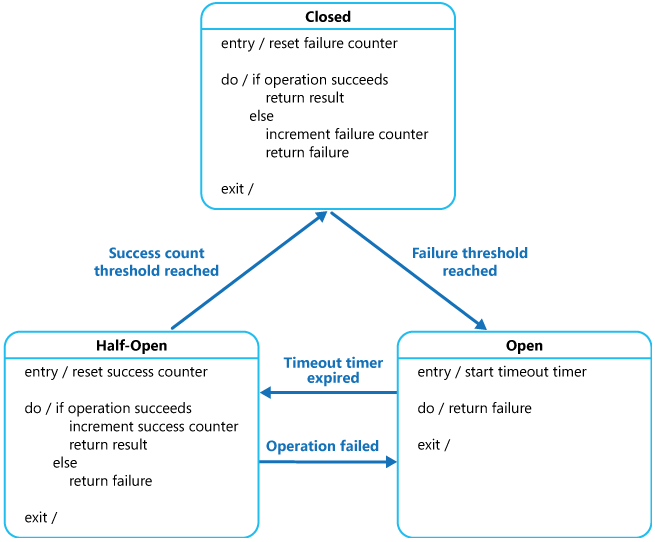

### Compensating Transaction
Große Transaktion dauern lange und bestehen aus mehreren Schritten. Wenn bei einem der letzten Schritte nun ein Fehler auftritt, dann müssen die vorherigen Schritte rückgängig gemacht werden. Da manche der veränderten Ressourcen bereits von anderen Services verändert wurden kann man kein Rollback machen, sondern die Änderungen Schritt für Schritt rückgängig machen.

Bei dem Compensating Transaction Pattern loggt man während einer Transaktionen die durchgeführten Schritte. Bei einem Fehler werden dann Gegenaktionen eingeleitet, die die alten Aktionen rückgängig machen. Bei diesem Prozess werden keine Updates anderer Services überschrieben und es ist außerdem möglich die Gegenaktionen parallel auszuführen, um diese schneller zu machen.

Bevor dieses Pattern sich aktiviert sollte man überlegen mit einem Retry die Transaktion doch noch zu retten. Außerdem ist es möglich, dass dieses Pattern einen Fehler macht und es nicht schafft alle Schritte rückgängig zu machen, wodurch ein Mensch eingreifen sollte.

### Bulkhead
Wenn ein Server eine Anfrage nicht direkt beantworten kann, dann erhöhen sich die Anzahl an wartenden Requests, bis der Server überlastet wird.

Mit dem Bulkhead Pattern versucht man die einzelnen Services zu isolieren, damit der Fehlschlag eines einzelnen Services nicht die anderen beeinflusst. Dabei werden nur eine maximale Anzahl an Anfragen für jeden Service angenommen und der Rest abgelehnt. Dadurch können auch Anfragen für andere Services verarbeitet werden. Eine weitere Möglichkeit ist es, dass jeder Service einen einzelnen Client bedient, wodurch ein Absturz des Services nur den einen Client betrifft und nicht alle.

Man muss dabei allerdings bedenken, dass eine Aufteilung der Services nicht immer leicht ist und sie dadurch schwerer zu managen sein können.

# Management und Monitoring

Cloud Anwendungen sind schwerer zu überwachen, da man nicht die volle Kontrolle über die Hardware und das Betriebssystem hat. Dennoch ist es wichtig zu überprüfen, ob das System verfügbar ist und im vollen Umfang funktioniert.

 

### Health Endpoint Monitoring

Es ist wichtig zu überprüfen, ob jeder Service in einem System intakt ist und wie schnell er funktioniert.

Mit dem Health Endpoint Monitoring wird ein Server erstellt, welcher verschiedene Testrequests an die Services schickt. Dabei werden die Geschwindigkeit der Antworten und die Statuscodes überprüft. Wenn man die Netzwerkgeschwindigkeit auch testen will, dann muss man beachten, dass der Health Endpoint Server sich in der Nähe der Nutzer befindet und nicht im gleicher Rechenzentrum, wie das restliche System.

### Ambassador
Eine Legacy Applikation verwendet häufig alte Technologien, wodurch Netzwerkfunktionalitäten häufig nur schwer oder langsam funktionieren.

Abhilfe schafft der Ambassador, welches ein Proxy Server ist. Auf diesem Ambassador können moderne Technologien verwendet werden und verschiedene Netzwerkfunktionalitäten, Pattern wie das Retry und Circuit Breaker. Man kann aber auch Funktionen für Monitoring und Security implemenetieren.

Der Ambassador ist dabei ein einfacher Proxy Server, welcher zwischen dem Remote Service und der legacy Applikation ist. Man muss auch bedenken, dass die Latenz durch einen solchen Proxy negativ beeinflusst wird.

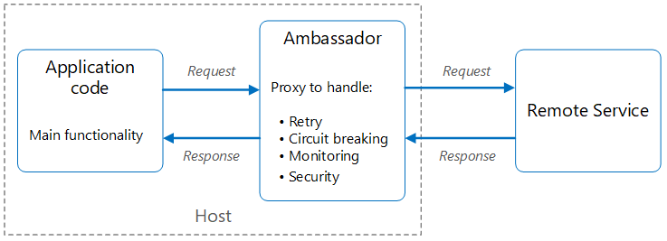

### Sidecar
Das Sidecar Pattern ist eine Abwandlung des Ambassador Patterns. Bei dem Sidecar Pattern liegt das Sidecar direkt neben der Applikation, wodurch die Latenzzeit verringert wird. Die Besonderheit bei dem Sidecar Pattern ist, dass dies immer zusammen mit der Applikation existiert. Wenn die Applikation terminiert wird, dann betrifft das auch das Sidecar.

Dabei muss man allerdings beachten, dass das Sidecar mit der Applikation mitskaliert. Man muss überlegen, ob es benötigt wird, dass das Sidecar neben der Applikation mitskaliert werden soll und gegebenenfalls ein anderes Pattern benutzen sollte.

### Gateway Offloading

Manche Funktionen werden von vielen oder allen Services verwendet. Um diese einfacher zu managen kann man diese auf ein Gateway auslagern. Dafür erstellt man eine Gateway Instanz mit verschiedenen Funktionen, wie zum Beispiel Funktionen zur Authentifizierung, Monitoring, für Zertifikate, SSL und mehr. 

Bei einem solchen Gateway muss man allerdings aufpassen, da es ein möglicher Single point of Failure und Bottleneck werden kann. Außerdem muss man sich überlegen, welche Funktionen in das Gateway sollen, da nicht jede Funktion von jedem Service benötigt wird.

### Gateway Aggregation

Für eine Aufgabe des Clients müssen häufig mehrere Services angesprochen werden. Dadurch werden mehrfach Requests an unterschiedliche Services geschickt, was aber zu einer erhöhten Netzwerklast führt.

Anstatt mehrere Requests an unterschiedliche Services zu schicken kann man ein Gateway aufbauen, an dem man einen einzelnen Request schicken kann. Dieser übernimmt dann die weiteren Requests an die  anderen Services. Dadurch wird das Netzwerk entlastet, da nur ein Request über das Internet geschickt wird. Außerdem verbessert sich die Latenz, da das Gateway sehr nah an den einzelnen Services liegt.

Auch bei diesem Gateway muss man bedenken, dass es sich zu einem Single Point of Failure oder Bottleneck entwickeln kann.

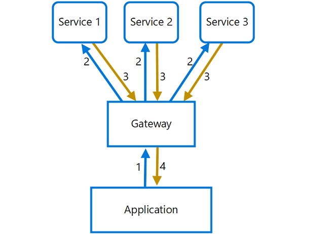

### Gateway Routing

Wenn ein Nutzer verschiedene Services ansprechen muss, dann muss er jeden Endpoint kennen. Anstatt dem Nutzer jeden Endpoint zur Verfügung zu stellen, benutzt man ein Gateway, welches die Requests der Nutzer weiterleitet. Dadurch lassen sich die einzelnen Services ohne großen Aufwand ändern und sind über das Gateway erreichbar. Dabei ist es auch möglich interne Endpunkte, wie zum Beispiel VMs über das Gateway zu erreichen.

Auch bei diesem Gateway muss man bedenken, dass es sich zu einem Single Point of Failure oder Bottleneck entwickeln kann.

# Security

Bei der Sicherheit geht es darum, dass die Daten vor unbefugten Zugriffen geschützt werden

### Gatekeeper

Um einen hohen Sicherheitsstandard zu erreichen sollten die Nutzer nicht direkt mit dem Server kommunizieren, um diesen nicht zu gefährden.

Ein Gatekeeper ist dabei ein Proxy, welcher dazu da ist zu überprüfen, ob man den Requests der Nutzer vertrauen kann. Validierte Requests schickt dieser dann weiter an den Server, welcher mit den Services und der Datenbank verbunden ist. Der Gatekeeper sollte dabei so wenig rechte haben wie möglich, damit im Falle eines Angriffs keine Informationen freigegeben werden, selbst wenn der komplette Gatekeeper übernommen wurde.

Es muss dabei beachtet werden, dass der Server nicht auf der gleichen VM läuft, wie der Gatekeeper, da ein Angreifer mit der Kontrolle des Gatekeepers auch Kontrolle über die VM erlangt. Ein einzelner Proxy kann dabei auch immer zu einem Single Point of Failure werden und durch den weiteren Zwischenschritt wird die Latenz negativ beeinflusst.

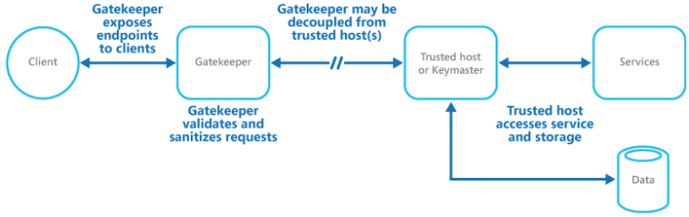

 

### Federated Identity

Webservices müssen in der Regel irgendwie ihre Nutzer identifizieren, was über Accounts geregelt wird. Die Benutzer mögen es aber nicht, dass sie sich für jeden Webservice einen neuen Account anlegen müssen. Wenn sie sich einen Account erstellen verwenden sie die gleichen Anmeldedaten, was zu einem Sicherheitsproblem werden kann, oder sie vergessen ihr Passwort, wodurch diese verärgert werden.

Um diese Probleme zu umgehen kann man die Authentifikation an Identity Providern, wie zum Beispiel google, facebook oder github auslagern. Dadurch kann der Nutzer einfach seinen zentralen Account verwenden und die Entwickler haben weniger Arbeit, da diese keine Nutzerverwaltung erstellen müssen.

Bei einem solcher Dienst schickt der Benutzer einem vom Webserver vertrautem Identity Provider seine Anmeldedaten und bekommt ein Token zurück. Mit diesem Token wird der Nutzer dann auf dem Webservice angemeldet.

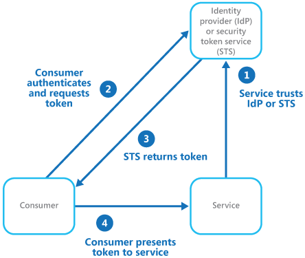
    

## Quellen
http://en.clouddesignpattern.org/index.php/Main_Page
https://docs.microsoft.com/en-us/azure/architecture/patterns/