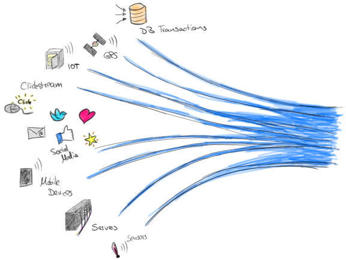
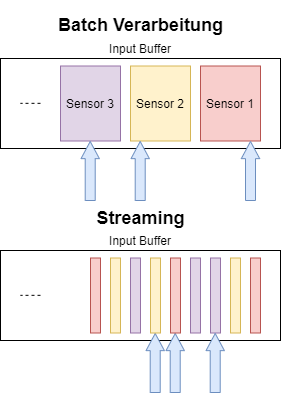
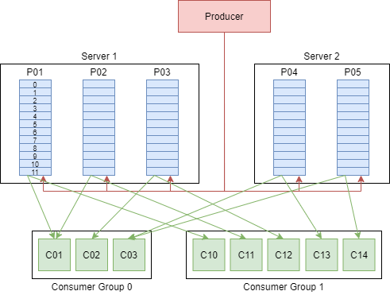
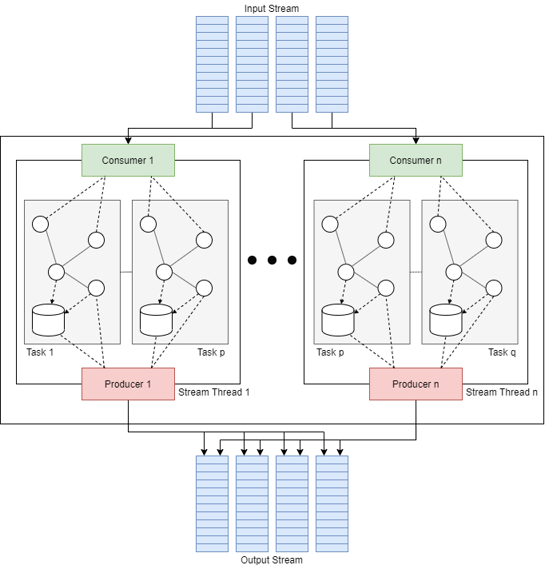
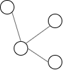
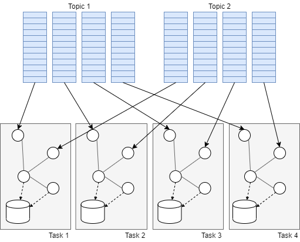
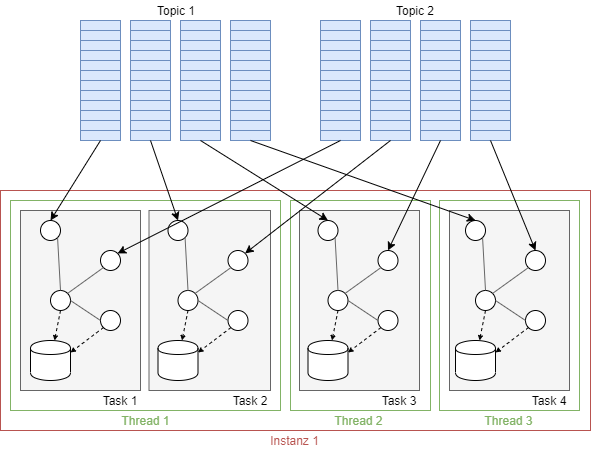
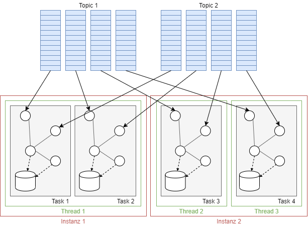

# Data Streaming

*Malte Riechmann*

## Was ist Data Streaming?

https://www.ververica.com/blog/continuous-queries-on-dynamic-tables-analyzing-data-streams-with-sql



Um Data Streaming zu beschreiben wird oft die Analogie eines Flusses verwendet. Wichtig ist dabei der Fokus auf die Strömung, die wie der Name *Streaming* schon verrät, im Vordergrund steht. Beim Data Streaming spielt der Anfang oder das Ende des Stroms erstmal keine Rolle. Die Daten die durch diesen Strom fließen sind kontinuierlich und haben keinen eindeutig definierten Start- und Endpunkt. Ein Beispiel für solch einen Datenstrom wäre zum Beispiel ein Smartes Thermometer, welches kontinuierlich die Temperatur an einen Server sendet, der darauf hin die Heizung steuert. Hier spielt der Start oder das Ende des Temperatur Datenstromes keine Rolle, wichtig ist nur der permanente Eingang neuer Daten.

Data Streaming ist auch nicht auf eine Datenquelle begrenzt. Wie das Bild zeigt, können die Daten aus tausenden verschiedenen Datenquellen kommen. Dabei ist der Typ der Datenquelle nicht wichtig und kann für jede Datenquelle unterschiedlich sein. Die Daten werden von der Quelle kontinuierlich als kleine Pakete verschickt, die von der Größe her im Kilobytebereich liegen. Die einkommenden Daten aus dem Strom werden dann sequentiell und inkrementell verarbeitet.

## Warum Data Streaming?

Nun stellt sich allerdings die Frage, was der Vorteil von Data Streaming und warum es verwendet werden sollte. Der Vorteil von Streaming wird schnell klar, wenn man den Bereich von Big Data betrachtet. Durch die kleinen Pakete, die aus viele verschiedene Quellen kommen, können Ereignisse aus diese Quellen quasi **simultan** verarbeitet werden. Dies ist wichtig um schnell auf verschiedene zusammenhängende Ereignisse zu reagieren.

Ein weiterer wichtiger Vorteil ist die **Echtzeitfähigkeit** des Streamings. Die kleinen Pakete können mit wenig Verzögerung verschickt werde. Außerdem gibt es kein Overhead für das Sammeln von Daten, wie es bei der Batch Verarbeitung üblich ist. Die kleinen Pakete können auch erheblich schneller verarbeitet werden als große Datenbündel, wodurch auf solche Ereignisse schneller reagiert werden kann.

Darüber besitzt Streaming eine gewisse **Fehlertoleranz**. Der Verlust einen wenige Kilobyte großen Paketes lässt sich in vielen Fällen bessere verkraften als zum Beispiel der Verlust eines ganzen Datenpaketes bei der Batch Verarbeitung. Und obwohl ein Datenpaket fehlt, kann der Datenstrom normal weiterverarbeitet werden.

Ein weiterer großer Vorteil von Data Streaming ist, dass das **Ende der Daten nicht bekannt sein muss**. Durch die Sequentielle Verarbeitung der kleinen Datenpakete wird immer nur in Ausschnitt des Datenstroms betrachtet. Dieses Fenster wird über die Daten geschoben, ohne das eine Ende bekannt sein muss. So können die kontinuierlichen Daten eines Sensors verarbeitet werden ohne sie vorher in Start- und Endpunkte aufzuteilen.

## Wo kommt Data Streaming zum Einsatz?

**Internet of Things**

Aufgrund der geringen Kosten von Sensoren und neuen Entwicklungen um Bereich Internet of Things (IoT) werden neue Produkte oft mit ihnen vollgepackt. Diese Sensoren zeichnen kontinuierlich Daten auf, die verarbeitet werden müssen. Die Daten an sich sind meisten kleine, wie zum Beispiel eine Temperaturwert oder eine Geschwindigkeit. Nichts desto trotz kommt es allein durch die Menge an Sensoren zu einem riesigen Strom an Daten. Das ist zum Beispiel der Fall in Transportfahrzeugen. Die Sensoren sollen dazu dienen die Leistung zu überwachen und gegebenenfalls Defekte möglichst schnell zu erkennen.

Ein weiteres Beispiel ist das Smart Home. Auch hier zeichnen zahlreiche Sensoren kontinuierlich Daten auf. Abhängig von den eingehenden Daten können dann Aktionen ausgeführt werden. Wenn zum Beispiel der CO2 Gehalt zu hoch ist können Fenster geöffnet und Heizungen ausgeschaltet werden. So kann der Komfort in dem Haus erhöht werden und außerdem Energie und Geld gespart werden.

**Finanzen**

Der Finanzbereich ist ein sehr typischer Bereich für Data Streaming, da hier tausende von verschieden Informationen kommen, die sich ständig ändern. So kann an dem Börsenmarkt Data Streaming zum Einsatz kommen um in Echtzeit Value-at-Risk-Berechnungen durchzuführen. So können Portfolios direkt angepasst und an den Börsenmarkt ausgerichtet werden.

**Aktivitätsverfolgung**

Aktivitätsverfolgung kommt in vielen Bereichen zum Einsatz, wie zum Beispiel Social Media Plattformen. Hier werden die einzelnen Aktivitäten der Nutzer verwendet um den Nutzungskomfort zu erhöhen. Basierend auf der Aktivität eines Nutzer und anderer vergleichbarer Nutzer werden dann bestimmte Vorschläge gemacht, die sich der Nutzer ansehen kann. Durch Data Streaming können diese Dienste besser auf den einzelnen Nutzer zugeschnitten werden und es kann schneller auf bestimmte Trends reagiert werden.

## Eigenschaften

In den vorherigen Kapiteln wurden einige Eigenschaften von Data Streaming erwähnt. An dieser Stelle werden alle noch einmal zusammengeführt und übersichtlich dargestellt.

* Ein Datenstrom kann mehrere unterschiedliche Quellen besitzen
* Es herrscht ein kontinuierlicher Datenfluss
* Der Datenfluss besteht aus kleinen Paketen im Kilobyte Bereich
* Ende des Flusses muss während der Übertragung nicht bekannt sein, wie im Beispiel der kontinuierlich generierten Daten eines Sensors
* Auf die Daten wird sequenziell zugegriffen (ggf. über ein Sliding Window)
* Datenrate kann variieren was bei der Verarbeitung/Speicherung beachtet werden

## Stream- vs. Batch-Verarbeitung

https://developer.sh/posts/streaming-data-overview



Bevor die Stream Verarbeitung in Mode gekommen ist wurde in erster Linie Batch-Verarbeitung verwendet. Hierbei werden die Daten zunächst gesammelt zu einem Datenblock. Durch die Sammlung von Daten können diese einfacher Verarbeitet werden. Im Gegensatz zur Stream Verarbeitung, bei der inkrementell Zahlen geupdatet werden müssen, wird hier einfach die Zahl über alle Daten berechnet, was vor allem für komplexe statistische Berechnungen einfacher ist. Eine Gegenüberstellung der beiden Methoden ist im oberen Bild dargestellt. Die blauen Pfeile markieren Ereignisse, die zur gleichen Zeit von dem Sensor aufgenommen wurden. Durch die Datenblöcke geht allerdings direkt die Echtzeit Eigenschaft verloren. Hier eignet sich die Stream Verarbeitung der kleinen Datensätze besser. Was am besten Angewandt werden soll hängt immer von dem konkreten Use Case ab, da beide Ansätze ihre Vorteile haben. Oft gibt es auch eine Kombination von beiden, sodass zuerst eine Stream Verarbeitung stattfindet für Echtzeit Berechnungen sattfindet und anschließend werden die Daten zu Batches zusammengefasst und weitere Berechnungen ausgeführt .

|             | Batch-Verarbeitung                                           | Stream-Verarbeitung                                          |
| ----------- | ------------------------------------------------------------ | ------------------------------------------------------------ |
| Datenumfang | Abfragen oder Verarbeitung über alle oder die meisten Daten im Datensatz. | Abfragen oder Verarbeitung über Daten in einem gleitenden Zeitfenster oder über die neuesten Datenaufzeichnungen. |
| Datengröße  | Große Datenbündel.                                           | Individuelle Mikrobündel aus wenigen Aufzeichnungen.         |
| Performance | Latenzen in Minuten zu Stunden.                              | Erfordert Latenzen im Bereich von Sekunden oder Millisekunden. |
| Analysen    | Komplexe Analysen.                                           | Einfache Reaktionsfunktionen, Aggregate und gleitende Metriken. |

https://aws.amazon.com/de/streaming-data/

## Dataspeicherung

Mit den neuen Eigenschaften der Daten aus Streams, werden auch neue Anforderungen an die Datenspeicherung gestellt. Die Datenmenge ist erheblich größer und variabler. Außerdem werden sie kontinuierlich generiert. Im folgenden werden dafür unterschiedliche Konzepte zu der Speicherung der Daten aus Streams dargestellt.

### Time Series Datenbanken

https://www.influxdata.com/time-series-database/

https://developer.sh/posts/streaming-data-overview

Da die meisten Datensätze eines Streams kontinuierlich generiert werden besitzen sie meistens auch ein Zeitachse. Das einfachste Beispiel hierfür ist wieder der Sensor als Input. Dieser misst die Daten immer zu einem bestimmten Zeitpunkt und die Daten verändern sich über die Zeit hinweg. Basierend auf  der Änderung über die Zeit müssen dann Entscheidungen getroffen werden. 

Time Series Datenbanken sind nun auf diese Art von Daten ausgelegt. Sie ermöglich das Aufnehmen von Daten mit einer hohen aus vielen verschieden Quellen, was optimal für Streams ist. Außerdem erlauben sie dem Nutzer einfach die Daten abzufragen und zu verstehen. Da die Datenbanken dafür ausgelegt sind Daten mit einem Timestamp zu speichern, sind sie optimiert für die Messung von Änderungen über die Zeit. Sie Unterscheiden sich von anderen Datenbanken, durch ein bestimmte Datenlebenszyklus Verwaltung, das Zusammenfassen von viel Daten des gleichen Typs und das schnelle Scannen der einzelnen Einträge. Oft ist die Struktur der eingetragen Daten deutlich weniger Komplex als bei Relationalen Datenbanken, was allerdings einen Geschwindigkeitsvorteil bringt.

### Data Warehouse

https://developer.sh/posts/delta-lake-and-iceberg

Ein Data Warehouse ist eine System zur verteilten Speicherung von Daten. Es können Transformation auf die Daten vor dem Speichern angewandt werden, sodass sie in der richtigen Form abgelegt werden. So können die verschiedenen Daten zentral abgefragt und analysiert werden. Data Warehouse sind generell für SQL ausgelegt, sodass sie die Daten in einer bestimmten Struktur erwarten.

Der Vorteil von einem Data Warehouse ist die Speichergröße. Es können riesige Datenmengen innerhalb eines Data Warehouse abgelegt werden. Das Problem ist, das durch die komplexe Datenstrukturierung, die Geschwindigkeit mit der die Daten in das Data Warehouse eingefügt werden können begrenzt ist.  Das ist ein großes Problem in Verbindung mit Streaming Daten, meistens eine hohe Datenrate besitzen. Durch durch fest definierten Strukturen kann ein Data Warehouse auch nur langsam auf Änderungen in den Daten reagieren. 

Kurz gesagt, ist eine Data Warehouse zwar gut für die große Menge an Daten geeignet, aber noch zu langsam und unflexibel für ein effizienten Umgang mit Streams.

### Data Lakes

https://developer.sh/posts/delta-lake-and-iceberg

Ein Data Lake ist eine zentraler Speicher, für alle Daten die irgendwie gesammelt werden. Dabei ist es egal, ob es sich um strukturiert oder und unstrukturierte Daten handelt. Sie werden so in ihrem Rohformat gespeichert, ohne sie umzuwandeln. Die Daten können aus unterschiedlichen Quellen kommen und unterschiedliche Typen besitzen. In dem Data Lake können Text, Zeitreihen und Bilddaten ohne weiteres zusammen kommen. Erst beim Abrufen erfolgt gegeben falls eine Umstrukturierung.

Diese Eigenschaften sind gut geeignet für Daten aus einem Datenstrom. Durch die weggefallen Strukturierung der Daten können sie mit einer sehr hohen Datenrate gespeichert werden. Außerdem ist ein Data Lake ohne eine vorgegeben Struktur erheblich flexibler und Änderungen in den Input Daten. Durch die riesigen Datenmenge in ihrer originalen Struktur eigen sich Data Lakes auch gut für Datenanalysen. 

Was aber im Endeffekt verwendet wird, ist immer Abhängig von dem jeweiligen Anwendungsfall. Im Kontext von Datastreams besitzt ein Data Lake viel Vorteile, bei Strukturierten Daten, die in Unternehmen häufig vorkommen eignen sich Data Warehouses besser.

## Kafka

https://kafka.apache.org/intro

Kafka ist einer verteilte Streaming Plattform. Verteilt bedeutet in diesem Kontext, dass es als Cluster auf einem oder mehreren Servern läuft. Was das für Vorteile mit sich bringt wird im folgenden nach und nach deutlich. Grundsätzlich bietet Kafka bietet drei Hauptfunktionen an:

1. Einen *Publish und Subscribe* Mechanismus an einen Strom an Datensätzen (Stream of records), vergleichbar zu Messaging Systemen
2. Ein fehlertolerantes Speichern von Datenströmen (Streams)
3. Und das Verarbeiten von Streams sobald sie auftauchen

Kafka kommt für häufig für zwei Hauptaufgaben zum Einsatz. Die erste ist als Datapipline die zuverlässig Daten zwischen Systemen in Echtzeit austauscht und die zweite ist zum Transformieren und und reagieren auf Datenströmen. Das heißt Kafka arbeitet nur auf dem Stream und hat keinen direkten Bezug zu dem Empfänger.

### Hauptkonzepte

Bevor es an die verschiedenen Streaming Architekturen geht müssen einige Grundbausteine und Konzepte von Kafka im Folgenden erklärt werden.



**Record**

Eine Record oder Datensatz stellt ein kleines Datenpaket dar, welches der Producer als eine Einheit schreibt. Jeder Datnsatz besteht aus einem Schlüssel, einem Wert und einem Timestamp.

**Topics and Logs**

Topics sind die Kernbestandteile von Kafka. Sie stellen die Kategorien dar unter denen Ströme von Datensätzen veröffentlicht werden. Wie in einer Log-Datei, werden alle eingehenden Datensätze gespeichert und neue Daten werden kontinuierlich an das Ende der Sequenz angehängt. Die Sequenz ist  dabei immutable und die Reihenfolge der Daten kann nicht geändert werden. Jeder Datensatz bekommt eine aufsteigende Nummer zugewiesen, dem sogenannten Offset. Dieser Offset identifiziert einen eine Datensatz eindeutig innerhalb einer Sequenz. Eine Topic unterstütz immer multi-subscriber, was bedeutet, dass ein Topic keinen, einen oder mehrere Subscriber haben kann

Unter einem Topic werden alle Daten erstmal dauerhaft gespeichert, unabhängig davon ob sie gelesen wurde oder nicht. Es kann eine Speicher-Periode eingestellte werden. Eingehende Datensätze werden dann für genau diese Zeitspanne gespeichert und nach Ablauf gelöscht unabhängig davon ob sie verarbeitet wurden.

**Partitions**

Ein weiterer wichtiger Punkt ist, dass ein Topic  aus mehren besteht Partitionen. Jede Partition ist eine solche geordnete Sequenz von Datensätzen. Die einzelnen Partition sind über das Cluster verteilt und jeder Server behandelt die Anfragen für einen Teil der Partitionen. Diese Aufteilung erlaubt eine nahe zu unbegrenzten Menge an Datensätzen zu speichern. Die Größe einer Partition ist begrenzt durch den Speicher des Servers, aber verschiedenen Partitionen liegen auf mehreren Servern und die Datensätze können aufgeteilt werden. Ein weiterer Vorteil ist, dass diese Aufteilung parallelisierte Verarbeitung unterstützt. *Wichtig anzumerken im Kontext der Offset ist, das dieser nur die Reihenfolge innerhalb einer Partition speichert und nicht für das gesamte Topic über alle Partitionen hinweg. Wenn eine solche übergeordnete Reihenfolge benötigt wird, darf nur eine Partition für das Topic verwendet werden.*

**Replicas**

Für jede Partition mehrere Kopien für eine höherer Fehler Toleranz. Dabei gibt es einen Server der als *Leader* agiert, der verantwortlich für alle Lese- und Schreibzugriffe auf die Partition ist. Die anderen Server der Kopien agieren als *Follower* und kopieren den Leader. Wenn einer der Leader ausfällt wird automatische einer der Follower zum neuen Leader. Um die Auslastung gleichmäßig über das Cluster aufzuteilen, agiert jeder Server als Leader für ein paar Partitionen und Follower für die Anderen.

**Producer**

Producer publishen Records an Topics ihrer Wahl. Dabei ist der Producer verantwortlich dafür welchen Datensatz er in welche Partition eines Topics schreibt. Dies Strategie hierfür kann jeder Producer frei wählen. Vorstellbar ist zum Beispiel ein Round-Robin vorgehen um die Auslastung der einzelnen Partitionen zu reduzieren, oder auch eine semantische Aufteilung der Datensätze, zum Beispiel nach dessen Schlüssel.

**Consumer**

Ein Consumer liest die verschiedenen Datensätze einer Partition, üblicherweise -aber nicht zwingend- in einer sequentiellen Reihenfolge. Für jeden Consumer wird ein Offset gespeichert, der angibt an welcher Stelle innerhalb des  Datenstromes er sich gerade befindet. Die Kontrolle über dem Offset liegt dabei bei dem jeweiligen Consumer. Deswegen muss dieser die Daten auch nicht sequentiell abarbeiten, sondern kann den Offset anpassen, um Daten wiederholt einzulesen oder Daten zu überspringen.

**Consumer Groups**

Jeder Consumer ist einer Gruppe von Consumern zugeordnet. Ein Datensatz eines Topics wird dann an genau einen Consumer innerhalb einer Consumer Gruppe geschickt. Wenn alle Consumer eines Topics als die gleiche Gruppe besitzen werden die Datensätze gleichmäßig aufgeteilt und wenn alle eine unterschiedliche Gruppe besitzen, wird der Datensatz an jeden Consumer geschickt. Diese beiden Fälle sind allerdings Spezialfälle, im Normalfall gibt wenige Consumer Groups (eine Gruppe = ein logischer Subscriber) mit jeweils mehreren Subscribern.

Bei Topics mit mehreren Partitionen und mehreren Consumer einer Gruppe werden die Partitionen auf die Consumer aufgeteilt. Das bedeutet, das ein Consumer immer die Datensätze von der gleichen Subgruppe an Partitionen bekommt. Diese Aufteilung wird von Kafka dynamisch verwaltet, sodass wenn neue Consumer dazu kommen, die Partitionen in kleinere Gruppen aufgeteilt werden, oder anders herum, wenn eine Instanz wegfällt, dass zu größeren Gruppen zusammengefasst werden.

**Broker**

Der Broker ist ein Kafka Server, der innerhalb des Clusters läuft. Er ist verantwortlich für das verwalten und weiterleiten der eingehenden Datensätze. Die Partitionen eines Topics werden gleichmäßig auf alle verfügbaren Broker aufgeteilt

**Zookeeper**

Der Zookeeper verwaltet und Koordiniert die verschiedenen Broker. Seine Hauptaufgabe ist es die Producer uns Consumer darüber zu informieren, dass ein neuer Broker verfügbar ist bzw. dass ein Broker ausgefallen ist. Die Producer und Consumer nutzen diese Information, um ihrer Aufgaben über andere Broker zu koordinieren 

**Cluster**

Sobald Kafka mehr als einen Broker besitzt spricht man von einem Cluster. Da Broker dynamisch dazu kommen oder verschwinden können, kann eine Cluster dynamisch wachsen oder schrumpfen. In dem Cluster wird die Persistenz und Kopien der Datensätze verwaltet.

### Kern APIs

https://kafka.apache.org/documentation.html#producerapi

Kafka bietet 5 API an, die Nutzer für ihre Software nutzen können.

**Producer API**

Die Producer API erlaubt es einer Applikation einen Datenstrom an ein oder mehr Topics zu veröffentlichen.  Im folgenden ist eine Beispiel eines Producers, der Nummern als String als Schlüssel-Wert-Paar schickt an ``"my-topic"`` schickt. Der Producer hält eine Buffer für jede Partition.

````java
Properties props = new Properties();
props.put("bootstrap.servers", "localhost:9092");
props.put("acks", "all");
props.put("key.serializer", "org.apache.kafka.common.serialization.StringSerializer");
props.put("value.serializer", "org.apache.kafka.common.serialization.StringSerializer");

Producer<String, String> producer = new KafkaProducer<>(props);
for (int i = 0; i < 100; i++)
     producer.send(new ProducerRecord<String, String>("my-topic", Integer.toString(i), Integer.toString(i)));

producer.close();
````

**Consumer API**

Die Consumer API erlaubt es Applikationen ein oder mehr Topics zu subscriben. Die so eingehenden Datensätze bestehend aus Schlüssel-Wert-Paaren und dem Offset können dann verarbeitet werden. Im folgenden ist ein Beispiel für ein Consumer.  Dieser Consumer gehört zur Consumer-Gruppe ``"test"`` und erwartet String Schlüssel-Werte-Paare. Der Consumer liest die Nachrichten aus dem Topic ``"my-topic"``.  An dieser Stelle können auch mehrere Topics angegeben werden.

````java
Properties props = new Properties();
props.setProperty("bootstrap.servers", "localhost:9092");
props.setProperty("group.id", "test");
// ... some more settings ...
props.setProperty("key.deserializer", "org.apache.kafka.common.serialization.StringDeserializer");
props.setProperty("value.deserializer", "org.apache.kafka.common.serialization.StringDeserializer");

KafkaConsumer<String, String> consumer = new KafkaConsumer<>(props);
consumer.subscribe(Arrays.asList("my-topic"));
while (true) {
    ConsumerRecords<String, String> records = consumer.poll(Duration.ofMillis(100));
    for (ConsumerRecord<String, String> record : records)
        System.out.printf("offset = %d, key = %s, value = %s%n", record.offset(), record.key(), record.value());
}
````

**Streams API**

Über die Streams API kann eine Applikation als Stream Processor fungieren. Es holt sich den Input-Stream aus einem oder mehreren Topics, verarbeitet sie und schreibt den Output in ein oder mehrere Topics. Auf die genau Architektur für Stream Processing wird nochmal unter **Streaming Architektur** eingegangen. Im folgenden ist ein sehr einfaches Beispiel gegeben.  Hier wird der Wert des eingehenden Schlüssel-Werte-Paars so umgewandelt, dass er nun die länge des Strings ursprünglichen Wertes als String enthält. Input für diesen Stream ist ``"my-topic"`` und der umgewandelte Datensatz wird an das Topic ``"my-output-topic"`` verschickt.

````java
Properties props = new Properties();
props.put(StreamsConfig.APPLICATION_ID_CONFIG, "my-stream-processing-application");
props.put(StreamsConfig.BOOTSTRAP_SERVERS_CONFIG, "localhost:9092");
props.put(StreamsConfig.DEFAULT_KEY_SERDE_CLASS_CONFIG, Serdes.String().getClass());
props.put(StreamsConfig.DEFAULT_VALUE_SERDE_CLASS_CONFIG, Serdes.String().getClass());

StreamsBuilder builder = new StreamsBuilder();
builder.<String, String>stream("my-topic").mapValues(value -> String.valueOf(value.length())).to("my-output-topic");

KafkaStreams streams = new KafkaStreams(builder.build(), props);
streams.start();
````

**Connector API**

Die Connector API ermöglicht es wieder verwendbare Consumer und Publisher zu schreiben, die Topics mit existierenden Applikationen oder Datensystemen verbindet. Es gibt beispielsweise Connectors zu Datenbanken wie Mongo DB, die jede Änderung in der Datenbank erfassen.

**Admin API**

Die Admin API erlaubt das verwalten und betrachten der verschiedenen Topics, Partitionen und Broker und anderer Kafka Objekte.

### Streaming Architektur

https://docs.confluent.io/current/streams/architecture.html



Die Streaming Architektur im Kontext von Kafka dreht sich um die **Stream API**. Die Architektur ist ausgelegt für Parallelisierung, Koordinierung der verteilten Anwendungen und Daten, Fehlertoleranz und operationale Einfachheit. Die überliegende Abbildung zeigt einmal die Architektur im Überblick. Die Input und Output Streams sind die partitionierten Topics. Der Stream Processor verwendet die Consumer API um die Input Daten zu holen und die Producer API um die umgewandelten Daten weiterzuleiten.  Die folgende Beschreibung wird nun die Aufteilung der Tasks und Stream Threads näher beschreiben. Dabei wird auch auf die Topologie innerhalb einer Task eingegangen.

**Prozessor Topologie**



Die Prozessor Topologie beschreibt die Logik der Stream Processing Anwendung. Sie gibt somit an, wie die Inputdaten umgewandelt werden um die Outputdaten zu erzeugen.  Dabei stellen die einzelnen Prozessoren die Knoten in dem Graphen dar und die Kanten, die die Knoten verbinden, sind Streams. In dem oben aufgeführten Beispiel eines Streamprocessors besteht die Topologie aus einem Knoten mit einer eingehenden und einer ausgehenden Kante.

**Stream Partitionierung und Tasks**

Ähnlich zu der Partitionierung der Topics in der Messaging Layer, teilt auch ein Stream die Daten für die Verarbeitung in Partitionen ein. Dabei wird unterschieden zwischen *Stream Tasks* und *Stream Partitionierung*. Im Bezug auf die oben aufgeführte Abbildung sind die Partitionen die einzelnen Stream Threads und die Stream Tasks werden innerhalb der Threads verarbeitet.

Was im ersten Augenblick ziemlich komplex wirkt verbirgt die Möglichkeiten der automatischen Skalierung und Aufteilung der Daten auf mehrere Instanzen. Dafür ist es wichtig zu verstehen, dass die Anzahl der möglichen Aufteilungen direkt Abhängig ist von der Partitionierung der Input Topics ist.  Der Grund dafür wird in der folgenden Grafik gezeigt.



Die Daten werden nicht manuell Aufgeteilt, sondern es wird Aufteilung der Topics verwendet. Jedes Topic wird zu einer Liste an Partitionen (der verschieden Input Topics) zugewiesen. Da jedes Topic zu einer Partition eines Topics zugewiesen wird, ist die maximale Anzahl an Tasks gleich der maximale Partitionierung aller Input Topics. In diesem Beispiel haben beide Topics vier Partitionen und somit ist maximale Anzahl an Task 4. Die Zuweisung von Partition zu Task ändert sich nie und somit ist die Anzahl and Task fest gelegt. Für jeden Task wird für die Verarbeitung jeweils die Prozessor Topologie initialisiert mit eigenen Buffern für die Inputdaten. 

Diese Tasks werden nun für die Verarbeitung weiter aufgeteilt auf Verschiedenen Instanzen und Threads. Der Einfachheit halber betrachten wir zunächst nur den Fall, dass es nur eine Instanz gibt. Für jede Instanz kann eine Anzahl an Threads konfiguriert werden.  Innerhalb eines Threads können mehrere Tasks abgearbeitet werden. Aufteilung der Tasks an die Instanzen und Threads wird von Kafka übernommen. Ein Beispiel für den Fall, dass es eine Instanz mit drei Threads gibt ist im Folgenden gegeben.



Für den Fall, dass es mehrere Instanzen gibt, zum Beispiel weil eine neue gestartet wurde, sähe die Zuweisung der Tasks beispielsweise wie folgt aus. Hierbei wurde die erste Instanz mit nur einem Thread gestartet und die zweite mit zwei Threads. Kafka übernimmt dynamisch die Neu-Zuweisung, wenn eine Instanz dazu kommt oder verschwindet. 



Zusammenfassend lässt sich also sagen, das Kafka die Partitionierung und Aufteilung vollkommen übernimmt. Der nutze muss lediglich die Task definieren und anschließende die Anzahl an Instanzen und deren jeweiligen Thread Anzahl festlegen. Dadurch ist Streamprocessing innerhalb eines großen Clusters mit vielen Instanzen trotzdem sehr einfach für den Nutzer zu realisieren. Zudem der gesamte Prozess sehr Fehlertolerant. Das liegt daran, dass die einzelnen Bestandteile schon sehr Fehlertolerant ist. Um Fehler im Consumer zu Fangen werden die Funktionen der Consumer API genutzt. Außerdem liegen mehrere Kopien von den verschiedenen Partitionen vor, sodass der Ausfall einer Partition schnell gefangen werden kann. Und durch das dynamisch aufteilen der Tasks auf die Instanzen ist auch das Ausfallen von Instanzen kein großes Problem. 

### Kafka Use Cases

https://kafka.apache.org/intro

Der Spezielle Aufbau von Kafka ermöglicht breitgefächerte Anwendungsgebiete, auch solche die nicht unbedingt Streaming erfordern. Der Folgenden Abschnitt wird hierfür drei Beispiele und darauf eingehen, warum Kafka sich hierfür besonders eignet. Obwohl sich hierbei auf drei Beispiele beschränkt wird ist der Anwendungsbereich riesig.

**Messaging System**

Um zu erklären warum und wie Kafka als Message Dienst genutzt werden kann, werden im folgenden einmal kurz die wichtigsten Grundprinzipien vom Messaging aufgeführt. Für einen detaillierteren Einblick bitte in die dazugehörige [Ausarbeitung](./Messaging/Messaging) gucken.

Es gibt grundsätzlich zwei Module beim Messaging, Queues und Publish-Subscribe. Bei der Queue lesen mehrere Consumer die Einträge vom Server, wobei jeder Datensatz nur zu genau einem Consumer geht. Beim Publish und Subscribe Prinzip, werden die Nachrichten an all Subscriber geschickt.

Diese beiden Konzepte werden in bei Kafka über das Design der Consumer Gruppe abgefangen. Die Nachrichten werden wie bei der Queue innerhalb einer Consumer Gruppe aufgeteilt. Darüber hin können mehrere Consumer Gruppe ein Topic lesen, wie es bei dem Publish und Subscribe Prinzip der Fall ist. Dadurch, das beide Funktionalitäten auf einmal abgedeckt werden ist Kafka wesentlich Flexibler. Ein weitere Vorteil ist, das Datensätze in Form eine Logs gespeichert werden, sodass auch ältere Daten oder bereits verarbeitete gelesen werden können. 

Ein weitere Vorteil ist, das Kafka eine striktere Reihenfolge hat, was für parallele Verarbeitung wichtig ist. So ist es zum Beispiel bei dem parallelen Verarbeiten mit Messaging Systemen und Queues so, das die Daten innerhalb der Queue eine Reihenfolge je nach ihrem eintreffen haben, allerdings können sie nicht sicher Stellen, das aufeinander folgenden Daten bei unterschiedlichen Consumer in der richtigen Reihenfolge ankommen. So kann die richtige Reihenfolge nach dem Versenden nicht mehr sichergestellt werden. 

Bei Kafka hingegen geschieht das über die strikte Reihenfolge innerhalb der Partitionen. So bekommt ein Consumer immer nur die Daten aus einer Partition. Somit somit wird die Reihenfolge innerhalb des Consumers und der Partition beibehalten. Allerdings ist die Anzahl der innerhalb einer Gruppe begrenzt mit der Anzahl an Partitionen des Topics.

**Storage System**

Jede Form einer Message Queue, die das Senden der Nachricht unabhängig von deren Lesen erlaubt kann theoretisch als Storage System betrachtet werden. Kafka besitzt einige Eigenschaften warum dies auf Kafka im Besonderen zutrifft. 

Zum einen werden die Daten auf die Disk geschrieben und werden nicht in einem flüchtigen Speicher gehalten. Darüber hinaus wird eine Partition zur Erhöhung der Fehlertoleranz mehrfach kopiert und auf anderen Servern gespeichert. Darüber hinaus nutzt Kafka eine Speicherstruktur, die eine große Skalierbarkeit besitzt, so das die Performance gleich bleibt, unabhängig von der Menge an gespeicherten Daten.

Eine letzter Punkt, warum sich Kafka für die Speicherung  von Daten eignet ist der vom Consumer verwaltete Offset. Über diesen Offset kann eine Consumer die Daten frei an jeder beliebigen Stelle lesen. Dies kann wie ein spezielles Datei-System gesehen werden.

**Stream Processing**

Dieser Use Case fällt im Vergleich zu den anderen insofern aus der Reihe, dass es eine typische Aufgabe von Streaming ist. Nichtsdestotrotz ist die Architektur von Kafka, wie in dem vorherigen Kapitel aufgeführt, sehr gut geeignet für eine solche Stream Processing in Echtzeit. Hierbei bezeichnet das Stream Processing alles was einen kontinuierlichen Stream als Input bekommt, Operation bzw. Transformationen auf den Daten ausführt und anschließend einen kontinuierlichen Strom and Daten als Output hat.

Typische Einsatzgebiete sind zum Beispiel das Behandeln von Ausreißern in den Daten oder das Durchführen von Zustandsberechnungen eines sich ändernden Systems.

### Kafka und Microservices

Kafka lässt sich auch gerade im Bereich von Microservices Einsetzen wegen seine Unterstützung von Asynchronen Nachrichten. Im einfachsten Fall wird Kafka dabei eins zu eins wie ein Messaging System, wie zum Beispiel RabbitMQ, eingesetzt werden. Wie vorher schon erwähnt bietet Kafka dabei einige Vorteile im vergleich zu herkömmlichen Message Systemen, vor allem durch seine hohe Flexibilität. Dabei sorgt Kafka automatisch für das richtige Balancing der verschiedenen Prozesse.

Aber Kafka bietet noch viel mehr Möglichkeiten, wie im Verlauf diese Ausarbeitung schon herausgearbeitet, die sich in Umgebung von Microservices effektive einsetzen lassen. Ein erster Vorteil, ist das die Topics als gemeinsamer Speicher zwischen den Microservices verwendet werden können. Ein einfacher dieses Speichers wäre es, ihn als eine Historie von zum Beispiel Einkäufen zu verwenden. Darüber hinaus können die Topics aber so eingestellt werden, immer nur den letzten Wert für einen Schlüssel zu speichern. Darüber können zum Beispiel Status anfragen geregelt werden. 

Der Zugriff auf ein Topic kann auch über eine Access Control List begrenzt werden, so dass nur eingetragene Services auf den Speicher zugreifen können.  Der beschränkte Zugriff ist natürlich auch für die Kommunikation vom Vorteil, auch nur bestimmte Services die Nachrichten lesen können.

Ein weiterer Großer Vorteil von Kafka mit Microservices ist offensichtlicher. Das die Topics für Datenströme ausgelegt sind, kann Kafka gleichzeitig als Messaging System und als Streaming System zwischen den einzelnen Services eingesetzt werden. Die Einsatzmöglichkeiten von Streaming in diesem Kontext sind riesig und gehen von Video und Audio Streams über Status anzeigen von Sensoren bis zu Aktivitäten Tracking der Nutzer.

Mit dem Aktivitäten Tracking geht eine weitere Fähigkeit einher, die sich mittels Kafka umsetzten lässt. Und zwar das Stream Processing. So kann zum Beispiel basierend auf den Aktivitäten eines Nutzer die Funktionalität eines Services angepasste werden. Parallel zu dem Tracking kann ein Echtzeit Verhaltensanalyse durchgeführt werden, um daraufhin zum Beispiel die Reihenfolge der Angebotenen Produkte geändert werden oder Empfehlungen für den Kunden gegeben werden.

Innerhalb eine Clusters von Microservices lassen sich so viele Daten generieren, auf die über Kafka unterschiedliche Analysen ausgeführt werden können. Die Möglichkeiten die sich daraus ergeben sind nahezu  unbegrenzt.

Obwohl Kafka diese vielen Möglichkeiten bietet, muss dabei auch beachtet werden, das ein erhöhter Wartungsaufwand einhergeht und Kafka mehr Ressourcen benötigt als andere Dienst. Deswegen sollte sich vorher gefragt werden, ob der Mehrwert, der Kafka in diesem Kontext mit sich bring auch wirklich genutzt wird.

### Abgrenzung zu anderer Big Data Science Software

Verschiedene Software bietet zum Teil Lösungen die so ähnlich auch in Kafka zu finden sind. Das diese Lösungen auch in Kafka so ähnlich zu finden sind bedeutet aber nicht, das Kafka anstelle dieser Software verwendet werden soll. Die verschiedenen Bibliotheken bieten gute Lösungen für ihren jeweiligen Anwendungsfall und wenn das Ziel das lösen diese Anwendungsfalls ist, ist es durchaus sinnvoll diese Software zu verwenden. Kafka ist stark auf Streams ausgerichtet, was sich zum einen in der Umsetzung widerspiegelt, was gut und schlecht sein kann. Dadurch besitzt Kafka eine hohe Komplexität die nicht unbedingt für jeden Anwendungsfall notwendig ist.

**Apache Spark Streaming**

https://spark.apache.org/docs/latest/streaming-programming-guide.html

Apache Spark Streaming basiert auf Apache Spark, welches eine Engine für large-scale Datenverarbeitung ist. Allerdings ist Apache Spark auf Batch Verarbeitung ausgelegt. Apache Spark Streaming ist nun die Erweiterung für die Verarbeitung von Streams. Der Input sind nun keine Batches mehr sondern zum Beispiel eine Stream an Datensätzen von Kafka. Im Gegensatz zur Stream Verarbeitung von Kafka, welches direkt auf den Minidatensätzen arbeiten kann, sammelt Spark Streaming die Daten zunächst in Minibatches, welche dann erst Verarbeitet werden. Das bedeutet auch, das der Output keine Datenstrom mehr ist, wie es bei Kafka der Fall ist.


**Apache Hadoop**

https://hadoop.apache.org/

Der Fokus von Apache Hadoop liegt auf der Koordinierung der Verteilten Verarbeitung von Datensätzen über ein Cluster hinweg.  Die Bibliothek soll Ausfälle erkennen und behandeln. Um so unabhängig von er Verfügbarkeit der einzelnen Hardware des Clusters trotzdem eine hohe Verfügbarkeit über das Cluster hinweg zu erlangen. Die Bibliothek ist Vergleichbar zu der automatischen Verteilung der einzelnen Partitionen eines Topics über das Cluster vergleichbar oder zu der dynamischen Zuweisung von Task an die einzelnen Verarbeitungsinstanzen. Die Übertragung der Daten über Streams ist dabei nicht Teil von Hadoop.

**Apache Hive**

https://developer.sh/posts/delta-lake-and-iceberg

https://hive.apache.org/

Apache Hive ist eine Data Warehouse Software. Sie führt das Lesen, Schreiben und Verwalten von großen Datensätzen, die verteilt gespeichert werden, über SQL durch. In Kafka wäre die Verwaltung und Verteilung der einzelnen Topics und deren Partitionen auf den verschiedenen Servern vergleichbar. Die letzten neuen Versionen von Hive Ziele darauf ab die Verarbeitung von Streams zu unterstützen. Problem die dabei vorliegen ist unter anderem, das die Datenrate von Streams erheblich höher ist, als sie von Hive verarbeitet werden können. Außerdem sind die Daten von Stream Variabler und können sich schneller ändern, wohingegen Hive langsam auf solche Änderung reagiert.

**Apache Cassandra**

https://cassandra.apache.org/

Apache Cassandra ist wie ähnlich zu Hive eine verteilte Datenbank, designt für große Datenmengen. Dadurch, dass es sich bei Cassandra um eine NoSQL Datenbank handelt sie allerdings wesentlich flexibler als Hive und kann besser mit unterschiedlichen Datenumgehen. Darüber hinaus ist die Datenbank einfach skalierbar, was auch eine Vorteil im Hinblick auf das Arbeiten mit Streams ist.

**Apache Flink**

https://flink.apache.org/flink-architecture.html

Das Apache Flink Framework wird für die verteilte Verarbeitung Streams zur Statusberechnungen verwendet. Dabei wird die Verarbeitung automatisch über das Cluster verteilt um eine gleichmäßige Auslastung zu erreichen. Für die Streams ist es dabei nicht zwingend Notwendig, dass sie ein Ende besitzen. Apache Flink ist Vergleichbar zu der Stream Verarbeitung innerhalb von Kafka, mit dem Unterschied, das hier der Fokus auf Statusberechnungen liegen. Kafka hingegen ist auch darauf ausgelegt einfache Transformationen auszuführen.

**Apache Beam**

https://www.google.com/search?q=apache+beam+kafka&rlz=1C1CHBF_deDE897DE897&oq=apache+beam+ka&aqs=chrome.1.69i57j0l7.3971j0j4&sourceid=chrome&ie=UTF-8

Apache Beam bietet die Möglichkeit parallel Datenverarbeitung Pipelines zu definieren, für Batch und Stream Verarbeitung. Wichtig ist, dass hier nur die Modellierung statt findet, die konkrete Ausführung wird dann von einem Backend wir zum Beispiel Google Cloud Dataflow, oder auch Kafka durchgeführt. Die Pipeline definiert die Schritte die zur Verarbeitung ausgeführt werden sollen unabhängig von der darunterliegenden Umsetzung. Vorteil ist, das die Pipeline mit wenigen Anpassungen für verschiedenen Backends angewandt werden können. In Kafka hingegen ist die Definition von Pipelines wesentlich komplexer, bietet dafür aber mehr Möglichkeiten für eigene Transformationen.

### Anwendungen On Top von Kafka

Um die Streams besser verarbeiten und Analysieren zu können gibt es Anwendung on top von Kafka, die den Umgang mit Stream vereinfachen sollen. Dies geschieht bei KSQL durch eine einfachere Syntax für den Zugriff auf die Daten eines Streams und bei Avro durch ein definiertes Schema für die Nachrichten.

**KSQL**

https://www.confluent.io/blog/ksql-streaming-sql-for-apache-kafka/

KSQL hat, anders als der Name es vermuten lässt, nichts mit SQL Datenbanken zutun. Bei SQL Datenbanken werden anfragen ausgeführt um lokale Daten abzufragen oder zu modifizieren. Was KSQL macht, sind kontinuierliche Anfrage auf die Daten eines Stream. KSQL besitzt zwei Kern Konzepte, die auf Kafka Topics aufbauen.

1. **Stream**: Eine unendliche Reihe von Daten, wobei eingetragene Daten imutable sind
2. **Table**: Eine Sicht auf ein Stream oder eine anderen Tabelle in Form einer Sammlung der sich ändernden Daten. Die Daten in einer Tabelle sind mutable, sodass sie für Transformationen genutzt werden können

**Avro**

https://www.confluent.io/blog/avro-kafka-data/

Avro ist ein System für die Datenserialisierung um den Austausch zwischen verschiedenen Systemen, Programmiersprachen und Frameworks zu vereinfachen. Dafür definiert es eine Schema, welches vergleichbar zu dem JSON Format ist.

Eine der Eigenschaften von Kafka ist, dass die Daten ein beliebiges. Das Daten oft eine unterschiedliche Struktur haben, werden sie so nicht durch ein Schema eingeschränkt. Mittels Avro wird argumentiert, warum es doch sinnvoll sein kann ein Schema zu verwenden, trotz des Overhead der durch die Strukturierung und Validierung dazu kommt. Ein Auszug der Vorteile der Verwendung eines Schemas sind im folgenden Aufgeführt.

1. **Robustheit**: Ohne Schema kann die Konsistenz und Strukturelle Korrektheit der Daten nicht sicher gestellt sein. Neue Producer eines Streams werden versuchen das ursprüngliche Datenformat beizubehalten, aber es gibt keine Garantie und keine Möglichkeit der Überprüfung
2. **Semantik**: Ohne Schema ist die Semantik eines Wertes nicht eindeutig definiert. Eingehende Daten können von lesenden Systemen unterschiedlich interpretiert werden.
3.  **Kompatibilität**: Durch Avro wird die Kompatibilität mit einer breitem Reihe an anderen Systemen sicher gestellt.