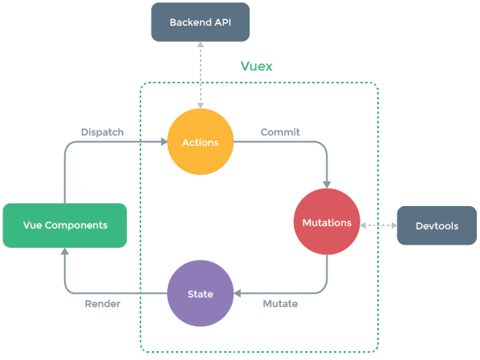

# Frontend Architekturen
Fabian Husemann | FH Bielefeld

 

# Inhalt
- Motivation für eine Frontend Architektur
	
- Reactive Programming		
- Functional Programming 
- Functional Reactive Programming 

- Verschiedene Architekturen		
	- Redux
	- MobX
	- Vuex
	- Model View Intent
	- SAM
	- Model View Update
	
- Architekturen im Vergleich

# Motivation für eine Frontend Architektur

Eine Frontend Architektur ist eine Kollektion von Tools und Prozessen die zur Verbesserungen der Frontend Codes beisteuern. Dabei sorgt die Frontend Architektur auch für einen sauberen und effizienten Arbeitsablauf. Häufig wird das Frontend unterschätzt und es heißt: „Das Frontend kloppen wir am Ende einfach irgendwie drauf.“ Aber da heutzutage Moderne Frontend Architekturen über einen enormen Funktionsumfang verfügen, ist das aufsetzen eines Frontend ein großer Arbeitsaufwand.

Auch durch die hohen Anforderungen ist das erstellen eines Frontends keine einfache Sache, da die Benutzer schon von kleinen Programmfehlern genervt und abgetan von unserer Anwendungen sein können. Die Anwendung sollte zum Beispiel den höchst möglichen Bedienkomfort haben und gleichzeitig auf verschiedenen Auflösungen laufen. Dazu zählen auch schnelle und flüssige Darstellungen von Objekten im Frontend, die durch asynchrone Kommunikation gewährleistet sind. Aber nicht nur die Benutzer haben Anforderung auch für die Entwickler selbst ist es wichtig dass, die einzelnen Komponenten Skalierbar und Wiederverwendbar sind, um strukturierten und übersichtlichen Code zu erhalten.

# Reactive Programming

Reactive Programming ist ein Programmierparadigma (Programmierstil), dass sich bei
der Datenverarbeitung an Datenflüssen orientiert. Dabei werden Änderungen in den
Datenflüssen automatisch propagiert. Dabei benutzt es das Observer-Pattern womit es möglich ist, ein Objekt zu einem Observable zu machen und andere Objekte können dieses Objekt abonnieren, um Änderungen automatisch zu erhalten. Durch dieses Pattern ermöglichen wir der Anwendung ohne einen Zustand auszukommen. Das Observer-Pattern ermöglicht es ein Event-driven Architektur umzusetzen um eine Asynchrone Kommunikation herzustellen. Beim Reactive Programming werden außerdem die Funktionen und der auszuführende Code entkoppelt, was dazu führt, dass die Betriebssystemebene weniger Kontextwechsel durchführen muss und eine bessere Performance erreicht wird. Jedoch sorgt die Entkopplung auch dazu, dass die Entkopplung von geschriebenen Funktionen und ausgeführtem Code zu einem erhöhten Schwierigkeitsgrad beim Lesen und Schreiben des Codes führt.

Warum sollte man also Reactive Programming benutzen? Da der Anwender eine schnelle Reaktionszeit und 100%ige Verfügbarkeit von unserer Website erwartet, muss man heutzutage ein Umsetzung benutzen die diese Punkte abdeckt. Dies kann mit Reactive Programming schnell und ressourcensparend umgesetzt werden. Dabei wird auch eine bessere Aufteilung beim Programmieren entstehen da die Funktionen entkoppelt voneinander sind. Allerdings sorgt das Entkoppeln des Codes und die vielen Datenströme dazu das die Anwendung Speicherintensiv wird. Durch die Weiterentwicklung von neuen Techniken und Speichermedien ist dies jedoch nur ein kleiner Nachteil. Ein weitere Nachteil ist es das die Denkweise beim Programmieren geändert werden muss, da hauptsächlich die Objektorientierte Programmierung verwendet wird.

# Reactive System
Reactive System ist eine Architektur, die man einsetzen kann um eine hohe Reaktivität zu gewährleisten. Dabei werden vier Qualitäten in Vordergrund gesetzt.

### Reaktive Systeme sind:

- Responsive:

  Das System soll zeitgerecht auf Anfragen Antworten. Dabei ist wichtig, dass eine vereinbarte Antwortzeitgrenze festgelegt wird, da die Fehler in verteilten Systemen nur durch die Abwesenheit einer Antwort sicher festgestellt werden können.

- Resilient:

  Das System bleibt selbst bei Ausfällen von Hard- oder Software antwortbereit. Dies erreicht man durch Replizieren der Funktionalität, Eindämmung von Fehlern, Isolation von Komponenten sowie Delegieren von Verantwortung. So fällt bei einem Ausfall nur ein Teilsystem aus und die Anwendung ist weiterhin in Antwortbereitschaft .

- Elastic

  Das System bleibt bei wechselnder Arbeitsbelastung reaktionsfähig. Bei Verminderung oder Erhöhung der Last werden automatisch die Replizierungsfaktoren und damit die genutzten Ressourcen angepasst. Um dies zu ermöglichen, darf das System keine Engpässe aufweisen, die den Gesamtdurchsatz vor Erreichen der geplanten Maximalauslegung einschränken.

- Message Driven: 

  Das System benutzt asynchrone Nachrichtenübermittlung zwischen den einzelnen Komponenten. Durch die lose Kopplung und die Isolation der Komponenten ist es der einzige Weg wie die Komponenten untereinander kommunizieren. Um Einblicke in die Laufzeit oder um Ressourcen zu steuern wir ein Nicht-blockierende nachrichtenorientierte Systeme verwendet. Nicht-blockierende nachrichtenorientierte Systeme erlauben eine effiziente Verwendung von Ressourcen, da Komponenten beim Ausbleiben von Nachrichten vollständig inaktiv bleiben können.

# Event-driven vs. Message-driven

Auf den ersten Blick sehen sich die Event-driven und die Message-driven Architektur ähnlich. Sie werden gebraucht um eine Kommunikation zwischen zwei Komponenten herzustellen. Jedoch benutzt die Event-driven Architektur Ereignisse die von anderen Komponenten beobachtet werden können. Und die Message-driven Architektur sendet Nachrichten an die vorgesehene Komponente. Dabei haben die Nachrichten ein genaues Ziel und gelten nur für die eine Komponente. Und Ereignisse dagegen sind Fakten die für jede Komponente gültig sein können. Außerdem ist die Belastbarkeit durch die Kurzlebigkeit der Ereignisverbrauchsketten auch schwerer zu erreichen. Jedoch haben Ereignisse den Vorteil, dass sie allgemein Gültiger sind als Nachrichten, da jede Nachricht einen bestimmten Empfänger hat.

# Functional Programming
Functional Programming ist ein weiterer Programmierstil wie Reactive Programming, jedoch wird beim Functional Programming der Programmablauf durch Funktionen bestimmt. Denn der Zustand der Anwendung fließt durch die Funktionen. Hierbei ist es wichtig das sogenannte Pure Functions benutzt werden. Eine Pure Function ist eine Funktion ohne SIDE Effects, dass heißt: Die Funktion hat keine unvorhersagbaren Auswirkungen auf unsere Programm. Solche Auswirkungen können von einem simplen console.log() bis zu System.exit() gehen. Ein weitere Auswirkung wäre es wenn die Inputs der Funktion in der Funktion verändert werden, deswegen werden die Inputparameter auf Immutable gesetzt. Da die Funktion keine SIDE Effects haben darf muss die Funktion einen Rückgabewert haben, da die Funktion sonst nichts tun würde. Dabei ist es Wichtig, dass der Rückgabewert, je nach Inputwert immer der gleiche Wert bleibt.

Durch sogenannte High-Order-Funktionen kann man die Wiederverwendbarkeit der Funktionen noch weiter verbessern. Im zusammen spiel mit Generics können Funktionen erstellt werden die mit Unterschiedlichen Datentypen klar kommen (siehe Beispiel).

# Functional Reactive Programming (FRP)

Functional Reactive Programming ist die Kombination aus Functional Programming und Reactive Programming. Dabei verwendet es die asynchronen Datenströme von Reactive Programming um eine schnelle Reaktionszeit zu bieten. Functional Programming dagegen bietet eine erhöhte Abstraktionsebene und Funktionen zum Kombinieren, Erstellen, Zuordnen und Filtern beliebiger Datenströme. Dadurch wir das System flexibel, lose gekoppelt und skalierbar. Functional Reactive Programming wird in den verschiedensten Bereichen der Programmierung angewendet zum Beispiel bei der Entwicklung von GUI´s, Robotik und Spiele.

# Redux

Redux ist eine Predictable-State-Container für JavaScript. Es hilft dabei, Anwendungen zu schreiben, die sich konsistent verhalten, in verschiedenen Umgebungen (Client, Server und nativ) laufen und leicht zu testen sind. Redux verwendet dabei zwei Pattern. Einmal das Command Query Responsibility Segregation (CQRS) Pattern. Dieses Pattern sorgt dafür das der Zustand nur durch bestimmte Befehle verändert werden können. Dabei werden die Befehle zu Store gesendet werden und verarbeitet. Das zweite Pattern ist das Event Sourcing Pattern. Event Sourcing kann aus den Befehlen von CQRS eine Abfolge von Befehlen machen die dann jeder Zeit abgespielt werden können.

### Komponenten

- Store

  Der Store ist ein Speicher, indem der gesamte Zustandsbaum der Anwendung hinterlegt ist. Der aktuelle Zustand kann vom Store zurück gegeben werden. Da der Store global gesetzt ist kann jede Komponente in der Anwendung drauf zugreifen. Jedoch kann der Zustand nicht einfach so geändert werden. Um einen Zustand im Store zu ändern muss eine Action zum Store gesendet werden.

- Action
	
	Eine Action ist ein einfaches Objekt mit den beschriebenen Änderungen der Daten im Store. Die Action ist einzige Information Quelle die von Store angenommen wird. Eine Action benötigt dafür ein Attribute "type" zur Identifizierung und die restlichen Daten zum ändern des Zustands.
	
- Dispatch

  Dispatch ist eine Funktion zum senden von Actions zum Store. Dies ist die einzige Möglichkeit einen Zustandswechsel auszulösen.

- Reducer

  Der Reducer ist eine Funktion die als  Reaktion auf gesendete Actions den neuen Zustand der Anwendung zurück gibt. Dabei ist es wichtig, dass der Reducer eine Pure Function ist, da keine SIDE Effects auftauchen sollen. Außerdem soll der Wert des neue Zustand immer der gleiche Wert bleiben für die Angegebene Action und den vorherigen Zustand.

###  Ablauf

Am Start der Anwendung wird der Startzustand aus dem Store geladen und in der UI dargestellt. Als nächstes wird eine Action von einem Benutzer auf der UI ausgelöst. Danach wird der Aktuelle Zustand und die Action dem Reducer übergeben und dieser berechnet den neuen Zustand und Updatet den Store. Als letztes bemerkt die UI durch den Observable Store eine Änderung und gibt den neuen Zustand aus. 

###  Vor- und Nachteile

Redux hat viele Vorteile für das Entwickeln von Frontend System. Zu einem sorgt der globale Zustandsbaum dafür das es wenig Überraschungen beim halten des Zustands gibt, da man bei Redux den Zustand nur durch Reducern und Actions ändern kann. In Anwendungen mit Zuständen ohne einem Zustandsmanagementtool kann es passieren das der Zustand durch Side Effects unvorhersehbar geändert werden kann. Ein weiterer Vorteil ist, dass durch die Entkopplung der Komponente ein gut testbares System entstanden ist. Durch die Entkopplung ist auch eine gute Übersichtlichkeit über die Anwendung entstanden, die in großen Projekten mit vielen Entwicklern eine einfache Aufteilung ermöglicht. Allerdings hat Redux auch Nachteile die jedoch von den Vorteilen überwogen werden. Zum einen ist der Programmieraufwand bei Redux deutlich gestiegen, da viel Struktur-Code implementiert werden muss. Zum anderen entsteht ein mittelhoher Prozessaufwand, da die Reducer (Pure Function) durchgelaufen werden müssen. 

# MobX
MobX ist eine weitere Frontend Architektur, die mit einer Zustandsverwaltung die Anwendung steuert. Dabei wird eine transparente Anwendung der funktionalen reaktiven Programmierung verwendet, um das Zustandsmanagement so einfach und skalierbar zumachen. MobX ist besonders in der Kombination mit React eine starke Architektur. Durch React wird der Zustand in der Anwendungen in einen Baum mit renderbaren Komponenten gerendert. Dabei bietet MobX Mechanismen zum Speichern und Aktualisieren von Zuständen

### Komponenten

- Action
	
	Action sind dafür da den Zustand zu modifizieren um den nächsten Zustand zu berechnen. Dabei ist wichtig anzumerken das nur eine Action den State beeinflussen kann. Eine Action wird von einem Event auf der UI aufgerufen.
	
- State

  Der State bilden den Zustand der Anwendung ab. Dadurch das der State ein Observable ist, werden Veränderungen automatisch erkannt. Da jeder Zustand der Anwendung programmiert werden muss, sollte drauf geachtet werden das keine Redundanz auftaucht. Außerdem sollte der State keine abgeleiteten Daten beinhalten damit der gleiche State keine unterschiedlichen Ergebnisse liefert.

- Computed values
	
	Computed Values sind die berechneten Werte des States, diese werden über Pure Functions an die Reaction weitergeleitet.
	
- Reactions

  Die Reaction ändert die UI anhand der Computed Values und stellt die nächsten Actions bereit.

  

### Ablauf

Der Ablauf bei MobX startet bei einer Action, die von einem Event aufrufen werden. Danach modifiziert die Action den State. Der State entscheidet welche Werte mit dieser Action ausgegeben sollen. Diese Werte werden Computed values genannt und sie werden über Pure Functions an eine Reaction gesendet. Reaction updatet dann die UI mit den neuen Actions um zum nächsten State zu gelangen.

### Vor- Nachteile

MobX ist eine Einsteigerfreundliche Frontend Architektur, denn im Gegensatz zu Redux wird bei MobX nur wenig Struktur Code zur Implementation benötigt. Dadurch kann sie deutlich einfacher gelernt und angewendet werden. Außerdem kann weiterhin Objektorientierte Programmierung verwendet werden, was man bei anderen Architekturen vermeiden sollte. Jedoch steigert das auch die Freiheit beim Programmieren und das kann dazu sorgen, dass der Code unübersichtlich wird. Des weiteren ist es schwer zu Debuggen, da die Zustande nur durch eine bestimme Reihenfolge durchlaufen werden können.

# Vuex

VueX ist eine Frontend Architektur die von Redux inspiriert wurde. Auch bei dieser Architektur wird eine Zustandsmanagement Pattern zum verwalten von Zustanden verwendet. Außerdem wird eine weiter Bibliothek eigebunden die das Mutieren von States vereinfacht. VueX wird verwendet für ein besseres Zustandhandling außerhalb von Vue Komponenten und ist deswegen auf Vue.js beschränkt. Wie bei den vorherigen Architekturen besitzt auch VueX einen Zustandsbaum mit allen Zuständen in der Anwendung. VueX verwendet zum aufrufen von Actions das Event-driven Pattern, womit es auf Events reagieren kann. 

### Komponenten

- State

  Der State gibt den Zustand der Anwendung wieder. 

- View
	
	Die View ist die Visuelle Ausgabe in der Anwendung. Da VueX auf Vue.js aufbaut werden zur Visualisierung die Vue Komponenten benötigt. Dabei können auch mehrere Views von einem State verändert werden.	
	
- Action

  Die Action wird aufgerufen, wenn ein Event ausgelöst wurde. Dabei wird ausgesucht welche Mutation ausgeführt und an den State gesendet werden soll.

- Mutation

  In der Mutation steht wie der aktuelle Zustand sich verändern soll. Eine Mutation wir durch eine Action versendet.

### Ablauf

Ein Ablauf von VueX wird aufgerufen, wenn in einer Vue Komponente ein Event auslöst. Danach wird die Action für das Event aufgerufen. Diese entscheidet welche Mutation auf den aktuellen State ausgelöst werden soll. Nach dem eine Mutation erstellt wurde wird sie zum State geschickt. In der Mutation steht beschrieben wie sich der State ändern soll. Der State reagiert auf die Mutation und rendert die Änderungen auf die Vue Komponente.

# Model View Intent (MVI)

Model View Intent ist eine Frontend Architektur, die die Entwurfsmuster für Reactive und Functional Programming verwendet. MVI ist besonders darauf ausgelegt mit einem Benutzer zu interagieren, deswegen wird es hauptsächlich im Bereich Android Programmierung verwendet. Dabei folgt es dem Kerngedanke von Model View Controller

Problem bei MVC: Der Controller in MVC ist in der Lage das Model und sogar die View zu manipulieren. Dadurch ,dass die Datenflusse in verschiedene Richtung gehen können, passt es nicht in das Konzept der Reaktiven Programmierung. Denn das Ziel von Model View Intent ist ein unidirektionaler Datenfluss mit Unveränderbarkeit von Zuständen.

### Ablauf

Wie setzt man nun diesen Kreislauf zusammen? Die Antwort darauf ist das Konzept der funktionalen Programmierung. Mit sogenannten Kettenfunktionen kann der Programmablauf durch die einzelnen Komponenten von MVI durchlaufen.

Reaktive Programmierung macht es nun möglich mit einem Observable View Events an intent() zu schicken. intent() wartet nun auf die Eingabe eines Benutzers und schickt darauf hin eine Action an model(). Die Funktion model() erstellt anhand der Action ein neues Modell und schickt es an die view(). Diese visualisiert das neue Modell.

### Komponenten

- intent() 

  Intent ist dafür da, um die Eingaben des Benutzers entgegen zunehmen. Dafür transformiert Intent die Eingaben, wie zum Beispiel ein Klick auf ein Element in der Anwendung, zu etwas, dass für die Funktion model() verständlich ist. Beispielsweise das einfache Setzen eines Strings im Model, es könnte aber auch die Transformation in etwas komplexeres wie eine Datenstruktur für Aktionen oder Befehle sein.

- model() 

  Das Model ist die Datenabbildung der Anwendung. Die Ausgaben von intent() werden von model() entgegen genommen und werden zum manipulieren des Modells benötigt. Da MVI darauf absieht die Zustände nicht zu verändern, wird ein neues Modell vom alten erstellt und danach manipuliert. Das neu entstandene Modell wird an die View weitergegeben.

- view()

  Die View bildet das Modell von model() in der Anwendung ab.

###  Vor- und Nachteile

Einer der Vorteil von Model View Intent ist der unidirektionaler und zyklischer Datenfluss. Dadurch entsteht ein leicht zu verfolgender Datenfluss, der bei Debuggen hilft. Dazu kommt noch das während des Lebenszyklus von Views in konsistenter Zustand vorhanden ist. Dies sorgt dafür, dass der Zustand nicht unvorhersehbar geändert werden kann. Jedoch hat Model View Intent auch Nachteile und zwar besteht eine höhere Lernkurve, da die Android Entwicklung viele verschiedene Technologien verwendet. Des weiteren bestehen immer zwei Modelle im Workflow, einmal die angezeigte View und die View die neu modifiziert wird. Dies sorgt für einen erhöhten Speicherverbrauch. 

# SAM - State-Action-Model

SAM (State-Action-Model) ist ein Software-Engineering-Muster, das bei der Verwaltung und Überprüfung des Anwendungsstatus hilft. Das Gründungsprinzip von SAM ist, dass State Mutation ein wichtiger teil des Programmierungsmodells sein muss. SAM verwendet Konzepte von React. Darunter gehört das Event-driven Pattern und die Reaktive Programmierung. Allerdings ist basiert die Grundlage von SAM auf das Paxos Protokoll und TLA+ (Temporal Logic of Actions). TLA+ ist eine formale Spezifikationssprache und sie wird zum Entwerfen, Modellieren, Dokumentieren und Überprüfen von Programmen verwendet. Um mit SAM die bestmögliche Implementation zu erreichen wird empfohlen einen unidirektionalen Datenfluss zu verwenden. Außerdem sollte man drauf achten das nur ein Zustandsbaum in der Anwendung vorhanden ist. Auch Pure Functions können eigensetzt werden, um eine übersichtlichen Durchlauf zu erstellen.

###  Komponenten

- Action

  Die Action beschreibt wie sich Model verändern soll. Dabei werden die Actions von einem Event auf der View ausgelöst. Die verfügbaren Actions werden durch ein Proposers vorgeschlagen.

- Model

  Das Model beinhaltet die Logik des Programmes und alle Datenströme. Das Model muss als erstes die Action durch einen Acceptor annehmen und berechnet dann den nächsten Zustand.

- State

  Der State ist der Zustand der Anwendung. Dieser kann nur verändert werden, indem einem Learner den neuen Zustand anlernt. Außerdem stellt State die nächsten Actions für den neuen Zustand zur Verfügung.

- View

  Zeigt den aktuellen Zustand der Anwendung an. Wenn ein Benutzer die Anwendung bedient wird ein Event mit der dazugehörigen Action losgeschickt.

### Ablauf

 

Im oben gezeigten Bild sieht man ein Durchlauf mit der SAM Architektur. Der Durchlauf startet wenn der Benutzer die Anwendungen bedient. Wenn der Benutzer nun ein Element in der Anwendung auswählt wird eine Event mit der dazugehörigen Action ausgelöst. Die Actions die von der View zur Auswahl stehen werden vorher von dem State vorgeschlagen. Die Action muss nun vom Model durch ein Acceptor angenommen werden. Als nächstes berechnet das Model den neuen Zustand. Bevor dieser angezeigt werden kann muss der State den neuen Zustand lernen. Danach wird der neue State der View übergeben und ausgegeben.

# Model View Update

Model View Update hat seinen Ursprung aus der Community der funktionalen Programmierungssprache ELM. Sieh wird häufig auch als ELM Architektur bezeichnet, aber dies setzt voraus, dass die Anwendung in ELM geschrieben wurde. MVU wird für Interaktive Programme, wie Webapplikationen und Spiele verwendet.

### Komponenten

- Model

  Anders als bei anderen Architekturen beschreibt Model nicht eine Menge von Funktionalität (Dienste, Daten, ...), sondern den Zustand des Programms.

- View

  Die View sorgt dafür das Model in eine Ausgabe umzuwandeln (also bspw. Modell in HTML Code)

- Update
	
	Mit Update ist es möglich Daten aus dem Model zu verändern. Dabei wird ein neues Model erstellt, da die einzelnen Model unveränderbar sein sollen. Dem Update wird übergeben was verändert wird und als Ausgabe kommt das neu veränderte Model raus.
	
- (Runtime)
	
	Diese Komponente wird ausschließlich in der ELM Programmiersprache verwendet, da diese zur grundlegenden Komponente von ELM zählt. Sie wird verwendet um die drei oben genannten Komponenten mit einander zu verketten.
	
	

### Ablauf Elm Architektur:

Der Ablauf bei Model View Update wird in eine Endlosschleife im Elm Runtime ausgeführt. Als erstes interagiert ein Benutzer mit der Anwendung. Danach schick der Elm Runtime eine Nachricht an Update. In der Nachricht steht beschrieben was der Benutzer für eine Aktion ausgeführt hat. Update erstellt aus der Nachricht und dem alten Model ein neues Model. Dieses Model wird dann durch die View in Html Form ausgegeben.

### Vor- und Nachteile:

Ein Vorteil der Model View Update Architektur ist die Einfachheit beim Programmieren, da nur wenig Struktur Code geschrieben werden muss. Dabei bietet es trotzdem eine hohe Kapselung und Modularität der Komponenten. Dadurch erreicht MVU eine sehr hohe Einsetzbarkeit, da Komponenten öfters in verschiedene Bereiche eingesetzt werden können. Jedoch gibt es eine schlechte Dokumentation, was während der Einfindungsphase zu einen paar Problemen führen kann.

# Architekturen im Vergleich

|                      | Redux                      | MobX                      | VueX                              |
| -------------------- | -------------------------- | ------------------------- | --------------------------------- |
| Programmiersprache   | JavaScript                 | JavaScript                | JavaScript                        |
| Vorraussetzung       | keine                      | Keine / React             | Vue.js                            |
| Programmierstil      | Reactive, Functional       | Reactive, OOP, Functional | Reactive                          |
| Vorteile             | Gut Testbar, Übersichtlich | Wenig Aufwand, OOP        | Übersichtlich                     |
| Nachteile            | Hoher Aufwand              | Zuviel Freiheiten         | Komplex                           |
| Eingesetzter Bereich | großen Anwendungen         | mittelgroß Anwendungen    | mittelgroß bis großen Anwendungen |

|                      | MVI                            | MVU(Elm)            | SAM                |
| -------------------- | ------------------------------ | ------------------- | ------------------ |
| Programmiersprache   | JavaScript                     | Elm, C#, JavaScript | JavaScript         |
| Vorraussetzung       | keine / RxJava                 | keine               | keine              |
| Programmierstil      | Reactive, Functional           | Functional          | Reactive           |
| Vorteile             | Übersichtlich                  | Wenig Aufwand       | Wenig Aufwand      |
| Nachteile            | Lange Lernkurve, Hoher Aufwand | schlechte Doku      | wenig Umfang       |
| Eingesetzter Bereich | Android                        | kleine Anwendungen  | kleine Anwendungen |

### Quellen:

[Allgemeines zur Frontend Architektur]( 
[MobX](!https://mobx.js.org/) 
[Redux](!https://redux.js.org/)
[Reactive System](!https://www.reactivemanifesto.org/) 
[Functional Reactive Programming](!https://blog.danlew.net/2017/07/27/an-introduction-to-functional-reactive-programming/) 
[Functional Reactive Programming (2)](!https://www.it-economics.de/software-architektur/2019-06/functional-reactive-programming-frp-mehr-als-nur-datenstroeme-und-lambdas-1) 
[Elm Architektur](!https://dennisreimann.de/articles/elm-architecture-overview.html) 
[Elm Architektur (2)](!https://guide.elm-lang.org/architecture/) 
[SAM](!http://sam.js.org/)