# Infrastruktur

André Kirsch

---

## Inhalt

1. Cloud Computing
2. The Twelve-Factor App
3. Infrastructure as Code
4. Virtualisierung und Containerisierung
5. Container Patterns
6. Docker
7. Kubernetes

---

## Cloud Computing

### Was ist Cloud Computing?

Da Cloud Computing sehr umfangreich ist, existiert keine eindeutige Definition. Manche haben trotzdem versucht, eine Cloud und Cloud Computing zu definieren:

Eine Cloud ist ein Pool mit virtualisierten Rechnerressourcen, die die dynamische Skalierung von Anwendungen durch Erhöhen und Reduzieren von Ressourcen ermöglicht. (Boss et al.)

Cloud Computing stellt eine komponentenbasierte Anwendungsentwicklung dar, bei der Anwendungsfragmente dynamisch abgerufen und in der Cloud eingesetzt werden können. (Skillicorn)

Cloud Computing ist ein Paradigma, das auf bestehende Technologien und Konzepte (z.B. Software-as-a-Service, Verteiltes Rechnen, ...) aufbaut. (Weiss)

### Acht primäre Merkmale des Cloud Computing

Die letzte Definition macht bereits deutlich, dass Cloud Computing viele verschiedene Konzepte und Technologien vereint. Die folgende Auflistung zeigt acht primäre Merkmale von Cloud Computing

1. Zentralisierung von IT-Ressourcen

   Firmen sollen nicht mehr ihre eigene Hardware und Ressourcen verwalten müssen. Stattdessen befinden sich diese Ressourcen gesammelt in Datenzentren, die von verschiedenen Firmen genutzt werden können.

2. Virtualisierung aller IT-Komponenten (Server, Netzwerke, Desktops)

   Die Virtualisierung von IT-Komponenten hat den Vorteil, dass Kosten reduziert und die Anpassbarkeit verbessert wird, da die benötigten Ressourcen passender gewählt werden können

3. Automatisierung so vieler Aufgaben wie möglich

   Aufgaben wie Troubleshooting, Konfigurieren und Änderungen machen werden automatisiert

4. Dynamische Verschiebung von Ressourcen

   Ressourcen können dynamisch z.B. VMs zugewiesen werden 

5. Starke Abhängigkeit vom Internet

6. Selbstbedienung der Endbenutzer (Endbenutzer können sich selbst ihre IT Ressourcen zuweisen)

7. Nutzungsabhängiges Bezahlen für verwendete Ressourcen (pay-as-you-go)

8. Vereinfachung von IT-Anwendungen und -Services

   Anstatt dass benutzerdefinierte Lösungen erstellt werden, liegt der Augenmerk auf der Verwendung eines Systems und einer Version einer Anwendung

### Cloud-basierte Geschäftsmodelle

Es existieren drei verschiedene Geschäftsmodelle, die auch als Ebenen bezeichnet werden.

- Infrastructure as a Service (IaaS)

    Die *Infrastructure as a Service* ist die unterste der drei Ebenen, bei der IT-Infrastruktur bereitgestellt wird, die an den Ressourcenbedarf angepasst werden kann. Virtuelle Maschinen sind zum Beispiel virtuelle Instanzen, die mit dazugehörigem Betriebssystem und inkludierter Rechenleistung angeboten werden

- Platform as a Service (PaaS)

    *Platform as a Service* ist die mittlere Ebene, die eine Basis als Entwicklungs- und Applikationsplattform für darauf aufsetzende Anwendungen bietet. Die Verwaltung der zugrunde liegenden Infrastruktur entfällt. Die Zielgruppe dieses Geschäftsmodells sind Softwareanbieter und Anwendungsentwickler, die ihre eigenen Anwendungen zur Verfügung stellen wollen.

- Software as a Service (SaaS)

    Die oberste Ebene ist die *Software as a Service*, die sich für Endbenutzer eignet. Dabei werden onlinefähige, skalierbare Endbenutzeranwendungen angeboten, die lediglich grundlegende unternehmensindividuelle Einstellungen bedürfen

### Cloud Computing Modelle

Geschäftsmodelle können sich zusätzlich auch noch durch Cloud Computing Modelle unterscheiden. Dabei existieren die zwei Grundmodelle *Public Cloud* und *Private Cloud* und unterschiedliche Kombinationen von diesen beiden.

- Public Cloud

    Das erste Modell *Public Cloud* zeichnet sich dadurch aus, dass die angebotenen Dienste öffentlich im Internet zugänglich sind. Ein Beispiel davon wären Webmail-Dienste oder auch Google Docs.

- Private Cloud

    Im Gegensatz dazu erlaubt eine *Private Cloud* nur die Nutzung von IT-Diensten innerhalb eines Netzwerks eines Unternehmens. Ein besonderes Augenmerk bei der *Private Cloud* liegt dabei auf der Sicherheit und dem Datenschutz, da Informationen nur innerhalb des internen Netzwerks verschickt werden.

- Hybrid Cloud

    Eine Kombination von Public Cloud und Private Cloud ist die *Hybrid Cloud*, die sich sowhl der Eigenschaften der Private Cloud als auch der Public Cloud bedient. Angebotene Services unterteilen sich dabei in öffentlich zugängliche Services und datenschutzkritische Prozesse, auf die nur innerhalb des Unternehmennetzes zugegriffen werden kann.

- Community Cloud

    Die *Community Cloud* ist ein Spezialfall der Private Cloud, bei der sich mehrere Unternehmen die gleiche Cloud teilen.

### Cloud Plattformen und ihre Dienste


|                              | AWS                              | GCP                                 | Azure                                                        |
| ---------------------------- | -------------------------------- | ----------------------------------- | ------------------------------------------------------------ |
| Kubernetes                   | EKS                              | GKE                                 | AKS                                                          |
| Datenbanken                  | Amazon RDS, Amazon DynamoDB, ... | Cloud SQL, Firestore, ...           | Azure Cosmos DB, Azure Database for (PostgreSQL, MySQL, MariaDB), ... |
| Virtuelle Server             | Amazon EC2                       | Compute Engine                      | Virtual Machines                                             |
| Datenspeicher                | Amazon S3, Amazon EFS, ...       | Cloud Storage, Persistent Disk, ... | Speicherkonten, Disk Storage, ...                            |
| Faas (Function as a Service) | AWS Lambda                       | Cloud Functions                     | Azure Functions                                              |

Amazon Web Services, Google Cloud Platform und Microsoft Azure bieten eine Vielzahl an Diensten, die das Entwickeln und den Betrieb auf einer Cloud Plattform ermöglichen. Die obige Tabelle gibt einen Überblick über einen kleinen Teil der angebotenen Dienste der drei Anbieter, wobei die Anzahl der angebotenen Dienste wesentlich größer ist. Alle drei Anbieter stellen eine Übersichtsseite zur Verfügung, auf der die Dienste aufgelistet werden:

Amazon Web Services: https://aws.amazon.com/de/

Google Cloud Platform: https://cloud.google.com/products?hl=de

Microsoft Azure: https://azure.microsoft.com/de-de/services/

---

## The Twelve-Factor App

The Twelve-Factor App ist eine Methode, um SaaS Apps zu erstellen. Dabei werden zwölf Faktoren genannt, die eine Anwendung erfüllen muss.

1. Codebase<br>
      Eine Codebasis, die von einem Versionskontrollsystem verwaltet wird
2. Dependencies<br>
      Explizite Angabe und Isolierung von Abhängigkeiten - Sollte ein App Abhängigkeiten besitzen, was in der Regel der Fall ist, so sollten diese explizit in zum Beispiel einer requirements.txt (Python), package-lock.json (Node) oder anderem definiert sein. Außerdem muss eine App in einer isolierten Umgebung (z.B. Python Environment, Docker Container) laufen, damit es keine Versionskonflikte gibt.
3. Config<br>
      Konfigurationen werden in einem Environment gespeichert - Konfigurationen sind Dinge wie z.B. Anmeldedaten, die sich ändern können. Aus diesem Grund ist es wichtig, dass diese Daten nicht mit in den Code geschrieben werden. Eine Alternative sind Konfigurationsdateien, die nicht einem Versionskontrollsystem hinzugefügt werden dürfen. Noch besser ist es, Konfigurationen in Umgebungsvariablen zu speichern.
4. Backing Services<br>
      Behandlung von unterstützenden Diensten als angegliederte Ressourcen - Backing Services sind Dienste, die über das Netzwerk mit der App verbunden sind. Dies kann zum Beispiel eine Datenbank oder ein Messaging System sein. App sollen dabei keine Unterscheidung machen, ob es sich bei einem Backing Service um einen lokalen oder einen Third-Party Service handelt, damit diese austauschbar sind.
5. Build, Release, Run<br>
      Strenge Trennung von Build- und Run-Schritten - Die Veröffentlichung einer App oder eines App Updates werden streng in drei Schritte eingeteilt. Im ersten Schritt wird die App erstellt bzw. kompiliert. Anschließend wird das Ergebnis der Build Stage mit den Configs kombiniert. In der Run Stage wird die App ausgeführt.
6. Processes<br>
      Ausführen der App als eine oder mehrere zustandslose Prozesse - Eine App wird immer als eine oder mehrere Prozesse ausgeführt. Dabei ist zu beachten, dass die App zustandslos sein muss. Einen Zustand dürfen also nur Backing Services wie eine Datenbank haben.
7. Port binding<br>
      Veröffentlichen von Services mithilfe von Port Binding - Wenn eine App als Web-App erstellt wird, stellt diese auch immer einen HTTP Service zu Verfügung, der über einen Port zugänglich gemacht werden muss. Wenn eine öffentliche Anfrage an die Webapp gestellt wird, muss somit ein Routing Layer sicherstellen, dass die Anfrage auch zur Webapp gelangt.
8. Concurrency<br>
      Erweitern der Rechenleistung über das Process Model hinaus - Aufgaben einer Webapp können auf mehrere Prozesse aufgeteilt sein. Dabei ist es wichtig, dass eine App auch dann funktioniert, wenn diese Prozesse auf unterschiedlichen Maschinen laufen.
9. Disposability<br>
      Maximieren der Robustheit mit schnellem Starten und angemessenes Abschalten - Eine App kann zu jedem Zeitpunkt gestartet oder gestoppt werden. Das bedeutet, dass zum einen die Startdauer einer App minimiert werden muss. Zum anderen muss auch das vorsichtige Beenden einer App möglich sein, indem laufende Aufgaben der App beendet und neue Aufgaben abgelehnt werden.
10. Dev/Prod Parity<br>
      Development, Staging und Production so ähnlich wie möglich halten - Um die drei Bereiche Development, Staging und Production möglichst ähnlich zu halten, müssen auch die verwendeten Tools möglichst ähnlich oder gleich sein. Außerdem ist es sinnvoll, wenn die Entwickler, die den Code geschrieben haben, auch selber in die Staging und Production Phase involviert sind. Um dies zu erreichen, sollte die Zeit zwischen dem Schreiben des Codes und dem Deployen möglichst kurz sein.
11. Logs<br>
      Behandle Logs wie Event Streams - Weil eine App zustandslos ist, kann sie keine Logs speichern. Stattdessen soll die App Logs als Event Stream behandeln und zum Beispiel auf stdout ausgeben. stdout kann dann eingelesen, umgeleitet oder ausgegeben werden.
12. Admin Processes<br>
      Führe Admin-/Management Aufgaben als One-Off Prozesse(Starten eines Skripts) aus - Admin Code sollen Programme oder Skripte sein, die über eine Shell gestartet werden können und Administrationsausgaben ausgeführt werden sollen. Da sich diese Aufgaben wiederholen können, soll Admin Code zusammen mit der App released werden, sodass direkt an richtiger Stelle auf ihn zugegriffen werden kann.

---

## Infrastructure as Code

### Was ist Infrastructure as Code?

*Infrastructure as Code* ist ein Ansatz zur Automatisierung von Infrastruktur basierend auf Praktiken der Softwareentwicklung. Dabei werden Beschreibungen von Umgebungen und Infrastruktur erstellt, die automatisch umgesetzt werden. Ein Vorteil von Infrastructure as Code ist, dass diese Beschreibungen wie Programmcode getestet werden können.

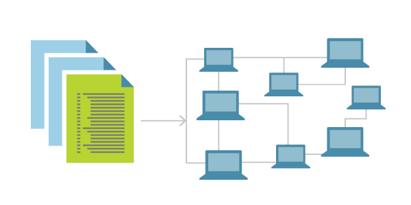


---

### Ziele von Infrastructure as Code

Infrastructure as Code verfolgt mehrere Ziele. Um diese Ziele zu verstehen, kann man sich folgendes Beispiel anschauen und wie Infrastructure as Code die Situation vereinfachen kann: In einem Unternehmen existieren zehn Server, auf denen die gleiche Software läuft. Ein Mitarbeiter hat die Aufgabe, eine neue Software auf den Servern zu installieren. Normalerweise müsste er die Software auf jedem Server einzeln installieren, mit Infrastructure as Code kann er einmal beschreiben, wie die Software installiert werden soll und auf jedem Server die Installation automatisch ausführen lassen.

1. IT Infrastruktur soll Veränderungen erlauben, anstatt ein Hindernis zu sein

2. Veränderungen am System sollen Routine statt Stress für die Benutzer und IT Mitarbeiter sein

3. IT Mitarbeiter sollen ihre Zeit für wichtige statt für sich wiederholende Aufgaben nutzen<br>
   Sich wiederholende Beschreibungen können einmal beschrieben und automatisiert werden

4. Benutzer sollen selbstständig ihre Ressourcen, ohne die Hilfe eines IT Mitarbeiters, managen können

5. Teams sollen sich möglichst schnell von Misserfolgen erholen anstatt anzunehmen, dass Misserfolge vollständig verhindert werden können<br>
   Da Veränderungen schneller ausgeführt werden können, kann man auch schneller auf Fehler reagieren

6. Verbesserungen werden kontinuierlich gemacht anstatt alles auf einmal zu ändern

7. Dass Lösungen zu Problemen funktionieren wird bewiesen durch Implementierungen, Tests und Messungen anstatt sie in Meetings zu diskutieren

### Tools

Es existieren mehrere Tools, mit denen Infrastructure as Code umgesetzt werden kann. In diesem Abschnitt werden ein paar dieser Tools vorgestellt und verglichen.


Weitere Tools: Chef, Puppet, Packer, CloudFormation(AWS), Heat

#### Vergleich

Der Vergleich von Infrastructure as Code Software bezieht sich auf die drei Tools Ansible, SaltStack und Terraform.

1. Configuration Mangement vs Provisioning<br>
   (Ansible, SaltStack vs Terraform)<br>
   Beim Configuration Management wird Software auf existieren Servern installiert. Provisioning dagegen umfasst einen größeren Bereich, indem es diese Server auch bereitstellt und verschiedene Tools dazu anbietet wie z.B. LoadBalancer oder Netzwerkkonfiguratoren

2. Mutable vs Immutable Infrastructure<br>
   (Ansible, SaltStack vs Terraform)<br>
   Bei einer Mutable Infrastructure ist die Infrastruktur veränderbar. Änderungen und Updates werden also direkt auf den aktuellen Instanzen durchgeführt. Bei der Immutable Infrastructure werden die aktuellen Images dagegen nicht verändert. Es wird immer ein neues Image erstellt und das alte Image wird anschließend durch das neue Image ersetzt.
   
3. Procedural vs Declarative<br>
   (Ansible vs Terraform, SaltStack)<br>
   Mit Procedural ist gemeint, dass der geschriebene Code Änderungen am aktuellen System meint. Sollen zusätzliche Instanzen einer Software hinzugefügt werden, muss angegeben werden, wie viele hinzugefügt werden sollen. Bei Declarative muss dagegen angegeben werden, wie viele Instanzen insgesamt gestartet sein soll. Declarative beschreibt also immer den aktuellen Zustand.

4. Master vs Masterless<br>
   (SaltStack vs Ansible, Terraform)<br>
   Infrastructure as Code Software kann einen Master besitzen, der Informationen speichern und Updates verteilen kann. Ein Master bedeutet aber auch immer, dass dieser gemanagt werden muss und zusätzliche Ressourcen benötigt. Ansible und Terraform dagegen sind Anwendungen, die ohne Master auskommen oder bei denen der Master Teil der Infrastruktur ist.

5. Agent vs Agentless<br>
   (SaltStack vs Ansible, Terraform)<br>
   Wie manche Software einen Master besitzen, kann diese auch Agents besitzen, die auf den einzelnen Server im Hintergrund laufen. Ansible und Terraform dagegen benötigen keine Agents oder die Agents gehören bereits zur Infrastruktur. Ansible verwendet z.B. ssh, um mit einzelnen Servern zu kommunizieren.

---

## Virtualisierung und Containerisierung

### Was ist Virtualisierung?

Die Virtualisierung ist die Abstrahierung von IT-Ressourcen durch das Einfügen einer zusätzlichen Ebene zwischen Anwendung und Hardware. Dadurch ist es möglich, Services, Betriebssysteme oder Hardware zu emulieren und virtuell bereitzustellen. Für den Anwender verhält sich das virtuelle Objekt wie ein dediziertes Hard- oder Softwareobjekt. (Stefan Luber/Florian Karlstetter)

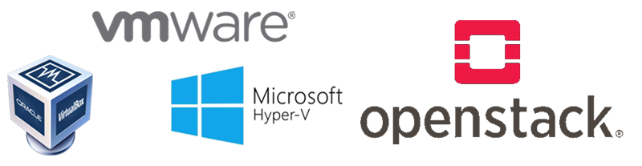

Auf dem oberen Bild sind links drei verschiedene Virtualisierungssoftwares zu sehen, mit denen man virtuelle Maschinen erstellen kann. Zumindest ein bis zwei davon sollten jedem in diesem Kurs bekannt sein. OpenStack auf der rechten Seite muss dagegen nicht jedem etwas sagen. Es wird gerne als *Cloud Betriebssystem* beschrieben und ist eine Open-Source-Cloud, die alle wesentlichen Komponenten inklusive Storage umfasst. Sie besteht aus mehreren Komponenten, die für jeweils unterschiedliche Aufgaben zuständig sind. OpenStack ermöglicht, VMs oder Container zu erstellen, auf denen Third-Party Anwendungen wie Kubernetes oder Terraform laufen können.

Neben OpenStack existiert noch eine Technologie mit dem Namen Hyperconverged Infrastructure (HCI), die genauso wie OpenStack Storage, Computing und Networking virtualisiert. Dabei darf man aber nicht davon ausgehen, dass beide die gleichen Funktion haben. HCI wurde für Unternehmen entwickelt, die eine gemeinsame Plattform statt traditionelle Servervirtualisierung und Storage haben wollten. Es ist ein vorkonfiguriertes System, dass die Arbeit in einem Unternehmen vereinfachen soll. Personal mit sehr guten Computerkenntnissen soll nicht mehr benötigt werden.

### Unterschiede zwischen Virtualisierung und Containerisierung

Neben der Virtualisierung existiert noch die Containerisierung. Beide unterscheiden sich darin, dass Virtualisierung einen Hypervisor verwendet und Containerisierung eine Runtime Engine benötigt. Eine virtuelle Maschine besteht dabei immer aus eine Betriebssystem, benötigten Bibliotheken und der eigentlichen Anwendung. Um Speicherplatz zu sparen, wurde bei der Containerisierung das Betriebssystem entfernt. Ein Container besteht somit nur aus benötigten Bibliotheken und der Anwendung selbst. Zusätzlich können Container durch ein Manifest (z.B. dockerfile) beschrieben werden.

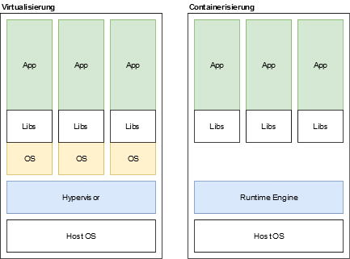

### Containerized Environments

Docker ist eine Technologie, mit der ich Container erstellen und verwalten kann. In Projekten mit größerem Umfang reicht dies aber nicht aus. Deshalb existiert verschiedene Software, mit der größere Containerumgebungen eingerichtet und gemanagt werden können. Das untere Bild zeigt eine Liste an Anwendungen für Containerumgebungen. Vorteile von containerisierten Umgebungen sind die Skalierbarkeit der containerisierten Anwendungen, die Berücksichtigung von Ressourcenanforderungen und das automatische LoadBalacing, bei dem die Last auf mehrere Container automatisch aufgeteilt werden kann.

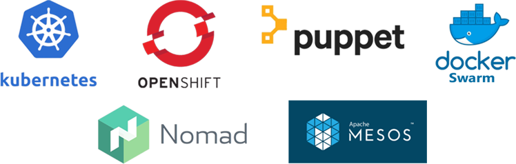

---

## Container Patterns

Container oder Sammlungen von Containern können nach verschiedenen Mustern erstellt werden, die hier einmal vorgestellt werden.

### Single Container Management Patterns

Beim *Single Container Management Pattern* stellt ein Container neben seiner Hauptfunktionalität eine Schnittstelle für ein Managementsystem zur Verfügung. Über eine *Upwards API* können Anwendungsinformationen wie Überwachungsmetriken oder Komponenteninformationen zur Verfügung gestellt werden. Ein Beispiel dafür ist der */health* Befehl, mit dem man testen kann, ob ein Container noch korrekt arbeitet.

Im Gegensatz zur Upwards API existiert auch eine *Downwards API*, die das Verwalten eines Container-Lebenszyklus und die Steuerung durch ein Container Management Tool ermöglicht. Ein Beispiel dafür ist das saubere Beenden eines Containers, um aktuelle Aufgaben korrekt beenden zu können.

### Single-Node, Multi Container Application Patterns

Bei *Single-Node, Multi Container Application Patterns* werden mehrere Container innerhalb eines Nodes (in der Regel eher Pod genannt) verwendet. Die Pattern folgen dem Prinzip, dass ein Container maximal eine Aufgabe besitzt.

#### Sidecar Pattern

Mit dem *Sidecar Pattern* kann der Main Container erweitert oder verbessert werden. Dabei werden, wie in der unteren Abbildung zu sehen, weitere Aufgaben in einen zweiten Container ausgelagert, der sich die Ressourcen mit dem ersten Container teilt.

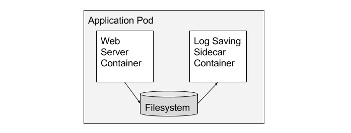

#### Ambassador Pattern

Beim *Ambassador Pattern* existiert ein Ambassador Container, der als Proxy für die Kommunikation des Main Containers mit mehreren anderen Containern dient. Für den Main Container sieht es so aus, als würde er nur mit einem anderen Container kommunizieren.

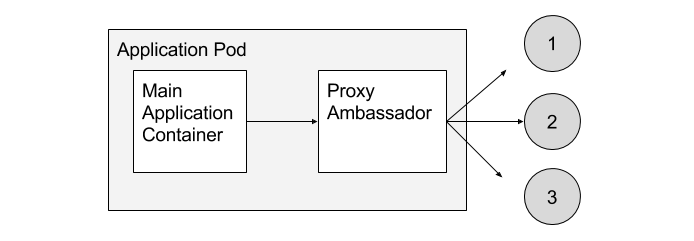

#### Adapter Pattern

Das *Adapter Pattern* "versteckt" den eigentlichen Main Container vor einem zentralen System. Damit ist es möglich, den Zugriff auf Container von diesem zentralen System zu vereinheitlichen. Das zentrale System kann somit dieselbe Schnittstelle für die Kommunikation mit unterschiedlichen Anwendungen verwenden.

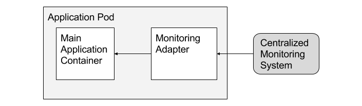

### Multi Node Application Patterns

Bei den *Multi Node Application Patterns* geht es um die Koordinierung mehrerer Nodes (bzw. Pods) in einem verteilten System

#### Leader Election Pattern

Benötigen mehrere Anwendungen auf unterschiedlichen Containern und Nodes einen Leader, wird das *Leader election Pattern* verwendet. Dabei läuft eine Leader election Container parallel zum Main Container (Sidecar Pattern). Die Leader election Container arbeiten dann zusammen, um zu jedem Zeitpunkt genau einen Leader zu haben, falls ein Leader ausfallen sollte.

#### Scatter Gather Pattern

Beim *Scatter Gather Pattern* wird eine Anfrage an einen Root Container in mehrere parallel abzuarbeitende Aufgaben aufgeteilt. Diese Aufgaben werden dann an mehrere Container gesendet, die alle eine Antwort zurücksenden. Ein anderer Container kann diese Antworten zusammenfassen, bevor sie zurückgesendet werden.

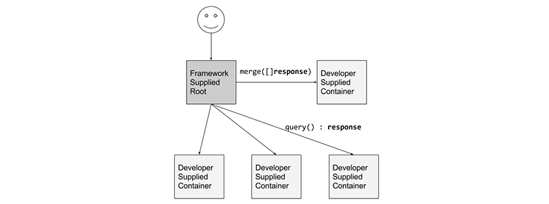

---

## Docker

### Zum Selbst ausprobieren

In der Präsentation wurde Play-with-Docker vorgestellt, um direkt Docker ausprobieren zu können.

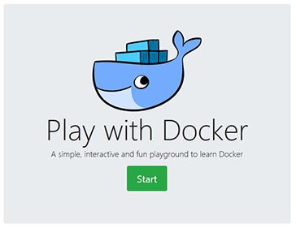

https://labs.play-with-docker.com/

### Wie funktioniert Docker?

Docker teilt sich auf in den Docker Client und den Docker Daemon. Der Docker Client ist ein Command Line Tool, mit dem der Benutzer Anweisungen an den Docker Daemon senden kann, der diese Anweisungen anschließend ausführt. Der Docker Daemon auf der anderen Seite managet alle Container, Images, Networks und Volumes. Ein Container Docker besitzt als Basis immer ein Image, von dem aus der Container erstellt wird. Zusätzlich befindet sich ein Docker Container in einem Netzwerk. Das Standardnetzwerk ermöglicht die Kommunikation unter Docker Container, aber keinen Zugriff von außen. Zusätzlich können einem Container Volumes zugewiesen werden, durch die Container auf Verzeichnisse des Host Systems zugreifen können.

Erstellte Images werden auf dem Host System zwischengespeichert. Ist ein Image nicht vorhanden, wird in einer Docker Registry nach diesem Image gesucht und es wird automatisch heruntergeladen.

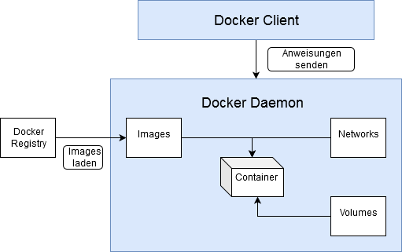

### Docker Hub

Eine Docker Registry ist Docker Hub, welches Dockers eigenes Container Image Repository ist. Dort kann man bereits viele direkt verwendbare Images finden, die man als Container starten kann. Auch lassen sich diese Images gut als Basis Image für weitere Images verwenden.


### Container starten mit docker run

Mit *docker run* können Container erstellt und gestartet werden.

```
docker run hello-world
```
*docker run hello-world* ist das typische Hello World Beispiel in Docker Form, welches einen Text auf der Konsole ausgibt.

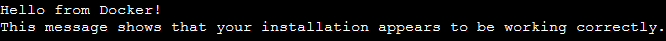

Außerdem beschreibt dieser ausgegebene Text, wie der *docker run* Befehl funktioniert, in er zuerst einen Befehl an den Docker Daemon sendet. Der Daemon sucht als erstes lokal nach dem hello-world Image und lädt es von Docker Hub herunter, wenn es noch nicht vorhanden ist. Ist das Image heruntergeladen, wird aus dem Image ein Container erstellt und ausgeführt. Die Ausgabe des Containers wird anschließend an den Docker Client zurückgesendet, welcher die Ausgabe auf der Konsole anzeigt.

### docker run Eingabeparameter

Bei *docker run* können verschiedene Parameter verwendet werden. Die folgenden Tabelle zeigt eine Auflistung der wichtigsten Parameter

| Parameterbeispiel | Beschreibung                                                 |
| ----------------- | ------------------------------------------------------------ |
| -it               | Starte den Container als interaktive Shell                   |
| -d                | Löse den Container von der aktuellen Shell                   |
| --name container1 | Container benennen                                           |
| -rm               | Entferne den Container, nachdem er beendet wurde             |
| -p 8080:80        | "Weiterleiten" eines Ports an einen Container                |
| -e "HOME=/www"    | Setzen von Umgebungsvariablen                                |
| -v /www:/var/www  | Verzeichnisse des Host System einem Container zur Verfügung stellen |


Am Beispiel nginx kann man erkennen, wie die Parameter verwendet werden. Um eine Website mit nginx zu veröffentlichen, muss man ein Volume angeben, in dem die Dateien liegen. Zusätzliche muss ein Port weitergeleitet werden, um von außen auf den Server zugreifen zu können.

```
docker run -v ~/www:/usr/share/nginx/html:ro -p 8080:80 nginx
```

### Docker Images erstellen - Das Dockerfile

Neben dem Verwenden von Docker Images kann man auch eigene Image mithilfe eines Dockerfiles erstellen.

Beispiel:

```
FROM ubuntu:18.04

RUN apt-get update && \
    apt-get install -y nano && \
    rm -rf /var/lib/apt/lists/*

COPY secret_pw.txt /

ENTRYPOINT ["nano"]
CMD ["secret_pw.txt"]
```

In diesem Beispiel Dockerfile wird zuerst ein Basis Image gewählt, welches ubuntu:18.04 ist. Anschließend können mit der RUN Instruktion Befehle ausgeführt werden. Verwendet man *apt update* ist es sinnvoll, den heruntergeladenen Cache im Anschluss mit rm zu entfernen. Da jede Instruktion in Dockerfiles eine neue Ebene im Docker Image einfügt, sollte man RUN Befehle verketten.

Nach dem Ausführen der Befehle wird mit COPY eine Datei ins das Docker Image geladen. Zum Schluss wird mit ENTRYPOINT ein Einstiegspunkt gesetzt und diesem wird über CMD ein Parameter übergeben.

### Image erstellen

Das erstellte Dockerfile kann im Anschluss verwendet werden, um daraus ein Docker Image zu erstellen. In dem unteren Beispiel wird ein Docker Image mit dem Namen beispiel erstellt. Der Punkt in dem Befehl gibt an, dass sich das Dockerfile im aktuellen Verzeichnis befindet.

```
docker build -t beispiel .
```

Bei dem Befehl wird zuerst ein Build Context erstellt. Anschließend werden alle Dateien und Ordner im aktuellen Verzeichnis an den Docker Daemon gesendet. Aus diesem Grund ist es sinnvoll, für eine Dockerfile und die dazugehörigen Dateien ein eigenes Verzeichnis zu erstellen. Der Docker Daemon erstellt anschließend aus dem Dockerfile und den gesendeten Dateien ein Docker Image.

### Dockerfile Instruktionen

Zusätzlich existieren weitere Dockerfile Instruktionen, die in der folgenden Tabelle beschrieben werden.

| Instruktion   | Beschreibung                                                 |
| ------------- | ------------------------------------------------------------ |
| FROM xxx      | Angeben des Basis Images                                     |
| RUN cmd       | Ausführen eines oder mehrerer Befehle                        |
| EXPOSE port   | Angabe eines verwendeten Ports                               |
| ENV key value | Angabe von Umgebungsvariablen                                |
| COPY (& ADD)  | Kopieren von Dateien und Ordnern in das Docker Image         |
| WORKDIR path  | Angabe des aktuellen Arbeitsverzeichnisses (Equivalent zu RUN cd path) |
| ENTRYPOINT    | Angabe des Image Main Commands                               |
| CMD           | Angabe des Image Main Commands oder in Kombination mit ENTRYPOINT Angabe von Parametern |

### Docker Compose

Docker Compose ist ein Tool zum Erstellen und Starten von Multi-Container Docker Anwendungen. Für Docker Compose werden mehrere Container (In Docker Compose Services genannt) in einer *docker-compose.yml* Datei beschrieben. Mit *docker-compose up* können die beschriebenen Container anschließend gestartet werden.

### docker-compose.yml

Beispiel:

```
version: '3'
services:
  web:
    build: .
    ports:
      - "5000:5000"
  redis:
    image: "redis:alpine"
```

Das obere Beispiel zeigt eine docker-compose.yml Datei, in der die zwei Services web und redis definiert wurden. Redis wurde ein Image aus Docker Hub zugewiesen. Der web Service nutzt eine im aktuellen Verzeichnis liegendes Dockerfile zum Erstellen eines Docker Containers. Beide Services sind automatisch in einem Netzwerk verbunden und können über ihre Namen, die auch ihre Hostnamen sind, angesprochen werden

### Service Optionen

In der folgenden Tabelle werden mehrere Service Optionen vorgestellt. Generell existiert für die meisten *docker run* Parameter auch immer eine Service Option in einem Dockerfile.

| Parameter   | Beschreibung                                                |
| ----------- | ----------------------------------------------------------- |
| build .     | Gibt an, dass das Docker Image erstellt werden muss         |
| image       | Name des Docker Images                                      |
| depends_on  | Angabe von Services, die vor diesem gestartet werden sollen |
| environment | Angabe von Umgebungsvariablen                               |
| ports       | Veröffentlichen von Ports für das Hostsystem                |
| volumes     | Angeben eines Volumes                                       |

### Beispiel docker-compose.yml

Im folgenden wird eine Beispiel docker-compose.yml Datei dargestellt, die die vorgestellten Service Optionen verwendet.

```
version: '3'
services:
  web:
    build: .
    image: myWebsite
    ports:
      - "8080:80"
    depends_on:
      - redis
    environment:
      - WEBSITE_DIR=/root/www
    volumes:
      - "/home/user/myProjectWebsite:/root/www"
  redis:
    image: "redis:alpine"
```

---

## Kubernetes

Kubernetes ist ein Tool zur Automatisierung, Skalierung und Verwaltung von containerisierten Anwendungen. Im Hintergrund kann Kubernetes unter anderem mit Docker Images und Docker Containern arbeiten.

### Kubernetes Cluster

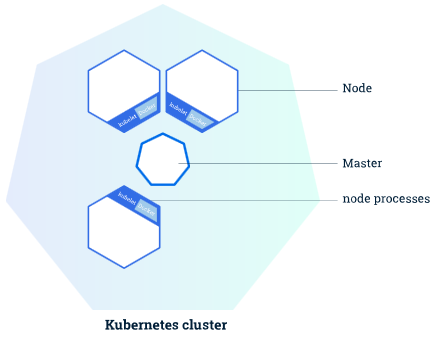

Zu einem Kubernetes Cluster gehört eine Sammlung an Kubernetes Nodes, die von einem Master gemanagt werden. Ein Node kann eine virtuelle Maschine oder ein physischer Server sein, auf dem eine Kubelet Instanz aktiv ist. Wenn Anwendungen im Kubernetes Cluster gestartet werden sollen, werden diese vom Master an die Nodes verteilt.

Mit dem Command Line Tool kubectl kann mit dem Kubernetes Cluster interagiert werden.

---

### Deployments in Kubernetes

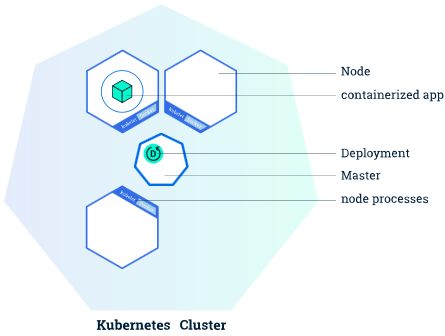

Mit einem Deployment kann ein Zustand eines Clusters beschrieben werden. Ein Deployment Controller sorgt dafür, dass der beschriebene Zustand erreicht wird. Mit ihm kann der Zustand eines Cluster verändert werden. Auch sorgt er dafür, sollte ein Node oder Pod ausfallen, dass die Pods innerhalb des Nodes auf anderen Nodes wiederhergestellt werden bzw. einzelne Pods neu gestartet werden.

---

### Pods in Kubernetes

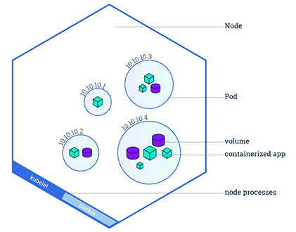

Pods sind Einheiten, die immer zu einer Node gehören. Sie können eine oder mehrere Container und Volumes enthalten, die immer zueinander gehören. Container in einem Pod können sich Ressourcen teilen und über localhost kommunizieren. Da Pods immer zu einer Node gehören, laufen auch dessen Container immer auf der selben Maschine. Ein Node kann mehrere Pods besitzen.

Pods werden immer von einem Benutzer erstellt und existieren solange, bis sie explizit gestoppt werden. Sie können zum Beispiel über ein Deployment gestartet werden. Pods können auch eine *Restart Policy* mit den möglichen Werten Always, OnFailure und Never besitzen.

---

### Services

Jeder Pod besitzt eine eigene IP-Adresse und gehört zu einem geschlossenen Netzwerk, das nicht von außen erreichbar ist.

Ein Service kann verwendet werden, um von außerhalb auf Pods zuzugreifen. Dabei definiert ein Service anhand eines *selectors* ein Set an Pods, die zu diesem Service gehören. Zusätzlich besitzt ein Service eine Policy, die beschreibt, wie auf die Pods zugegriffen werden kann. Außerdem hat jeder Service immer einen Servicetyp.

Service Typen:
  - ClusterIP: Der Service ist nur innerhalb des Clusters erreichbar
  - NodePort: Der Service wird auf jeder einzelnen Node veröffentlicht
  - LoadBalancer: Auf jedem Node wird ein *ClusterIP* und *NodePort* Service erstellt, die von einem externen LoadBalancer angesprochen werden

Zusätzlich zu den Services bietet Kubernetes Ingress an, welcher als externer LoadBalancer eingesetzt werden und mehrere Services kombinieren kann. Zum Beispiel kann eine API unter mehreren Pfaden verschiedene Versionen anbieten, die über verschiedene Services angesprochen werden.

---

### Volumes

Ein Volume in Kubernetes kann im Vergleich zu Docker mehr als nur ein Hostverzeichnis sein. Dabei spezifiziert ein Pod immer, welche Volumes er benötigt. Wird ein Pod entfernt, dann wird auch dessen Volume entfernt. Die Daten, die in einem Volume gespeichert wurden, bleiben aber zwischen Pod Restarts gespeichert.

Volumes können in Kubernetes unterschiedliche Typen sein. Diese Volume Typen beschreiben, wo sich das Volume befindet und wie es erreicht werden kann.

Volume Typen:

- awsElasticBlockStore (für AWS): Speicherplatz, der über AWS verwaltet wird. Kann nur in Kombination mit EC2 Instanzen verwendet werden
- gcePersistentDisk (für GCP): Wie awsElasticBlockStore, nur für Google Cloud Platform. Die Nodes, auf denen die Pods mit den Volumes gestartet werden, müssen GCE VMs sein
- configMap: *configMap* Daten können über diese Methode zu Pods hinzugefügt werden
- emptyDir: Leeres Verzeichnis, über das Container in einem Pod Informationen austauschen können. Das Verzeichnis wird vollständig gelöscht, wenn der Pod entfernt wird
- hostPath: Verzeichnis auf dem Host System
- und viele mehr...

---

### Config Maps

Eine ConfigMap ermöglicht das Hinzufügen von Konfigurationen zu einer Anwendung. Dabei werden die Einträge in eine ConfigMap als Schlüssel-Wert-Paare oder als eine Liste an Schlüssel-Wert-Paaren wie in einer Datei angegeben. Es existieren vier Möglichkeiten, um Informationen von einer ConfigMap zu erhalten bzw weiterzugeben:

1. Als Kommandozeilenargumente dem Entrypoint des Containers übergeben
2. Als Umgebungsvariablen eines Containers
3. Als Read-Only Volume wie bei einer Config-Datei
4. Ausführen von Code innerhalb eines Pods, der mit der Kubernetes API kommuniziert

## Quellen

- https://www.researchgate.net/publication/289532506_Cloud_Computing_An_Aspect_of_Information_System
- https://link.springer.com/content/pdf/10.1007/BF03340507.pdf
- https://aws.amazon.com/de/types-of-cloud-computing/
- https://teamdrive.com/die-verschiedenen-modelle-der-cloud/
- http://www.webtorials.com/main/resource/papers/webtorials/2009-Cloud-Guide/Cloud-Computing-Guide.pdf
- https://azure.microsoft.com/de-de/services/
- https://cloud.google.com/products?hl=de
- https://aws.amazon.com/de/
- https://12factor.net/
- https://books.google.de/books?hl=de&lr=&id=BIhRDAAAQBAJ&oi=fnd&pg=PR2&dq=infrastructure+as+code&ots=yWbn6XZHSl&sig=mkec4gFgCp9wrqMUYnqMuWS83NI#v=onepage&q&f=false
- https://docs.microsoft.com/en-us/azure/devops/learn/what-is-infrastructure-as-code
- https://blog.gruntwork.io/why-we-use-terraform-and-not-chef-puppet-ansible-saltstack-or-cloudformation-7989dad2865c
- https://www.cloudcomputing-insider.de/was-ist-virtualisierung-a-756279/
- https://www.cloud-mag.com/was-ist-openstack/
- https://ieeexplore.ieee.org/stamp/stamp.jsp?tp=&arnumber=8091086
- https://www.vmware.com/de/products/hyper-converged-infrastructure.html
- https://www.computerweekly.com/de/ratgeber/OpenStack-und-Hyperkonvergenz-bilden-Open-Source-Cloud
- https://superuser.openstack.org/articles/openstack-and-kubernetes-competing-or-complementary/
- https://medium.com/tech-bits/container-design-patterns-7020b132675
- https://hackernoon.com/what-is-containerization-83ae53a709a6
- https://www.cloudcomputing-insider.de/was-ist-kubernetes-k8s-a-832381/
- https://labs.play-with-docker.com/
- https://docs.docker.com/develop/develop-images/dockerfile_best-practices/
- https://docs.docker.com/compose/gettingstarted/
- https://docs.docker.com/compose/compose-file/
- https://kubernetes.io/docs/home/
