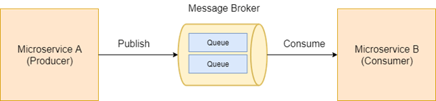
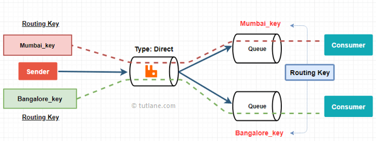

# Messaging

**Autor:** Philipp Clausing **Modul:** Spezielle Gebiete zum Software Engineering

# Inhalt

1. Motivation
2. Messaging
3. Terminologie
4. Broker
5. Pattern
6. Protokolle
7. QoS
8. Sicherheit
9. Anbieter
10. Quellen

## Motivation

Durch die Verbreitung einer auf Mikroservices aufbauenden Architektur werden immer mehr komplexere Anwendungen mittels kleinen, entkoppelten Modulen implementiert. Damit diese Dienste miteinander kommunizieren können musste eine geeignete Lösung gefunden werden. Dafür bietet sich das Messaging an.

## Messaging

Messaging bezeichnet das Austauschen von Nachrichten zwischen einzelnen Diensten, meist mittels eines Message Brokers. Dabei gibt es verschiedene Umsetzungsmöglichkeiten.

Auf diese Möglichkeiten wird im folgenden genauer eingegangen. In der Regel wird Messaging in Architekturen verwendet in welchen die Komponenten abgekapselt sind. Dazu zählt unter anderem die Microservices-Architektur welche als Grundlage für kommende Beispiele verwendet wird.

# Terminologie

Im folgenden wird eine Auswahl an Begriffen näher erläutert um das Konzept "Messaging" verständlicher kommunizieren zu können.

#### Producer

Ein Producer ist ein Softwarebaustein welcher, wie der Name suggeriert, Inhalte produziert. In der Regel sendet dieser also Nachrichten die von anderen Komponenten entsprechend weiterverarbeitet werden.

#### Consumer

Der Consumer ist das Gegenstück des Producers. Auch hier ist die Tätigkeit Namensgebend. Er empfängt die Nachrichten des Producers um diese zu Verarbeiten. Ein Microservice kann dabei sowohl Producer als auch Consumer sein.

#### Queue

Nachrichten welche vom Broker empfangen werden, werden in eine Queue(Liste) eingetragen. Aus dieser Liste werden die Daten dann (meist) chronologisch abgearbeitet und weiter versendet. 

#### Exchange

Als Exchange wird die Komponente bezeichnet welche bestimmt wie Nachrichten weiterverarbeitet und umgeleitet werden. Hierbei gibt z.B. bei RabbitMQ verschiedene Exchange Typen. Diese werden in einem späteren Kapitel genauer erläutert.

#### Message

Eine einzelne Nachricht welche zwischen Client und Client oder auch Client und Broker ausgetauscht wird. Sie ist äquivalent zu einem Brief und enthält neben Metadaten einen, meist kleinen, Datensatz.

Eine Message wird in einem vorher definierten Format verschickt, hierzu zählen unter anderem die bekannten Formate JSON und XML.

#### Broker

Der Message Broker ist eine zentrale Einheit welche das Verwalten und formatieren von Nachrichten übernimmt. Er stellt verschiedene Queues & Exchanges bereit welche er dann als Verwaltungsinstanz kontrolliert.

#### Push/Pull

Push und Pull sind verschiedene Definitionen welche den Datenfluss beschreiben. Push bezeichnet dabei das senden von Nachrichten durch den Message Broker an den Client. Unaufgefordert über eine bestehende Verbindung. Bei Pull fragt der Client immer eine gewisse Menge an Nachrichten vom Broker ab, dieser sendet die Nachrichten dementsprechend nur auf Anfrage.

#### Topic

Eine Topic kann auch als Kategorie verstanden werden, unter dieser werden Nachrichten zusammengefasst. So kann eine Zugehörigkeit festgestellt werden und die Daten spezifisch nur an Dienste gesendet werden, für welche diese relevant sind.

# Broker

Der Broker bildet die Kernkomponente des Messaging. Er verwaltet alle Topics, Exchanges und Queues ist aber auch für Themen wie Ausfallsicherheit und Datenschutz verantwortlich. Neben Administrationszugriff werden zunächst Exchanges definiert welche den vorher erdachten Datenfluss umsetzen.

Im AMQP Protokoll sind vier verschiedene Exchange Typen definiert. Diese sind ``Direct``,``Fanout``,``Topic`` und ``Headers``. 

Bei einem Direct-Exchange werden die Nachrichten entsprechend ihrer Keys in Queues eingeführt. 

Ein Fanout-Exchange leitet alle Nachrichten in **alle** Queues welche angebunden sind.

Der Headers-Exchanges arbeitet ähnlich wie der ``Direct`` , verwendet allerdings die Nachrichten Header zum Routing.

Auch der Topic-Exchange arbeitet ähnlich. Wie oben Dargestellt werden mit Topic und auch unter Topic Nachrichten den entsprechenden Queues zugeordnet.

# Pattern

#### Publish / Subscribe

``Publish and Subscribe`` ist ein Kommunikationspattern welches auch unabhängig vom Messaging Anwendung findet. Es basiert auf einer Bereitstellung von Daten durch einen Service (Publish). Andere Dienste können dann diese Datenquelle ``abonnieren``, der Service liefert die Daten an alle Subscriber aus.

#### Point to Point

Bei ``Point to Point`` findet die Kommunikation lediglich zwischen zwei Endpunkten statt. Ein Service sendet die Nachrichten in eine Queue, die andere Partei liest aus dieser Queue und senden eine Bestätigung.

#### Request / Response

Das ``Request and Response`` Pattern beschreibt die Kommunikation zwischen Requestor und Replier. Das besondere ist hierbei das es sowohl für Request als auch für Reply eigene Channel (z.B. Queues) gibt.

# Protokolle

Im folgenden werden verschieden Protokolle erläutert. Die meisten Broker können mit mehreren dieser umgehen, am weitesten verbreitet sind AMQP und MQTT. Wobei die beiden Protokolle in der Regel nicht in direkter Konkurrenz zueinander stehen da sie verschiedene Anwendungsfälle bedienen.

#### AMQP

**AMQP**(``Advanced Message Queuing Protocol``) ist ein Protokoll für Message-Orientierte Middleware. Also eine Messaging Struktur mit Message Broker. Bekannte Implementierungen dieses Protokolls sind Apache ActiveMQ, RabbitMQ oder JBoss AMQ. 

Es umfasst Definitionen für Nachrichten senden, empfangen, empfang bestätigen und auch Nachrichten erneut anfordern. Zusätzlich bietet es die Möglichkeit zur Erweiterung, wie es RabbitMQ  mit der Funktion ``Nachrichten ablehnen(NACK)`` gemacht hat.

#### MQTT

**MQTT**(``Message Queuing Telemetry Transport``) ist ein Protokoll nach Publish and Subscribe Pattern. Es ist vor allem für die Verwendung in Leistungskritischen Umgebungen gedacht (Industrie, Mikro Sensorik). Es ist auf die M2M Kommunikation ausgelegt. Genau wie AMQP ist das Protokoll offen und nicht lizensiert.

#### STOMP

**STOMP**(``Streaming Text Oriented Messaging Protocol``) ist ähnlich wie AMQP besonders auf MOM(``Message-Oriented Middleware``) ausgelegt. Das Protokoll ist dabei wesentlich simpler gestaltet und Text-orientiert Aufgebaut. Ähnlich wie HTTP bietet es Grundlegende Befehle wie CONNECT, SEND, SUBSCRIBE und UNSUBSCRIBE aber auch weitere.

#### Weitere

Weitere Protokolle sind **CoAp**(``Constrained Application Protocol``), **DDS1**(``Digital Subscriber System``) aber auch viele weitere. 

# QoS

Die QoS(``Quality of Service``) ist auch in diesem Bereich relevant. Dabei gibt es konzeptionelle Gedanken als auch konkrete Umsetzungen zu dem Thema. Ein Beispiel ist das QoS Agreement , bei diesem legt der Client im Vorfeld des Datenaustausches fest ob er die Nachricht höchstens einmal, mindestens einmal oder genau einmal erhalten möchte. 

Dazu gibt es noch weitere theoretische Aspekte welche beim Einsatz von Messaging zur Kommunikation beachtet werden müssen:

- Ankunft und Verarbeitung der Nachrichten nicht immer gewährleistet
- Asynchron / Synchron
  - Wann nutze ich asynchrone und wann synchrone Kommunikation

# Sicherheit

Das Thema Sicherheit kann man im allgemeinen sehr gut vom eigentlichen Messaging abkapseln, dennoch kommen an dieser Stelle ein paar Aspekte zu Umsetzungen von Sicherungsmaßnahmen. 

Die Message Broker Software RabbitMQ bietet verschiedene Möglichkeiten der Absicherung hierzu zählt das Authentifizieren mit Benutzername und Passwort aber auch das Authentifizieren mit einer Zertifikatsdatei. Darüber hinaus kann man als Basislayer-Protokoll TCP verwenden welches an sich eine Kontrolle des Nachrichtenflusses beinhaltet. Auch der Support für Verschlüsselung ein wichtiger Aspekt und sollte vor der Umsetzung eines Messaging Systems genau geplant werden.

# Anbieter

#### AWS

Amazon bietet mit seinem AWS(``Amazon Web Services``) Unternehmen einen der größten Cloud-Computing Anbieter der Welt. Die Produktpalette zum Thema Messaging umfasst dabei mehr als 5 verschiedene Produkte für unterschiedliche Anwendungsfälle.

**Amazon MQ** - eine Cloudvariante der Apache ActiveMQ Software

**Amazon SQS** - Amazon Simple Queue Service bietet, wie der Name impliziert, einen einfach Message Queue Dienst

**Amazon SNS** - Ein skalierbares Publish and Subscribe System welche mit besonders hoher Zuverlässigkeit wirbt

**Amazon Pinpoint** - Ein Praxis orientierter Message Broker welcher besondere Kommunikationsmethoden Vielfalt besitzt. Zum Beispiel SMS, MPush oder E-Mail.

**Amazon Kinesis Streams** -  Zum verarbeiten großer Datenmengen und persistenter Speicher dieser. Beworben besonders für Stream Processing.

**AWS IoT Message Broker** - Broker speziell für IoT Anwendungen (Publish and Subscribe)

#### Google Cloud

Google bietet im Rahmen seiner Firebase Umgebung den **Firebase Cloud Messaging** Service an. Dieser stellt einen "klassischen" Message Broker dar, ähnlich wie die RabbitMQ Software.

#### Azure

Microsofts Cloud Plattform Azure bietet auch verschiedene Service die Messaging umsetzen.

**Event Grid** - Event basiertes Messaging für weitere Azure Dienste

**Event Hubs** - Ein "offen" gestalteter Messaging Dienst für Anwendungsfälle wie Telemetrie, Logging oder Anomalie Erkennung.

**Service Bus** - Message Broker für Enterprise Anwendungen, umfangreich mit Regeln und Filtern konfigurierbar.

# Quellen

RabbitMQ Exchange Typen - https://www.tutlane.com/tutorial/rabbitmq/rabbitmq-exchanges

RabbitMQ - https://www.rabbitmq.com/

AMQP - https://www.ionos.com/digitalguide/websites/web-development/advanced-message-queuing-protocol-amqp/

MQTT - http://mqtt.org/

Stomp - https://stomp.github.io/stomp-specification-1.2.html

HiveMQ QoS Integration - https://www.hivemq.com/blog/mqtt-essentials-part-6-mqtt-quality-of-service-levels/

PtP und Pub/Sub - https://docs.oracle.com/cd/E19798-01/821-1841/bncea/index.html

Message Queue - https://docs.microsoft.com/en-us/azure/service-bus-messaging/service-bus-messaging-overview

RequestResponse - https://adoc.tips/enterprise-service-bus-esb.html

MessagingOverview - https://thundertech.tech.blog/2019/08/09/event-driven-microservices-with-spring-boot-and-activemq/

AWS - https://aws.amazon.com/de/messaging/

Azure - https://docs.microsoft.com/en-us/azure/event-grid/compare-messaging-services

Firebase - https://firebase.google.com/products/cloud-messaging