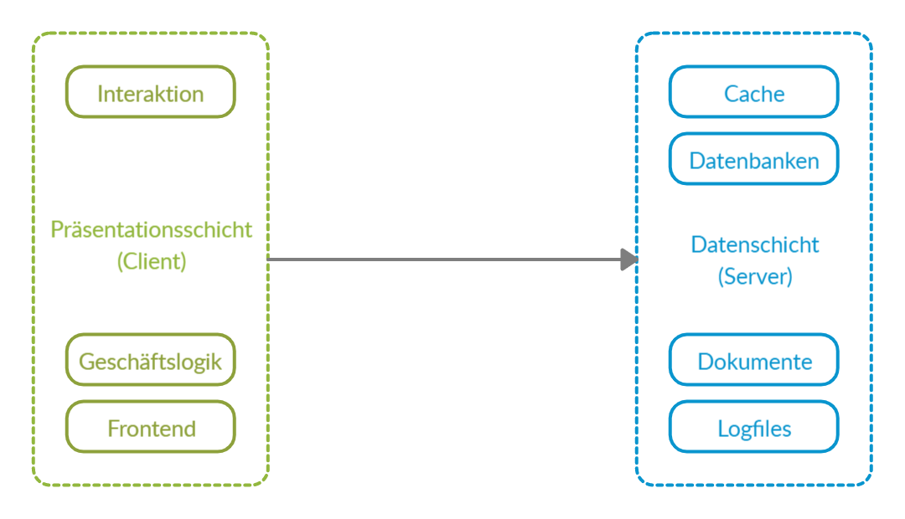
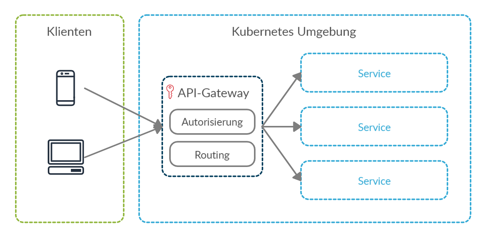
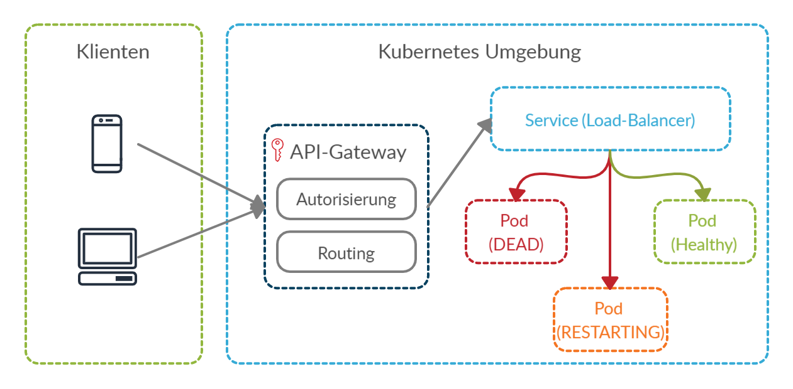

# Muster verteilter Systeme
---
Sven Simikin

## Architekturstile
---
Softwarearchitekturstile gruppieren Konzepte und Designprinzipien für die Enterprise-Application-Softwareentwicklung. Sie definieren logische Zusammenhänge zwischen einzelnen Komponenten und spezifizieren die Struktur der Gesamtapplikation. Das Ziel eines Architekturstiles ist es, wiederverwendbare Konzepte für kontextspezifische Anwendungsfälle zu schaffen. Dabei sind Softwarearchitekturstile nicht von spezifischen Programmiersprachen oder Frameworks abhängig, dennoch eignen sich spezielle Technologien besonders gut für deren Umsetzung.

### Voraussetzungen

##### Cloud Native Applikationen

Besonders bei verteilten Umgebungen, welche in der Cloud beheimatet sind, ist die Wahl einer entsprechenden Cloud-Architektur entscheidend. In diesem Rahmen definiert der Term **Cloud Native** eine nahtlose Integration in Cloud Umgebungen unter strikter Verwendung von Werkzeugen und Cloud-Services für die Bereitstellung von verteilten Systemen. Für Cloud-Anwendungen ist die Kommunikation zwischen Entwicklern, welche Cloud Native Anwendungen entwickeln, und dem Operations-Team, welches für die pflege und Wartung der IT-Infrastruktur zuständig ist, essential und ein Kernelement ohne dieses ein Betrieb von verteilten Umgebungen in der Cloud nicht möglich wäre. Diese Zusammenarbeit wird als **DevOps** beschrieben und ist beginnend bei der Planung bis zur Auslieferung und Wartung eines Produktes beteiligt.

Für verteilte Systeme in Cloud Umgebungen ist ein hoher Automatisierungsgrad maßgeblich für die schnelle und effektive Auslieferung und Entwicklung von Produkten entscheidend. Durch geschickte Automatisierungsmechanismen lassen sich Entwicklungsfehler früh erkennen und das Ausliefern und bereitstellen von Produkten vollständig automatisieren. Für diese Zwecke werden Continuous Integration und Continuous Delivery (CI/CD) Umgebungen eingesetzt, welche das Ergebnis der engen Zusammenarbeit von DevOps-Teams sind.

Auch für unerfahrene Teams mit wenig IT-Operations Erfahrungen bietet die Cloud heutzutage Werkzeuge und Hilfsmittel, die die Zeit- und Kosteninvestition für die Bereitstellung von Hardware in Cloud Umgebungen reduzieren. **Serverless** Server, welche zu großen teilen durch Betreiber von Rechenzentren dynamisch je nach Bedarf skaliert werden können, senken den IT-Operations aufwand erheblich, sodass sich ein Unternehmen auf Kerngeschäftsfelder wie die Entwicklung von Cloud Native Applikationen konzentrieren kann. Serverless stellt in diesem Sinne einen Marketing-Term dar, welcher die Zuweisung von Computerressourcen aus dem eigenen Zuständigkeitsbereich in die Hände eines Cloudproviders übergibt. Daraus können Situationen entstehen, die aufgrund von Zuständigkeits- und Zugriffsproblemen nicht mehr in der Gewalt eines Unternehmens liegen.

Es existieren unzählige kleine und große Cloud-Service-Provider welche verschiedene Services für Entwicklung und den Betrieb von Cloud Native Applikationen bereitstellen. Zu den Marktführern zählen mit großem Abstand Amazon Web Services, Microsoft und Google, jedoch zeigen Trends einen starken Wettbewerb durch hohe Investitionen von Unternehmen wie Alibaba Cloud, Oracle und IBM. Zu den Voraussetzungen für eine Bereitstellung einer Cloud Anwendung zählt insbesondere Cloud Nativeness.

### 1. Schichtenarchitektur
Die Schichtenarchitektur, auch N-Tier oder Multitier-Architektur genannt ist ein traditioneller mehrschichtiger Softwareaufbau für Enterprise Applikationen. In der Schichtenarchitektur werden einzelne Aspekte eines Softwaresystems logisch zu einer Schicht zusammengefasst, beispielsweise in eine Präsentationsschicht, Geschäftslogikschicht und eine Datenzugriffsschicht. Die einzelnen Schichten sind nach dem Top-Down-Prinzip hierarchisch miteinander verbunden, sodass Schichten welche anderen Schichten untergeordnet sind, nicht auf übergeordnete Aspekte zugreifen können. 

Es existieren verschiedene Grade der Schichtenarchitektur die jeweils eine unterschiedliche Menge logischer Schichten für unterschiedliche Einsatzzwecke bereitstellen. Diese Grade lassen sich grob in 1-Tier, 2-Tier und 3-Tier Schichtenarchitekturen einteilen, mit jeweils 1, 2 und 3 Schichten. Schichtenarchitekturen sind nicht auf 3 Schichten begrenzt und können grundsätzlich beliebig viele Schichten besitzen, die jedoch logisch miteinander in Zusammenhang stehen müssen.

Die Schichtenarchitektur trifft mit ihren Graden keine Unterteilungen, wo sich innerhalb eines Gesamtsystems die jeweiligen Schichten befinden müssen oder wie die interne Struktur dieser Schichten zu gestalten ist. So kann es sich bei einer 2-Tier-Applikation möglich sein ein System als eine verteilte Anwendung im Rahmen einer Klient-Server-Infrastruktur zu betreiben, jedoch lässt sich das gleiche System ebenfalls als monolithische Applikation ausführen, welche einen Klient und einen Server in demselben System, innerhalb einer lokal betrieben Anwendung bündelt.

#### 1-Tier Schichtenarchitektur

Die 1-Tier-Architektur ist die simpelste Implementierung der Schichtenarchitektur und bündelt alle Belange einer Anwendung in einer einzelnen Schicht zusammen. Häufig entstehen durch dieses Architekturmuster monolithische Desktopapplikationen die schnell zu entwickeln sind jedoch schwer zu warten und bei einer späteren Weiterentwicklung einen hohen Entwicklungsaufwand erfordern.

#### 2-Tier Schichtenarchitektur

Die 2-Tier-Architektur fügt, verglichen mit der 1-Tier-Architektur, einem System eine weitere Schicht hinzu, sodass Klient-Server-Strukturen realisiert werden können. Es ist dabei nicht definiert das ein Server auf einem entfernten System oder einem verschiedenen Computer arbeiten muss, und kann in diesem sinne ein Modul oder Bestandteil der ersten Schicht, bzw. eines Klienten sein. Ein Server enthält eine möglichst minimale Geschäftslogik, sodass bei verteilten Umgebungen die Klienten die hauptsächliche last für Berechnungen und Verarbeitungen tragen.

#### 3-Tier Schichtenarchitektur

Die 3-Tier-Architektur ist der bekannteste Vertreter des Schichtenarchitekturmodells und wird häufig bei einfachen Webanwendungen verwendet. Zwischen dem Frontend und der Datenbank befindet sich ein Middle-Tier oder Backend, welches die Aufarbeitung und Weiterverarbeitung von Anfragen verwaltet und direkt mit der Datenschicht kommuniziert. Dieses Vorgehen entkoppelt die Präsentationsschicht von der Geschäftslogik und verschiebt diese in eine separate Schicht und ermöglicht bei bedarf das Skalieren individueller Anwendungsteile.

##### 3-Tier Schichtenarchitektur in nicht verteilten Umgebunden

Ein prominentes Beispiel für die 3-Tier Schichtenarchitektur ist für nicht verteilte Umgebungen das Schalenmodell für Betriebssysteme, bei dem die einzelnen Betriebssystemkomponenten wie Ringe aufeinander aufgebaut sind. Die Kommunikation zwischen den Ringen erfolgt mittels definierter Schnittstellen, wobei nur Ringe welche direkt aneinander liegen miteinander kommunizieren können. Den Kern einer Schichtenarchitektur dieser Art bildet die Hardware eines Computers, welche durch das BIOS in der nächsthöheren Schicht gesteuert wird. Oberhalb des BIOS befindet sich der Betriebssystemkern (Kernel), welcher durch die oberste Ebene, den Kommandozeileninterpreter und den Anwendungsprogrammen Interaktionen erlaubt.

#### Einsatzbereiche

Beispiele für Anwendungszwecke für sich die Schichtenarchitektur gut eignen lauten: 

- Desktop Applikationen
- Einfache Klient/Serveranwendungen
- Einfache Webanwendungen

#### Vor- und Nachteile

Die folgende Tabelle bietet einen Überblick über Vor- und Nachteile für die Schichtenarchitektur:

| Vorteile                                           | Nachteile                                          |
| :------------------------------------------------- | :------------------------------------------------- |
| Geringer Lernaufwand                               | Führt oft zu monolithischen Design                 |
| Einfache Entwicklung                               | Nicht immer leicht Skalierbar                      |
| Klare Einteilung grober logischer Zusammenhänge    | Nicht Nativ für Cloud Umgebungen geeignet          |
| Eventbus erlaubt Microservice ähnliche Architektur | Datenintegrität lediglich beschränkt gewährleistet |
|                                                    | Aufbau und Struktur sind nicht definiert           |

### 2. Web-Queue-Worker

Die Web-Queue-Worker-Architektur stellt für das Lösen von Aufgaben und Probleme ein Web-Frontend bereit, welches die Interaktion mit dem System erlaubt. Dabei kann es sich um eine grafische Benutzerschnittstelle handeln aber auch um eine einfache HTTP-Schnittstelle. Aufgaben, welche dem Frontend übergeben werden, werden in eine Nachrichtenwarteschlange eingereiht, und durch Worker-Nodes der Reihe nach bearbeitet. Dieses Vorgehen ermöglicht eine teilweise Entkopplung der Bearbeitung von Daten und eine Zustandslosigkeit des Gesamtsystems, jedoch ist zu beachten das ein Frontend in diesem Fall für die Validierung und die Aufarbeitung von Aufgaben eine gewisse Menge Geschäftslogik enthalten muss.

#### Abgrenzung zur Schichtenarchitektur

Die Web-Queue-Worker-Architektur sieht der Schichtenarchitektur sehr ähnlich, jedoch kann diese nicht als Schichtenarchitektur eingeordnet werden, da ein Frontend mit seiner Geschäftslogik Schichten überspringt und somit direkten Zugriff auf die Datenschicht erhält. Dieses Vorgehen verstößt gegen den Grundsatz der direkten Nachbarschaft von Schichten der Schichtenarchitektur.

#### Einsatzbereiche

Beispiele für Anwendungszwecke für sich die Web-Queue-Worker-Architektur gut eignen lauten: 

- Ressourcenintensive Arbeiten und Probleme
- Langandauernde Arbeiten und Probleme
- Anwendungsfälle die kein direktes Feedback erfordern

#### Vor- und Nachteile

Die folgende Tabelle bietet einen Überblick über Vor- und Nachteile für die Web-Queue-Worker-Architecture:

| Vorteile                                                | Nachteile                                                    |
| ------------------------------------------------------- | ------------------------------------------------------------ |
| Zustandslosigkeit des Systems                           | Frontend und Worker können sich zu monolithischen Bestandteilen entwickeln |
| Asynchrone Ausführung lang andauernder Aufgaben         | Kein direktes Feedback zu möglichen Problemen von Aufgaben in der Warteschlange |
| Starke Entkopplung durch Verwendung einer Warteschlange | Geschäftslogik befindet sich zu großen teilen innerhalb des Web-Frontends |
| Einfach zu entwickelnde Architektur                     |                                                              |

### 3. Event-Driven-Architecture
Die Event-Driven-Architecture besteht in ihrem Kern aus Message-Produzenten, welche Nachrichten erzeugen und Message-Konsumenten, welche Nachrichten konsumieren. Message-Konsumenten konsumieren Nachrichten, welche für sie relevant sind, können aber potenziell auch alle Nachrichten in einem System konsumieren. Message-Produzenten wissen in der Regel nicht, ob und wie viele Konsumenten es gibt, die sich für die produzierten Nachrichten interessieren. Dieses asynchrone, anonyme Vorgehen erlaubt eine Starke Entkopplung zwischen Systemen, sodass diese unabhängig voneinander arbeiten können. 

Die einzigen definierten Schnittstellen sind in der Event-Driven-Architecture die Nachrichten selbst, welche wohldefiniert und bekannt sein müssen, sodass Produzenten und Konsumenten mit diesen arbeiten können. Nachrichten bilden in diesem Sinne Fakten über Ereignisse ab, welche in einem System aufgetreten sind. Diese Ereignisse können durch äußere Faktoren ausgelöst werden, wie zum Beispiel einem Bestellvorgang in einem eCommerce-System, aber auch durch interne Routinen wie zum Beispiel einem Prozess, welcher sich um Kundendaten kümmert und diese DSGVO-Konform nach einer Speicherungsfrist löscht.

#### Komponenten

Die Event-Driven-Architecture setzt sich gewöhnlicherweise aus den folgenden 4 Komponenten zusammen:

1. **Event Generator**

   Der Event-Generator ist der Produzent einer Nachricht. Bei Produzenten kann es sich um beliebige Systeme handeln, so können Computersysteme, Services, Sensoren und Prozesse Nachrichten erzeugen. Ein Produzent ist dafür verantwortlich, die Daten, welche als Nachricht zu veröffentlichen sind so aufzuarbeiten, dass diese in einem definierten Format dem Event-Channel zugeführt werden können.

2. **Event Channel**

   Der Event-Channel ist das Medium, welches für die Propagierung von Nachrichten zuständig ist. Dabei kann es sich beispielsweise um Event-Qeues und Event Mediatoren in verteilten Systemen handeln aber auch um Speicherbereiche im Hauptspeicher monolithischer Applikationen, welche in ihrer Architektur mit Nachrichten arbeiten. Jedes Medium, welches sich für den Transport von Nachrichten eignet, wird in diesem Sinne als Event-Channel bezeichnet, so zählen zu den bereits genannten Ansätzen ebenfalls Dateien, Datenbanken, Eventbusse und Netzwerkträgermedien.

3. **Event Processing Engine**

   Die Event-Processing-Engine ist dafür zuständig, relevante Events zu identifizieren und festgelegte Aktionen für die Eventverarbeitung auszulösen. Aktionen könnten beispielsweise das Benachrichtigen von Services und Individuen, das auslösen von Businessprozessen, die Aufzeichnung und Speicherung von Nachrichten aber auch die Erstellung neuer oder Verwerfung bestehender Nachrichten sein. Die Event-Processing-Engine ist für große Teile der Filterung und dem Routing von Nachrichten an Konsumenten verantwortlich.

4. **Downstream Event-Driven Activity**

   In der Downstream-Event-Driven-Activity erfolgt die tatsächliche Reaktion auf ein Ereignis. Eine Reaktion ist stark von dem System, der Implementierung und dem Verwendungszweck abhängig, deshalb lassen sich hier keine allgemeinen Aussagen treffen. Auch sind Reaktionen nicht zwangsläufig erforderlich, so können Ereignisse auch hier gefiltert, ignoriert oder verworfen werden.

#### Verarbeitungsverfahren

Die Nachrichtenverarbeitung innerhalb der Event-Driven-Architecture kann durch Konsumenten im Rahmen der folgenden gängigen Verfahren ablaufen:

- **Simple-Event-Processing**

  Im Simple-Event-Processing lösen Nachrichten in einem Konsumenten direkte Reaktionen aus. So kann ein Konsument bei dem Erhalt einer Nachricht eine Datenbanktransaktion oder ähnliche direkte Prozesse auslösen. Dieses Vorgehen minimiert die Bearbeitungsverzögerung und wird üblicherweise bei System mit Echtzeitanforderungen verwendet.

- **Complex-Event-Processing**

  Im Complex-Event-Processing wird eine Menge von Nachrichten ausgewertet, die für einen Konsumenten in Abhängigkeit zueinander stehen. Es können konsekutive Nachrichten gesammelt aber auch Parallele Nachrichtenströme in Beziehung zueinander gesetzt werden. Beispielsweise könnte in einem System ein Temperatursensor einem Konsumenten Temperaturdaten liefern, welche der Konsument über einen gewissen Zeitraum mittelt und später diesen Mittelwert selbst veröffentlicht.

- **Event-Stream-Processing**

  Event-Stream-Processing erlaubt die Integration und Analyse von Nachrichten durch Event-Streaming-Plattformen wie Apache Kafka und ActiveMQ, sodass sich für zeitlich und kontextuell zusammenhängende Daten ein bedingter Verknüpfungsmechanismus ergibt. Nachrichtenbroker ermöglich das Abonnieren von Nachrichtenströmen und die Benachrichtigung von Konsumenten über Ereignisse für den Zeitpunkt an dem diese passieren. Ähnlich wie das Simple-Event-Processing eignet sich das Event-Stream-Processing für Real-Time Umgebungen, bei denen zeitkritisch schnelle Reaktionen erforderlich sind.

#### Vor- und Nachteile

Die folgende Tabelle bietet einen Überblick über Vor- und Nachteile der Event-Driven-Architecture:

| Vorteile                                            | Nachteile                                        |
| --------------------------------------------------- | ------------------------------------------------ |
| Starke Entkopplung zwischen Produzenten/Konsumenten | Nachrichtenreihenfolge nicht sichergestellt      |
| Einfaches Hinzufügen neuer Produzenten/Konsumenten  | Nachrichten müssen bei Erhalt validiert werden   |
| Asynchrone Verarbeitung von Aufgaben                | Bei Fehlern ist kein Standardverhalten definiert |
| Hoch skalierbar und verteilt                        | Netzwerkverzögerung bei verteilten Arbeiten      |
| Nachrichten werden garantiert bearbeitet            |                                                  |

### 4. Big Data und Big Compute

Charakteristisch stellen die Architekturmuster Big-Data und Big-Compute hohe Mengen Arbeitsspeicher und physikalische CPU-Kerne zur Verfügung mit denen Aufgaben schnell und effektiv bearbeitet werden können. Systeme mit Zehntausenden CPU-Kernen und etlichen Terabyte Arbeitsspeicher sind in diesem Bereich keine Ausnahme. Für die Verarbeitung von großen und komplexen Datenmengen mit vielen Abhängigkeiten sind herkömmliche Architekturmuster und Systeme nicht geeignet oder brauchen für deren Berechnung zu lange. 

#### Einsatzbereiche

Beispiele für hochkomplexe Aufgaben für die Big-Data und Big-Compute sehr gut geeignet sind lauten: 

* Berechnungen von Flüssigkeitsdynamiken für Schiffsschrauben und Antriebspropeller
* Vorhersagen von Geldflüssen in Millisekundenbruchteilen für Börsentransaktionen
* Modellierungen für die geologische Ölexploration
* Wirkstoffentwicklung und Wirkstoffanalyse in der Pharmaindustrie
* Simulationen für die Entwicklung und Anwendung von Atomwaffen
* Bearbeitung von Daten die für herkömmliche Rechensysteme zu groß sind

#### Vor- und Nachteile

Die folgende Tabelle bietet einen Überblick über Vor- und Nachteile bezüglich Big Data und Big Compute:

| Vorteile                                       | Nachteile                                    |
| ---------------------------------------------- | -------------------------------------------- |
| Hohe Performance                               | Hoher Aufwand für die Hardwarebereitstellung |
| Skalierung mit der Aufgabenanforderung         |                                              |
| Komplexe Probleme können Zeitnah gelöst werden |                                              |
|                                                |                                              |
|                                                |                                              |

### 5. Microservice-Architektur

Eine Microservicearchitektur setzt sich aus einer Menge eigenständiger Services zusammen, welche als Gesamtsystem aber auch unabhängig voneinander agieren können. 

Einer der Hauptvorteil der Microservicearchitektur ist die lose Kopplung der Services untereinander, welche eine hohe Ausfallsicherheit und Unabhängigkeit der Services sicherstellt. Die Kommunikation zwischen den einzelnen Microservices findet üblicherweise synchron über definierte Schnittstellen oder asynchron mittels Messaging statt.

#### Abgrenzung zur Schichtenarchitektur

Microservicearchitekturen lassen sich von der Schichtenarchitektur in sofern unterscheiden, dass eine Microservicearchitektur die Interaktion einzelner Services definiert und beschreibt wie diese miteinander kommunizieren und die Schichtenarchitektur im Gegensatz dazu eine Anwendung in Schichten aufteilt, in der jede Schicht eine logische Funktion übernimmt.

#### Kommunikation

Innerhalb der Microservicearchitektur ist es aufgrund der polyglotten Natur individueller Services wichtig, allgemeine Schnittstellen für die synchrone und asynchrone Kommunikation zwischen Services zu gewährleisten. Schnittstellen, welche sich für diesen Zweck besonders gut eignen sind REST und gRPC basierte Schnittstellen, da mit diesen aufgrund definierter Protokolle sprachunabhängig gearbeitet werden kann. 

Damit Entwicklerteams für die Kommunikation mit anderen Services nicht selbstständig eigene Schnittstellen entwickeln müssen, empfiehlt sich die Entwicklung von Softwareschnittstellen, welche in Services eingebettet werden können. Dabei kann es leicht dazu kommen, dass Entwickler mehr mit der Entwicklung und Wartung von Schnittstellen beschäftigt sind als mit der Entwicklung des eigentlichen Services. Um dieses Problem zu lösen, könnte beispielsweise der verwendet Sprachschatz verfügbarer Entwicklungssprachen limitiert werden, sodass die Entwicklung von Softwareschnittstellen effektiv auf eine überschaubare Anzahl reduziert wird.

##### 5.1.1. Messaging

Messaging ist optimal für die Verwendung in einer Microservicearchitektur geeignet und erlaubt die asynchrone Verarbeitung Verarbeitung von Nachrichten, welche Absender und Konsumenten von Nachrichten nahezu vollständig voneinander entkoppelt. Nachrichten Produzenten publizieren Nachrichten für Ereignisse, welche in einem System stattgefunden haben. Nachrichten Konsumenten können individuell Nachrichten abonnieren für die sie sich interessieren und individuelle auf diese Ereignisse reagieren. Produzenten und Konsumenten müssen sich dabei nicht bekannt sein, sodass üblicherweise ein Message-Bus oder ein Message-Broker für die Propagierung und Veröffentlichung von Nachrichten zuständig ist. 

Nachrichten Konsumenten können sich aktiv um die Beschaffung von Nachrichten kümmern, sodass ein System selbst dafür zuständig ist bei freien Systemkapazitäten Nachrichten von einem Message-System abzurufen, aber kanns sich auch Passiv durch ein Message-System über neue Nachrichten benachrichtigen lassen, sodass ein Konsument die Bearbeitung von Nachrichten gegeben Falls priorisieren kann, falls die Bearbeitungsreihenfolge keine Rolle spielt.

Event-Sourcing kann in Nachrichten basierten Umgebungen zusätzlich die Skalierung und Effizienz eines Systems positiv beeinflussen, setzt jedoch zusätzliche Anforderungen, wie zum Beispiel die Command-Query-Responsibility-Segregation (CQRS)  für die Kommunikation voraus.

Zusammenfassend entstehen durch die Verwendung eines Message Verfahrens zu Inter-Service-Kommunikation die folgenden Vorteile:

- Garantierte Bearbeitung von Ereignissen durch Konsumenten
- Entkopplung von Nachrichten Produzenten und Konsumenten
- Hohe Asynchronität gewährleistet optimale Systemauslastungen

##### 5.1.2. Command Query Responsibility Segregation

Die Command-Query-Responsibility-Segregation (CQRS) teilt das konzeptionelle Modell nach Richtlinien der ComandQuerySeperation (CQS) in separate Modelle für schreib und lese Vorgänge auf. CQS ist dabei für die strikte Trennung von Objektmethoden in Queries und Commands zuständig, die sich ähnlich dem CRUD-Pattern in destruktive und nicht destruktive Vorgänge einordnen lassen:

- **Queries**

  Queries sind Abfragen innerhalb eines Datenmodells, welche garantiert zu keiner Zustandsänderung führen und ohne Nebeneffekte ausgeführt werden können. Sie liefern Daten an Beobachter und enthalten Informationen über Objekt- und Datenzustände.

- **Commands**

  Commands führen zu einer Zustandsänderung innerhalb eines Systems und können abhängig von ihrer Natur zu starken Nebeneffekten führen. Ihre Ausführung liefert keine Informationen über neue Zustände oder Änderungen zurück.

Der Vorteil dieses Vorgehens ist, dass Systeme welche unter CQS-Prinzipien entwickelt werden eine höhere Wiederverwendbarkeit von Methoden aufweisen, da klar unterschieden werden kann welche Programmteile zu Zustandsänderungen führen und welche nicht.

Ein konkretes Beispiel für die Command-Query-Responsibility-Segregation ist die Arbeit mit Views in einer Datenbank, bei dem der Zugriff auf Views ausschließlich lesend erfolgt und der Zugriff auf übrige Objekte (Tabellen und Entitäten) schreibend erfolgen kann. Ein weiteres Beispiel ist die Entwicklung einer Software mit getrennten Schnittstellen für Lese und Schreibzugriffe, welche getrennt skaliert und verbreitet werden können.

Allgemein lässt sich CQRS von CQS insofern abgrenzen, dass CQS Objektmethoden für Abfragen in Queries und Commands aufteilt und CQRS spezifiziert das diese Aufteilung innerhalb verschiedener Objekte bzw. Modelle stattfinden muss. Damit erweitert CQRS das von CQS bereitgestellte Konzept.

#### Skalierung

Die Skalierung eines Systems verspricht im Allgemeinen die Leistungs- und Effizienzsteigerung mit der Aufgaben bearbeitet werden. In einem Gesamtsystem können einzelne Systembestandteile individuell skaliert werden, sofern die dem System zugrunde liegende Architektur dieses Vorgehen erlaubt. In einer Microservice-Cloud könnten so beliebige Anwendungsteile repliziert werden um einer erhöhten Nachfrage zu entsprechen oder für Monolithischen Applikationen die physikalische Systemleistung gesteigert werden um Hardwarelimitierungen vorzubeugen.

Grundsätzlich kann nicht jede Applikation beliebig skaliert werden. Skalierung ist stark von dem Anwendungsfall, des Architekturstils und der Systemarchitektur abhängig. Systeme welche nicht verteilt betrieben werden dürfen, wie zum Beispiel monolithische Applikationen, können nur schwer oder überhaupt nicht horizontal skaliert werden. Andererseits ist in besonderen Fällen eine vertikale Skalierung für eine Leistungssteigerung nicht möglich, falls sich ein System bereits aufgrund anderer Faktoren und Limitierungen an seinem Leistungslimit befindet.

##### Vertical Scaling

Mit Vertical-Scaling (auch als Scaling-Up bezeichnet) wird einem bestehenden System mehr Rechenkapazität zur Verfügung gestellt, indem zusätzliche Ressourcen wie Arbeitsspeicher und physikalische Rechenkerne bereitgestellt werden. In diesem Kontext wird die Leistung eines Gesamtsystems erhöht, ohne das es zu einer Reduzierung der Gesamtauslastung kommt. Gründe vertikal zu skalieren sind beispielsweise gestiegene Ansprüche an ein System welches nicht verteilt arbeitet aber auch sich ändernde Anforderungen wie die Erhöhung der IOPS (Input/Output-Operations-Per-Second). Zu den Nachteilen zählen, dass es zu Down-Times und Unerreichbarkeiten in der Übergangsphase während eines Hardwareupdates kommen kann.

##### Horizontal Scaling

Mit Horizontal-Scaling (auch als Scaling-Out bezeichnet) beschreibt man das Verteilen einer Last auf mehrere Server (Nodes) innerhalb eines Serverclusters. Dabei wird die Rechenkapazität individueller Nodes nicht verändert, jedoch verteilt sich durch das Hinzufügen zusätzlicher Nodes eine Last breiter und gleichmäßiger innerhalb eines Clusters und stellt dem System zusätzliche Endpunkte zur Verfügung.

Grundsätzlich bietet die horizontale Skalierung in der Cloud im Gegenzug zu der vertikalen Skalierung einige Vorteile, wie die folgende Auflistung zeigt:

- Keine Limitierung der Hardware
- Kosten sind an Auslastung gebunden
- Eingebaute Redundanz und Replikation
- Bedarfsabhängige Dimensionierung4       

#### Event Sourcing

Bei dem Event-Sourcing wird der Zustand einer Entität als Liste chronologischer Ereignisse in einer Datenbank gespeichert. Es handelt sich dabei nicht um einen Architekturstil sondern vielmehr um einen Persistenzmechanismus, der dennoch strikte Anforderungen an Produzenten und Konsumenten von Ereignissen hat. So ist es zwingend erforderlich, in einem System zwischen destruktiven und nicht destruktiven Vorgängen zu unterscheiden, welche zu Zustandsänderungen führen oder keine Zustandsänderungen auslösen. Ereignisse, welche zu Zustandsänderungen führen, werden für das Event-Sourcing in einer Datenbank mit einem Zeitstempel gespeichert. Häufig wird dazu das Command-Query-Responsibility-Segregation-Pattern (CQRS) verwendet, ist jedoch je nach Implementierung nicht notwendigerweise erforderlich.

Beispielsweise könnte eine Bank den Saldo der Konten ihrer Kunden in einer Datenbank, als eine Menge chronologischer Transaktionen abbilden, welche der Reihe nach aufeinander angewendet den aktuellen Kontostand eines Kunden zeigen.

Im Rahmen der Skalierung erlaubt Event-Sourcing einer neuen Instanz schnell einen gewünschten Zustand zu erreichen, welcher gewöhnlicherweise der aktuell neuste Zustand in einem System ist, aber auch jeder weitere Zustand in der Vergangenheit sein kann. Dazu führt eine neue Instanz sequenziell alle relevanten Ereignisse, beginnend bei dem ältesten Ereignis, der Reihe nach aus, bis der Wunschzustand erreicht ist. Um zu verhindern das bei größeren Systemen mit vielen Ereignissen in einer Event-Sourcing-Datenbank eine solche Zustandsreplikation viel Zeit in Anspruch nimmt oder große Mengen Systemressourcen blockiert, kann eine Menge von Ereignissen zu Abbildern (Snapshots) zusammengefasst werden.

#### Load Balancing

Load-Balancing (Reverse-Proxy) erlaubt es eine Last, basierend auf definierten Kriterien auf verschiedene Server, Nodes oder Anwendungen zu verteilen. Das Ziel eines Load-Balancers ist es Abläufe zu steuern und zu optimieren.

Kriterien für die Steuerung und Verteilung von Lasten lauten beispielsweise:

- Verzögerungsoptimierung bei geografisch-strategisch verteilten Umgebungen

  In einer verteilten Umgebung mit geografisch-strategisch verteilten Clustern erlaubt der Einsatz eines Load-Balancers beispielsweise einen Benutzer mit seinen Anfragen zu dem ihm nächst gelegenen Cluster zu lenken, sodass eine möglichst kurze Verzögerung entsteht oder im Rahmen einer international betrieben Website einem Benutzer auf regional relevanten Inhalte verweisen.

  

- Auslastungsoptimierung zur gleichmäßigen Verteilung von Lasten auf freie/belegte Systemresourcen

  Dabei kann ein System einem Load-Balancer aktiv Feedback über derzeitige Auslastungen und Verfügbarkeit geben, welcher auf dessen Basis Entscheidungen über das weitere Vorgehen fällt, aber auch passiv nach Scheduling Verfahren (wie beispielsweise Round-Robin) einem System rundenbasiert oder abwechselnd Lasten direkt zuteilen. 

  

- URL- und Dienstbasierte Weiterleitungen von Anfragen

  Ein Load-Balancer kann anhand der Route einer URL oder eines verwendeten Dienstes (FTP, HTTP, HTTPS) Entscheidungen treffen, welcher Service in einem Gesamtsystem für eine Anfrage zuständig ist und Anfragen dementsprechend and die jeweiligen Services weiterleiten.

  

#### API-Gateway

Als Kernstück einer Microservicearchitektur stellt das API-Gateway (auch Edge-Service genannt) eine gemeinsame Schnittstelle und Zugangspunkt für Backend-Services und Dritte bereit. Ein API-Gateway versteckt die eigentliche Geschäftslogik der Implementierung hinter einer einheitlichen homogenen Schnittstelle, welche zentral erreichbar ist. Definierte Routen können Microservicefunktionen publizieren und so von außerhalb der Microservicearchitektur erreichbar machen. Dieses Vorgehen erlaubt Schnittstellen für Funktionalitäten zu definieren, welche von verschiedenen Applikationen im Frontend gleichermaßen verwendet werden können (Cross-Cutting-Concerns).

Ein API-Gateway übernimmt zusätzlich als zentrales Element für den Zugriff von außerhalb der Microservicearchitektur die folgenden Rollen:

- **Nutzer Authentifizierung**

  API-Gateway können vollständig die Benutzerverwaltung, Autorisierung und Authentifizierung verantworten und zusätzlich Identity-Provider Dritter an das System anbinden. 

- **Request Validierung**

  Die Request-Validierung stellt sicher, dass für die Bearbeitung einer Anfrage alle grundsätzlich notwendigen Bedingungen erfüllt sind. Diese Bedingungen können das Vorhandensein von Http-Headern oder Pflichtparametern sein aber auch die allgemeine Wohlgeformtheit und Vollständigkeit voraussetzen. Individuelle Parameter, welche Services einzigartig für ihre Bearbeitungen benötigen werden gewöhnlicherweise nicht durch ein API-Gateway geprüft oder vorausgesetzt. 

- **Rate Limiting**

  Wird ein definiertes Anfragelimit durch einen Benutzer überschritten, so kann einem Benutzer das Abfragen von Daten für einen Zeitraum verweigert werden. Mit diesem Vorgehen können Ressourcen geschont und potenziell bösartige Aktivitäten eingeschränkt werden. Die Verwendung einer derartigen Limitierung ermöglicht ebenfalls die Berechnung von Maximallasten, die ein System pro definiertem Zeitraum unter Berücksichtigung der Benutzeranzahl auszuhalten hat.

- **SDK Generation**

  Moderne API-Gateways sind in der Lage Services über definierte Schnittstellen zu analysieren (Beispielsweise Swagger), diese in Code zu Wandeln und zentral SDK-Schnittstellen für die Einbettung Systeme Dritter zu generieren. Dabei ist darauf zu achten welche Teile eines Systems veröffentlicht werden, sodass es nicht zu Datenschutz oder anderen sicherheitskritischen Probleme kommt.

##### Abgrenzung zu Load Balancer

Ein API-Gateway übernimmt im Vergleich zu einem Load-Balancer wesentlich mehr Aufgaben, die für den effizienten Betrieb einer Microservicearchitektur notwendig sind. Grundsätzlich arbeiten beide Komponenten sehr gut zusammen, sodass in einem System ein API-Gateway üblicherweise als zentrales Element vor einzelnen Services und deren Load-Balancers betrieben wird. Als Kernaussagen lassen sich folgende Punkte zusammenfassen:

- **API-Gateway**

  Ist Haupteintrittspunkt für Dritte, verbirgt die Geschäftslogik, autorisiert Nutzer, validiert Anfragen, generiert SDKs, definiert Anfragegrenzen und leitet Anfragen an entsprechende Services weiter.

- **Load-Balancer**

  Verteilt die Last einer Route nach definierten Kriterien auf entsprechende Ziele, Services oder Service-Nodes.

#### Service Discovery

Werden in einem System Replikationen eines Services bereitgestellt oder einem System ein neuer Service hinzugefügt, so kann ein API-Gateway ohne weitere Hilfsmittel kein Wissen über etwaig neue verfügbare Routen verfügen. Für diesen Zweck existiert das Service-Discovery-Pattern, welches einem Gesamtsystem, hochverfügbar, eine zentrale Registrierungsmöglichkeit bietet, sodass neue Services sich an diesem Punkt anmelden können. Um sicherzustellen das Service stets verfügbar sind, müssen Services in gewissen Zeitabständen einen Gesundheitscheck durchführen und sich in diesem Rahmen bei dem Discoverydienst melden. Ein Discoverydienst pflegt für diesen Zweck eine Tabelle mit zeitgesteuerten Einträgen, bei dem ein Eintrag entfernt wird, sollte sich ein Service nicht in dem für ihn vorgesehenen Zeitraum zurückmelden. Services können sich bei einem gesteuerten Ende ihrer Laufzeit von einem Discoverydienst abmelden, um damit Time-outs zu vermeiden. Ist kein Eintrag zu einer Route in in einem Discoverydienst hinterlegt oder eine Route ist nicht verfügbar, so kann ein API-Gateway mit einer entsprechenden Meldung reagieren und einen Benutzer entsprechend benachrichtigen.

#####  Serverside Discovery

In der Serverside-Discovery findet die Abfrage verfügbarer Services und Routen durch das API-Gateway innerhalb der Microservicearchitektur statt. Bei diesem Vorgehen bleiben interne Strukturen geheim und können ohne Einbeziehung von Klienten stets flexibel geändert und angepasst werden.

##### Clientside Discovery

Die Clientside-Discovery erlaubt Klienten zugriff auf die Einträge des Discoveryservices, sodass Routen und Services preisgegeben werden und nicht länger geheim sind. Anpassungen für Routen können bei diesem Vorgehen je nach Implementierung des Discovery-Klienten Änderungen der bereitgestellten SDK-Schnittstellen erfordern.

#### Orchestrierung

Das Management und die Verwaltung von Services und Containern in der Microservicearchitektur ist entscheidend um Auslastungen zu steuern und einen reibungslosen Betrieb mit möglichst geringen Verzögerungen zu gewährleisten. Zu diesem Zeck sind durch die Enge Zusammenarbeit von Entwicklungs- und IT-Operions-Teams Werkzeuge entstanden, die die Arbeit in der Microservicearchitektur erleichtern.

##### Fehlerbehandlung

Stürzt ein Service aufgrund eines unvorhersehbaren Fehlers ab, so sorgen Mechanismen welche laufend die Gesundheit und Verfügbarkeit eines Services sicherstellen unverzüglich für einen Neustart einer fehlerhaften Komponente oder leiten Netzwerkverkehr zu alternativen Notes und Clustern um. Dazu können beispielsweise Load-Balancer unter Verwendung von Gesundheitscheck-Schnittstellen eingesetzt werden.

##### Logging und Monitoring

Logging verfahren helfen Fehler während dem Betrieb einer Anwendung aufzudecken, kommen aber auch beispielsweise Anforderungen von Strafverfolgungsbehörden bezüglich der Auskunft von IP, Port und Aufrufadressen nach. Um zu verhindern, dass Logdateien in lokalen Speichern abgelegt werden und manuell zusammengefügt und auswertet werden müssen, empfiehlt sich die Integration von verteilten Logging und Monitoring-Mechanismen, wie beispielsweise dem Elastic Stack.

Der Elastic Stack ist ein Software-Stack, welcher sich aus verschiedenen Anwendungen zusammensetzt, die in einem System unterschiedliche Aufgaben übernehmen. Beats und Logstash sammeln und verarbeiten Logdateien und können direkt in Microservices integriert werden. Elasticsearch sammelt aufgearbeitete Log-Meldungen aller Systeme und speichert diese in einer Datenbank. Kibana erlaubt das Visualisieren und Anzeigen von Log-Meldungen und stellt Metriken zur Häufigkeit und Fehlerrelevanz dar.

##### Transaktionen

Durch Faktoren wie der Datenhoheit von Services bezüglich der eigenen Daten, haben Services keinen Zugriff auf Datenbanken anderer Services. Das macht besonders das Zusammenführen von Daten und das ausführen von Transaktionen im Vergleich zu anderen Architekturen sehr aufwendig und ineffizient. Um Daten Konsistenz zwischen Services sicherzustellen, können Event-Sourcing Ansätze verwendet werden aber auch die Struktur der Businesslogik in Services so abgebildet werden, das dadurch bestimmte Muster entstehen, die die Bearbeitung von Aufgaben als eine Reihe von Transaktionen abbilden. Das Saga-Pattern eignet sich für diesen Zweck besonders gut.

Eine Saga ist eine Sequenz lokaler Transaktionen innerhalb individueller Services. Einzelne Services generieren nach Bearbeitung ihrer jeweiligen Transaktion Nachrichten, welche in diesem Kontext für andere Services und die weitere Bearbeitung der Saga relevant sind. Bei einem Fehlschlag kann eine Reihe von Behebenden-Nachrichten ausgesandt werden, welche die Änderungen durch vorherige Nachrichten wiederherstellen. Das CQRS Pattern und Event-Sourcing erleichtern die Arbeit mit diesem Pattern.

#### Einsatzbereiche

Beispiele für Anwendungszwecke für sich die Microservice-Architektur gut eignen lauten: 

- Video- und Game-Streaming
- Komplexe Web-Shops und Web-Anwendungen
- Verteilte Anwendungen innerhalb des SmartCity-Softwareprojekts :-)

#### Vor- und Nachteile

Die folgende Tabelle bietet einen Überblick über Vor- und Nachteile der Microservicearchitektur:

| Vorteile                                                | Nachteile                                    |
| ------------------------------------------------------- | -------------------------------------------- |
| Flexibilität durch unabhängige Bereitstellung           | Komplexes und großen Gesamtsystem            |
| Isolation und Hoheit über Daten einzelner Services      | Fehleranalyse kann eine Herausforderung sein |
| System kann beliebig je nach Auslastung skaliert werden |                                              |
| Fehler führen nicht zum Ausfall des Gesamtsystems       |                                              |
| Codebasis einzelner Services ist besser überschaubar    |                                              |

---

## Quellen
---
+ [Architecture styles - Microsoft Azure](https://docs.microsoft.com/en-us/azure/architecture/guide/architecture-styles/)
+ [Microservices communications - Matteo Joliveau](https://dev.to/matteojoliveau/microservices-communications-why-you-should-switch-to-message-queues--48ia)
+ [Logging in microservices - Gábor Soós](https://blog.craftlab.hu/logging-in-microservices-2bb9afac258b)
+ [Handling Timeouts - Colin Jones](https://8thlight.com/blog/colin-jones/2018/09/18/microservices-arent-magic-handling-timeouts.html)
+ [A pattern language for microservices - Microservices.io](https://microservices.io/patterns/index.html)
+ [Design patterns for microservices - Microsoft Azure](https://docs.microsoft.com/en-us/azure/architecture/microservices/design/patterns)
+ [Microservices Design Guide - Thilina Ashen Gamage](https://medium.com/platform-engineer/microservices-design-guide-eca0b799a7e8)
+ [Four Distributed Systems Architectural Patterns - Tim Berglund](https://www.youtube.com/watch?v=tpspO9K28PM)
+ [Towards Microservices Architecture - Thilina Ashen Gamage](https://medium.com/platform-engineer/microservices-architecture-8bb5a4f46da0)
+ [Scaling Applications in the Cloud - Houssem Dellai](https://medium.com/faun/scaling-applications-in-the-cloud-52bb6dfbac4e)
+ [Handling Distributed Transactions in the Microservice world - Sohan Ganapathy](https://medium.com/swlh/handling-transactions-in-the-microservice-world-c77b275813e0)
+ [Design Microservice Architectures the Right Way - Michael Bryzek](https://youtu.be/j6ow-UemzBc)
+ [Building event-driven (Micro)Services with Apache Kafka - Guido Schmutz](https://youtu.be/IR1NLfaq7PU)
+ [RESTful Microservices - Jakub Podlešák](https://youtu.be/5XGMuftgnIQ)
+ [Avoiding Microservice Megadisasters - Jimmy Bogard](https://youtu.be/gfh-VCTwMw8)
+ [Mastering Chaos - A Netflix Guide to Microservices - Josh Evans](https://youtu.be/CZ3wIuvmHeM)
+ [Was ist eine Microservice-Architektur? - Smartbear](https://smartbear.de/learn/api-design/what-are-microservices/)
+ [Was sind Microservices? - Smartbear](https://smartbear.de/solutions/microservices/?l=ua)
+ [Betriebssystem - Schalenarchitektur](https://www.spektrum.de/lexikon/physik/betriebssystem/1500)
+ [Petaflops für Atomwaffensimulation](https://www.heise.de/newsticker/meldung/Petaflops-fuer-Atomwaffensimulation-193921.html)
+ [Cloud Service Provider Trends](https://cloud.google.com/gartner-cloud-infrastructure-as-a-service/)
