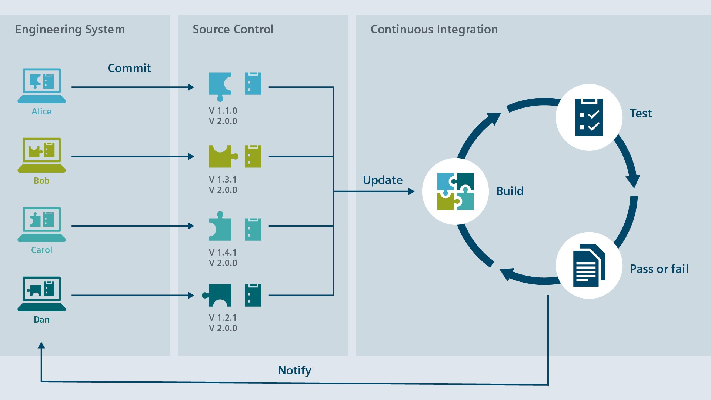
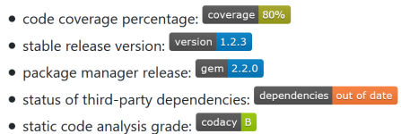
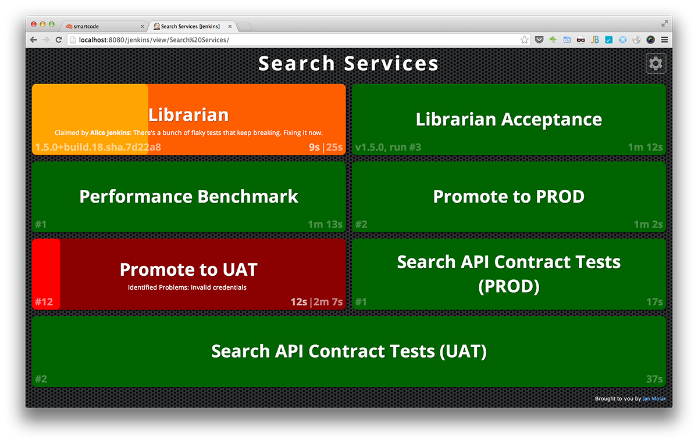
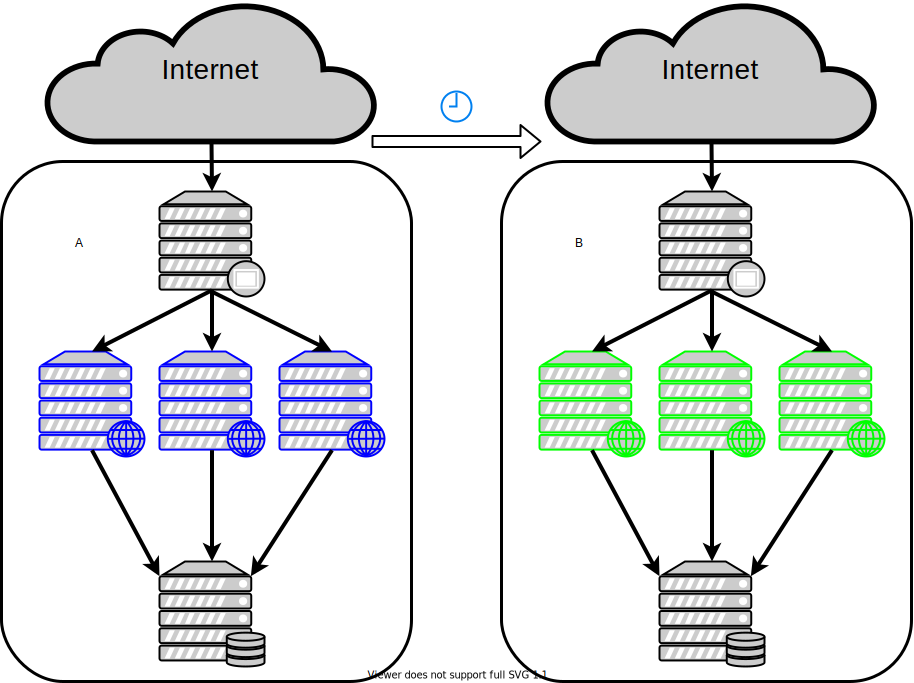
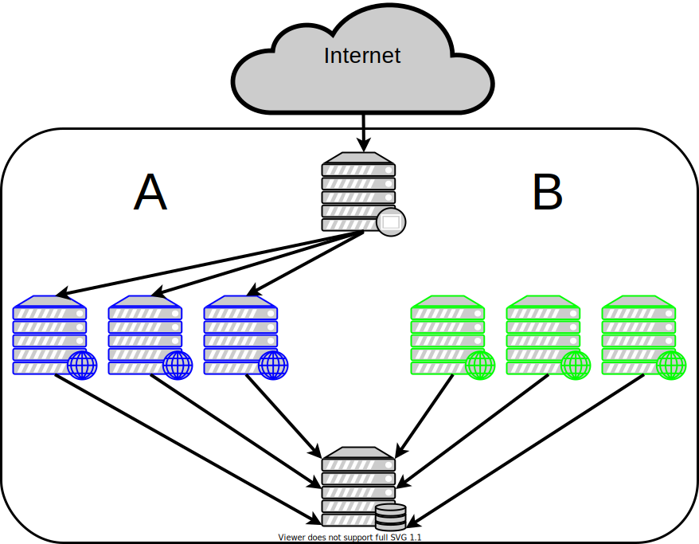
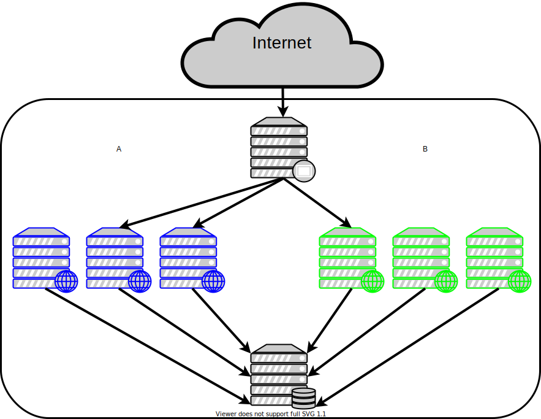
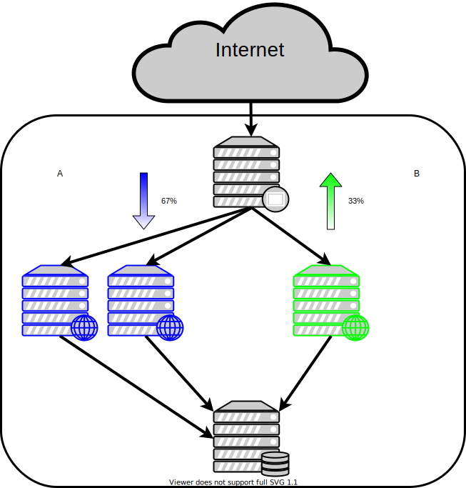
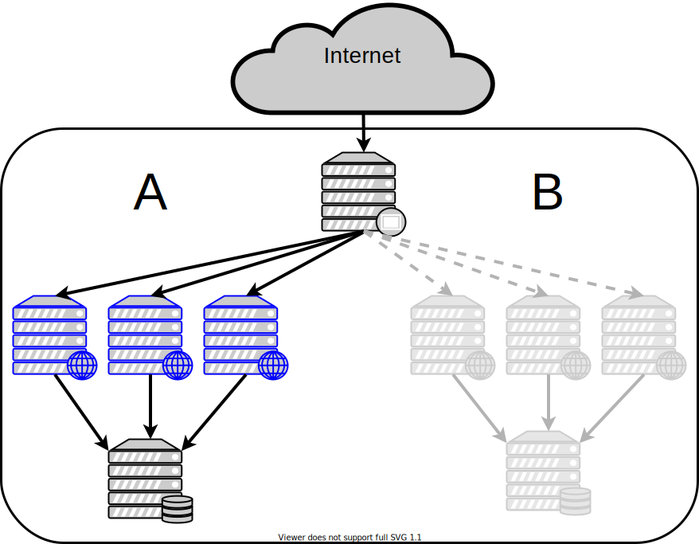
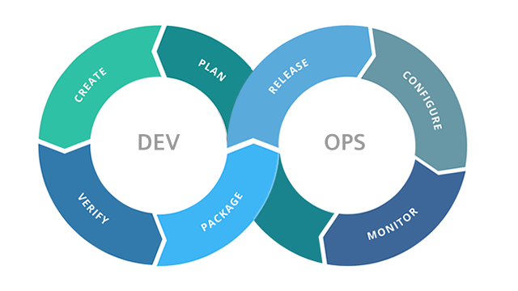

# Practices
Von Benedikt Struzek

## Continuous Integration
### Was ist Continuous Integration?
*Continuous Integration* ist eine Beschreibung des fortlaufenden zusammenführen von Softwarekomponenten wärend der Entwicklung. Die *Integration* der einzelnen Softwarekomponenten ist eine häufige Quelle von Problemen in der Softwareentwicklung. *Continuous Integration* soll dabei helfen diese Probleme zu minimieren.

#### Workflow ohne CI
Vor der Nutzung von *Continuous Integration* wurde vom Entwickler ein einfacher Workflow befolgt:


Der geschriebene Quellcode wird lokal kompiliert und getestet. Dabei wird wiederholt der dazugehörige Branch im Team Repository aktualisiert.

Um dann die Änderungen in den master Branch zu übernehmen muss der Quellcode zusammengeführt werden. Je größer der Unterschied zwischen den beiden Quellcodes ist, desto größer ist der benötigte Aufwand für die Zusammenführung.


#### Workflow mit CI
Um die Integration zu vereinfachen werden von den Entwicklern regelmäßig lauffähige Versionen ihres Quellcodes ins Team Repository eingecheckt. Mit diesen wird dann Automatisch ein Buildvorgang mit definierten Tests gestartet.



Die Bestandteile der *Continuous Integration* Pipeline sind:
1. **Build**
2. **Test**

Um die einzelne Softwarekomponenten möglichst führ abzudecken wird die *Continuous Integration* Pipeline für eine Reihe von Branches durchgeführt:
- Master branch
- Development branch
- Feature Branch
- Pull Requests auf Master oder Development
- Tags für Releaseversionen

### Vorteile
- Es ist zu jeder Zeit ein testbarer Build vorhanden
- Interessierten Nutzern kann ein Nightly Build bereitgestellt werden
- Ergebnisse der Letzten Tests lassen sich als Badge in der Readme des Repository anzeigen
  - 
- Serverseitige Code-Analyse
- Aktuelle Informationen über den Zustand des Quellcodes können bereitgestellt werden
  - per E-Mail Benachrichtigung
  - per CI Build Monitor



## Continuous Delivery
*Continuous Delivery* ist eine Erweiterung von *Continuous Integration*. Als weiterer Schritt kommt dazu, dass automatisch der erfolgreich gebaute und getestete Build als Release veröffentlicht werden kann. Veröffendlichungsmöglichkeiten sind z.B. das Hinzufügen zu einem Package Repository wie dem offizellen npm Repository, Maven Central einer Docker Registry oder einer unternehmensinternen Variante dieser.

*Continuous Delivery* Pipeline:
1. Build
2. Test
3. **Delivery**

## Continuous Deployment
*Continuous Deployment* ist eine Erweiterung von *Continuous Delivery*. Hier wird als weiterer Schritt das aktualisieren der Software in einer produktiven Umgebung hinzugefügt. Aufgrund der potenzellen Auswirkung auf den Betrieb ist eine enge Zusammenarbeit aller beteiligten Abteilungen nötwendig.<br>
Dies sowie die tatsächlichen Umsetztungsmöglichkeiten des Deploymentsvorgangs werden weiter unten in den Abschnitten für [Deployment strategies](./Practices/Practices#Deployment-strategies) und [DevOps](./Practices/Practices#DevOps) behandelt. 

*Continuous Deployment* Pipeline:
1. Build
2. Test
3. Delivery
4. **Deployment**

## Plattformen & Tools für CI/CD
Um Praktiken wie CI oder CD umzusetzten gibt es eine Reihe von Services und Tools. Bei jedem dieser wird eine Pipeline definiert. Die Definition unterscheidet sich von Anbieter zu Anbieter und erlaubt eine hohe Flexibilität.
Um Zugangsdaten und Attribute der Buildumgebung zu verwenden werden im Regelfall Umgebungsvariablen zur Verfügung gestellt.

Der Durchlauf der Pipeline kann auf unterschiedlichen Ebenen durchgeführt werden. So kann das produzierte Package eine Ausführbare Datei sein oder die gleiche Datei schon fertig Containerisiert.

### Jenkins
[Jenkins](https://www.jenkins.io/) ist ein automatisierungs Server zum selber hosten. Im Regelfall wird Jenkins für CI/CD Aufgaben verwendet, bietet aber durch seine Funktionen und Erweiterbarkeit noch viele weitere Anwendungsmöglichkeiten.

#### Beispiel einer Jekins Pipeline
Im nachfolgenden Beispiel wird der Quellcode eines Projekt über einen Bitbucket Server verwaltet. Unter zuhilfenahme eines Plugins für Bitbucketserver wird ein komplettes Repository abgedeckt.

Für alle Branches wird automatisch bei einem neuen Commit die Pipeline ausgeführt. Ebenso werden für alle Pull Requests bei der Erstellung und Aktualisierung die Pipeline ausgeführt.
Die in Git erstellten Tags stehen ebenfalls zur Verfügung um manuell die Pipeline anzustoßen.

In der Pipeline wird:
1. Die aktuellste Version aus dem Git Repository geholt
2. Ein Build durchgeführt
3. Die definierten Tests durchgeführt
4. Der Build ausgeliefert

Die Auslieferung des Build erfolgt ausschlißlich auf dem Master Branch des Repository. Darüber hinaus ist es möglich eine Auslieferungen von Snapshots und preview Build über einen Development Branch zu konfiguieren.

```groovy
#!/usr/bin/env groovy
pipeline {
    agent any

    tools {
        maven 'Maven-3.6.0'
    }

    stages  {
        stage('Clone') {
            steps{
                checkout scm
            }
        }
        stage('Build') {
            steps {
                sh 'mvn -B -DskipTests clean package'
            }
        }
        stage('Test') {
            steps {
                sh 'mvn test'
            }
            post {
                always {
                    junit 'target/surefire-reports/*.xml'
                }
            }
        }
        stage('Deliver') {          
            when {
                branch 'master'
            }
            steps {
                sh 'mvn deploy' 
            }
        }
    }
}
```
In der dargestellten Pipeline für Jenkins wird ein Maven Artefakt kompiliert, getestet und ggf. an ein Artefakt Repository gesendet.

### GitHub Actions
[GitHub Actions](https://github.com/features/actions)

```yaml
name: Docker Image CI

on:
  push:
    branches: [ master ]
  release:
    types: [published]

jobs:

  build:

    runs-on: ubuntu-latest

    steps:
      - uses: actions/checkout@v1
      - name: Login to DockerHub Registry
        run: echo ${{ secrets.DOCKERHUB_PASSWORD }} | docker login -u ${{ secrets.DOCKERHUB_USERNAME }} --password-stdin
      - name: Build the tagged Docker image
        run: docker build . --file Dockerfile --tag dasbene/continuousdemo:$GITHUB_SHA
      - name: Push the tagged Docker image
        run: docker push dasbene/continuousdemo:$GITHUB_SHA
      - name: Build the latest Docker image
        run: docker build . --file Dockerfile --tag dasbene/continuousdemo:latest
      - name: Push the latest Docker image
        run: docker push dasbene/continuousdemo:latest
```

### CircleCI
[CircleCI](https://circleci.com/)

```yaml
version: 2.1
orbs:
  node: circleci/node@1.1.6
jobs:
  build-and-test:
    executor:
      name: node/default
    steps:
      - checkout
      - node/with-cache:
          steps:
            - run: npm install
            - run: npm test
workflows:
    build-and-test:
      jobs:
        - build-and-test
```

### Sonstige Plattformen
- [TravisCI](https://travis-ci.org/)
- AWS Code Build & CodePipeline
- Google Cloud Build
- Azure Pipelines
- GitLab
- [Docker Hub](https://hub.docker.com/)

Die Plattform Docker Hub hat sich auf *Continuous Delivery* von Docker Images beschränkt. Dies wird vereinfacht da die zum builden von Containern genutzte *Dockerfile* schon ein build Pipeline darstellt. Die fertigen Images werden direkt in Docker Hub, das als Image Repository agiert, zur Weiterverteilung gespeichert.

## Deployment strategies

### Was ist eine deployment strategy
Nachdem mittels CI/CD, oder auch nur manuell, ein Build erstellt wurde der deployed werden soll steht die Frage an wie man der Übergang von Version A zu Version B gestaltet. Hier kommen deployment strategies ins Spiel.
*Deployment strategies* werden auch *Continuous Delivery Patterns* genannt.

### Recreate
*Recreate* ist die älteste deployment strategy. Es wird als erstes die alte Version A auf allen Servern gestoppt und dann die Version B installiert und gestartet.



#### Vorteile
- Einfach durchzuführen
- Saubere Trennung zwischen alten und neuen Zustand

#### Nachteile
- Downtime
- Kein schnelles Rollback

### Blue / Green
Bei der *Blue/Green* deployment strategy wird die alte Version A als Blue bezeichnet und die neue Version B als Green. Green wird parallel zu Blue betrieben und greift auf die selbe oder eine replizierte Datenbank zu.
Bei einem Umschaltvorgang wird dann der gesamte Traffic von einenm Proxy oder ggf. Load Balancer an Green weitergeleitet.



#### Vorteile
- Vor der Umschaltung kann die Green Umgebung getestet werden
- Bei schwerwiegenden Problemen kann auf Blue zurückgeschaltet werden

#### Nachteile
- Hohe Kosten durch doppelte Ressourcen

### Canary
Bei der *Canary* deployment strategy wird der Traffic vom Load Balancer anhand einer Gewichtung zwischen den Instanzen der alten Version A und der neuen Version B aufgeteilt.



#### Vorteile
- Nur eine kleine Menge der Nutzer verwendet die neue Version
  - Die Menge der potenziellen Fehler ist gering
- Schnelles Rollback

#### Nachteile
- Langsames Rollout

### Rolling / Ramped
Eine *Rolling* deployment strategy ist ähnlich zu der *Canary* deployment strategy. Es wird genau so die neue B Version parallel zu der alten Version A betrieben. Der Anteil des Traffics, der vom Load Balancer zu B weitergeleitet wird erhöht sich immer weiter mit dem Anteil Instanzen von B.

Ebenso wie bei *Canary* ist das Erhöhen des Anteils von Instanzen mit Version B abhängig von der fehlerarmen Operation dieser.



#### Vorteile
- Eignet sich gut für Anwendungen die ihren Zustand sauber in den Datenabbilden
- Einfach aufzusetzten

#### Nachteile
- Ohne angemessene Abwärtskompatibilität wird ein Rollback schwieriger
- Ggf. müssen mehrere APIs unterstützt werden

### Shadow
Wie *Rolling* hat die *Shadow* deployment strategy eine Ähnlichkeit mit *Blue/Green*. Es werden Instanzen mit der neuene Version B gestartet die vom Load Balancer eine Schattenkopie der Nutzeranfrage erhalten. Diese kopierte Anfrage wird vom System verarbeitet und das Ergebnis kann mit dem Ergebnis der alten Version A verglichen werden.

Um keine Auswirkungen auf weitere System zu haben müssen diese upstream Services ggf. simuliert werden. Datenbanken können auch als Kopie vorliegen.



#### Vorteile
- Tatsächliches Release erst bei der erfüllung aller KPIs
- Testen der Schnelligkeit mit echten Anfragen
- Der Benutzer merkt davon nichts

#### Nachteile
- Komplexes Setup
- Upstream Dienste müssen ggf. simuliert werden
- Ausgehende Antworten müssen abgefangen werden

### A/B testing
Beim *A/B testing* wird anhand von festgelegten Merkmalen entschieden ob ein Nutzer die alte Version A oder die neue Version B ausgeliefert bekommt. Dies macht *A/B testing* mehr zu einer Auswertungsvariante und kann z.B. ein *Canary* Deployment erweitern.

Zu diesen Merkmalen können gehören:
- GeoIP Informationen
- Endgerät wie Desktop oder Mobile
- Die Rolle des Nutzers
  - innerhalb oder außerhalb eines Firmennetzwerks
  - Betatester
- Sprache des Nutzers
- Mögliche Browser Features
- Anfrageparametern


#### Vorteile
- Eine neue Version kann zuerst an bestimmte Kunden ausgeliefert werden
- Bessere Kontrolle über die Verteilung der Anfragen

#### Nachteile
- Hohe Anforderungen an den Load Balancer

### Weitere deployment strategies
**Feature Flags**: Bei *Feature Flags* werden die neuen Funktionen per Umschaltung innerhalb der Anwendung ein- und ausgeschaltet. Features deren Entwicklung länger als ein Entwicklungszyklus dauert können auf diese Art und Weise schon integriert werden. Bei der Nutzung von zu vielen Feature Flags oder schlechtem Management dieser können hohe technische Schulden entstehen.

**Dark Launching**: Beim *Dark Launching* werden neue Funktionen im Backend und der Geschäftslogik hinzugefügt die jedoch noch nicht in der UI zur Verfügung stehen. 
Falls der Service per API und das UI per Webanwendung unanhängig voneinander entwickelt und deployed werden impliziert dies *Dark Launching*.

## DevOps
*DevOps* bringt zwei wesentliche Elemente der Softwareentwicklung näher zusammen. Development und IT-Operations. Seit 2008 gibt es die Idee von *DevOps* und seit dem hat *DevOps* die Entwicklung von unterstützenden Technologien befügelt. Zu diesen gehören Cloud Computing, Containerisierung sowie Serverless Architekturen.

Bei *DevOps* werden die Merkmale agiler Vorgehensweisen wie Scrum, die sich bisher nur auf die Softwareentwicklung beschränkte, auf Operations ausgeweitet.

Wesentlche Kenngrößen von Development:
- neue Features
- behobende Fehler

Wesentlche Kenngrößen von IT-Operations:
- Verfügbarkeit
- Stabilität

Das verbessern Kenngrößen führt effektiv zu einem Tauziehen der beiden Abteilungen. Durch DevOps sollen diese besser zusammenarbeiten.

### DevOps als Kultur
Da *DevOps* ein gewünschtes Ergebnis beschreibt sollte dies eher als Kultur interpretiert werden und nicht als konkretes Rezept für besseren Zusammenarbeit.<br>
Elemente dieser Kultur sind multidisziplinäre Teams. Diese ermöglichen eine Pipeline von der Idee bis zum Auswerten der Operations Erfahrungen.


Durch diese Pipline wird es Möglich aus dem am Ende gelernten im nächsten Entwicklungsschritt oder Sprint zu profitieren und ein besseres Update bereitzustellen. Dies bedeutet das *DevOps* ein endloser Zyklus ist.



### Ziele
- Schnellere Auslieferung von neuen Funktionen
- Schnellere Auslieferung von Änderungen
- Höhere Qualität der Auslieferungen
- Schnellere Reaktionszeit Fehler zu beheben

### Unterstützende Technologien
- Continuous Deployment
- Containerisierung
- Microservices
- Cloud native computing

## DevSecOps
*DevSecOps* ist eine Variante von *DevOps* bei der der Fokus auf der Sicherheit liegt(secure-by-design).
Dabei werden die einzelnen Schritte der Pipeline durch Risiko minimierende Vorgehensweisen erweitert.

Grundsätzlich gilt dabei die Pipeline transparent zu gestalten um den aktuellen Zustand nachvollziehen zu können. Dies vereinfacht auch ggf. benötigte Sicherheitsaudits.

### Detaillierte Anforderungen
Den einzelnen Workflow schritten werden zusätzliche Anforderungen gestellt, welche die Sicherheit des Release erhöhen sollen.
Neben einfachen Maßnahmen wie Test-driven development, Pair Programming und Linting gibt es noch weitere wie z.B.:

**Vulnerability scanning**: Automatisches auffinden von bekannten Sicherheitslücken bei verwendeten Libaries und anderen Dependencies wie container Layer.

**Cloud nativ deployment**: Das Aufbauen auf Produkten von Cloud Anbietern erlaubt es auf bestimmte Operations Elemente zu verzichten. Ein Beispiel hierfür sind Serverless Anwendungen die auf gehostete Lambda Funktionen setzten.

### Vorteile
Neben der Sicherheit selber ist ein wesentlicher Vorteil besser Compliance Vorgaben für den Entwicklungsprozess erfüllen zu können. In einer Reihe von Geschäftsfelder ist das Einhalten von gesetzlichen Vorgaben vorraussetzung damit Kunden das entwickelte Produkt oder Service verwenden können.
Zu diesen Geschäftsfelder zählen insbesondere das Gesundheitswesen, Finanzwesen sowie öffentliche Aufträge.

## Site Reliability Engineering
*Site Reliability Engineering* (SRE) ist eine von Google entwickelte Praktik mit großer Überlappung mit DevOps. Google startete SRE in 2003 und ist damit deutlich älter als *DevOps*.

> SRE is "what happens when a software engineer is tasked with what used to be called operations."
>
> -- <cite>Ben Treynor</cite>

### Säulen von SRE
**Reduce organizational silos**: Organisatorische Silos sind Organisationseinheiten innerhalb des Unternehmens die sich vom Rest teilweise abschotten. Dies kann neben Abteilungen wie Development und Operations auch Altprojekte betreffen, die seit vielen Jahren unabhängig vom restlichen Geschäft weiterentwickelt und gewartet werden. Soweit möglich gilt es bei *SRE* diese Silos zu minimieren.<br>
Das Aufbrechen von Development und Operations kann z.B. duch das verwenden gemeinsamer Tools und das Teilen von Verantwortung 

**Accept failure as normal**: Fehler und Risiken lassen sich nie zu 100% abwenden, vorallem nicht bei Programmen die weltweit millionen von Anfragen verarbeiten. Darum ist es wichtig Risiken anzunehmen und Fehler zu akzeptieren. Bei einer angemessenen Umsetzung von *SRE* wird die potentielle Auswirkung der auftretenen Fehler minimiert.

**Implement gradual changes**: Das reduzieren der durch Fehler verursachten Kosten und das Entwickeln von kleineren Änderungen und Features erlaubt es diese nach kürzerer Entwicklungszeit schneller ins Produktivsystem zu bringen.

**Leverage tooling and automation**: Um *SRE* erfolgrich Umzusetzen müssen kleinere und altägliche Aufgaben Automatisiert oder zumindest Teilautomatisiert werden. Diese Aufgaben werden bei *Toil* genannt.

**Measure everything**: Das Beobachten der laufenden Systeme ist eine der Schlüsselanforderungen von *SRE*. Dies erlaubt es besonders schnell auf Fehler zu reagieren und die Auswirkungen dieser gering zu halten.

### Unterschiede zu DevOps
*SRE* und *DevOps* haben von der Idee und Motivation viele gemeinsamkeiten. Obwohl *SRE* ein paar Jahre älter ist als die ersten *DevOps* Definitionen wird die Beziehung der beiden häufig dargestellt mit ```class DevOps implements SRE```.<br>
*DevOps* beschreibt nicht wie man zum Ziel kommt, sondern nur wie sich das fertige System am Ende verhalten soll. *SRE* geht hier weiter und schreibt konkrete 

# Quellen
- CI/CD
  - https://new.siemens.com/global/de/produkte/automatisierung/industrie-software/automatisierungs-software/tia-portal/highlights/continuous-integration.html
  - https://www.atlassian.com/continuous-delivery/continuous-integration/how-to-get-to-continuous-integration
  - https://www.atlassian.com/continuous-delivery/continuous-deployment
  - https://github.com/badges/shields
  - Jenkins
    - https://plugins.jenkins.io/build-monitor-plugin/
    - https://www.jenkins.io/doc/tutorials/build-a-java-app-with-maven/
  - CircleCI
    - https://jaxenter.de/der-softwarelieferheld-45524
- Deployment strategies
  - https://thenewstack.io/deployment-strategies/
  - https://dev.to/mostlyjason/intro-to-deployment-strategies-blue-green-canary-and-more-3a3
  - https://docs.cloudfoundry.org/devguide/deploy-apps/blue-green.html
  - https://rollout.io/blog/rolling-deployment/
  - https://medium.com/@Cycligent/pros-and-cons-of-5-popular-continuous-delivery-patterns-e2998af002ff
  - https://de.wikipedia.org/wiki/Datei:Un-flag-square.png
  - https://de.wikipedia.org/wiki/Flagge_Deutschlands#/media/Datei:Flag_of_Germany.svg
- Dev[Sec]Ops
  - https://www.ibm.com/cloud/devops
    - https://www.youtube.com/watch?v=UbtB4sMaaNM
  - https://developer.ibm.com/recipes/tutorials/devsecops-security-and-devops-working-together/?mhsrc=ibmsearch_a&mhq=devsecops
    - https://www.youtube.com/watch?v=J73MELGF6u0
  - https://www.serverless.com/aws-lambda/
- SRE
  - https://landing.google.com/sre/
  - https://cloud.google.com/blog/products/gcp/sre-vs-devops-competing-standards-or-close-friends
  - https://landing.google.com/sre/interview/ben-treynor-sloss/
  - https://landing.google.com/sre/sre-book/chapters/eliminating-toil/
  - https://landing.google.com/sre/sre-book/chapters/embracing-risk/
- Bilder
  - https://assets.new.siemens.com/siemens/assets/api/uuid:25eb416f-2262-47b1-a514-32dd437f37dd/width:2732/quality:high/version:1572011544/grafik-continuous-integration-gesamtbild-en-1920p.jpg
  - https://raw.githubusercontent.com/jan-molak/jenkins-build-monitor-plugin/master/docs/3_Two_columns_view_with_claim_and_build_failure_analyzer_plugins.png
  - https://www.plm.automation.siemens.com/media/global/de/polarion-devops_tcm53-26359.png
