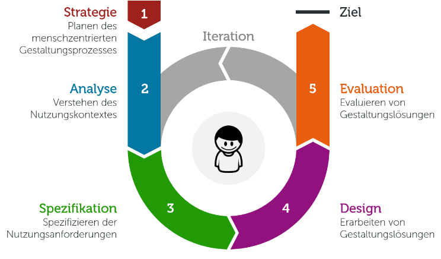
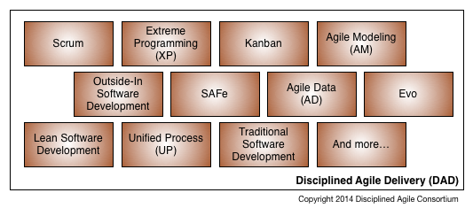
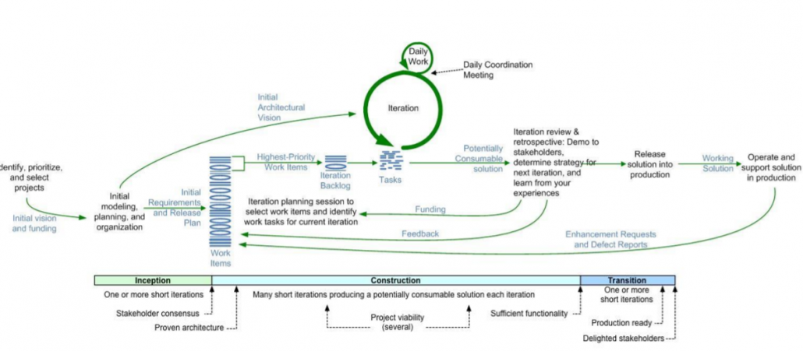
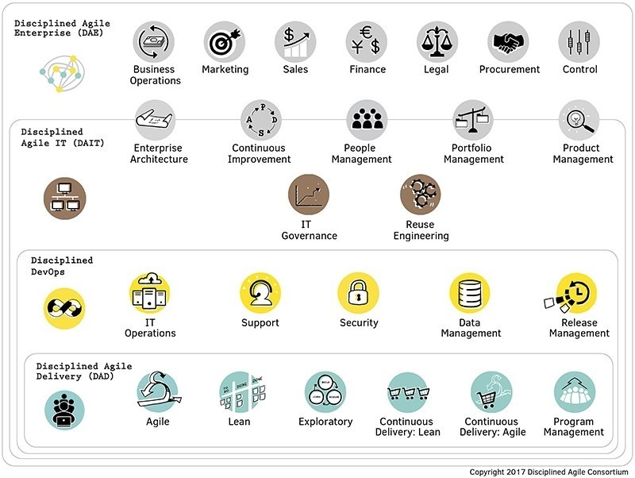
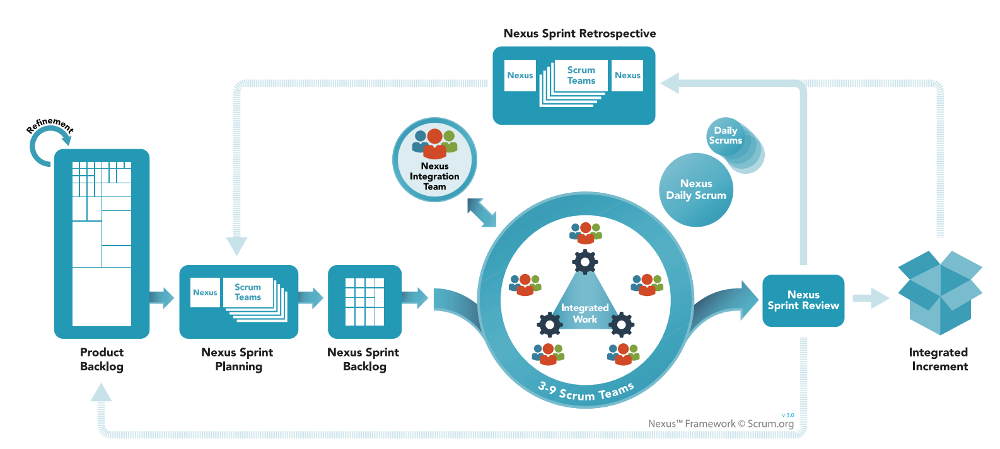
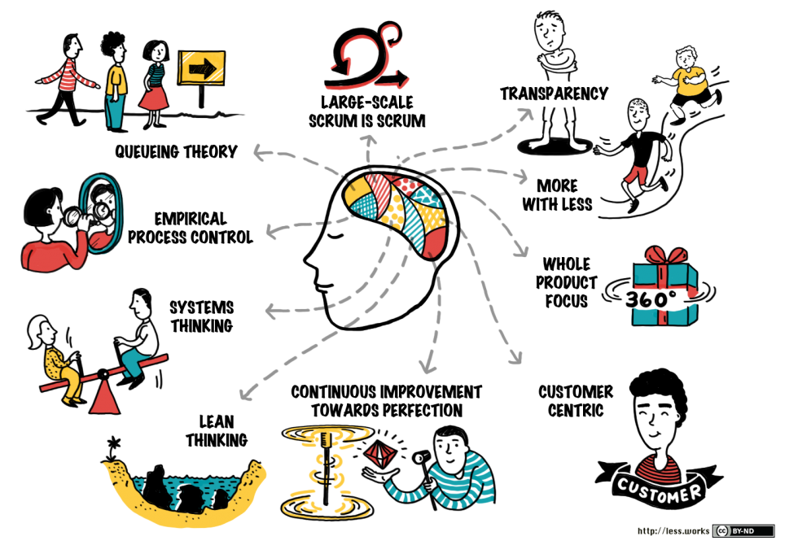
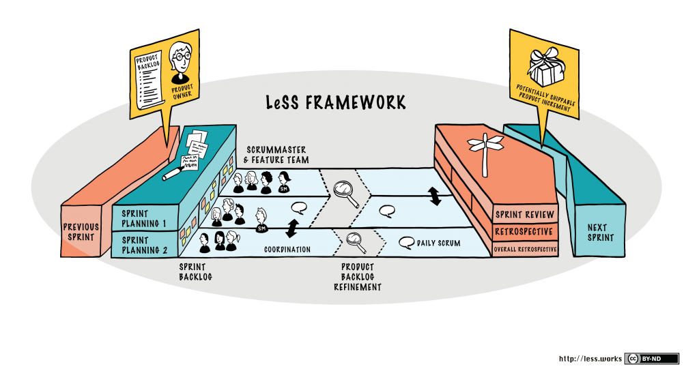
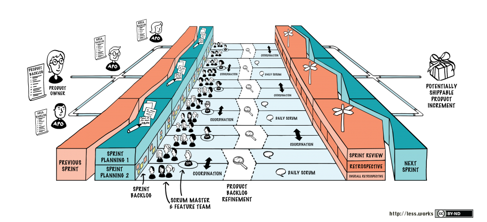

# Einleitung

Das Designen und Festlegen von festen Arbeitsabläufen ist unerlässlich in der Zusammenarbeit mit anderen. Durch die geänderten Anforderungen durch die Digitalisierung funktionieren die alten Prozesse allerdings nur noch bedingt. Aus diesem Grund wird heutzutage immer mehr auf agile Prozesse und Methoden gesetzt. Der bekanntesten Vertreter dieser neuen Agilen Frameworks sind Scrum und Kanban. Aber welche Strategien gibt es außerhalb dieser beiden? Und welche Tools bieten sich an, um diese zu nutzen? 

# User-Centered Design

Die Idee hinter dem Entwurf User zentriert zu entwickeln steht die Anforderung, die Wünsche und Anforderungen eines Produktusers zu berücksichtigen. Die Wünsche des Users werden dabei immer wieder angepasst und verfeinert, bis ein endgültiges Produkt steht, welches höchste Ansprüche an die Useability und die User Experience stellt.

## Funktionsweise

In der ersten Phase geht es darum, dass der Benutzerkontext verstanden wird. Hieraus ergeben sich dann auch verschiedene Useranforderungen. Diese werden dann ausgearbeitet und umgesetzt. Zum Schluss eines Durchlaufes wird die Arbeit bewertet und es werden die vorher getroffenen Anforderungen verfeinert. Dies wird bis zum Endprodukt immer wiederholt.

Im Folgenden werden die Phasen noch genauer beschrieben:

1. Analyse: In dieser Phase wird der Benutzerkontext beschrieben. Die gestellten Fragen dazu lauten:

   1. Welche Merkmale hat der Benutzer?
   2. In welcher Umgebung findet die Nutzung statt?
   3. Welche Aufgaben will der User lösen?

   Antworten auf diese Fragen können nur durch Feedback von dem Kunden entstehen. So sind verschiedene Techniken, wie Interviews, zum Einholen des Feedbacks vom User unerlässlich.

2. Spezifikation: Hier werden die Anforderungen an die Software spezifiziert. Ziel ist es herauszufinden, was die Software leisten muss. Die Ergebnisse dieser Phase beeinflussen den Entwicklungsprozess.

   Aus den formulierten Wünschen in Phase 1 werden jetzt Anforderungen für das Programm  erstellt. Bei einer Präsentationssoftware könnte zum Beispiel der Wunsch vom User kommen "Ich muss wissen, wie viel Zeit ich noch habe". Hieraus könnte die Anforderung entstehen: "Die Restzeit muss sichtbar sein".

3. Design: Die gestellten Anforderungen werden einem ersten Prototypen umgesetzt. Der Fokus liegt hierbei ganz klar auf der Nutzbarkeit der Funktionen. Das Design trägt zwar seinen Teil dazu bei, gutes Design ersetzt fehlende Funktionalitäten jedoch nicht.

4. Evaluation: Die erarbeiteten Lösungen werden ständig geprüft und getestet. Hierzu ist wieder das Feedback vom User nötig. Dies kann wieder über Methoden wie Interviews oder Usability-Tests eingeholt werden.

Diese Phasen werden wie oben gezeigt immer wieder durchlaufen, bis es zu einem endgültigen Produkt gekommen ist.

## Einsatzgebiet

Diese Vorgehensweise bietet sich für alle Bereiche an, in denen eine starke Userfokussierung vorliegt. Klassische Bereiche dafür wären zum Beispiel Web-Frontends oder die App-Entwicklung.

## Vorteile

Der starke Userfokus und die Einbindung des Users ermöglichen Produkte, die auf den User zugeschnitten sind. Hierdurch erfahren vor allem Bereiche, für die ein gut bedienbares Framework elementar ist, einen machbaren Einsatz. Das steigert die Kundenzufriedenheit und auch die Qualität der Software. Weitere Vorteile sind geringere Schulungskosten und ein Wettbewerbsvorteil durch gute Software.

## Nachteile

Durch die Fokussierung auf die Bedürfnisse des Users kann es dazu kommen, dass Produkte nicht fertig werden. Häufig wird der Ansatz in einer sich schnell verändernden Umgebung eingesetzt. Diese Umgebung wird zum Beispiel durch neue Technologien verändert. Dies ändert jedoch auch die Bedürfnisse des Users, die Entwicklung beginnt im schlimmsten Fall von vorne. Die Entwicklung muss also schnell abgeschlossen werden. Teilweise wird auch bemängelt, dass keine passgenaue Lösung entsteht. Dies ist immer dann der Fall, wenn sich grundsätzlich zwei Usergruppen gegenüber stehen, zum Beispiel Experten und Anfänger, die jedoch unterschiedliche Bedürfnisse haben.

# DaD

Das Disciplined agile Delivery Framework (DaD) konzentriert sich ähnlich wie SAFe, LeSS oder Nexus auf die agile Arbeit in Unternehmen. Anders als diese Frameworks liegt die Hauptkonzentration dabei jedoch nicht auf die Zusammenarbeit zwischen den Teams, vielmehr bildet DaD eine Erweiterung von Scrum über den vollständigen Produktlebenszyklus.

## Aufbau

DaD verfolgt einen hybriden Ansatz, das bedeutet, dass es neben Scrum auch Ansätze und Methodiken aus anderen Konzepten vereint. Hierzu zählen unter anderem Agile Modeling (AM), Extreme Programming (XP), Unified Process (UP), Kanban, Lean Software Development und Outside In Development(OID). DaD bildet dabei ein Fundament, auf dem agile Techniken und Frameworks ausgeführt werden können.

Bei der Einbettung von dem Framework ist es nun wichtig zu verstehen, dass der Fokus weg von Software hin zu Lösungen geht. Damit verschiebt sich auch der Fokus vom User zu allen Stakeholdern. So sollen auch wirtschaftliche, kulturelle und technologische Einflüsse angemessen repräsentiert werden. Dafür unterscheidet das Framework im wesentlichen drei Phasen:

### Inception Phase

Hier wird die Entwicklung der Produktvision vorangetrieben

### Construction Phase

Über eine agile Methode, zum Beispiel Scrum oder Kanban, wird schrittweise eine Lösung erarbeitet.

### Transition Phase

Die Lösung wird den Stakeholdern bereitgestellt.

## Lebenszyklus

Das Framework beherrscht mehrere Lebenszyklen. Hier wird sich auf ein agiler Lebenszyklus bezogen, der auf Scrum aufsetzt.

## DaD Agile Lifecycle

Dieser Zyklus basiert auf Scrum. Am Anfang ist die Inception Phase. Diese besteht aus wenigen kurzen Iterationen, um die erste Planung und Organisation zu beschließen. Anschließend geht es schon in die Construction über. Aus den Anforderungen werden Work Items extrahiert und diese priorisiert. Anschließend werden die wichtigsten Funktionen zuerst entwickelt. Der normale Scrum Zyklus wird dabei angewendet. Am Ende dieser Phase werden erste Demos den Stakeholdern gezeigt. Daraus werden dann  neue Anforderungen oder abweichende Priorisierungen ermittelt. Diese fließen in die Planung für den nächsten Durchlauf ein. Abschließend wird in der Transition Phase das fertige Produkt zu den Stakeholdern gegeben. Das Feedback zu dem Produkt kann wiederum zu Anpassungen führen.

Der Unterschied zu dem einfachen Scrum liegt jetzt darin, dass alle Personen im Unternehmen beteiligt werden. So sind auch alle für kontinuierliche Verbesserungen zum Erreichen der Vision zuständig. Ebenfalls wird jetzt nicht nur die Software in Ihrer Entstehung begleitet, sondern auch im weiteren Lebensverlauf. So können Anforderungen, die nach Auslieferung der Software entstehen, wieder in den Entwicklungsprozess zurückgehführt werden. Das Produkt wird über die komplette Lebenszeit betreut.

Die unteren drei Phasen stellen dabei eher den Lebenszyklus da, das Scrum ähnliche Schaubild eher den Entwicklungsprozess.

## Vorteile

DaD ist sehr flexibel und greift andere Aspekte auf, wie die bereits vorgestellten Methodiken SAFe, LeSS oder Nexus. Aus diesem Grund kann es sich bei DaD um eine passende Ergänzung zu diesen Frameworks handeln. Dabei überlässt das Framework den Entwicklern einen gewissen Freiraum nach welchen Praktiken diese arbeiten. Der Fokus liegt vielmehr auf der angemessenen Repräsentation aller Stakeholder an einem Produkt. So sollen auch andere Business Einheiten in dem Unternehmen Einfluss nehmen können. Ein Punkt, den Nexus und LeSS zum Beispiel nicht behandeln. Auch bietet dieses Framework sehr viel Flexibilität und soll vor allem bei der Auswahl der richtigen Methodik unterstützen. 

## Nachteile

Teilweise ist DaD mit seinen wenigen Spezifikationen sehr vage. Zwar bleibt es so für jedes Unternehmen anpassbar, gerade ungeübte Unternehmen werden jedoch Unterstützung benötigen.

In letzter Zeit entwickelt sich auch SAFe immer mehr dazu, dass es Aufgaben von DaD übernimmt. Dieses ist zwar kein direkter Nachteil für dieses Framework, sollte jedoch erwähnt werden.

## Ausblick

Am Anfang der Entstehungsgeschichte stand nur das Liefern von Software im Vordergrund. Dieser Ansatz, oben beschrieben, wurde jedoch schrittweise erweitert.

Mittlerweile umfasst das DA Framework noch folgende Bereiche:

__DA DevOps:__ Integration agiler Entwicklung mit dem IT-Betrieb samt Security und Data Management

__DA Agile IT:__ Integration agiler Entwicklung in eine IT-Organisation

__DA Agile Enterprise:__ Agile und leichtgewichtige Unternehmensprozesse sowie eine lernende Organisation

Durch diese Erweiterungen bietet das komplette DA Framework mittlerweile sehr viele Möglichkeiten. Sämtliche Bereiche eines Unternehmens können nach einem Model integriert und alle Prozesse dargestellt werden. 

# Nexus

## Zweck

Nexus ist ein Framework, um die Arbeit mit mehreren Scrum-Teams zu erleichtern. Scrum selber beschreibt nur den Ablauf innerhalb eines Teams, zu der Zusammenarbeit mit anderen Teams macht es jedoch keine Vorgaben. Um diese Lücke möglichst leichtgewichtig zu füllen, hat einer der Erfinder von Scrum, Ken Schwaber, Nexus entwickelt.

## Ablauf

Nexus besteht aus drei Elementen. Den Rollen, Artefakten und Events. Eine Rolle ist zum Beispiel das Nexus Integration Team. Ein Artefakt das Product Backlog und der Sprint Review ist ein Event.

### Verfeinerung des Product Backlogs

Am Anfang des Models steht die Verfeinerung des Product Backlogs. Dieses muss so genau definiert werden, dass Abhängigkeiten erkannt und beseitigt oder minimiert werden. Die Einträge im Backlog werden zu kleinen Teilen der Funktionalität verfeinert und die Teams, welche die Funktionalität erledigen sollen, erkannt und zugewiesen.

### Nexus Sprint-Planning

Anschließend treffen sich Repräsentanten von jedem Team und diskutieren das verfeinerte Product Backlog. Auch wählen Sie in diesem Meeting geeignete Einträge aus dem Backlog für ihr Team zur Umsetzung aus. Nach dem Meeting plant jedes Team den Sprint, es entsteht ein Sprint Backlog. Diese Planung geschieht mit angemessener Kommunikation zu den anderen Teams. Letztendlich soll so eine Reihe von Sprint-Zielen entstehen, die auf das Product-Backlog und auf alle Sprint-Backlogs abgestimmt ist.

Aus dieser Reihe von Zielen entsteht ein Nexus Sprint Backlog, welches die Ziele und deren Abhängigkeiten beschreibt. Ziel ist es Transparenz unter den Teams zu schaffen.

### Entwicklungsarbeit

Alle Teams integrieren ihre Lösungen regelmäßig in eine gemeinsame Umgebung. Diese wird getestet, damit sichergestellt werden kann, dass die Integration erfolgreich durchgeführt wird.

#### Nexus Integration Team

Das Integration Team hat dafür Sorge zu tragen, dass am Ende des Sprints mindestens ein funktionstüchtiges Inkrement entsteht. Hierfür adressiert und moderiert es die teamübergeifenden Probleme.

### Nexus Daily Scrum

Die Repräsentanten von jedem Team treffen sich täglich, um bestehende Integrationsprobleme zu erkennen und zu erörtern. Im Anschluss an dieses Meeting haben die Teams ihr Daily Scrum Meeting. Hier soll der Tagesplan erstellt werden. Sollten im Nexus Daily Scrum Integrationsprobleme erkannt werden, sollten diese im Tagesplan adressiert werden.

### Nexus Sprint Review

Am Ende eines jeden Sprint findet der Sprint Review statt. Hier treffen sich alle Teams mit den Stakeholdern, um Feedback zu der gebauten Funktionalität zu erhalten. Ergebnis aus diesem Feedback kann das Product Backlog weiter verfeinern.

### Nexus Sprint Retrospektive

Abschließend treffen sich die Vertreter von jedem Team, um gemeinsame Probleme zu identifizieren. Anschließend hält jedes Team eine eigene Retrospektive ab. Danach treffen sich dann noch einmal die Vertreter um die erkannten Probleme abschließend zu diskutieren und das weitere Vorgehen zu erarbeiten. So soll sichergestellt werden, dass die Probleme passend in der Lösung beachtet werden.

## Vorteile

Für Unternehmen oder Teams, die bereits nach Scrum arbeiten, bedeutet dieses Framework wenig extra Aufwand. Es entstehen wenige zusätzliche Rollen und Meetings, alles läuft bereits nach der bekannten Methodik ab. Dazu kommt, dass dieses Framework kostenlos erhältlich ist. Der im Netz erhältliche Guide ist ca. 15 Seiten lang und in 30 Sprachen erhältlich.

## Nachteile

Hier ist ganz klar die Limitierung von Nexus auf maximal neun Teams zu nennen. Dies bedeutet automatisch, dass dieses Framework für große Projekte nicht geeignet ist. Zusätzlich liegt der Fokus dieses Frameworks fast ausschließlich auf dem Integrationsteam. Anweisungen oder Empfehlungen zu Struktur- und Ablaufkonzepten, oder gar zu Portfoliomanagement, IT-Betrieb oder Strategien enthält das Framework leider nicht

# LeSS

LeSS (Large-Scale Scrum) ist ebenfalls ein Framework für die Zusammenarbeit von verschiedenen Scrum Teams.  Die beiden Gründer von LeSS waren lange Zeit in der traditionellen Entwicklung beheimatet mit verschiedenen Teams. Jedoch fühlte sich davon keine Methode mehr richtig an. Scrum fühlte sich zwar in einem Team richtig an, hatte jedoch das Problem keine Vorgaben zur Zusammenarbeit mit Teams zu machen.

Aus diesem Grund hat auch LeSS den Anspruch nicht einfach ein Scrum zu sein für viele Teams. Vielmehr soll es eine Methodik bieten, damit viele Teams, auch crossfunctional, zusammenarbeiten können. 

LeSS besteht aus verschiedenen Kernpunkten: Ein Kernpunkt ist die technische Exzellenz. Hierzu zählen eine kontinuierliche Entwicklung, Integration und Auslieferung. Zusätzlich definiert LeSS einige Regeln und Prinzipien.

## Prinzipien

### Queueing Theory

Die Warteschlangen Theorie beschäftigt sich mit der Frage, wie sich Objekte in einer Warteschlange bewegen.  Die Warteschlangen Theorie ist einer der Grundsätze von Lean Development. LeSS beherrscht die Warteschlangentheorie. Ziel ist es, in kurzer Zeit auslieferbare Produkte zu erstellen.

### Large-Scale Scrum is Scrum

Dieses Prinzip sagt aus, dass der bekannte Ablauf von Scrum immer noch gleich ist. Es soll auch keine neue Version von Scrum entwickelt werden mit dem Framework. Vielmehr sollen Regeln und Anleitungen gegeben werden, wie Teams zusammenarbeiten können. Es löst organisatorische Probleme. Genau legt LeSS jedoch nicht fest, wie die Teams das Lösen. Dies liegt vielmehr im Aufgabenbereich jedes einzelnen Teams.

### Transparency

Da sich auch mit der Anwendung von Scrum Probleme nicht automatisch lösen, bietet LeSS Methoden, um den Teams ein regelmäßiges Feedback zu geben, wo Sie aktuell stehen. Es zeigt aber nicht nur Probleme in dem Team auf, sondern auch in der Organisation.

### More with LeSS

Dieses Prinzip bildet das Herzstück von LeSS. Es basiert auf der Erkenntnis, dass die Nachteile durch komplexe organisatorische Lösungen teilweise schlimmer sind als die Probleme, die sie lösen sollen. Aus diesem Grund versucht LeSS organisatorische Komplexität zu beseitigen, indem es Probleme der Produktentwicklung auf einfache Art und Weise löst.

### Whole Product Focus

Dadurch, dass der Kunde nie Teile des Produktes sieht, sondern immer nur ganze Produkte. Daraus entwickelt LeSS wichtige Leitlinien:

- Teile, die noch nicht in die Gesamtsoftware integriert werden, haben keinen Wert
- Teile sind erst dann fertig, wenn sie integriert sind

Es ist eine der schwierigsten Aufgaben bei der Arbeit mit Scrum über mehrere Teams, dass sich alle auf das Produkt und nicht auf einzelne Teile konzentrieren.

### Customer Centric

Im Mittelpunkt steht immer der Kunde und seine Anforderungen. Jeder ist somit direkt mit dessen Bedürfnissen verbunden.

### Continuous Improvement towards perfection

Die Hauptaussage besteht darin, dass Perfektion so gut wie nie erreicht wird. Aus diesem Grund ist ein Produkt auch nie  fertig. Stattdessen wird es kontinuierlich weiterentwickelt, um näher an die Perfektion ran zu kommen.

### Lean Thinking

Hierunter wird verstanden, dass eine Denkweise etabliert wird, die den Respekt vor dem Menschen, das Streben nach kontinuierlicher Verbesserung und ein agiles Mindset beinhaltet. Dieses Mindset wird durch verschiedene Prinzipien und Ziele weiter definiert.

### Systems Thinking

Auch dieser Punkt definiert wieder mehrere Prinzipien, die ihn ausmachen. Zusammengefasst geht es so ungefähr darum, ein Gespür für das System zu bekommen. Und das neue Probleme nicht einfach auftauchen, sondern es Gründe im System gibt. Hierfür muss man aber die Eigenheiten, den Aufbau und die Gedanken für das System verstehen.

### Empirical Process Controll

Es wird in kurzen Zyklen ein versandfertiges Teil des Produktes hergestellt und getestet. Hierbei wird vor allem die Art und Weise wie es gebaut wird überprüft.

### Zusammenfassung

Viele der Prinzipien sind bereits durch Scrum definiert. Hier beziehen sie sich jedoch nur auf ein einzelnes Projekt, nicht jedoch auf die Zusammenarbeit von Teams.

## Workflow

Ähnlich wie Nexus erweitert auch LeSS den Produktzyklus. Auch in diesem Framework gibt es nur einen Product Owner und ein Product Backlog. Da die Aufgabe analog zu Nexus ist, sind die hier nicht mehr ausführlich beschrieben.

Die einzelnen Feature Teams planen danach ihre Sprints. In einer ersten Phase wird die Frage "Was?" beantwortet. Also das Feature für den Sprint wird aus dem Product Backlog ausgewählt. Die zweite Phase plant dann das Vorgehen, beantwortet also das "Wie?".

In der Zusammenarbeit der Teams bestehen ebenfalls viele Parallelen zu Nexus. Die Teams haben ihre Daily Scrums und ausgewählte Vertreter sprechen mit den anderen Teams / dem Scrum Master. Am Ende des Sprints gibt es auch hier zuerst eine Retrospective mit allen Teams. Die Erkenntnisse werden anschließend in jedem Team einzeln diskutiert und es werden Lehren und aufgetretene Probleme aus dem Sprint definiert. Am Ende soll so ein auslieferbares Produkt Increment stehen. Und der nächste Sprint kann beginnen.

### Huge

Da LeSS nur für eine Anwendung mit bis zu maximal 8 Teams taugt, wurde LeSS Huge erfunden. Über dieses Framework können beliebig viele Teams miteinander arbeiten. Es gibt weiterhin nur einen Product Owner, der den Überblick über das komplette Produkt hat. Hinzugekommen sind jedoch die Area Product Manager. Diese verantworten immer einen Teilbereich des Produktes. Und planen für diesen Teilbereich die Sprints der einzelnen Feature Teams. Der Rest ist dann wieder gleich geblieben im Vergleich zu dem kleinen LeSS.

## Vorteile

LeSS setzt auf dem bereits bekannten Scrum-Prinzip auf. Dieses Prinzip wird an vielen Stellen nur verfeinert, sodass LeSS optimal ist für Teams, die bereits nach Scrum arbeiten. Die Zusammenarbeit mit anderen Teams wird jedoch gefördert und unterstützt. Letzendlich beschreibt LeSS mit seinen Prinzipien sogar eher einen Zielzustand, welcher sich stark an Scrum orientiert.

## Nachteile

LeSS enthält keine Angaben, bzw. Vorgaben, zu Themen wie der Unternehmensstrategie, -architektur oder dem Portfolio. In diesem Punkt brauchen allerdings vor allem mittlere und große Unternehmen mehr Klarheit bezüglich der Organisation.

## SAFe

SAFe for Lean Enterprises, so lautet der offizielle Name des Frameworks. Dieser Name deutet schon auf das große Ziel des Frameworks hin. Denkt man einmal an die Assoziationen, die man bei dem Begriff "Lean Enterprise" hat, denkt man schnell an Skalierung und agiles Arbeiten. Und genau diese beiden Schlagwörter setzt sich das Framework als Maßstab, um bei der Entwicklung und Bereitstellung von Technologiebasierten Lösungen zu unterstützen. Es beansprucht dabei, die besten Konzepte aus der agilen Entwicklung, des Lean Developments und bewährte Methodigen des DevOps-Bereiches zu vereinen, um so eine Online-Wissensdatenbank zur Erreichung der wirtschaftlichen Ziele zur Verfügung zu stellen. SAFe ist dabei freierhältlich. Die Inhalte des Frameworks sind allerdings sehr gut dokumentiert, allerdings auch sehr genau festgelegt.

### Zweck

Eine wichtige Frage bei der Einführung von Frameworks ist natürlich, wieso möchte ich die überhaupt einführen? SAFe hilft Unternehmen bei der Einführung und Koordination von agilen Methoden, wie zum Beispiel Scrum. Methoden wie Scrum sind bekanntlich gut dokumentiert und sehr beliebt im Einsatz, es stellt sich also ein bisschen die Frage, wieso ich dafür ein Framework einführen sollte. Scrum funktioniert auf Teamebene hervorragend, es spezifiziert jedoch keine Vorgehensweise für die Zusammenarbeit, wenn mehrere, unabhängige Scrum-Projekte gleichzeitig entwickelt werden sollen. Hinzu kommt, dass mittlerweile auch Teams aus anderen Bereichen, wie Personal oder Controlling, zunehmend agil arbeiten. Diese Lücke versucht SAFe zu füllen und somit als Leitwerk für die Zusammenarbeit zu dienen.

### Leitfragen

Konkreter möchte SAFe bei der Beantwortung folgender Fragen helfen:

- Wie richten wir die technologische Entwicklung an den strategischen Unternehmenszielen aus?
- Wie liefern wir neue Werte in einem vorhersehbaren Zeitplan, damit der Rest des Unternehmens damit planen kann?
- Wie verbessern wir die Qualität unserer Produkte und steigern die Kundenzufriedenheit?
- Wie skalieren wir agile Methoden von dem Team, über Programm und Geschäftsbereiche bis hin zu dem Unternehmen, um bessere Resultate zu erzielen?
- Wie organisieren wir Mitarbeiter so um unsere Werte, dass wir effektiver werden und die Schwächen traditioneller Strukturen vermeiden?
- Wie schaffen wir eine Umgebung, die Zusammenarbeit, Innovation und die kontinuierliche Verbesserung unserer Mitarbeiter fördert?
- Wie können wir unsere Unternehmenskultur so verändern, dass es sicher ist zu versagen? Wie können wir unsere Mitarbeiter motivieren Risiken einzugehen, kreativ zu denken und sich stetig zu verbessern? Wie können wir unseren Teams helfen, ohne dabei zu stören?

Betrachtet man die Fragen wird eines immer deutlicher: SAFe ist kein Framework, welches man in einem Team für ein Projekt anwendet. Vielmehr erhebt SAFe den Anspruch, ein komplettes Unternehmen dauerhaft zu unterstützen. 

### Prinzipien

SAFe ist aus 7 Prinzipien aufgebaut.

#### Enterprise Solution Delivery

Dieser Bereich beschreibt, wie die Prinzipien von schlanker und agiler Entwicklung auf die Entwicklung, Auslieferung, Betrieb und Weiterentwicklung von den größten Softwareanwendungen, Netzwerken oder cyber-physikalischen Unternehmen erreicht werden. Die besondere Herausforderung besteht bei solchen Systemen darin, dass häufig Hunderte, teilweise auch Tausende, Menschen mitarbeiten. Zusätzlich müssen meisten viele Komponenten aus verschiedenen Unternehmen zusammengesetzt werden, diese unterliegen jedoch teilweise strengen Regeln und Betriebsbedingungen.

#### Lean Portfolio Managment

__Strategy and Investment Funding:__

Sicherstellung der Ausrichtung und Finanzierung des Portfolios, welches Lösungen schaffen und betreiben soll, die zur Erreichung der Geschäftsziele erforderlich sind.

__Agile Portfolio Operations:__

Koordiniert und unterstützt die dezentrale Ausführung.

__Lean Governance:__

Überwachung und Entscheidungsfindung in den Bereichen Ausgaben, Rechnungsprüfung, Compliance, Ausgabenprognosen und Messungen.

#### Organizational Agility

Im Zuge der sich globalisierenden Märkte und immer neuer und schnellerer Technologien müssen auch Unternehmen zunehmend in der Lage sein, sich schnell auf die veränderten Marktbedingungen anzupassen. So können neue Chancen ergriffen werden. Hierfür muss in allen Unternehmensbereichen ein entsprechendes Denken etabliert werden.

#### Continuous Learning Culture

Innerhalb einer Gesellschaft lernen alle zusammen. Aus diesem Grund sind Kreativität und der Drang nach Entdeckungen Teil der Organisationsphilosophie. Dies geht sogar so weit, dass Verbesserungen und Innovationen in den Aufgabenbereich von jedem Einzelnen gehören.

#### Lean-Agile Leadership

Die Führungskräfte in einem Unternehmen sind für die Umsetzung der Prinzipien und Methoden verantwortlich. Aus diesem Grund ist es unerlässlich, dass diese ebenfalls nach einem agilen Muster arbeiten. Nur so können andere Mitarbeiter sich an diesen orientieren und von diesen profitieren. Zusätzlich haben die Führungskräfte die Befugnis Arbeitsläufe zu verändern, um so Verbesserungen zu schaffen.

#### Team and Technical Agility

Dieses Prinzip beschreibt die agilen Teams und eine technische Agilität. Diese beiden Kompetenzen, bzw. Arbeitsweisen sind für die Erstellung von Mehrwerten für den Kunden nötig. Der Erfolg des Unternehmens hängt von dieser Fertigkeit ab. Ein agiles Team soll Lösungen liefern und die Bedürfnisse des Kunden erfüllen.

#### Agile Product Delivery

Dies beschreibt einen kundenorientierten Workflow zur Definition und Entwicklung von Produkten für den Kunden. Hierunter fallen Techniken zum Contionous Delivery von Produkten.

#### Zusammenfassung

Beschäftigt man sich tiefer mit diesen Prinzipien kann man verschiedene Aussagen treffen, die das Framework zusammenfassend beschreiben.

1. Eine wirtschaftliche Perspektive einnehmen
2. Systematisches Denken einsetzen
3. Variabilität annehmen und Optionen vorhalten
4. Inkrementell mit schnellen integrierten Lernzyklen entwickeln
5. Meilensteine auf die objektive Bewertung von funktionierenden Systemen basieren
6. Unfertige Ergebnisse visualisieren und limitieren, Losgrößen reduzieren und Warteschlangen managen
7. Kontinuierlichen Rhythmus anwenden und mit der übergreifenden Planung synchronisieren
8. intrinsische Motivation von Mitarbeitern erschließen
9. Fällen von Entscheidungen dezentralisieren

### Konfigurationen

#### Essential SAFe

Die Version Essential SAFe ist die Basiskonfiguration für parallel arbeitende agile Teams.

Ganz unten befindet sich die Teamebene, die Ebene darüber die Programmebene. In der Produktebene werden die Aufgaben und das Vorgehen der einzelnen Teams schematisch dargestellt. Ganz links sehen wir die Zusammensetzung der agilen Teams. Auch hier haben wir ein Product-, bzw. Team-Backlog. In SAFe organisiert sich jedes Team selbstständig, es wird jedoch ein Scrum-Ansatz mit XP-Ansätzen empfohlen. Diese Teams integrieren dann ihre Arbeit in einem CI / CD Ansatz kontinuierlich in das endgültige Produkt. Hierbei kommt es immer wieder zu Verfeinerungen der Anforderungen. AUf Programmebene wird ein Team installiert, welches die Koordination der Feature Teams beaufsichtigt. Hierzu wird ein Agile Release Train eingeführt. Ziel ist es, dass nur Teams an dem Produkt (Train) mitarbeiten, wenn sie benötigt werden. Bei all diesen Maßnahmen steht das User-zentrierte-Denken im Vordergrund. 

#### Portfolio SAFe

Das Essential SAFe wird mit Strategie-, Investitions-, Leitungs- und Portfolio Management-Aufgaben erweitert.

Dazu gehört zum Beispiel die Festlegung einer Strategie oder die Erstellung einer Vision für das Portfolio. Insgesamt wird hier auch Budgetplanung berücksichtigt, die Ausrichtung des Unternehmens und viele weitere Aspekte.

#### Large Solution SAFe

Diese Lösung bietet sich für Teams an, die große zusammenhängende Projekte realisieren. Diese Produkte sind entsprechend komplex und die Koordination beinhaltet zusätzliche Aufgaben.

Neu in dieser Ebene ist deshalb ein Team, welches die gesamtheitliche Lösung und die Integration der einzelnen Teams beaufsichtigt und begleitet. Dazu zählen dann auch externe Zulieferer und Dienstleister. Auch diese haben eigene Bedürfnisse, die koordiniert werden müssen. Hierzu wird dann ein Solution Train eingeführt. Dieser funktioniert analog zu dem Release Train, benötigte Einheiten werden nur wenn benötigt verwendet.

#### Full SAFe

Diese Frameworkstufe ist für Unternehmen, die Produkte und integrierte Lösungen in Teams von mehreren hundert Leuten entwickeln.

Hierbei ist es wichtig, dass die neue Ebene das große Ganze beaufsichtigt, die Geldflüsse managet und die Vision für die Teams festlegt.

### Einsatzgebiet

Dass die Einführung des Enterprise Frameworks sich erst lohnt, wenn Scrum seine Grenzen in der Koordination erreicht hat, sollte auch durch die definierten Ziele und Prinzipien klar geworden sein. Alle Prozesse und Prinzipien, Vorgaben und deren Umsetzung beschreibt SAFe allerdings sehr genau. Es eignet sich deshalb vor allem für Unternehmen, die noch nicht agil arbeiten. Bereits agil arbeitende Unternehmen könnten sich durch die strikten Vorgaben eingeengt fühlen. Letztendlich ist es jedoch auch das einzige Frramework, welches für große Unternehmen mit mehr als 100 Entwicklern an einem Projekt in Frage kommt.

### Vorteile

Ein klarer Vorteil von SAFe ist, dass es sehr gut dokumentiert ist. Zu jedem Bereich sind zahlreiche Artikel, Präsentationen und Videos erhältlich. Mittlerweile gibt es auch eine große Gemeinschaft zu diesem Framework, so fand zum Beispiel 2018 eine Konferenz zu diesem Thema statt. Auch bietet es großen Unternehmen die Möglichkeit, einen umfassenden Ordnungsrahmen für agile Teams zu schaffen. Und das nicht auf einen Bereich begrenzt, sondern über viele Unternehmensbereiche hinweg. Helfen tun hierbei die sehr detailliert beschriebenen Prozesse, Abhängigkeiten und Vorgaben. Auch ist SAFe das einzige Framework, welches sich mit Fragen der Finanzierung beschäftigt. Auch aus diesem Grund ist es für Firmen mit mehr als 100 Entwicklern an einem Projekt das einzige in Frage kommende Framework. 

### Nachteile

Der große Vorteil von SAFe, dass es einen umfassenden Rahmen für große Unternehmen schafft, ist gleichzeitig auch der größte Kritikpunkt. Es hat einen riesigen Umfang. Gerade für kleine Teams bedeutet das teilweise einen riesigen Overhead. Auch wenn es unterschiedliche Abstufungen gibt, ein kleines SAFe gibt es nicht wirklich. Auch können Unternehmen, die bereits agil arbeiten, sich durch die Einführung von SAFe stark eingeschränkt fühlen. Dies liegt an der strikten und sehr detaillierten Ausarbeitung von Prozessen und Vorgaben.

 Durch den großen Umfang ist es aber selbst für Kenner von agilen Methoden fast unerlässlich ein Training und entsprechende Zertifizierungen zu buchen. Ein Umstand der von dem Betreiber des Frameworks so gewollt ist. Schließlich ist das Framework an sich frei erhältlich, der Umsatz des Unternehmens wird über Schulungen und Zertifizierungen generiert.

## Vergleich

Das User Centered Design stellt einen grundlegen Aspekt beim agilen Arbeiten da. Der User steht im Fokus. Nach diesem Prinzip sind Scrum und so ausgerichtet.

Die drei vorgestellten Frameworks sollen alle die mangelnden Vorgaben von Scrum (oder anderen agilen Methodiken) zur Arbeit in mehreren Teams und in größeren Problemen ersetzen. Alle drei Frameworks haben dabei jedoch unterschiedliche Ansprüche an die Lösung. Nexus ist der leichtgewichtigste Vertreter dieser Frameworks. Dafür hat es allerdings auch nur den Anspruch die Zusammenarbeit mit maximal 9 Teams zu regeln. Funktionsübergreifende Teams werden auch nicht betrachtet, Nexus konzentriert sich auf die Entwicklerteams.

LeSS setzt ebenfalls auf Scrum auf und eignet sich deswegen vor allem für Teams, die bereits agil nach Scrum arbeiten. LeSS legt verschiedene Regeln und Prinzipien fest, verpasst es allerdings auch genaue Vorgaben zu machen, die zum Beispiel ein Portfoliomanagement oder die Budgetplanung betreffen. 

SAFe ist das umfangreichste Framework. Es beschreibt jegliche Bereiche und die benötigten Prozesse sehr genau. Aus diesem Grund eignet es sich auch für Unternehmen, die noch keine Erfahrung gemacht haben. Im Bereich der Entwicklung mit hunderten Entwicklern ist es quasi konkurrenzlos, da es als einziges Framework zum Beispiel auch die Budgetplanung berücksichtigt. Nachteil ist hier jedoch, dass der Umfang einfach riesig ist, es werden viele neue Rollen und Abläufe eingeführt. Die zu verstehen benötigt Zeit.

 

| Name            | Nexus                    | LeSS                                                       | SAFe                                        |
| --------------- | ------------------------ | ---------------------------------------------------------- | ------------------------------------------- |
| __Basis__       | Scrum                    | Scrum                                                      | Scrum, Kanban, XP                           |
| __Komplexität__ | Abhängigkeiten           | Balance zwischen definierter Struktur und Prozesskontrolle | Agile Ausrichtung der gesamten Organisation |
| __Größe__       | 3-9 Teams                | LeSS: 3-8 Teams LeSS Huge: >8 Teams                    | über 100 Teams                              |
| __Augenmerk__   | Tranzparenz, Einfachkeit | Wertstrom                                                  | Kundenzentriert                             |

​          

# Anhang

## Quellen

__SAFe__

- [SAFe for Lean Enterprises](https://www.scaledagileframework.com/#)
- [Besser SAFe?](https://www.mosaiic.com/blog/2018/03/20/safe-scaled-agile-framework/)
- [Braintime- SAFe](https://www.braintime.de/methoden/ueberblick-scaled-agile-framework-beratung/safe-voraussetzungen/)
- [Palladio Consulting-SAFe](https://www.palladio-consulting.de/safe/)
- [wibas - SAFe](https://www.wibas.com/de/scaled-agile-framework/)
- [cassini - SAFe oder LeSS?](https://www.cassini.de/interview/safe-oder-less)

__LeSS__

- [LeSS](https://less.works/de)
- [Ist LeSS wirklich mehr?](https://www.mosaiic.com/blog/2018/04/24/large-scale-scrum-framework/)
- [cassini - SAFe oder LeSS?](https://www.cassini.de/interview/safe-oder-less)
- [Less vs. SAFe](https://www.knowledgehut.com/blog/agile/less-vs-safe-which-certification-should-you-choose-and-why)
- [LeSS - emendare](https://www.emendare.de/less-large-scale-scrum/)

__Nexus__

- [Scrum.Org - Nexus](https://www.scrum.org/resources/scaling-scrum)
- Nexus Guide
- [Nexus im Überblick](https://www.mosaiic.com/blog/2018/05/15/nexus-framework-im-ueberblick/)

__DaD__

- [PMI-DaD](https://www.pmi.org/disciplined-agile/hybrid-framework)
- [DA-Consortium](https://disciplinedagileconsortium.org/Disciplined-Agile-Case-Study)
- [Scrum endlich diszipliniert?](https://www.mosaiic.com/blog/2018/06/05/disciplined-agile-delivery/)
- [DA-Übersicht](https://www.palladio-consulting.de/disciplined-agile-delivery/)

__UCD__

- [Ionos](https://www.ionos.de/digitalguide/websites/web-entwicklung/human-centered-design/)

- [ryte](https://de.ryte.com/wiki/User_Centered_Design)

- [interaction-design](https://www.interaction-design.org/literature/topics/user-centered-design)

  

