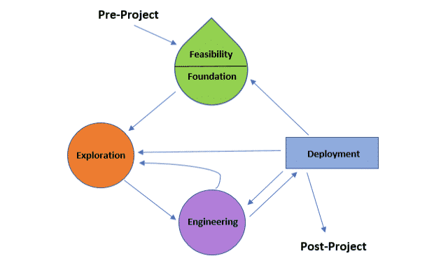

# Einleitung

Das Designen und Festlegen von festen Arbeitsabläufen ist unerlässlich in der Zusammenarbeit mit anderen. Durch die geänderten Anforderungen durch die Digitalisierung funktionieren die alten Prozesse allerdings nur noch bedingt. Aus diesem Grund wird heutzutage immer mehr auf agile Prozesse und Methoden gesetzt. Der bekanntesten Vertreter dieser neuen Agilen Frameworks sind Scrum und Kanban. Aber welche Strategien gibt es außerhalb dieser beiden? Und welche Tools bieten sich an um diese zu nutzen? 

# Strategien

## Rapid Application Development

Rapid Application Development (RAD) ist eine agile Projektmanagment Strategie. Der Grundlegende Gedanke bei diesem Modell ist, Anforderungen möglichst schnell in einen ausführbaren Prototypen zu verwandeln. Diese Prototypen werden im Verlauf der Entwicklung immer wieder durch Feedback des Kunden angepasst.

### Historie

RAD wurde Anfang der 1970er von Brian Gallagher, Alex Balchin, Barry Boehm und Scott Schultz entwickelt. Ihr Ziel war es dabei die Softwareentwicklung zu beschleunigen und flexibler zu gestalten. Berühmt wurde die Methode allerdings erst Anfang der 1990er Jahre. Seitdem wird die Methode jedoch vielfältig eingesetzt und ist auch heutzutage noch aktuell.

### Vorgehensweise

Die Methode besteht vor allem aus vier grundlegenden Phasen.

In der Phase Requirements Planning legen Entwickler, Auftraggeber und Planer die Anforderungen fest und priorisieren diese. In dieser Phase dürfen Entwickler und Auftraggeber auch direkt miteinander kommunizieren. Aus den Anforderungen wird im Anschluss ein erster Prototyp entwickelt. Dadurch wird bereits die zweite Phase betreten. In dieser Phase kommt es zu ständigen Anpassungen durch den Kunden. Hieraus wird ein neuer Prototyp entwickelt. Anschließend wird dieser getestet und der Kunde verfeinert wieder seine Anforderungen. In dieser Phase soll der Austausch eher als ein Monolog vom Kunden erfolgen. Je nach Projekt sollte ein Zyklus zwischen einem Tag und drei Wochen dauern. Diese Phase dauert solange, bis alle Anforderungen von dem Kunden erfüllt worden sind. Abschließend wird die Anwendung in eine Produktionsumgebung verschoben. In dieser Phase finden umfassende Tests und Trainings statt.

### Vorteile

Großer Vorteil dieser Methode ist die geringe Zeit an Vorentwicklung bis zum ersten Prototypen. Hierdurch können dem Kunden schon früh erste Ergebnisse gezeigt werden und Feedback eingeholt werden. Missverständnisse können so frühzeitig erkannt und behoben werden. Da Prototypen erstellt werden, werden die verschiedenen Programmbausteine parallel entwickelt, sodass die Software im Regelfall in weniger als 120 Tagen ausgeliefert werden kann.

### Nachteile

Durch die Vorgabe möglichst schnell einen ersten Prototypen zu entwickeln wird häufig auf vorgefertigte Baukästen zurückgegriffen. Diese bieten bereits einen hohen Funktionswert für den Kunden, werden allerdings selten manuell angepasst um alle Anforderungen zu 100% zu erfüllen. Letztendlich entsteht dadurch Code, der nicht performant ist.

### Einsatzgebiet

Aufgrund des großen Nachteils, dass häufig wenig performanter Code entsteht, sollte RAD nur in kleineren Projekten zum Einsatz kommen, die nicht performance-kritisch sind. Für diese Anwendungsfälle generiert der Ablauf jedoch schnell funktionierende Ergebnisse, die auf das Feedback des Kunden anpassbar sind.

## Dynamic System Development Model

Das Dynamic System Development Model (DSDM) ist eine Erweiterung zu RAD.  Es verfolgt einen iterativen, inkrementellen Ansatz und betont besonders die Einbindung der Anwender. Hierfür wurden neun Prinzipien und sieben Phasen zur Umsetzung definiert.

### Historie

Da das Vorgehen bei RAD häufig zu unkoordiniert ist, gründete sich 1994 ein Konsortium, welches diese Mängel ausmerzen wollte. Aufgrund ihrer Erfahrung erarbeiteten sie das Framework, welches aber anfänglich nur für Blue-Ship Organisationen wie British-Airways oder Oracle zur Verfügung stand. 2006 wurde das Framework allerdings öffentlich zugänglich gemacht. Diese Version 4.2 war für Einzelpersonen bestimmt. Seit 2014 ist ein DSDM-Handbuch erhältlich und es können Unterlagen heruntergeladen werden. Die momentan aktuelle Version heißt DSDM Atern, wird teilweise auch nur Atern genannt. In dieser Version wurden alle IT-Spezifika entfernt, es ist also auch auf Nicht-IT-Projekte anwendbar.

### Vorgehensweise

#### Prinzipien

Diese neun Prinzipien müssen während eines Projektes alle eingehalten werden.

1. Der Kunde wird aktiv in die Arbeit des Teams einbezogen
2. Die Entscheidungsgewalt liegt (in großen Teilen) beim Team
3. Eine regelmäßige Lieferung von (Teil-)produkten wird angestrebt
4. Jede Lieferung muss einen Geschäftswert für den Anwender darstellen, welcher auch ein relevantes Abnahmekriterium ist
5. Eine iterative inkrementelle Entwicklung ist notwendig
6. Alle Änderungen während der Entwicklung sind zurücknehm- oder umkehrbar
7. Anforderungen werden auf einem hohen Niveau festgeschrieben
8. Testen ist ein integraler Bestandteil des Prozesses
9. Die kooperative Zusammenarbeit aller Beteiligten ist wichtig

#### Phasen

Insgesamt umfasst DSDM sieben Phasen, falls notwendig können einzelne Phasen aber ausgelassen werden.

__Phase 1: Pre-Project__

Beinhaltet die Projektauswahl.

__Phase 2: Feasability Study__

Es wird geprüft, ob DSDM das richtige Vorgehen ist. Auch die Umsetzbarkeit, mögliche Risiken und Kosten werden evaluiert.

__Phase 3: Business Study__

Es werden die betroffenen Prozesse und Anwender identifiziert. Auch werden Business Cases in dieser Phase erstellt. Wird auch Foundation genannt.

__Phase 4:  Functional Model Iteration__

Das Produkt wird auf Basis von Phase 3 spezifiziert. Hierfür wird die Architektur erstellt und ein erster Prototyp erstellt. Wird auch Exploration genannt.

__Phase 5: Design and Build Iteration__

Der Entwurf und die Entwicklung erfolgt in dieser Phase. Wird auch Engineering genannt.

__Phase 6: Implementation__

Das fertige Produkt wird den Anwendern übergeben. Wird auch Deployment genannt.

__Phase 7: Post-Project__

Es wird überprüft, ob die Lösung effektiv, effizient und korrekt ist. Auch wird evaluiert, ob Erweiterungen notwendig sind.

Wie zu sehen ist, ist der Kreislauf nicht streng vorgegeben. Dies erhöht die Flexibilität innerhalb des Projektes deutlich.

#### Kerntechniken

DSDM verwendet vor allem zwei Kerntechniken. Einmal wäre dies das Timeboxing. Das bedeutet, dass jede Iteration eine feste Dauer hat. Die Iterationen können jedoch unterschiedlich lang sein und auch unterschiedliche Phasen umfassen.

Eine zweite Kerntechnik ist das MoSCoW-Prinzip. Dies besagt, dass die Anforderungen in folgende Kategorien eingeteilt werden:

- Muss (Must have)
- Sollte (Should have)
- Könnte (Could have)
- Nicht umgesetzt, vorgemerkt für später (Won't have)

### Vorteile

Ein großer Vorteil ist, dass die Methode normiert und standardisiert ist.  Auch kommt diese Methode den meisten sehr "natürlich" vor, da sie das Vorgehen aus dem Wasserfallmodell kennen. Dies hängt natürlich von dem gewählten Pfad ab, eine Umsetzung in dem Pfad Machbarkeit-->Grundlagen-->Forschung<-->Entwicklung --> Auslieferung ist jedoch keine Seltenheit. Dies vereint ein striktes Vorgehen mit einem agilen Vorgehen. Ansonsten hat diese Vorgehen seine Stärken vor allem in den Bereichen Konzeption, Entwicklung und Testen.

Ebenfalls ist es ein Vorteil, dass dieses Vorgehen sich für alle Arten von Projekten einigt. Es kann z.B. auch ein Maschinenbauer die Entwicklung einer neuen Kurbelwelle über dieses Framework umsetzen. Es können also ganze Konzerne diese Philosophie leben und es gibt keine Koexistenzen.

### Nachteile

Leider ist dieses Vorgehen nicht sehr verbreitet. Es gibt zwar einen Support und spezielle Software, eine große Anzahl an Forenbeiträgen kann allerdings nicht hinzugezogen werden. Auch die Bereiche Wartung, sowie Projekt- und Qualitätsmanagement werden nicht gut abgedeckt.

# Frameworks

In diesem Abschnitt werden vor allem agile, unternehmensweite Frameworks betrachtet, die eine Umsetzung der Prozesse erleichtern. 

## SAFe

### Prinzipien

SAFe ist aus 7 Prinzipien aufgebaut.

__Enterprise Solution Delivery__

__Lean Portfolio Managment__

__Organizational Agility__

__Continuous Learning Culture__

Innerhalb einer Gesellschaft lernen alle zusammen. Aus diesem Grund sind Kreativität und der Drang nach Entdeckungen Teil der Organisationsphilosophie. Dies geht sogar soweit, dass Verbesserungen und Innovationen in den Aufgabenbereich von jedem Einzelnen gehören.

__Lean-Agile Leadership__

__Team and Technical Agility__

__Agile Product Delivery__

# Anhang

## Quellen

__Rapid Application Development:__

- [RAD- Computerwoche](https://www.computerwoche.de/a/rapid-application-development,2352552)

- [RAD A Brief Overview](https://www.csiac.org/wp-content/uploads/2016/02/1998_03_01_RapidApplicationDevelopment.pdf)

- [RAD-IT-Talents](https://www.it-talents.de/blog/it-talents/was-ist-rapid-application-development)

  

