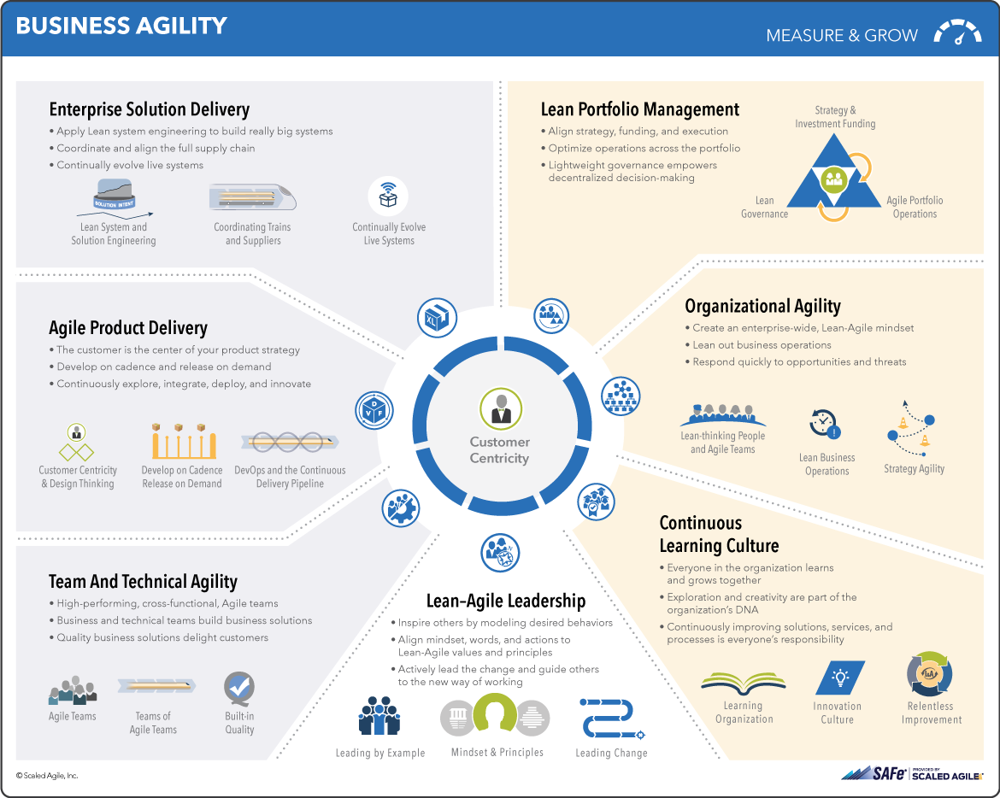

# Einleitung

Das Designen und Festlegen von festen Arbeitsabläufen ist unerlässlich in der Zusammenarbeit mit anderen. Durch die geänderten Anforderungen durch die Digitalisierung funktionieren die alten Prozesse allerdings nur noch bedingt. Aus diesem Grund wird heutzutage immer mehr auf agile Prozesse und Methoden gesetzt. Der bekanntesten Vertreter dieser neuen Agilen Frameworks sind Scrum und Kanban. Aber welche Strategien gibt es außerhalb dieser beiden? Und welche Tools bieten sich an um diese zu nutzen? 

# Strategien

## Rapid Application Development

Rapid Application Development (RAD) ist eine agile Projektmanagment Strategie. Der Grundlegende Gedanke bei diesem Modell ist, Anforderungen möglichst schnell in einen ausführbaren Prototypen zu verwandeln. Diese Prototypen werden im Verlauf der Entwicklung immer wieder durch Feedback des Kunden angepasst.

### Historie

RAD wurde Anfang der 1970er von Brian Gallagher, Alex Balchin, Barry Boehm und Scott Schultz entwickelt. Ihr Ziel war es dabei die Softwareentwicklung zu beschleunigen und flexibler zu gestalten. Berühmt wurde die Methode allerdings erst Anfang der 1990er Jahre. Seitdem wird die Methode jedoch vielfältig eingesetzt und ist auch heutzutage noch aktuell.

### Vorgehensweise

Die Methode besteht vor allem aus vier grundlegenden Phasen.

In der Phase Requirements Planning legen Entwickler, Auftraggeber und Planer die Anforderungen fest und priorisieren diese. In dieser Phase dürfen Entwickler und Auftraggeber auch direkt miteinander kommunizieren. Aus den Anforderungen wird im Anschluss ein erster Prototyp entwickelt. Dadurch wird bereits die zweite Phase betreten. In dieser Phase kommt es zu ständigen Anpassungen durch den Kunden. Hieraus wird ein neuer Prototyp entwickelt. Anschließend wird dieser getestet und der Kunde verfeinert wieder seine Anforderungen. In dieser Phase soll der Austausch eher als ein Monolog vom Kunden erfolgen. Je nach Projekt sollte ein Zyklus zwischen einem Tag und drei Wochen dauern. Diese Phase dauert solange, bis alle Anforderungen von dem Kunden erfüllt worden sind. Abschließend wird die Anwendung in eine Produktionsumgebung verschoben. In dieser Phase finden umfassende Tests und Trainings statt.

### Vorteile

Großer Vorteil dieser Methode ist die geringe Zeit an Vorentwicklung bis zum ersten Prototypen. Hierdurch können dem Kunden schon früh erste Ergebnisse gezeigt werden und Feedback eingeholt werden. Missverständnisse können so frühzeitig erkannt und behoben werden. Da Prototypen erstellt werden, werden die verschiedenen Programmbausteine parallel entwickelt, sodass die Software im Regelfall in weniger als 120 Tagen ausgeliefert werden kann.

### Nachteile

Durch die Vorgabe möglichst schnell einen ersten Prototypen zu entwickeln wird häufig auf vorgefertigte Baukästen zurückgegriffen. Diese bieten bereits einen hohen Funktionswert für den Kunden, werden allerdings selten manuell angepasst um alle Anforderungen zu 100% zu erfüllen. Letztendlich entsteht dadurch Code, der nicht performant ist.

### Einsatzgebiet

Aufgrund des großen Nachteils, dass häufig wenig performanter Code entsteht, sollte RAD nur in kleineren Projekten zum Einsatz kommen, die nicht performance-kritisch sind. Für diese Anwendungsfälle generiert der Ablauf jedoch schnell funktionierende Ergebnisse, die auf das Feedback des Kunden anpassbar sind.

## Dynamic System Development Model

Das Dynamic System Development Model (DSDM) ist eine Erweiterung zu RAD.  Es verfolgt einen iterativen, inkrementellen Ansatz und betont besonders die Einbindung der Anwender. Hierfür wurden neun Prinzipien und sieben Phasen zur Umsetzung definiert.

### Historie

Da das Vorgehen bei RAD häufig zu unkoordiniert ist, gründete sich 1994 ein Konsortium, welches diese Mängel ausmerzen wollte. Aufgrund ihrer Erfahrung erarbeiteten sie das Framework, welches aber anfänglich nur für Blue-Ship Organisationen wie British-Airways oder Oracle zur Verfügung stand. 2006 wurde das Framework allerdings öffentlich zugänglich gemacht. Diese Version 4.2 war für Einzelpersonen bestimmt. Seit 2014 ist ein DSDM-Handbuch erhältlich und es können Unterlagen heruntergeladen werden. Die momentan aktuelle Version heißt DSDM Atern, wird teilweise auch nur Atern genannt. In dieser Version wurden alle IT-Spezifika entfernt, es ist also auch auf Nicht-IT-Projekte anwendbar.

### Vorgehensweise

#### Prinzipien

Diese neun Prinzipien müssen während eines Projektes alle eingehalten werden.

1. Der Kunde wird aktiv in die Arbeit des Teams einbezogen
2. Die Entscheidungsgewalt liegt (in großen Teilen) beim Team
3. Eine regelmäßige Lieferung von (Teil-)produkten wird angestrebt
4. Jede Lieferung muss einen Geschäftswert für den Anwender darstellen, welcher auch ein relevantes Abnahmekriterium ist
5. Eine iterative inkrementelle Entwicklung ist notwendig
6. Alle Änderungen während der Entwicklung sind zurücknehm- oder umkehrbar
7. Anforderungen werden auf einem hohen Niveau festgeschrieben
8. Testen ist ein integraler Bestandteil des Prozesses
9. Die kooperative Zusammenarbeit aller Beteiligten ist wichtig

#### Phasen

Insgesamt umfasst DSDM sieben Phasen, falls notwendig können einzelne Phasen aber ausgelassen werden.

__Phase 1: Pre-Project__

Beinhaltet die Projektauswahl.

__Phase 2: Feasability Study__

Es wird geprüft, ob DSDM das richtige Vorgehen ist. Auch die Umsetzbarkeit, mögliche Risiken und Kosten werden evaluiert.

__Phase 3: Business Study__

Es werden die betroffenen Prozesse und Anwender identifiziert. Auch werden Business Cases in dieser Phase erstellt. Wird auch Foundation genannt.

__Phase 4:  Functional Model Iteration__

Das Produkt wird auf Basis von Phase 3 spezifiziert. Hierfür wird die Architektur erstellt und ein erster Prototyp erstellt. Wird auch Exploration genannt.

__Phase 5: Design and Build Iteration__

Der Entwurf und die Entwicklung erfolgt in dieser Phase. Wird auch Engineering genannt.

__Phase 6: Implementation__

Das fertige Produkt wird den Anwendern übergeben. Wird auch Deployment genannt.

__Phase 7: Post-Project__

Es wird überprüft, ob die Lösung effektiv, effizient und korrekt ist. Auch wird evaluiert, ob Erweiterungen notwendig sind.

Wie zu sehen ist, ist der Kreislauf nicht streng vorgegeben. Dies erhöht die Flexibilität innerhalb des Projektes deutlich.

#### Kerntechniken

DSDM verwendet vor allem zwei Kerntechniken. Einmal wäre dies das Timeboxing. Das bedeutet, dass jede Iteration eine feste Dauer hat. Die Iterationen können jedoch unterschiedlich lang sein und auch unterschiedliche Phasen umfassen.

Eine zweite Kerntechnik ist das MoSCoW-Prinzip. Dies besagt, dass die Anforderungen in folgende Kategorien eingeteilt werden:

- Muss (Must have)
- Sollte (Should have)
- Könnte (Could have)
- Nicht umgesetzt, vorgemerkt für später (Won't have)

### Vorteile

Ein großer Vorteil ist, dass die Methode normiert und standardisiert ist.  Auch kommt diese Methode den meisten sehr "natürlich" vor, da sie das Vorgehen aus dem Wasserfallmodell kennen. Dies hängt natürlich von dem gewählten Pfad ab, eine Umsetzung in dem Pfad Machbarkeit-->Grundlagen-->Forschung<-->Entwicklung --> Auslieferung ist jedoch keine Seltenheit. Dies vereint ein striktes Vorgehen mit einem agilen Vorgehen. Ansonsten hat diese Vorgehen seine Stärken vor allem in den Bereichen Konzeption, Entwicklung und Testen.

Ebenfalls ist es ein Vorteil, dass dieses Vorgehen sich für alle Arten von Projekten einigt. Es kann z.B. auch ein Maschinenbauer die Entwicklung einer neuen Kurbelwelle über dieses Framework umsetzen. Es können also ganze Konzerne diese Philosophie leben und es gibt keine Koexistenzen.

### Nachteile

Leider ist dieses Vorgehen nicht sehr verbreitet. Es gibt zwar einen Support und spezielle Software, eine große Anzahl an Forenbeiträgen kann allerdings nicht hinzugezogen werden. Auch die Bereiche Wartung, sowie Projekt- und Qualitätsmanagement werden nicht gut abgedeckt.

# Frameworks

In diesem Abschnitt werden vor allem agile, unternehmensweite Frameworks betrachtet, die eine Umsetzung der Prozesse erleichtern. 

## SAFe

SAFe for Lean Enterprises, so lautet der offizielle Name des Frameworks. Dieser Name deutet schon auf das große Ziel des Frameworks hin. Denkt man einmal an die Assoziationen, die man bei dem Begriff "Lean Enterprise" hat, denkt man schnell an Skalierung und agiles Arbeiten. Und genau diese beiden Schlagwörter setzt sich das Framework als Maßstab um bei der Entwicklung und Bereitstellung von Technologiebasierten Lösungen zu unterstützen. Es beansprucht dabei, die besten Konzepte aus der agilen Entwicklung, des Lean Developments und bewährte Methodigen des DevOps-Bereiches zu vereinen um so eine Online-Wissensdatenbank zur Erreichung der wirtschaftlichen Ziele zur Verfügung zu stellen. SAFe ist dabei freierhältlich. Die Inhalte des Frameworks sind allerdings sehr gut dokumentiert, allerdings auch sehr genau festgelegt.

### Zweck

Eine wichtige Frage bei der Einführung von Frameworks ist natürlich, wieso möchte ich die überhaupt einführen? SAFe hilft Unternehmen bei der Einführung und Koordination von agilen Methoden, wie zum Beispiel Scrum. Methoden wie Scrum sind bekanntlich gut dokumentiert und sehr beliebt im Einsatz, es stellt sich also ein bisschen die Frage, wieso ich dafür ein Framework einführen sollte. Scrum funktioniert auf Teamebene hervorragend, es spezifiziert jedoch keine Vorgehensweise für die Zusammenarbeit, wenn mehrere, unabhängige Scrum-Projekte gleichzeitig entwickelt werden sollen. Hinzu kommt, dass mittlerweile auch Teams aus anderen Bereichen, wie Personal oder Controlling, zunehmend agil arbeiten. Diese Lücke versucht SAFe zu füllen und somit als Leitwerk für die Zusammenarbeit zu dienen.

### Leitfragen

Konkreter möchte SAFe bei der Beantwortung folgender Fragen helfen:

- Wie richten wir die technologische Entwicklung an den strategischen Unternehmenszielen aus?
- Wie liefern wir neue Werte in einem vorhersehbaren Zeitplan, damit der Rest des Unternehmens damit planen kann?
- Wie verbessern wir die Qualität unserer Produkte und steigern die Kundenzufriedenheit?
- Wie skalieren wir agile Methoden von dem Team, über Programm und Geschäftsbereiche bis hin zu dem Unternehmen, um bessere Resultate zu erzielen?
- Wie organisieren wir Mitarbeiter so um unsere Werte, dass wir effektiver werden und die Schwächen traditioneller Strukturen vermeiden?
- Wie schaffen wir eine Umgebung, die Zusammenarbeit, Innovation und die kontionuierliche Verbesserung unserer Mitarbeiter fördert?
- Wie können wir unsere Unternehmenskultur so verändern, dass es sicher ist zu versagen? Wie können wir unsere Mitarbeiter motivieren Risiken einzugehen, kreativ zu denken und sich stetig zu verbessern? Wie können wir unseren Teams helfen, ohne dabei zu stören?

Betrachtet man die Fragen wird eines immer deutlicher: SAFe ist kein Framework, welches man in einem Team für ein Projekt anwendet. Vielmehr erhebt SAFe den Anspruch, ein komplettes Unternehmen dauerhaft zu unterstützen. 

### Prinzipien

SAFe ist aus 7 Prinzipien aufgebaut.

#### Enterprise Solution Delivery

Dieser Bereich beschreibt, wie die Prinzipien von schlanker und agiler Entwicklung auf die Entwicklung, Auslieferung, Betrieb und Weiterentwicklung von den größten Softwareanwendungen, Netzwerken oder cyber-physikalischen Unternehmen erreicht werden. Die besondere Herausforderung besteht bei solchen Systemen darin, dass häufig Hunderte, teilweise auch Tausende, Menschen mitarbeiten. Zusätzlich müssen meisten viele Komponenten aus verschiedenen Unternehmen zusammengesetzt werden, diese unterliegen jedoch teilweise strengen Regeln und Betriebsbedingungen.

#### Lean Portfolio Managment

__Strategy and Investment Funding:__

Sicherstellung der Ausrichtung und Finanzierung des Portfolios, welches Lösungen schaffen und betreiben soll, die zur Erreichung der Geschäftsziele erforderlich sind.

__Agile Portfolio Operations:__

Koordiniert und unterstützt die denzentrale Ausführung.

__Lean Governance:__

Überwachung und Entscheidungsfindung in den Bereichen Ausgaben, Rechnungsprüfung, Compliance, Ausgabenprognosen und Messungen.

#### Organizational Agility

Im Zuge der sich globalisierenden Märkte und immer neuer und schnellerer Technologien müssen auch Unternehmen zunehmend in der Lage sein, sich schnell auf die veränderten Marktbedingungen anzupassen. So können neue Chancen ergriffen werden. Hierfür muss in allen Unternehmensbereichen ein entsprechendes Denken etabliert werden.

#### Continuous Learning Culture

Innerhalb einer Gesellschaft lernen alle zusammen. Aus diesem Grund sind Kreativität und der Drang nach Entdeckungen Teil der Organisationsphilosophie. Dies geht sogar soweit, dass Verbesserungen und Innovationen in den Aufgabenbereich von jedem Einzelnen gehören.

#### Lean-Agile Leadership

Die Führungskräfte in einem Unternehmen sind für die Umsetzung der Prinzipien und Methoden verantwortlich. Aus diesem Grund ist es unerlässlich, dass diese ebenfalls nach einem agilen Muster arbeiten. Nur so können andere Mitarbeiter sich an diesen orientieren und von diesen profitieren. Zusätzlich haben die Führungskräfte die Befugnis Arbeitsläufe zu verändern um so Verbesserungen zu schaffen.

#### Team and Technical Agility

Dieses Prinzip beschreibt die agilen Teams und eine technische Agilität. Diese beiden Kompetenzen, bzw. Arbeitsweisen sind für die Erstellung von Mehrwerten für den Kunden nötig. Der Erfolg des Unternehmens hängt von dieser Fertigkeit ab. Ein agiles Team soll Lösungen liefern und die Bedürfnisse des Kunden erfüllen.

#### Agile Product Delivery

Dies beschreibt einen kundenorientierten Workflow zur Definition und Entwicklung von Produkten für den Kunden. Hierunter fallen Techniken zum Contionous Delivery von Produkten.

#### Zusammenfassung

Beschäftigt man sich tiefer mit diesen Prinzipien kann man verschiedene Aussagen treffen, die das Framework zusammenfassend beschreiben.

1. Eine wirtschaftliche Perspektive einnehmen
2. Systematisches Denken einsetzen
3. Variabilität annehmen und Optionen vorhalten
4. Inkrementell mit schnellen integrierten Lernzyklen entwickeln
5. Meilensteine auf die objektive Bewertung von funktionierenden Systemen basieren
6. Unfertige Ergebnisse visualisieren und limitieren, Losgrößen reduzieren und Warteschlangen managen
7. Kontinuierlichen Rhythmus anwenden und mit der übergreifenden Planung synchronisieren
8. intrinsische Motivation von Mitarbeitern erschließen
9. Fällen von Entscheidungen dezentralisieren

### Konfigurationen

#### Essential SAFe

Die Version Essential SAFe ist die Basiskonfiguration für parallel arbeitende agile Teams.

In dem Bild sieht man die enthalteten Bausteine. Links sind die verschiedenen agilen Teams. Dann folgen verschiedene agile Ansätze, die inkrementelle Produktverwaltung und eine Contionous Delivery Ansatz. Ebenfalls steht auch hier bereits das kundenzentrierte Design im Vordergrund.

#### Portfolio SAFe

Das Essential SAFe wird mit Strategie-, Investitions-, Leitungs- und Portfolio Management-Aufgaben erweitert.

Dazu gehört zum Beispiel die Festlegung einer Strategie oder die Erstellung einer Vision für das Portfolio.

#### Large Solution SAFe

Diese Lösung bietet sich für Teams an, die große zusammenhängende Projekte realisieren. Diese Produkte sind entsprechend komplex und die Koordination beinhaltet zusätzliche Aufgaben.

Neu in dieser Ebene ist deshalb ein Team, welches die gesamtheitliche Lösung und die Integration der einzelnen Teams beaufsichtigt und begleitet.

#### Full SAFe

Diese Frameworkstufe ist für Unternehmen, die Produkte und integrierte Lösungen in Teams von mehreren hundert Leuten entwickeln.

Hierbei ist es wichtig, dass die neue Ebene das große Ganze beaufsichtigt, die Geldflüsse managet und die Vision für die Teams festlegt.

### Einsatzgebiet

Das die Einführung des Enterprise Frameworks sich erst lohnt, wenn Scrum seine Grenzen in der Koordination erreicht hat, sollte auch durch die definierten Ziele und Prinzipien klar geworden sein. Alle Prozesse und Prinzipien, Vorgaben und deren Umsetzung beschreibt SAFe allerdings sehr genau. Es eignet sich deshalb vor allem für Unternehmen, die noch nicht agil arbeiten. Bereits agil arbeitende Unternehmen könnten sich durch die strikten Vorgaben eingeengt fühlen. Letztendlich ist es jedoch auch das einzige Frramework, welches für große Unternehmen mit mehr als 100 Entwicklern an einem Projekt in Frage kommt.

### Vorteile

Ein klarer Vorteil von SAFe ist, dass es sehr gut dokumentiert ist. Zu jedem Bereich sind zahlreiche Artikel, Präsentationen und Videos erhältlich. Mittlerweile gibt es auch eine große Gemeinschaft zu diesem Framework, so fand zum Beispiel 2018 eine Konferenz zu diesem Thema statt. Auch bietet es großen Unternehmen die Möglichkeit, einen umfassenden Ordnungsrahmen für agile Teams zu schaffen. Und das nicht auf einen Bereich begrenzt, sondern über viele Unternehmensbereiche hinweg. Helfen tun hierbei die sehr detailliert beschriebenen Prozesse, Abhängigkeiten und Vorgaben. Auch ist SAFe das einzige Framework, welches sich mit Fragen der Finanzierung beschäftigt. Auch aus diesem Grund ist es für Firmen mit mehr als 100 Entwicklern an einem Projekt das einzige in Frage kommende Framework. 

### Nachteile

Der große Vorteil von SAFe, dass es einen umfassenden Rahmen für große Unternehmen schafft, ist gleichzeitig auch der größte Kritikpunkt. Es hat einen riesigen Umfang. Gerade für kleine Teams bedeutet das teilweise einen riesigen Overhead. Auch wenn es unterschiedliche Abstufungen gibt, ein kleines SAFe gibt es nicht wirklich. Auch können Unternehmen die bereits agil arbeiten, sich durch die Einführung von SAFe stark eingeschränkt fühlen. Dies liegt an der strikten und sehr detaillierten Ausarbeitung von Prozessen und Vorgaben.

 Durch den großen Umfang ist es aber selbst für Kenner von agilen Methoden fast unerlässlich ein Training und entsprechende Zertifizierungen zu buchen. Ein Umstand der von dem Betreiber des Frameworks so gewollt ist. Schließlich ist das Framework an sich frei erhältlich, der Umsatz des Unternehmens wird über Schulungen und Zertifizierungen generiert.

# Anhang

## Quellen

__Rapid Application Development:__

- [RAD- Computerwoche](https://www.computerwoche.de/a/rapid-application-development,2352552)
- [RAD A Brief Overview](https://www.csiac.org/wp-content/uploads/2016/02/1998_03_01_RapidApplicationDevelopment.pdf)
- [RAD-IT-Talents](https://www.it-talents.de/blog/it-talents/was-ist-rapid-application-development)

__SAFe__

- [SAFe for Lean Enterprises](https://www.scaledagileframework.com/#)
- [Besser SAFe?](https://www.mosaiic.com/blog/2018/03/20/safe-scaled-agile-framework/)
- [Braintime- SAFe](https://www.braintime.de/methoden/ueberblick-scaled-agile-framework-beratung/safe-voraussetzungen/)
- [Palladio Consulting-SAFe](https://www.palladio-consulting.de/safe/)
- [wibas - SAFe](https://www.wibas.com/de/scaled-agile-framework/)
- [cassini - SAFe oder LeSS?](https://www.cassini.de/interview/safe-oder-less)

