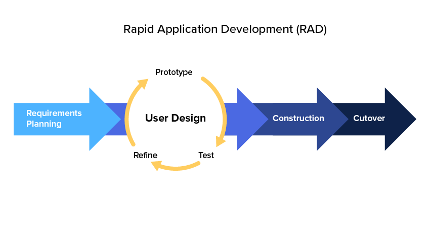

# Einleitung

Das Designen und Festlegen von festen Arbeitsabläufen ist unerlässlich in der Zusammenarbeit mit anderen. Durch die geänderten Anforderungen durch die Digitalisierung funktionieren die alten Prozesse allerdings nur noch bedingt. Aus diesem Grund wird heutzutage immer mehr auf agile Prozesse und Methoden gesetzt. Der bekanntesten Vertreter dieser neuen Agilen Frameworks sind Scrum und Kanban. Aber welche Strategien gibt es außerhalb dieser beiden? Und welche Tools bieten sich an um diese zu nutzen? 

# Strategien

## Rapid Application Development

Rapid Application Development (RAD) ist eine agile Projektmanagment Strategie. Der Grundlegende Gedanke bei diesem Modell ist, Anforderungen möglichst schnell in einen ausführbaren Prototypen zu verwandeln. Diese Prototypen werden im Verlauf der Entwicklung immer wieder durch Feedback des Kunden angepasst.

### Historie

RAD wurde Anfang der 1970er von Brian Gallagher, Alex Balchin, Barry Boehm und Scott Schultz entwickelt. Ihr Ziel war es dabei die Softwareentwicklung zu beschleunigen und flexibler zu gestalten. Berühmt wurde die Methode allerdings erst Anfang der 1990er Jahre. Seitdem wird die Methode jedoch vielfältig eingesetzt und ist auch heutzutage noch aktuell.

### Vorgehensweise

Die Methode besteht vor allem aus vier grundlegenden Phasen.

In der Phase Requirements Planning legen Entwickler, Auftraggeber und Planer die Anforderungen fest und priorisieren diese. In dieser Phase dürfen Entwickler und Auftraggeber auch direkt miteinander kommunizieren. Aus den Anforderungen wird im Anschluss ein erster Prototyp entwickelt. Dadurch wird bereits die zweite Phase betreten. In dieser Phase kommt es zu ständigen Anpassungen durch den Kunden. Hieraus wird ein neuer Prototyp entwickelt. Anschließend wird dieser getestet und der Kunde verfeinert wieder seine Anforderungen. In dieser Phase soll der Austausch eher als ein Monolog vom Kunden erfolgen. Je nach Projekt sollte ein Zyklus zwischen einem Tag und drei Wochen dauern. Diese Phase dauert solange, bis alle Anforderungen von dem Kunden erfüllt worden sind. Abschließend wird die Anwendung in eine Produktionsumgebung verschoben. In dieser Phase finden umfassende Tests und Trainings statt.

### Vorteile

Großer Vorteil dieser Methode ist die geringe Zeit an Vorentwicklung bis zum ersten Prototypen. Hierdurch können dem Kunden schon früh erste Ergebnisse gezeigt werden und Feedback eingeholt werden. Missverständnisse können so frühzeitig erkannt und behoben werden. Da Prototypen erstellt werden, werden die verschiedenen Programmbausteine parallel entwickelt, sodass die Software im Regelfall in weniger als 120 Tagen ausgeliefert werden kann.

### Nachteile

Durch die Vorgabe möglichst schnell einen ersten Prototypen zu entwickeln wird häufig auf vorgefertigte Baukästen zurückgegriffen. Diese bieten bereits einen hohen Funktionswert für den Kunden, werden allerdings selten manuell angepasst um alle Anforderungen zu 100% zu erfüllen. Letztendlich entsteht dadurch Code, der nicht performant ist.

### Einsatzgebiet

Aufgrund des großen Nachteils, dass häufig wenig performanter Code entsteht, sollte RAD nur in kleineren Projekten zum Einsatz kommen, die nicht performance-kritisch sind. Für diese Anwendungsfälle generiert der Ablauf jedoch schnell funktionierende Ergebnisse, die auf das Feedback des Kunden anpassbar sind.

# Frameworks

In diesem Abschnitt werden vor allem agile, unternehmensweite Frameworks betrachtet, die eine Umsetzung der Prozesse erleichtern. 

## SAFe

### Prinzipien

SAFe ist aus 7 Prinzipien aufgebaut.

__Enterprise Solution Delivery__

__Lean Portfolio Managment__

__Organizational Agility__

__Continuous Learning Culture__

Innerhalb einer Gesellschaft lernen alle zusammen. Aus diesem Grund sind Kreativität und der Drang nach Entdeckungen Teil der Organisationsphilosophie. Dies geht sogar soweit, dass Verbesserungen und Innovationen in den Aufgabenbereich von jedem Einzelnen gehören.

__Lean-Agile Leadership__

__Team and Technical Agility__

__Agile Product Delivery__

# Anhang

## Quellen

__Rapid Application Development:__

- [RAD- Computerwoche](https://www.computerwoche.de/a/rapid-application-development,2352552)

- [RAD A Brief Overview](https://www.csiac.org/wp-content/uploads/2016/02/1998_03_01_RapidApplicationDevelopment.pdf)

- [RAD-IT-Talents](https://www.it-talents.de/blog/it-talents/was-ist-rapid-application-development)

  

