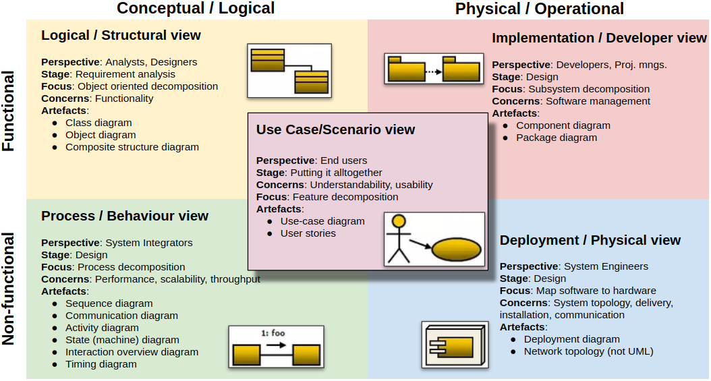
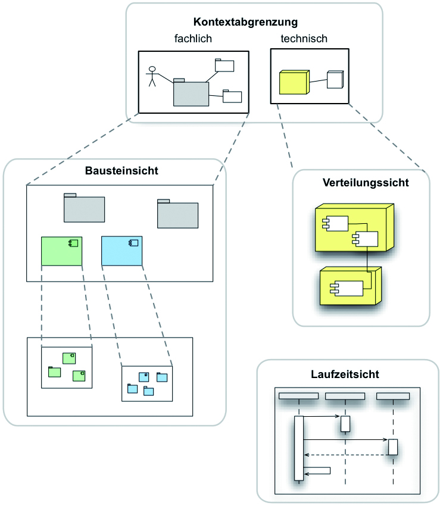
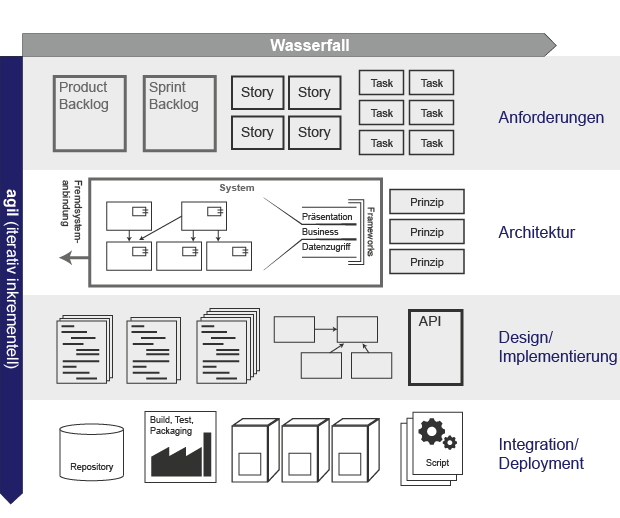
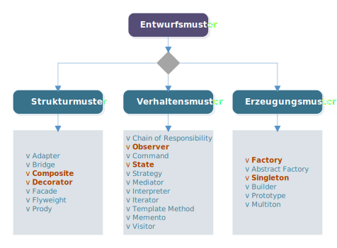
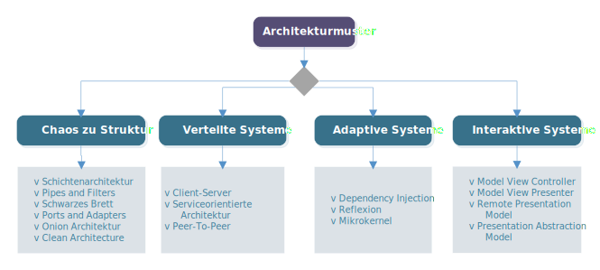
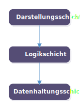
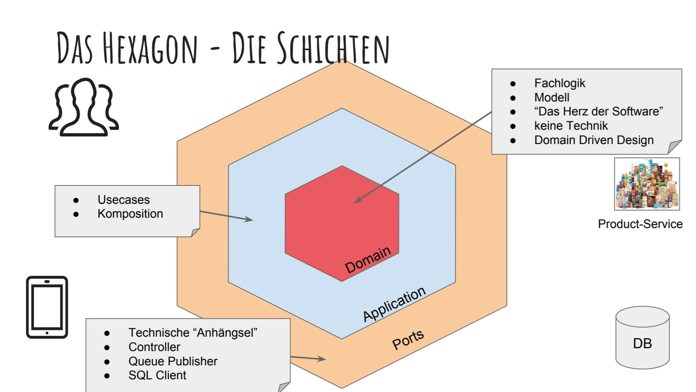
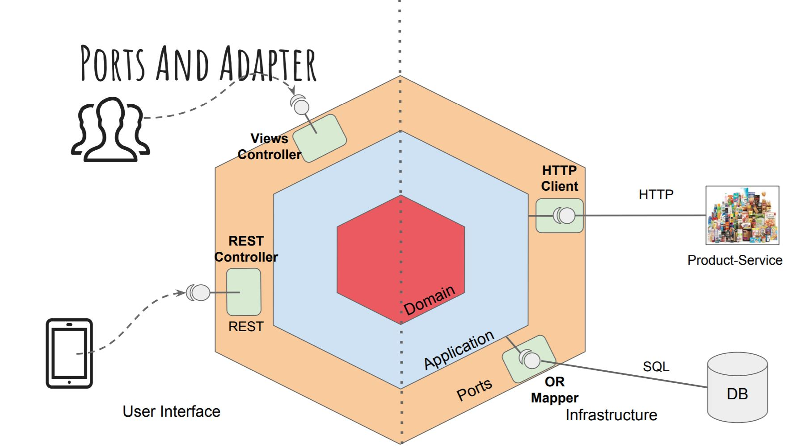
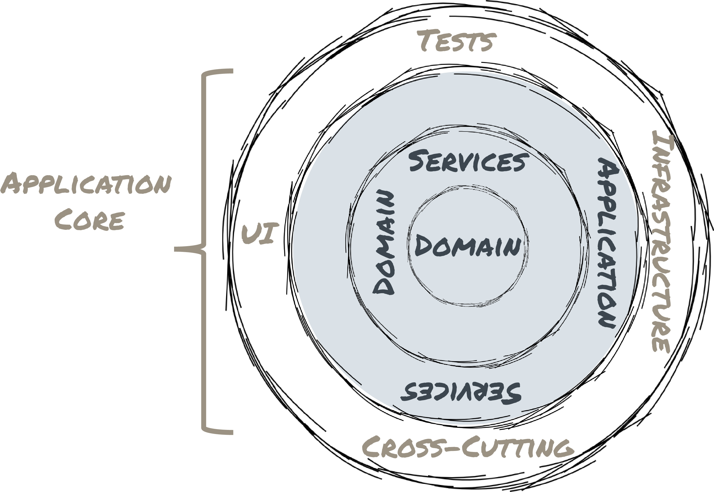
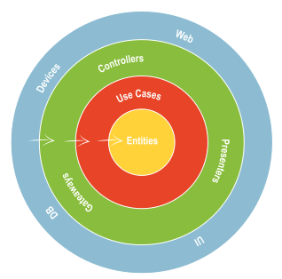

# Software Architekturen

**Autor:** Pia Schreiner

**Modul:** Spezielle Gebiete des Software Engineerings

## Motivation und Ziele

Alle Softwaresysteme besitzen eine Architektur, auch wenn niemand diese explizit modelliert hat. Da die Modellierung eines Softwaresystems einen hohen Aufwand erfordert, stellt sich die Frage, zu welchem Zweck eine Architektur modelliert werden sollte und ob dies einen Mehrwert darstellt. Durch die steigende Zahl vernetzter Produkte steigt die Komplexität und der Umfang von Softwareprojekten. Außerdem müssen auch immer mehr organisatorische Einflussfaktoren berücksichtigt werden. Auf Grund dessen wird der Entwurf einer guten und effizienten Software Architektur immer relevanter.

Bereits mittelgroße Softwaresysteme verfügen oftmals bereits über matrixartige Systemstrukturen, welche viele Module und Subsysteme enthalten. Diese strecken sich oft über viele Schichten und beinhalten fachliche sowie technische Querschnitte. Eine gute Software Architektur kann diese Komplexität beherrschbar machen und eine Entwicklungs- und Prozessverbesserung erreichen. Außerdem dient die Software Architektur als Kommunikations- und Diskussionsgrundlage für verschiedene Beteiligte.

Vorteile durch eine sorgfältige geplante Software-Architektur sind:

- Effiziente Softwareentwicklung ist möglich
- Performance kann gezielt gesteigert werden
- Zeiteinsparung kann realisiert werden
- Software-Budget kann optimieren werden
- Gezielte Minimierung von Risiken
- Kompakte Software in Umfang und Funktion designen
- Wertvolles Wissen zu Software im Unternehmen erhalten und bewahren

## Was ist eine Software Architektur?

Eine Software Architektur ist eine Beschreibung aller Komponenten eines Systems sowie aller Verbindungen, welche zwischen den Komponenten bestehen. Dabei geht es nicht um einen detaillierte Entwurf, sondern mehr um Zusammenhänge zwischen den Anforderungen und dem System.

Im Zuge der Definition einer Software Architektur werden grundlegende Entscheidungen für den weiteren Systementwurf getroffen, wie beispielsweise die Wahl der Plattform, die Auswahl von Entwicklungssystemen oder auch der einzusetzenden Datenbank. Software Architektur stellt also den Plan eines Systems dar und keinesfalls das System selbst. 

Um gute Software zu entwickeln ist es für Software Architekten wichtig, sich mit der Beschreibung des Softwaresystems zu beschäftigen. In einer guten Softwarearchitektur sollten folgende Aspekte berücksichtigt werden:

- Beschreibung aller Elemente aus denen das System besteht
- Interaktion zwischen den Elementen
- Entwurfsmuster, welche durch die Softwarekomposition leiten
- Geltende Bedingungen für die Entwurfsmuster

### Architektursichten

Um eine Software Architektur in Gänze begreifen zu können, kann man aus verschiedenen Sichten auf eine Softwarearchitektur schauen. Dies ist sinnvoll, da verschiedene Beteiligte an einem Softwareprojekt unterschiedliche Rollen wahrnehmen und auch in verschiedenen Gebieten über Expertise verfügen. Die verschiedenen Sichten sorgen dafür, dass man die Softwarearchitektur aus verschiedenen Blickwinkeln betrachtet. Dadurch erreicht man mehr Transparenz sowie eine bessere Komplexitätsbewältigung im Rahmen von Anforderungen, Struktur und Umsetzung. Außerdem findet dadurch eine Entkopplung verschiedener System-Aspekte statt. Diese können dadurch einzeln genauer betrachtet werden.

Für die Betrachtung einer Software Architektur aus verschiedenen Sichten, gibt es bereits einige Modelle. Die bekanntesten sind dabei das `4+1 Sichtenmodell` von Philippe Kruchten sowie die `vier Arten von Sichten` von Starke.

### 4+1 Sichten Modell nach Kruchten

Das 4+1 Sichten Modell von Philippe Kruchten stellt die Blickwinkel auf das System aus verschiedenen Rollen innerhalb der vier Hauptsichten dar. Zusätzlich können Use Cases und Szenarios betrachtet werden, um die Architektur besser darzustellen. Diese Zusatzbetrachtung stellt das +1 in Namen dar. Bei den insgesamt vier Schichten handelt es sich um eine logische Sicht, eine Enwicklungssicht, eine Prozesssicht sowie eine Physische Sicht.

#### Logische Sicht

Die logische Schicht beschäftigt sich mit der Funktionalität des Systems für den Endnutzer. Diese Funktionalität wird mit Hilfe von verschiedenen UML-Diagrammen dargestellt. Die logische Sicht betrachtet die Phase der Anforderungsanalyse und verwendet unter anderem die folgenden Artefakte:

- Klassendiagramm
- Verbundstrukturdiagramm

#### Entwicklungssicht

Die Entwicklungssicht beschreibt das System vom Standpunkt eines Entwicklers. Dabei beschäftigt sich diese mit dem Softwaremanagement und hat einen Fokus auf die Modularisierung in Subsysteme. Folgende Artefakte werden zur Darstellung verwendet:

- Komponentendiagramm
- Paketdiagramm

#### Prozesssicht

Die Prozesssicht beschreibt das System vom Standpunkt des Systemintegrators. Dabei beschäftigt sich diese mit den dynamischen Aspekten des Systems. Der Fokus liegt dabei auf der Beschreibung aller Prozesse sowie die Kommunikation derer hinsichtlich des Laufzeitverhaltens. Hierfür kommen alle Artefakte zum Einsatz, welche in der Lage sind Aktivitäten und Prozesse zu beschreiben, wie z.B.:

- Aktivitätsdiagramm
- Sequenzdiagramm
- Kommunikationsdiagramm

#### Physische Sicht

In der physischen Sicht wird das System vom Standpunkt eines Systemarchitekten beschrieben. Dabei geht es um die Abbildung der Software auf die Hardware sowie die Verteilungsaspekte. Dabei werden Artefakte wie eine Netzwerktopologie eingesetzt.

#### Szenario Sicht

Die Szenario Sicht stellt eine Beschreibung wichtiger Anwendungsfälle und Anwendungsszenarien dar. Diese bieten eine Darstellung von Abläufen zwischen Komponenten und Prozessen. Dies bietet die Möglichkeit Architekturelemente zu identifizieren und zu veranschaulichen. Genutzte Artefakte für die Darstellung sind:

- Use Case Diagramm
- User Stories

			*Quelle: [4]*

### Vier Arten von Sichten von Starke

Das Sichten Modell von Starke beschreibt die Blickwinkel auf die Architektur bezogen auf das System im Gegensatz zu Kruchten nicht auf den Standpunkt verschiedener Rollen. 

#### Kontextabgrenzung

Bei der Sicht auf die Kontextabgrenzungen wird die Einbettung des Systems in seine Umgebung betrachtet. Dabei wird das System als Blackbox in seinem Kontext aus einer Vogelperspektive dargestellt. Die Kontextabgrenzung bietet eine sehr abstrahierte Sicht auf die Architektur. Im Detail  beschreibt die Kontextabgrenzung die Namen und Funktion aller Nachbarsysteme, die Art der mit den Nachbarsystemen ausgetauschten Daten sowie Metainformationen der Schnittstellen oder übertragenen Daten. Weiterhin können Datenformate sowie Übertragungsmedien beleuchtet werden, vorausgesetzt sie sind zu diesem Zeitpunkt schon relevant.

#### Bausteinsicht

In der Bausteinsicht wird der interne Aufbau des Systems in Form einer statischen Struktur dargestellt. Dabei werden die Strukturen des Systems, der Subsysteme und Komponenten beleuchtet. Außerdem wird das Zusammenwirken der einzelnen Bausteine (Schnittstellen) dargestellt. Die Bausteinsicht wird ausgehend von der Kontextabgrenzung top-down entwickelt. Sie enthält Blackbox sowie Whitebox Bausteine. Blackbox Bausteine stellen dabei nur Schnittstellen und Funktionen dar, während Whitebox Bausteine als Verfeinerung die innere Struktur zeigen. Dabei werden die folgenden Artefakte verwendet:

- Komponentendiagramm
- Paketdiagramm

#### Laufzeitsicht

Die Laufzeitsicht beschreibt im Gegensatz zur Bausteinsicht die dynamische Struktur und die Bausteine des Systems, welche zur Laufzeit existieren. Darüber hinaus stellt sie dar, wie die Bausteine zusammenwirken. Die Aktivitäten werden mit folgenden Artefakten dargestellt:

- Sequenzdiagramm
- Kommunikationsdiagramm

#### Verteilungssicht (Infrastruktur)

Die Verteilungs- oder Infrastruktursicht beschreibt die technische Ablaufumgebung. Dabei werden die Hardwarekomponenten beschrieben, auf denen das System läuft. Im Detail werden hier Rechner, Prozessoren und Speicher beleuchtet auf denen die Softwarebestandteile des Systems ausgeführt werden oder eine Speicherung von Daten stattfindet. Außerdem werden Kanäle beschrieben, welche für die Datenübertragung zwischen den Knoten sorgen. Die Darstellung der Sicht findet mit Hilfe der folgende Artefakte statt:

- Deploymentdiagramm
- Netzwerktopologie

​			*Quelle: [5]*

## Bewertung von Software-Architekturen

Um zu die entwickelte Software Architektur zu validieren und zu überprüfen, ob diese als Lösungskonzept für das vorhandene Problem dienen kann, ist es sinnvoll eine Bewertung durchzuführen. Diese kann helfen, potenzielle Risiken zu erkennen sowie die Realisierung von Qualitätsanforderungen durch die Architektur zu beurteilen. Weiterhin kann eine Bewertung dazu beitragen, die Schwachstellen sowie deren Überarbeitungsaufwand zu analysieren. Im Zuge der Bewertung werden oftmals auch Möglichkeiten zur Wiederverwendung von Softwarekomponenten und anderen Artefakten erarbeitet. Dies dient der Sicherstellung, dass die korrekte Software Architektur verwendet wird, da diese spätere Funktionalität sowie Kosten maßgeblich beeinflussen kann. Je später Fehler erkannt werden, desto teurer können diese werden.

Die Bewertung einer Software Architektur erfolgt grundsätzlich anhand der Erreichung bestimmter Qualitätsmerkmale. Die `ISO 25010` definiert für diesen Zweck eine Reihe von Qualitätskriterien für Software und IT-Systeme. Die in dem untenstehenden Bild sichtbaren 8 Kernkriterien werden von der Norm definiert. Alle Kernkriterien besitzen Unterkriterien, welche zu erreichen sind um das Kernziel umfassend zu erfüllen.

​       *Quelle: [6]*

### Qualitätsbaum

Der Qualitätsbaum ist der Ausgangspunkt für die Bewertung einer Software Architektur. Er stellt eine Beschreibung der zu erreichenden Qualitätsziele dar. Dabei wird eine hierarchische Struktur aufgestellt, welche die Qualitätsmerkmale aus der `ISO 25010` für die eigenen Bedürfnisse anpasst und nur die für spezifische Software relevanten Qualitätsmerkmale enthält. Im Qualitätsbaum können je nach Softwareanforderungen einzelne Kernkriterien oder nur einige Unterkriterien weggelassen werden. Auf Basis des Qualitätsbaums können anschließend verschiedene Bewertungsmethoden durchgeführt werden. Das untenstehende Bild verdeutlicht ein Beispiel eines Qualitätsbaums, in welchem einige Kernkriterien nicht relevant sind.

​     *Quelle: [3]*

### Qualitative Bewertung

Die qualitative Bewertung einer Softwarearchitektur setzt auf Fokussierung, die Durchsprache von Lösungsansätzen sowie auf Erfahrung und Argumente von Workshop Beteiligten. Dabei bleibt ein Restrisiko, da eine Durchsprache niemals ein Messen von Zahlen darstellen kann. Daher liefert diese Art der Bewertung keine Zahlen, sondern quantitative Aussagen. Qualitative Bewertungsmethoden überprüfen, ob die Lösungsansätze und Entscheidungen die für eine Architektur getroffen wurden, zu den Zielen des Vorhabens sowie der Anforderungen passen.

Für die qualitative Bewertung gibt es verschiedene Methoden und Ansätze wie z.B das Ausfüllen von vorgefertigten Fragebögen und Checklisten oder auch das Durchführen Szenario basierter Verfahren. Szenario basierte Verfahren agieren häufig wie eine Art Vorgehensmodell, welches zu einer Architekturbewertung führt. Dabei werden mehr oder weniger detailliert Schritte beschrieben, wie man zu einer solchen Bewertung gelangt. Die wichtigsten Schritte, welche sich in vielen dieser Vorgehensmodelle wiederfinden, sind folgende:

- Erheben und Priorisieren von Qualitätsszenarios
- Erstellen und Beschreiben der Architektur
- Bewertung der Softwarearchitektur aus dem Blickwinkel der wichtigsten erhobenen Qualitätsszenarios
- Präsentieren der Ergebnisse und Erstellen eines Berichts

Ein Qualitätsszenario stellt dabei eine beispielhafte Verwendung des zu betrachtenden Systems dar. Dies kann ein gewünschter Anwendungsfall oder auch der Auftritt eines Fehlers sein. Dabei muss ein bestimmtes Qualitätsmerkmal aus dem Qualitätsbaum im Fokus liegen. Es gibt sehr viele verschiedene Szenario basierte Verfahren. Das bekannteste Verfahren nennt sich ATAM [**A**rchitecture **t**readeoff **a**nalysis **m**ethod]. Dieses bietet eine gute Identifikation von Risiken und Nichtrisiken hinsichtlich der geforderten Qualitätsmerkmale. 

In der nachfolgenden Tabelle sind die Vor und Nachteile der qualitativen Bewertung aufgelistet:

| Vorteile                                                 | Nachteile                                                    |
| -------------------------------------------------------- | ------------------------------------------------------------ |
| Bereits früh anwendbar                                   | Durchsprache ist kein Messen (ein "Restrisiko" bleibt)       |
| Passt auf alle Qualitätsmerkmale                         | Workshops nicht trivial in der Durchführung (Planung, Moderation ... ) |
| Bindet Stakeholder optimal ein und fördert den Austausch |                                                              |

 *Quelle: [6]*

## Quantitative Bewertung

Im Gegensatz zur qualitativen Bewertung setzt die quantitative Bewertung eher auf Zahlen und Fakten. Um eine Bewertung durchzuführen, wird der Quelltext der Software sowie die Struktur der Elemente und deren Beziehungen untereinander gemessen. Dies wird toolgestützt durchgeführt mit Hilfe von Tools für die Code Analyse.

Ansätze für die quantitative Bewertung sind z.B. die statische oder dynamische Codeanalyse. Bei der statischen Codeanalyse werden Metrik Auswertungen durchgeführt, welche Problemgebiete innerhalb der Software identifizieren und bestehende Softwareteile zu bewerten oder Aufwände zu fokussieren. Die dynamische Codeanalyse kann dafür genutzt werden, um in den Bereichen der Performanz, Skalierung sowie Zuverlässigkeit Aufschlüsse über die Tauglichkeit der Softwarelösung zu geben. Außerdem kann eine quantitative Bewertung auch mit Hilfe einer Strukturanalyse durchgeführt werden. Dabei wird der Code in seiner Gliederung und Abhängigkeiten visualisiert und kann anschließend auf Problemherde untersucht werden. Dabei wird auch eine mögliche Abweichung der bisherigen Architekturidee sichtbar. Dies kann zur Überarbeitung von Architektur oder Code führen.

In der nachfolgenden Tabelle sind die Vor und Nachteile der quantitativen Bewertung aufgelistet:

| Vorteile                                          | Nachteile                                                  |
| ------------------------------------------------- | ---------------------------------------------------------- |
| Wenig Bauchgefühl, Zahlen sind gute Argumente     | Vergleichsweise spät einsetzbar                            |
| Messungen leicht automatisierbar und wiederholbar | Messungen können nicht alle Qualitätsmerkmale gut erfassen |
|                                                   | Gefahr der Missdeutung und Fehlleitung                     |

 *Quelle: [6]*

## Entwurf einer Software

Der Softwareentwicklungsprozess gliedert sich in vier Phasen auf. Zu Beginn wird eine Anforderungsanalyse durchgeführt, welche alle Anforderungen an die Software zusammen mit allen Rahmenbedingungen sammelt und in ein Lasten und Pflichtenheft formuliert. Anschließend folgt die Entwurfphase. Diese gliedert sich auf in Grob- und Feinentwurf. Im ersten Schritt, dem Grobentwurf oder auch Architekturentwurf wird die eine erste Klärung der Funktionalität und Systemarchitektur durchgeführt und erste Modelle werden entworfen. Anschließend werden die Ergebnisse beim Feinentwurf oder auch Detailentwurf detaillierter Ausgearbeitet und Schnittstellen sowie Datenstrukturen werden definiert. Wenn er Entwurf abgeschlossen ist beginnt die Implementierung der Software. Abschließend wird die Software getestet und integriert. Je nach Vorgehensweise werden die Phasen nacheinander abgearbeitet (klassisch) oder es besteht die Möglichkeit zu einer früheren Phase zurückzuspringen (agil / iterativ).

​                                      *Quelle: [14]*

Die Software Architektur entsteht in der Entwurfphase. Wie zuvor erläutert, muss dafür die Analysephase abgeschlossen sein und die Anforderungs- und Systemspezifikation (Pflichten und Lastenheft) müssen vorliegen. Bei der Entwicklung eines Softwareentwurfs wird iterativ vorgegangen und der Entwurf nimmt mit jeder Iterationsphase an Granularität zu. Ziel des Softwareentwurfs ist es, die Vorgaben der Anforderungsdefinition möglichst umfassend zu berücksichtigen.

### Grobentwurf / Architekturentwurf

Der Grobentwurf, oder auch Architekturentwurf genannt, beschreibt die Gesamtstruktur und Organisation des Systems auf einer hohen Abstraktionsebene. Dabei müssen wesentliche Komponenten und deren Interaktion untereinander identifiziert werden. Außerdem werden Randbedingungen festgelegt, wie die Vorgabe von Hardware, Betriebssystem, Middleware sowie Vorgaben zu Programmiersprachen. Die Hauptaufgaben für die Erstellung des Grobentwurfs sind:

- Aufgabe analysieren
- Architektur modellieren und dokumentieren
- Lösungskonzept prüfen

Bei der Analyse der Aufgabe ist es das Ziel die Anforderungen zu verstehen und vorhandene bzw. beschaffbare Technologien zu analysieren. In der Modellierungs- und Dokumentationsphase wird die grundlegende Systemarchitektur festgelegt. Im Rahmen dessen ist es hilfreich die Modularisierung zu definieren. Dabei wird dir zu erstellende Software in Komponenten gegliedert und Module werden voneinander abgegrenzt. Außerdem werden Verantwortlichkeiten definiert. Eine weitere Aufgabe der Phase ist es nebenläufige Lösungen in Prozesse zu gliedern. Dafür muss eine Analyse der zeitlich verzahnten Ausführung von Aktivitäten durchgeführt werden. Anschließend können die Prozesse festgelegt und zu Modulen zugeordnet werden. Weiterhin muss in dieser Phase die Zusammenarbeit festgelegt werden. Dabei werden Kommunikationsbedürfnisse analysiert und Kommunikationsverfahren festgelegt. Für jedes Bedürfnis werden konkrete Verfahren gewählt und Schnittstellen definiert. Abschließend wird das gesamte Lösungskonzept geprüft und validiert.

Der Grobentwurf beinhaltet die folgenden Artefakte:

- Architekturentwurf
- Subsystem Spezifikation
- Schnittstellenspezifikation

### Feinentwurf / Detailentwurf

Der Feinentwurf beschreibt die Detailstruktur des Systems. Dabei werden die einzelnen Komponenten detailliert beschrieben, so dass diese implementiert werden können. Außerdem werden Datenstrukturen und Algorithmen beschrieben. Zu den Hauptaufgaben für die Erstellung des Feinentwurfs gehört die Abbildung der Module und Prozesse auf die verfügbaren Konstrukte der verwendeten Programmiersprachen. Außerdem wird ein Coderahmen sowie Implementierungsskizzen für alle Module und Prozesse erstellt. 

Der Feinentwurf beinhaltet die folgenden Artefakte:

- Komponentenentwurf
- Datenstrukturentwurf
- Algorithmenentwurf

## Herangehensweise an Architektur und Design

Im Rahmen der Software Entwicklung werden für alle Schritte verschiedene Arten von Mustern eingesetzt. Es gibt Muster für die Analyse, für den Entwurf, für die Implementierung sowie für das Testen von Software. Für den Softwareentwurf unterscheidet man je nach Granularität zwischen Entwurfsmustern und Architekturmustern. Architekturmuster sind grobgranular und bieten eine Sicht auf die gesamte Anwendung. Entwurfsmuster dagegen sind eher feingranular und fokussieren sich auf die Lösung eines lokalen Problems.

### Entwurfsmuster

Entwurfsmuster sind innerhalb der Softwarearchitektur und Entwicklung allgemeine, wieder verwendbare Lösungsmuster für wiederkehrende Entwurfsprobleme. Sie bieten eine bereits bewährte Vorlage zur Problemlösung für bestimmte Kontexte. Weiterhin legen Entwurfsmuster eine Struktur von Subsystemen fest. Entwurfsmuster können die Kommunikation im Team verbessern, da sie eine Diskussionsgrundlage bieten um über Softwarearchitektur zu sprechen. Es gibt drei verschiedene Gruppen von Entwurfsmuster basierend auf dem Kontext in dem sie eingesetzt werden können. Folgende Arten von Erzeugungsmustern gibt es:

- Erzeugungsmuster
- Strukturmuster
- Verhaltensmuster

Erzeugungsmuster befassen sich mit der Erzeugung von Objekten. Sie entkoppeln die Objektkonstruktion von der Objektrepräsentation. Strukturmuster beschreiben die Komposition von Klassen Objekten. Verhaltensmuster stellen die Kommunikation von Klassen oder Objekte dar und beschreiben die Verteilung von Verantwortlichkeiten.

### Architekturmuster

Architekturmuster beschreiben Systemstrukturen, welche die Gesamtarchitektur eines Systems festlegen. Dabei spezifizieren sie wie die Subsysteme der Software miteinander zusammenarbeiten. Architekturmuster können mittels vier Überkategorien geordnet und zusammengefasst werden.

*Nachgebaut nach [22]*

#### Chaos zu Struktur

Architekturmuster dieser Kategorie bieten eine Organisation der Vielzahl der Komponenten und Objekte eines Softwaresystems. Die Aufteilung der Funktionalität des Gesamtsystems wird dabei in kooperierende Subsysteme aufgeteilt. Die bekannteste Architektur in dieser Kategorie ist die Schichtenarchitektur. Folgende Architekturmuster finden sich in dieser Kategorie:

- Schichtenarchitektur
- Pipes and Filters
- Schwarzes Brett
- Ports and Adapters
- Onion Architektur
- Clean Architektur

#### Muster für verteilte Systeme

Architekturmuster in dieser Kategorie unterstützen die Verwendung verteilter Ressourcen und Dienste in Netzwerken. Um ein Softwaresystem verteilen zu können, muss es in Subsysteme strukturiert sein. Dabei ist es wichtig, dass die Subsysteme in sich stark verbunden sind. Die traditionelle Architektur in dieser Kategorie ist die Client-Server Architektur.  Folgende Architekturmuster finden sich in dieser Kategorie:

-  Client-Server
-  Serviceorientierte Architektur (SOA)
-  Peer-to-Peer

#### Adaptive / Anpassbare Systeme

Architekturmuster in dieser Kategorie sind besonders anpassungsfähig und erweiterungsfähig zur Laufzeit. Folgende Architekturmuster finden sich in dieser Kategorie:

- Dependency Injection
- Reflexion 
- Mikrokernel

#### Interaktive Systeme

Muster in dieser Kategorie bieten eine Strukturierungsmöglichkeit für die Interaktionen von Mensch und Computer. Folgende Architekturmuster finden sich in dieser Kategorie:

- Model View Controller
- Model View Presenter
- Remote Presentation Model
- Presentation Abstraction Model

### Architekturmuster für moderne Anwendungen

Im Folgenden möchte ich einige Architekturmuster im Detail vorstellen:

#### Schichtenarchitektur

Die Schichtenarchitektur ist ein häufig eingesetztes Architekturmuster. Die Grundidee dabei ist, dass die Subsysteme verschiedenen horizontalen Schichten zugeordnet werden. Komponenten innerhalb eines Subsystems können dabei beliebig auf einander zugreifen. Zwischen den horizontalen Schichten gelten Zugriffsregeln und die interne Struktur einer Schicht ist nach außen nicht sichtbar. Die Schichtenarchitektur kommt häufig bei der Strukturierung großer Systeme zum Einsatz und besteht meistens aus drei Schichten. Die oberste oder auch Darstellungsschicht genannt, ist dafür zuständig Anwendungsdaten darzustellen und mit dem Benutzer zu interagieren. Die mittlere Schicht, die Logikschicht, stellt das Herzstück der Anwendung dar. Die unterste Schicht ist die Datenhaltungsschicht. Diese ist zuständig für die Speicherung aller Anwendungsdaten.

Jede Schicht darf dabei nur mit der Schicht darunter kommunizieren. In der Praxis werden jedoch häufig Geschäftslogik und Benutzeroberflächen-Code vermischt. Dadurch entstehen einige Probleme. Die Anwendung kann beispielsweise nicht ohne größeren Aufwand automatisiert getestet werden. Außerdem ist es knifflig die Anwendung ganz oder in Teilen wiederzuverwenden oder zu ersetzen. Auch die Entwicklung der einzelnen Anwendungskomponenten kann sich so nur schwer unabhängig voneinander vorantreiben lassen.

Durch die Abhängigkeit von der Datenhaltungsschicht, ist diese Architektur in Zeiten von agiler Entwicklung und vor allem in Kombination mit Domain Driven Design wenig praktikabel. Auch kann das Test Setup mit dieser Architektur sehr aufwändig werden und die Testausführung dadurch sehr langsam sein. Dies liegt daran, dass wenn die Business Logik Schicht direkt die Datenzugriffsschicht und die diese direkt die Datenbank aufruft nicht einmal die Business-Logik unabhängig von der Datenbank getestet werden kann Außerdem ist die Schichtenarchitektur wenig flexibel. Durch die Abhängigkeiten muss die Logikschicht meist mit angepasst werden, wenn sich in der Datenhaltungsschicht etwas ändert, wie beispielsweise der Datenzugriff .

#### Von Schichten zu Ringen

In der modernen Softwareentwicklung gibt es bereits eine Reihe von Weiterentwicklungsansätzen für die Schichtenarchitektur. Folgende Ansätze werde ich in dieser Ausarbeitung vorstellen:

- Ports and Adapters (hexagonale Architektur)
- Onion Architektur
- Clean Architektur

Der neue Ansatz bei der Weiterentwicklung der Schichtenarchitektur ist die Entkopplung durch das Prinzip der Dependency Inversion. Dabei geht die Abhängigkeit immer von dem Kern der Anwendungslogik weg, welches einige Vorteile mit sich bringt. Alle oben genannten Ansätze haben dabei die gleichen Ziele. Zunächst soll die Anwendung unabhängig von Frameworks, Datenbanken und sonstiger Infrastruktur entwickelt werden können. Die Architektur soll nicht von der Existenz einer bestimmten Bibliothek abhängen. Außerdem soll die Anwendung gut testbar sein. Dabei ist das Ziel dass die Geschäftslogik nicht an außenstehende Infrastruktur gebunden ist und sich dadurch ohne diese testen lässt. Weiterhin soll die Anwendung auch unabhängig von Benutzeroberfläche und Datenbank sein. Diese Komponenten sollen also austauschbar sein, ohne dass der Rest vom System angepasst werden muss.

#### Ports and Adapters (hexagonale Architektur)

Die hexagonale Architektur besitzt einen mittleren Kern aus Fachlogik. Darum gibt es eine Anwendungsschicht, welche alle Use Cases sowie Kompositionen enthält. Die dritte Schicht, die sogenannte "Ports Schicht", enthält Controller, technische Anhängsel, etc.

​        *Quelle: [18]*

Auf der Ports Schicht existieren Adapter. Diese stellen klassische Adapter nach dem Adapter Pattern dar und geben der Architektur auch den Namen `Ports and Adapter`. Adapter stellen die Verbindung von der Anwendung zu außenliegenden Systemen, wie beispielsweise der Datenbank. Jeder Adapter sollte dabei nur einem einem Port abhängen, damit die Vorteile des Systems erhalten bleiben. Man unterscheidet dabei primäre und sekundäre Adapter. Primäre Adapter sind treibende Adapter. Sie werden aktiv von außen angesprochen und werden im User Interface eingesetzt. Ein Beispiel für einen primären Adapter ist zum Beispiel ein REST-Controller, welcher in der Applikation verschiedene Funktionen aufruft. Sekundäre Adapter sind angetriebene Adapter. Sie werden von der Applikation angesprochen um Subsysteme zu triggern. Sekundäre Adapter werden in der Infrastruktur eingesetzt. Ein Beispiel für einen sekundären Adapter ist beispielsweise ein E-Mail Adapter, welcher einen außenstehenden Mail Server aufruft, oder auch ein ORM Adapter, welcher die außenstehende Datenbank anfragt.

​        *Quelle: [18]*

Die hexagonale Architektur kann eingesetzt werden, sofern eine Fachlogik in Form einer Domain vorhanden ist. Sinnvoll ist sie, wenn viele Umsysteme oder APIs existieren oder es verschiedene fachliche Sichten gibt. 

Vorteil der hexagonalen Architektur ist die klare Einteilung der Komponenten. Dadurch existieren Objekte, welche beispielsweise für die Darstellung gebraucht werden, lediglich im entsprechenden GUI Adapter. Weiterhin sorgt die Architektur dafür, dass sich einzelne Schichten sehr gut testen lassen. Durch den Aufbau nach dem Bausteinprinzip ist außerdem die Anpassung / Austauschbarkeit der Software gegeben. So wäre es denkbar, den Postgres-Datenbankadapter durch einen Android-SQLite-Adapter und den HTML-UI-Adapter durch einen nativen Android-UI-Adapter zu ersetzen. Mit dem Austausch von lediglich zwei Komponenten wandelt man die Anwendung zu einer nativen Android-Anwendung, ohne dass die eigentliche Geschäftslogik geändert werden muss. Auf Grund der Anpassbarkeit durch das konsequente Entwickeln gegen Ports  lässt sich die Software außerdem gut erweitern. Ohne großen Aufwand ist es so auch möglich eine Anwendung von einem lokalem zu einem verteilten System zu migrieren. Ein weiterer Vorteil ist, dass innerhalb der einzelnen Komponenten keine Festlegung auf eine Architekturform notwendig ist. Innerhalb der Hexagonalen Architektur werden keinerlei Annahmen über den Entwurf der einzelnen Adapter getroffen. Um beispielsweise eine webbasierte Oberfläche als Adapter für die Benutzerinteraktion zu entwickeln, kann man sich problemlos eines Musters für die Oberflächenentwicklung, wie etwa MVC (Model View Controller), bedienen.

Nachteil der hexagonalen Architektur ist schlichtweg die hohe Komplexität. Dadurch existiert für neue Mitarbeiter auch eine schwierigere Orientierung sowie eine höhere Einarbeitungszeit, da einzelne Komponenten möglicherweise über mehrere Projekte und Subprojekte verteilt sind. Weiterhin ist eine Orchestrierung notwendig um die einzelnen Teile der Anwendungen wieder zusammenzufügen. Daher lohnt sich dieser Architekturstil nur für größere Projekte aufgrund des hohen Aufwandes.

Die nachfolgende Tabelle stellt die Vor und Nachteile der hexagonalen Architektur nochmal kurz gegenüber:

| Vorteile                                                     | Nachteile                                                    |
| ------------------------------------------------------------ | ------------------------------------------------------------ |
| Klare Einteilung der Komponenten                             | höhere Komplexität                                           |
| Einzelne Schichten lassen sich besser testen                 | schwierigere Orientierung / Einarbeitungszeit                |
| Anpassung/Austauschbarkeit der Adapter                       | Orchestrierung notwendig um die einzelnen Teile der Anwendung zusammenzufügen |
| Einfache Erweiterbarkeit und Skalierbarkeit                  | Lohnt sich nur für größere Projekte auf Grund des Aufwandes  |
| Keine Festlegung auf eine Architekturform innerhalb der einzelnen Komponenten |                                                              |

#### Onion Architektur

Wie bereits schon bei der hexagonalen Architektur gesehen, steht bei der Onion Architektur ebenfalls die Fachlichkeit im Zentrum. Sie besteht aus einer je nach Definition unterschiedlichen Zahl an Ringen, welche jeweils bestimmte Aspekte der Applikationsarchitektur beinhalten. Dabei dürfen auf Grund des Dependency Inversion Prinzips Abhängigkeiten nur von äußeren zu inneren Ringen führen. Der Sinn dieser Architektur ist, dass Infrastruktur und Datenzugriffsbelange in das Äußerste der Applikation geschoben werden und nicht im Zentrum verbleiben. Der Architekturstil basiert auf den Regeln des Domain-Driven Design und ist sinnvoll sobald eine Applikation eine gewisse Größe und Komplexität aufweist. Die Zahl der Ringe im Applikationskern kann dabei stark variieren, der innerste Ring stellt jedoch immer das Domänenmodell dar. Der erste Ring ist enthält typischerweise immer die Schnittstellen in Form der Domain Services. Äußere Ringe sind dann für Dinge reserviert die sich häufiger ändern, wie z.B. Benutzerschnittstelle, Infrastruktur sowie Tests. Dieser Ansatz sichert ab, dass der Applikationskern nicht geändert werden muss, wenn Benutzerschnittstelle, Datenzugriff oder Webservices sich ändern.

​            *Quelle: [19]*

Vorteil der Onion Architektur ist die Flexibilität. Die klare Trennung der äußeren Schichten von der Anwendungslogik führt dazu, dass ein Austauschen einzelner Komponenten problemlos möglich ist. Außerdem existiert eine klare Trennung zwischen fachlichem Code und Infrastruktur. Da die Geschäftslogik im Vergleich zu sich schnell verändernden Infrastrukturtechnologien und Frameworks sehr langlebig ist, stellt dies das Fundament für eine nachhaltige Software dar. Da der Anwendungskern keine Abhängigkeiten hat, kann die Software zudem schnell getestet werden.

Auf Grund der Verteilung der Komponenten ist dieser Architekturstil nicht so einfach zu verstehen und es ist eine längere Lernkurve notwendig. Außerdem ist die korrekte Aufteilung der Verantwortlichkeiten zwischen den Ebenen nicht einfach und wird oft falsch gemacht. Durch die vielen Schnittstellen, welche die Onion Architektur enthält, ist es außerdem möglich, dass die Navigation im Projekt deutlich erschwert ist.

Die nachfolgende Tabelle stellt die Vor und Nachteile der Onion Architektur nochmal kurz gegenüber:

| Vorteile                                                  | Nachteile                                                    |
| --------------------------------------------------------- | ------------------------------------------------------------ |
| Flexibilität                                              | Nicht einfach zu verstehen                                   |
| Klare Trennung zwischen fachlichem Code und Infrastruktur | Aufteilung der Verantwortlichkeiten zwischen den Ebenen nicht einfach |
| Kann schnell getestet werden                              | Viele Schnittstellen                                         |

#### Clean Architektur

Die Clean Architektur verfügt wie die Onion Architektur ebenfalls über eine Darstellung mit konzentrischen Ringen. Die ersten zwei Ringe stellen dabei die Geschäftslogik dar. Den Kern stellen die Entitäten. Entitäten kapseln unternehmensweite Geschäftsregeln. Eine Entität kann ein Objekt mit Methoden oder auch eine Reihe von Datenstrukturen und Funktionen sein. Entitäten können von vielen Anwendungen im Unternehmen verwendet werden. Der zweite Ring stellt die Anwendungsfall Ebene dar. Dort befinden sich anwendungsspezifische Geschäftsregeln. Die ebene stellt die Kapselung und Implementierung aller Anwendungsfälle des Systems dar. Anwendungsfälle koordinieren dabei den Datenfluss zu und von den Entitäten. Der dritte Ring stellt die Schnittstellenebene dar. Dort befinden sich Adapter zwischen Anwendungsfällen und der Außenwelt. Dabei werden Daten in ein Format, das für externe Ebenen wie das Web oder Datenbanken geeignet ist formatiert. Außerdem werden externe Daten in ein Format umgewandelt, das für interne Ebenen geeignet ist. Der vierte Ring stellt Frameworks und Treiber dar. Dort befindet sich die Benutzeroberfläche sowie Frameworks, Tools und Datenbanken. Die Abhängigkeiten zwischen den Ringen darf nur von innen nach außen existieren. Diese vier Ringe stellen das grundlegende Schema dar. Es gibt allerdings keine Regel dass immer nur diese vier Ringe existieren müssen. Es ist möglich, dass es Fälle gibt, wo mehr als die vorgegebenen vier Ringe benötigt werden.

​				*Quelle: [21]*

Der Einsatz dieses Architekturstils lohnt sich, wenn die umzusetzende Fachlichkeit eher komplex ist und über einen längeren Zeitraum gewartet werden muss, weil sie wichtige Geschäftsprozesse unterstützt. Für einfache Anwendungen lohnt sich der Aufwand nicht.

Ein Vorteil der Clean Architektur ist, dass Anwendungsfälle an einem Ort zusammengefasst sind. Das sorgt dafür, dass sie sehr gut sichtbar und leicht zu verstehen sind. Weiterhin sind die Geschäftsregeln nicht überall verteilt. Dadurch ist das Debuggen leicht und der Code kann einfach geändert werden. Durch die Abhängigkeitsregel ist das Testen außerdem sehr viel einfacher und die Anwendung ist flexibel und portabel. Da die Anwendungsfälle vollständig von jeder Benutzeroberfläche oder Infrastruktur entkoppelt sind, ist das Austauschen von beispielsweise Datenbank sehr einfach. Auch eine Portierung auf eine neue Plattform kann ohne viel Aufwand umgesetzt werden.

Wie bereits bei zuvor erläuterten Ansätzen, ist auch die Clean Architektur mit einem hohen Aufwand sowie einer langen Lernkurve verbunden. Außerdem wird das Projekt zum Teil sehr aufgebläht, da oft viele separate Klassen für allen Präsentatoren, Entitäten etc. genutzt werden.

Die nachfolgende Tabelle stellt die Vor und Nachteile der Onion Architektur nochmal kurz gegenüber:

| Vorteile                                          | Nachteile               |
| ------------------------------------------------- | ----------------------- |
| Anwendungsfälle sind an einem Ort zusammengefasst | sehr viel Aufwand       |
| Geschäftsregeln sind nicht überall verteilt       | hohe Lernkurve          |
| Testen sehr einfach                               | Aufblähen des Projektes |
| Flexibel und portabel                             |                         |

## Fazit / Ausblick

Zusammenfassend lässt sich sagen, dass alle drei Erweiterungen der Schichtenarchitektur sehr ähnlich sind und daher auch Vor und Nachteile sich teilweise überschneiden. Alle haben gemeinsam, dass sich die Anwendung nur ab einer gewissen Größe lohnt. Außerdem weisen alle eine hohe Komplexität auf, welche einen hohen Aufwand sowie eine lange Lernkurve mit sich bringt. Da es aber in der modernen agilen Softwareentwicklung sehr häufig vorkommt, dass sich Frameworks und andere Infrastruktur nur kurzlebig sind und oftmals angepasst oder ausgetauscht werden, ist es sinnvoll Anwendungen zu entwickeln, welche sich auf diese Gegebenheiten flexibel anpassen können. Da alle drei Anwendungen diese Unabhängigkeit zur Infrastruktur bieten und dadurch eine nachhaltig wartbare Software bieten, werden diese Ansätze immer beliebter.

## Quellen

[1] [Software Architekturen: Grundlagen - Theorie - Praxis](https://www.springer.com/de/book/9783827419330)

[2] [Software Architektur kompakt (Gernot Starke)](https://www.springer.com/de/book/9783827428349#otherversion=9783827428356)

[3] [Effektive Softwarearchitekturen (Gernot Starke)](https://www.hanser-fachbuch.de/buch/Effektive+Softwarearchitekturen/9783446452077)

[4] [Documenting Software Architecture](https://herbertograca.com/2019/08/12/documenting-software-architecture/)

[5] [Unterschiedliche Sichten auf Architekturen](https://entwickler.de/online/unterschiedliche-sichten-auf-architekturen-116073.html)

[6] [Was ist eigentlich Architekturbewertung](https://www.informatik-aktuell.de/entwicklung/methoden/was-ist-eigentlich-architekturbewertung.html)

[7] [Architektur Reviews](https://www.embarc.de/themen/architekturreviews/)

[8] [Auswahl von Bewertungsmethoden für Softwarearchitekturen](https://www.softec.wiwi.uni-due.de/uploads/tx_itochairt3/publications/ICBReport14_04.pdf)

[9] [Vergleich von Qualitätsbewertungsmethoden für IT-Architekturen](http://bauhaus.cs.uni-magdeburg.de:8080/miscms.nsf/FEA8C8150500AA14C1257449004F79A9/739B0C874E72E513C1257651002C9086/$FILE/Studienarbeit%20Frank%20Eichler.pdf)

[10] [Qualitätsanforderungen konkret formulieren](https://jaxenter.de/stakeholder-qualitaetsanforderungen-konkret-formulieren-86582)

[11] [Spezifikation und Entwurf von Software (Martin Glinz)](https://files.ifi.uzh.ch/rerg/amadeus/teaching/courses/spezifikation_und_entwurf_ws0506/kapitel_17.pdf)

[12] [Softwarearchitektur & Entwurf (Wolfgang Schramm)](http://services.informatik.hs-mannheim.de/~schramm/see/files/Kapitel04.pdf)

[13] [Lehrbuch der Softwaretechnik: Entwurf, Implementierung, Installation und Betrieb (Helmut Balzert)](https://www.springer.com/de/book/9783827417060)

[14] [Vorgehensweise zur Erstellung einer  IT-Architektur](https://www.axxessio.com/de/blog-de/axx42-erstellung-it-architektur)

[15] [Design Pattern](https://www.philipphauer.de/study/se/design-pattern.php)

[16] [Architektur und Entwurfsmuster](https://www.w3l.de/de/fileadmin/user_upload/Architektur_und_Entwurfsmuster_2012.pdf)

[17] [DDD Architekturen im Vergleich](https://www.maibornwolff.de/blog/ddd-architekturen-im-vergleich)

[18] [Hexagonale Architektur](https://www.doag.org/formes/pubfiles/11046614/2019-NN-Christian_Iwanzik-Hexagonale_Architektur_in_Microservices-Praesentation.pdf)

[19] [Zwiebelarchitektur und Ihre Vorteile](https://jaxenter.de/die-zwiebelarchitektur-und-ihre-vorzuege-19474)

[20] [Von Schichten zu Ringen - Hexagonale Architekturen erklärt](https://www.maibornwolff.de/blog/von-schichten-zu-ringen-hexagonale-architekturen-erklaert)

[21] [Clean Architecture](https://www.4soft.de/blog/2019/clean-architecture/)

[22] [Architekturentwicklung](https://www.enzyklopaedie-der-wirtschaftsinformatik.de/wi-enzyklopaedie/lexikon/is-management/Systementwicklung/Softwarearchitektur/Architekturentwicklung/architekturmuster)