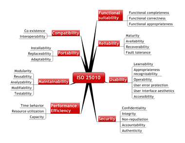
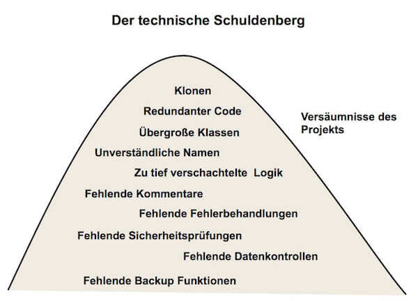
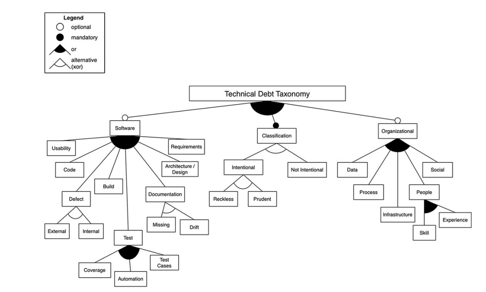
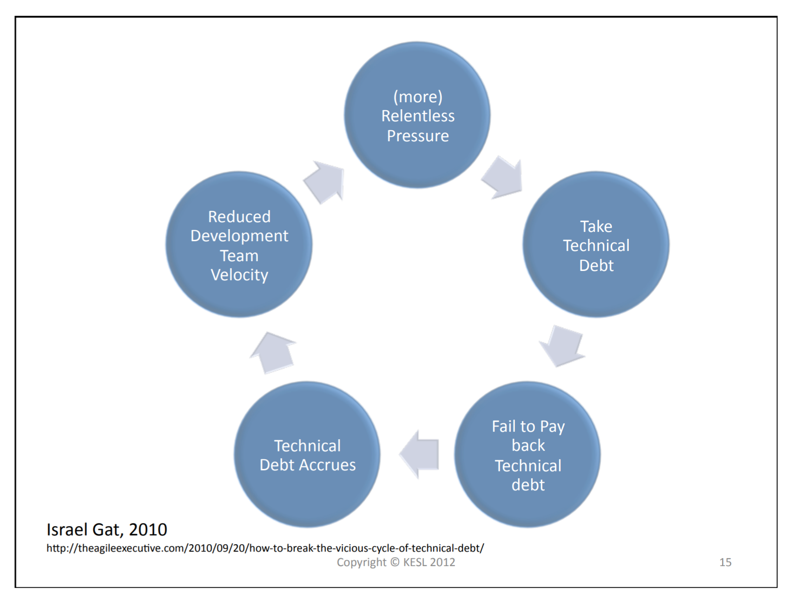
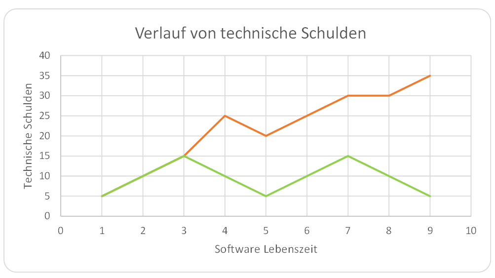
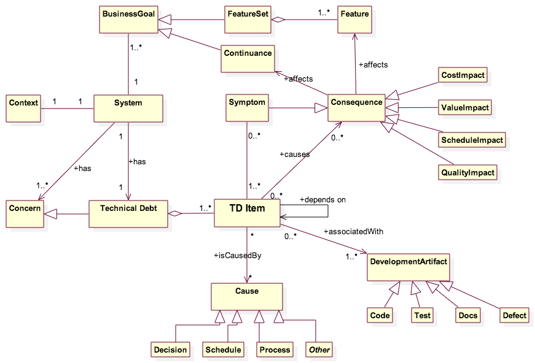
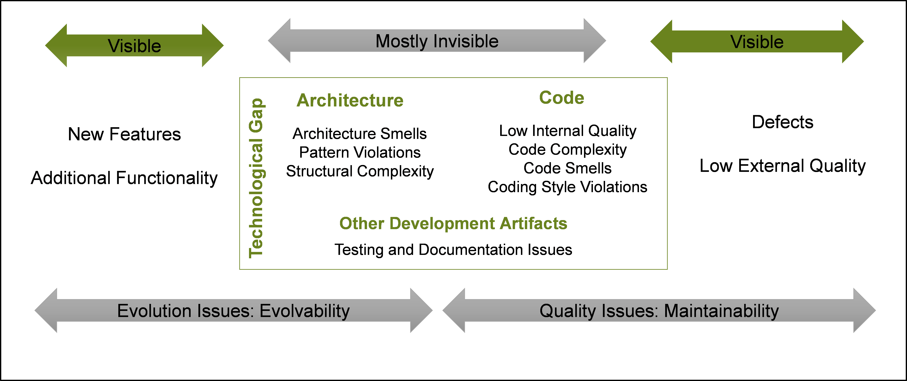

# Softwarequalität

André Matutat

**WORK IN PROGRESS**

ToDos

- Struktur anpassen
- Formulierung schleifen
- CMoTD
- Schulden Managen (stichpunkte ausformulieren)
- Schulden ökonomisch bewerten (stichpunkte ausformulieren, beispiele optimieren)
- SonarQube Anwenden für Beispiele (evtl nur im Vortrag)
- Ergebnisse aufbereiten: An empirical assessment of technical debt practices in industry
- Tldr anpassen

## Motivation

Die Konzeptionierung und Entwicklung von Software ist ein komplexes Unterfangen bei denen eine Vielzahl an unterschiedlichen Faktoren und Stakeholder Einfluss nehmen. Oft wird Software über Jahre hinweg eingesetzt und erweitert. Um sowohl die Kosten der Wartung und Entwicklung niedrig zu halten als auch die Performance und Stabilität der Software zu gewährleisten, ist es besonders wichtig auf eine hohe Softwarequalität zu achten. 

## Was ist Softwarequalität

Der Begriff Softwarequalität wird meist wie folgt definiert:

>Software-Qualität ist die Gesamtheit der Merkmale und Merkmalswerte eines Softwareprodukts, die sich auf dessen Eignung beziehen, festgelegte oder vorausgesetzte Erfordernisse zu erfüllen. 
glossar.hs-augsburg.de

### ISO 25010 

Die ISO 25010 definiert acht verschiedene Faktoren, die für das Erreichen qualitativer Software nötig sind.



**Funktionalität**: Beschreibt den Grad der Funktionalen -Vollständigkeit, Korrektheit und Angemessenheit, also ob die Software alle geforderten Aufgaben korrekt lösen kann.

**Performance/Effizienz**: Beschreibt die Leistung im Verhältnis zu den eingesetzten Ressourcen. Dabei spielen vor allem Zeitverhalten, Ressourcennutzung (z. B. Speicher oder Rechenleistung) und die Kapazität (Höchstgrenzen der Software), unter Betrachtung der Anforderungen, eine Rolle.

**Kompatibilität**: Beschreibt den Grad in welchem Software innerhalb einer Umgebung mit anderer Software arbeiten bzw. koexistieren kann, ohne an Effizienz zu verlieren.

**Bedienbarkeit/Benutzerfreundlichkeit**: Beschreibt wie zufriedenstellend die Benutzerschnittstelle ist. Dabei ist neben einen optisch Ansprechenden und Verständliches Designs, auf einfache Erlernbarkeit der Software sowie auf Absicherung vor Benutzerfehler zu achten. Je nach Anforderungen müssen auch unterschiedliche Faktoren betrachtet werden, welche ein Barrierefreies benutzten möglich machen.

**Zuverlässigkeit**: Beschreibt den Grad in dem Software bestimmte Funktionen unter bestimmten Umständen ausführt. Dabei ist es wichtig, dass die Software ihre Aufgabe unter normalen Umständen fehlerfrei und verlässlich ausführt. Auch die Verfügbarkeit der Software und die Toleranz gegen Hardware/Software Fehlern spielt eine Rolle.

**Sicherheit**: Beschreibt wie Sicher ein System im technischen Bezug ist. Dabei ist es wichtig darauf zu achten, dass Daten nur von berechtigten Personen eingesehen werden dürfen (Vertraulichkeit, Integrität),  Änderungen nachvollzogen und bewiesen werden können (Unleugbarkeit) und alle Aktivitäten sicher auf die dafür verantwortliche Person zurückverfolgt werden können (Verantwortlichkeit, Authentizität).

**Wartbarkeit**: Beschreibt wie gut ein Softwareprodukt modifiziert werden kann, um es zu verbessern, zu korrigieren oder an neue Anforderungen anzupassen. Dabei ist vor allem auf eine hohe Modularität, also die Verwendung von kleineren Modulen, zu achten. Zusätzlich ist es gut, wenn Teile der Software für andere Bereiche oder andere Projekte wiederverwendet werden können, daher flexibel und nicht statisch sind. Zu einer guter Wartbarkeit gehören auch Faktoren wie, eine hohe Testabdeckung und gute Analysierbarkeit, um Fehler bei Modifizierungen erkennen und beheben zu können.

**Übertragbarkeit**: Beschreibt wie einfach es ist, ein Softwaresystem in eine neue Umgebung zu installieren und an wechselnde Hardware oder andere, sich verändernde, Nutzungsumgebungen angepasst werden kann. 

## Technische Schulden

Leider ist es, trotz großer Bemühungen, nicht immer Möglich zu jeder Zeit auf qualitative Softwareentwicklung zu achten bzw. es können auch unwissentlich Entscheidungen getroffen werden, welche zu einer schlechteren Softwarequalität führen.
Der Begriff **technische Schulden** beschreibt die Konsequenzen die aufgrund von schlechter, technischer, Umsetzung innerhalb von Softwareprojekten entstehen. Ebenso wie wirtschaftliche Schulden müssen auch technische Schulden zurückgezahlt werden. 

Technische Schulden sind meist die Konsequenz von Entscheidung für den kurzfristen Erfolg. 

**Technische Schulden sind nicht sichtbar und haben negativen Einfluss auf das Geschäft.**

Bugs, fehlende Features, defekte Hardware und niedrige Qualität in externen Systemen sind KEINE technischen Schulden. 

Der Begriff technische Schulden ist von Begriffen wie *Anti-Pattern* oder *Code Smells* abzugrenzen, da diese, im Gegensatz zu technische Schulden, eine Konsequenz aus Faulheit und Unprofessionalität des Entwicklers sind.

```
>>In software-intensive systems, technical debt is the collection of design or implementation constructs that are expedient in the short term, but set up a technical context that can make future changes more costly or impossible. Technical debt presents an actual or contingent liability that impacts internal system qualities, primarily maintainability and evolvability.<<
insights.sei.cmu.edu/sei_blog/2016/08/the-future-of-managing-technical-debt.html
```


Man kann technische Schulden grob in folgende Kategorien aufteilen

- Implementationsschulden	
  - entstehen durch schlecht umgesetzten Code (siehe auch Vortrag "Clean Code") 
- Architekturschulden
  - entstehen, wenn Architekturmodelle falsch verwendet/umgesetzt werden. 
- Testschulden
  - entstehen, wenn keine, wenige und/oder mangelhafte Testabdeckung vorhanden ist.
- Dokumentationsschulden
  - entstehen, wenn die Dokumentationen nicht gepflegt werden oder gar nicht erst angefertigt werden. 



### Taxonomie

Technische Schulden lassen sich bei bedarf auch detaillierter Klassifizieren. Folgende Taxonomie stammt aus *[An empirical assessment of technical debt practices in industry](<https://www.researchgate.net/publication/319294348_An_empirical_assessment_of_technical_debt_practices_in_industry>)* 



| Types of technical | Definition |
| ---------------- | ---------- |
| Software                     | Categories of technical debt related to software |
| Requirements                 | Tradeoffs made with respect to what requirements the development team need to implement. This category can also include delayed or wrong features. |
| Architecture/ design         | Refers to software design no longer fits its intended purpose |
| Code                         | Refers to violations of design principles in production code |
| Usability                    | Refers to technical debt associated with difficult to user interfaces resulting in inconsistent or poor user experience |
| Defect                       | Refers to known defects that are not yet fixed |
| Internal                     | Refers to defect uncovered by the development team |
| External                     | Refers to defect uncovered by the customer |
| Test                         | Refers test plan is not completely carried out |
| Test cases                   | Refers to test cases being no longer relevant to the software functionality or missing |
| Automation                   | Refers to unacceptable level of test automation or technical debt in the test automation code or unoptimized existing tests |
| Coverage                     | Refers to lack of test coverage |
| Build                        | Refers to flaws in the build system or build process of a software |
| Documentation                | Refers to missing or inadequate or outdated documentation |
| Missing                      | Refers to documentation which is missing or outdated |
| Drift                        | Refers to documentation which does not reflect the functionality of the software anymore |
| Classification               | Categories of technical debt as intentional or nonintentional |
| Intentional                  | Refers to technical debt taken on voluntarily |
| Unintentional                | Refers to technical debt taken on involuntarily |
| Reckless                     | Refers to debt taken on that has an overall negative impact with time (eg, increased interest payments) |
| Prudent                      | Refers to conscious debt taken on for short term benefits based on a decision<br/>that is not sustainable in the long term |
| Organizational               | Categories of technical debt related to the organization |
| Data                         | Refers to technical debt associated with poor quality data |
| Infrastructure               | Refers to delaying an upgrade or infrastructure fix |
| People                       | Refers to lack of skills, experience in technology, tools, and techniques to build better quality software. Also known as knowledge debt. |
| Skill                        | Refers to lacking knowledge of the right solution or tool and technology to build quality software |
| Experience                   | Refers to lack of relevant experience required to achieve quality software |
| Process                 | Refers to inefficient processes related to the code development<br/>And test environment |
| Social                       | Refers to unforeseen project costs connected to a sub‐optimal development community |


### Wie entstehen technische Schulden

Für die Entstehung von technischen Schulden gibt es eine Vielzahl von Ursachen und nicht immer liegt die Schuld bei den Softwareentwicklern selbst. Oft spielen Finanzziele oder zeitliche Vorgaben von "oben" eine große Rolle in der Softwareentwicklung. Die Software soll möglichst schnell und möglichst günstig ausgeliefert werden. 

Unter Zeitdruck entstehen viele Fehler und oft werden Probleme *quick and dirty* gelöst. So werden eine menge technischer Schulden aufgenommen welche eigentlich später abbezahlt werden müssten, doch meist müssen dann schon neue Features Implementiert oder Fehler beseitigt werden, durch die eh schon hohen Schulden sinkt die Produktivität und es entsteht erneut Zeitdruck. Ein Teufelskreis.



Aber auch das Arbeiten mit, für das Team, unbekannten Technologien, Architekturen etc. führen zu technischen Schulden, welche sich kaum vermeiden lassen.
Unverständliche, unrealistische oder sich ständig ändernde Anforderungen können auch Ursache für technische Schulden sein.

Übersicht der gängigsten Ursachen für technische Schulden: 

- Technologie
  - Technologische Limitationen
  - Legace code
  - COTS
  - Veränderungen in Technologien
  - Projektreife
- Prozess
  - schlechte Codepflege
  - unklare Anforderungen
  - Prozess einschränken (code reviews)
  - keine Wissen über best practices
- Menschen
  - Aufschieben von Aufgaben
  - Machen von schlechte Annahmen
  - Unerfahrenheit
  - Unprofessionalität 
  - Schlechte Teamleitung/Teamdynamic
  - Kein Durchsetzungsvermögen gegenüber Kunden
  - Ego steht im Weg
  - Wisse wie Code "sicher" geändert werden kann
  - Subunternehmer
- Produkt
  - Zeit- und Gelddruck 
  - Schlechte Kommunikation zwischen Entwickler und Management
  - Ändern der Prioritäten
  - Fehlende Vision/Plan/Strategie
  - Unklare Ziele und Prioritäten
  - Versuch jeden Kunden zufrieden zu stellen
  - Unklare Entscheidungen 


### Folgen von technischen Schulden
Unbezahlte Schulden erschaffen Software  welche unübersichtlich und ineffizient ist. Änderungen an der Software vorzunehmen wird immer Zeit intensiver, je mehr Schulden angesammelt werden. Durch fehlende/mangelahfte Tests sind die Auswirkungen von Änderungen an der Software nicht nachvollziehbar und die Chance das neue Fehler entstehen steigt dramatisch. 

Außerdem steigt die "Angst" der Entwickler Quellcode zu ändern, sie fangen an um problematische Stellen herum zu programmieren, so ensteht nochmehr unübersichtlicher Code und bestehender Code wird zu *legacy Code*. Durch fehlende oder veraltetet Dokumentationen ist es, selbst bei großen Bemühungen, sehr schwer den Quellcode und die (geplante) Architektur nochvollziehen zu können, dass demotiviert und sorgt wieder für weitere Schulden. Technische Schulden verhalten sich also äqvivalent zu wirtschaftlichen Schulden und vermehren sich mit der Zeit (der Zinses Zins effekt). 

Unbezahlte Schulden vermehren sich solange, bis die Software unwarbar und unproffitabel wird. 

Der Graph unten zeigt wie sich Schulden mit der Zeit vermehren, wenn sie nicht abgezahlt werden (rot), Ziel sollte es sein, seine Schulden regelmäßig abzubezahlen (grün).  

 


### Schulden sind Zeit und Geld

**WEITER AUSFÜHREN**

- in SCRUM können Entwickler gut schätzen wie viel kleiner ihr Backlog wird wenn bestimmte Schulden beseitigt sind, daraus lässt sich dann der wirtschafliche schaden ableiten
- Der "Wert" von Schulden kann am besten in Aufwand (Stunden) angegeben werden, den die Schuld über den eigentlichen "normalen" entwicklungs Aufwand zusätzlich beansprucht
- Den Aufwand eine Schuld zu bereinigen kann oft ähnlich zur Berechnung von kosten neuer Features/Modifikationen

Den wirtschaftlichen Schaden von technischen Schulden zu bestimmen ist sehr schwierig, über Schätzungen lassen sich Tendenzen ableiten. Hierbei kann man Ähnlich wie bei der Kostenabschätungen von Anforderungen vorgehen. Man Schätz also wie viel zusätzlicher Aufwand (Zeit) durch eine Schuld, z.B mangelhafte Testabdeckung, entsteht. 
Es gibt auch weitere Ansätze die mehrere Faktoren in die Berechnung der Schätzung mit aufnehmen. Empfehlenswert ist [An Empirical Model of Technical Debt and Interest](https://www.researchgate.net/publication/228684782_An_Empirical_Model_of_Technical_Debt_and_Interest).


### Bewusste Schulden

Da sich einige Ursachen von technischen Schulden nicht vermeiden lassen, ist es wichtig mit den entstandenen Schulden verantwortungsvoll umzugehen.

Dazu ist es wichtig zwischen bewussten und unbewussten Schulden zu unterscheiden. 

|  | Rücksichtslos |Umsichtig |
|---|---|---|
|**Bewusst**|"Wir haben keine Zeit für Design!"|„Wir müssen schnell liefern und kümmern uns später um die Konsequenzen“|
|**Unbewusst**|"Was ist eine Schichtenarchitektur?"|"Jetzt wissen wir, was wir hätten tun sollen"|

In Softwareprojekten muss man Prioritäten setzten und das führt zu Aufnahme von Schulden. Man sollte aber immer versuchen alle Schulden bewusst aufzunehmen und sich über die Bedeutung und Auswirkung dieser Schuld im Klaren zu sein. Bewusste Schulden sollten mit dem Team besprochen und dokumentiert werden. Sollten unbewusste Schulden sichtbar werden, ist es wichtig sich mit den Ursachen dafür Auseinanderzusetzen um diese beim nächsten Mal zu vermeiden.

Technische Schulden können auch als Investment betrachtet werden. Eventuell lohnt sich eine Verschuldung um sein Produkt schneller auf den Markt zu werfen um schneller Feedback zu bekommen und Geld einzunehmen. Sollte das Produkt keinen Erfolg haben, kann man sich ggf. auch von den Schulden lösen.  

### Gute Schulden

Wie in der Finanzwelt kann es auch in der Softwareentwicklung manchmal schlau sein Schulden aufzunehmen. Dabei ist zu beachten das "gute Schulden" IMMER auch bewusste Schulden sind.

Vor allem, wenn das Entwicklerteam mit neuen Technologien arbeiten muss/soll oder die Komplexität des Projektes noch nicht eingeschätzt werden kann, kann es Sinnvoll sein einen "kleinen" Prototypen zu entwickeln, dessen einziger Verwendungszweck das experimentieren und ausprobieren ist und welcher am Ende bewusst verworfen wird. Man nimmt zwar am Anfang Schulden auf, da so ein Prototyp "dirty" sein kann/soll, vermindert aber durch die gesammelte Erfahrung weitere technische Schulden, wenn es um die Entwicklung der "richtigen" Software geht.

Manchmal kann das Beheben eines Fehlers zu technischen Schulden führen. Es könnte eventuell sinnvoll sein einen Fehler, und somit Schulden, bewusst in kauf zunehmen, um weitere Schulden zu vermeiden. Dabei ist natürlich zu beachten um was für eine Art von Fehler es sich handelt, wie oft er auftritt, wie "gefährlich" erst ist und wie komplex die Behebung der Lösung wäre.  


### Conceptual Model of Technical Debt




**NOCH SELBST ERKLÄREN**

> *Technical debt* (highlighted words refer to elements in the conceptual model) is one of the many *concerns* associated with a software-intensive *system*. The technical debt associated with a system is composed of *technical debt items*. Technical debt items have *causes* and *consequences*. The causes of technical debt can be an action (or lack of action) that triggers the existence of that debt item, such as a *decision*, *schedule* pressure, lack of *process*, unavailability of a key person, lack of information about a technical feature, and so on.

> The consequences of a technical debt item are many: it affects the *cost* and *value* of the system, directly or by negatively impacting the *schedule* or *quality* of the system. The *business goals* of the sponsoring organization developing or maintaining the software system are affected in several ways: through schedule delay, loss of quality in some system *features*, or difficulties in the *continuance* of system operations. *Symptoms* are a subset of the consequences that are directly observable or measurable.

> A technical debt item is associated with one or more concrete, tangible *artifacts* of the software development process. These include primarily *code*, but also architecture, deployment/delivery infrastructure such as build scripts and test suites, and to a certain extent the documentation and known defects associated with the system.

> A conceptual model like this one is a step forward in understanding quantification, what artifacts to look at, and what techniques are needed to analyze the consequences of debt. In a previous [blog post](https://insights.sei.cmu.edu/sei_blog/2016/06/got-technical-debt-track-technical-debt-to-improve-your-development-practices.html), we provided a list of properties to describe a *technical debt item* based on these concepts.


### Schulden Managen

#### "Nicht-Informatiker" überzeugen

Um technische Schulden managen zu können, wird Zeit benötigt. In der Wirtschaft bedeutet Zeit aber auch Geld, und viele Stakeholder ohne technischen Hintergrund fehlt das Verständnis für die Bedeutung von hoher Softwarequalität, daher ist es wichtig die entscheidenden Personen überzeugen zu können.

Der Begriff *Schulden* ist in der Wirtschaft kein unbekannte und der Begriff *technische Schulden* wurde gezielt gewählt um die Kommunikation zwischen Informatiker und Manager zu erleichtern. Die meisten werden Verstehen, dass es Teilweise nötig ist Schulden aufzunehmen um dann eine verbesserte Produktion fahren zu können, ähnlich wie die Anschaffung einer neuen Maschine.

Es hilft Beispielrechnungen vorzubringen das Zeigen, dass das jetzige Handeln deutlich günstiger sein wird, als das späte Handeln. Sagt man einem Manager jetzt 10.000€ investieren oder später womöglich 50.000€, kann dieser selbst eine Entscheidung treffen.

Es kann auch Hilfreich sein den Begriff "Schulden" gegen "Verschleiß" auszutauschen, da es so schwieriger ist den Entwickler vorzuwerfen etwas falsch gemacht zu haben, da verschleiß in der Industrie etwas vollkommen normales und verständliches ist an den niemand Schuld hat.  

```
*Manager*: I need feature X. How much time do you think it will take you?  
*Developer*: 1 week (*1 day of thinking, 2 days coding and testing, 1 refactoring, 1 days extra testing*)  
*Manager*: Hmm, it needs to go online in two days though, as big event X is in two days  
*Developer*: OK, I’ll see what I can do (*I’ll cut down on the thinking and testing*)  
*Manager*: OK (*I’m a great manager, I just managed to get something done in 2 days which normally takes a week*)  
*Developer*: OK (*ugh, always the same, we just can’t write decent code here*)
```


#### Schulden vermeiden 


- **Praktik Review genauer erklären und durcharbeiten**
- **Überarbeiten**

Schulden lassen sich durch unterschiedliche Methoden vermeiden. 

- Der Quellcode sollte Regelmäßig refactored werden
- Dokumente sollten immer auf den neusten Stand gebracht werden
- Code sollte gereviewed werden bevor er deploit wird. 
- Paar Programming hilft dabei sauberen und Fehlerfreien Code zu schreiben
- Es sollte Richtlinien zum Coden geben (Namen etc.) und eingehalten werden
-  Bewusst aufgenommene Schulden sollten verstanden und dokumentiert werden
- Es sollte einige ausreichende Testabdeckung geben (Stichwort Test Driven Development)
  - Sollten im Laufe des Softwarezyklus Fehler gefunden werden, diese beheben und Tests anfertigen.

##### How to Review

- AD-Hoc Review vermeiden (Review durch spontate Kollegen gespräche Reviewn)

  - sollte gemacht werden aber NICHT THE WAY TO GO sein

- Review von Erfahren entwicklern machen lassen und dafür Zeit geben

- Code Regelmässig Reviewn damit die zu überprüfenden Codezeilen gering bleiben

- Review Kommentare sollen Konstruktiv sein und den Autor des Codes nicht persönlich treffen

  - Beispiel einfügen

- Bugs, Codestyle etc. über Automatische Tests prüfen lassen

- 200 bis 400 Zeilen Code in 60 bis 90 Minuten

  - nach ca 60-90min pause machen

- Checkliste erstellen 

- Entwickler Reviewet sich zuerstt selbst

- Review Bereiche Festlegen (z.B Fokus auf Performance, Clean Code etc.)


#### Schulden erkennen

Technische Schulden zu erkennen ist gar nicht mal so einfach. Einzelne Indizien, wie die Testabdeckung lassen sich zwar recht gut erahnen, Bad-Smells oder verwaschene Architekturmuster lassen sich hingegen nur schwer erkennen. Indizien für schlecht Designte Software sind unter anderen niedrige Kohäsion innerhalb von Modulen oder hohe Kopplungen zwischen Modulen oder Module/Klassen die den Großteil des Codes beinhalten.

Schulden zu finden und zu beseitigen kann sehr zeitaufwendig und Kostspielig werden, da oft ein Voranschreiten ohne externe Qualitäts-Experten kaum möglich ist. Schulden lassen sich daher am besten erkennen bevor sie gemacht werden.

Es gibt einige kostenfreie Tools, die dabei helfen können, eine grobe Analyse der Codebase durchzuführen um zu große Klassen oder verschwommene Architekturmuster zu erkennen.  


- [Sonarqube](<https://www.sonarqube.org/>) 
- [Jdepend](<https://github.com/clarkware/jdepend>)
- [Ndepend](<https://www.ndepend.com/>)
- [Cdepend](<http://billauer.co.il/cdepend.html>)

#### Kategorisieren und Entscheiden

Es gibt verschiedene Herangehensweisen an technische Schulden. Man kann sie ignorieren (nicht empfohlen), versuchen alle Schulden zu beseitigen (aufwändig, teuer, Kampf gegen Windmühlen) oder Schulden identifizieren, bewerten und dann entscheiden, ob sie behalten werden oder abbezahlt werden. 

Da Systeme nie perfekt sind und immer verbessert werden können, sollten Schulden nur dann abbezahlt werden, wenn eine Verbesserung mehr Produktivität erzeugt als die Optimierung an Aufwand kostet.

Bill Clark von Riot Games beschreibt in einem [Blog]( <https://technology.riotgames.com/news/taxonomy-tech-debt>) Eintrag sein vorgehen im Umgang mit technischen Schulden bei den *Champions* des Spiels *League of Legends*

Clark bewertet den **Impact**, die **Fix Kosten**, und den **Contagion** jeder Schuld auf die er stößt auf einer Scala von bis zu 5 Punkten und entscheidet dann, ob eine Schuld beglichen wird oder bewusst behalten wird. 

Hinter den Begriff Impact versteckt sich die Auswirkung des Problems, sowohl auf die Spielerfahrung (Bugs, fehlende Features etc.) als auch auf den Workflow der Entwickler.

Unter Fix Kosten versteht Clark die vermutlich auftretenden Kosten, wenn der Fehler behoben werden soll auch unter Betrachtung der Risiken möglicher (unvorhergesehener) Komplikationen mit anderen teilen des Codes.

Der letzte, laut Clark oft vernachlässigte, Punkt ist die Frage der "Contagion" also der Ansteckung/Ausbreitung des Problems, wenn es weiter bestehen bleibt. Hat es Einfluss auf die Entwicklung neuer Features? Besteht die Gefahr das sich die Schuld durch "Copy-and-paste" weiterverbreitete?  

Bewertet man seine Schulden mit diesem Schema ergeben sich einige Entscheidungsmöglichkeiten. Schulden mit hohem Impact, niedrigen Fixkosten und hoher Verbreitungsgefahr sollten so schnell wie möglich beseitigt werden. Fehler mit niedrigem Impact und geringer Verbreitung können auch später behoben werden, da sich die Kosten wohl nicht vergrößern werden. 


#### Schulden bezahlen

- **expliziete Handlungsempfehlungen für Informatiker und nicht Informatiker geben.**
- <https://docs.microsoft.com/en-us/archive/msdn-magazine/2009/december/code-cleanup-using-agile-techniques-to-pay-back-technical-debt>
- **Tool beispiel geben**

```
>>Kein System ist perfekt. Es gibt immer etwas zu optimieren. Das bedeutet, dass Teams praktisch unbegrenzt optimieren können. Wenn das Team durch eine Optimierung keine Verbesserung der Produktivität erwartet, die mehr bringt, als die Optimierung an Aufwand kostet, dann sollte die Optimierung unterbleiben.<<
heise.de
```

- Prioriäten setzten, erst die schulden mit großen einfluss fixen dann die kleinen
- Entscheiden ob Schulden komplett, teilweise oder garnicht bezahlt werden


##### Schulden und Legacy Code

- Ab jetzt nur noch guten Code schreiben
- Legay Code stückweise isolieren
- Änderungen am Legacy Code müssen den Code IMMER verbessern

## Tldr

Ziel jedes Softwareprojektes sollte es sein, ein möglichst Qualitativ hochwertiges Produkt anzufertigen. Dazu sollten die Faktoren Funktionalität, Effizienz, Wartbarkeit, Benutzerfreundlichkeit, Übertragbarkeit, Sicherheit, Zuverlässigkeit und Kompatibilität beachtet werden. Der Begriff technische Schulden beschreibt den Mehraufwand der durch schlechte technische Umsetzung entsteht. Durch die teilweise hohe Anforderungen, komplexe Projekte oder unerfahrene Entwickler werden im Laufe des Entwicklungsprozesses technische Schulden aufgenommen. Wichtig ist es technische Schulden zu erkennen, zu bewerten und entsprechende Handlungen in die Wege zuleiten. Technische Schulden können auch im laufe eines Investments aufgenommen werden, um kurzfristigen Erfolg zu erreichen. Schulden sollten immer bewusst und umsichtig gemacht werden. Technische Schulden im Nachhinein zu erkennen und zu beheben ist Zeit- und kostspielig.

 


## Quellen
- [ISO25010](https://iso25000.com/index.php/en/iso-25000-standards/iso-25010)

- [Wikipedia](https://de.wikipedia.org/wiki/Technische_Schulden)

- [Technische Schulden erkennen und reduzieren](https://www.youtube.com/watch?v=aT6TGc_cGUg)

- [Technical Debt from metaphor to theory and practice](https://pkruchten.files.wordpress.com/2012/08/kruchten-120821-techdebt.pdf)

- [3 Kinds of Good Tech Debt](https://engineering.squarespace.com/blog/2019/three-kinds-of-good-tech-debt)

- [Softwareverschleiß vs technische Schulden](https://www.wps.de/aktuelles_events/blog/softwareverschleiss-vs-technische-schulden/)

- [A TAXONOMY OF TECH DEBT](https://technology.riotgames.com/news/taxonomy-tech-debt)

- [Code Cleanupt - Using Agile Techniques to Pay Back Technical Debt](https://docs.microsoft.com/en-us/archive/msdn-magazine/2009/december/code-cleanup-using-agile-techniques-to-pay-back-technical-debt)

- [Technical debt: managing code quality](https://www.kenneth-truyers.net/2016/04/13/technical-debt-managing-code-quality/)

- [5 arguments to make managers care about technical debt](https://understandlegacycode.com/blog/5-arguments-to-make-managers-care-about-technical-debt/)

- [Messen und Steuern von Softwarequalität](https://jaxenter.de/kontinuierliche-inspektion-wie-sie-interne-softwarequalitaet-objektiv-messen-und-steuern-24180)

- [Messen und verbessern von Softwarequalität](https://entwickler.de/online/agile/softwarequalitaet-so-misst-und-verbessert-man-software-114867.html)

- [Qualitätsmetriken mit VS-Code](https://www.aitgmbh.de/blog/tfsblog/qualitt-als-konzept-qualittsmetriken-in-visual-studio/)

- [Abschlussarbeit Thema: Entwicklung eines Werkzeuges zur Bestimmung von Qualitätskriterien und Metriken für sicherheitsrelevante Industriesoftware in der Hochsprache C](https://www.h-brs.de/files/informatik/maurer.pdf)

- [Die Sicht des Architekten auf Softwarequalität in Unternehmen](https://m.heise.de/developer/artikel/Die-Sicht-des-Architekten-auf-Softwarequalitaet-in-Unternehmen-3338611.html?seite=all)

- [Der Kampf gegen technische Schulden](<https://www.richard-seidl.com/kampf-gegen-technische-schulden/>)

- [Technische Schulden entstehen einfach so](<https://www.heise.de/developer/artikel/Technische-Schulden-entstehen-einfach-so-3969279.html>)

- [A Systematic Mapping Study on Technical Debt and Its Management](<https://www.researchgate.net/publication/269396520_A_Systematic_Mapping_Study_on_Technical_Debt_and_Its_Management>)

- [An empirical assessment of technical debt practices in industry](<https://www.researchgate.net/publication/319294348_An_empirical_assessment_of_technical_debt_practices_in_industry>)

- [The Future of Managin Technical Debt](<https://insights.sei.cmu.edu/sei_blog/2016/08/the-future-of-managing-technical-debt.html>)

- [An Empirical Model of Technical Debt and Interest](<https://www.researchgate.net/publication/228684782_An_Empirical_Model_of_Technical_Debt_and_Interest>)

  

