# Security Pattern

[TOC]

## 1 Einleitung

*Lösungsmuster für immer wiederkehrende Probleme*. So könnte eine Mustersprache (Pattern Language) in der Kurzform beschrieben werden. Oft wird jedoch ein Muster mit einer konkreten Lösung in Verbindung gebracht und weckt die Erwartung, dass ein Muster wie ein Rezept fungiert. Ein Rezept oder ein anderer sequenzieller Satz von zu befolgenden Schritten, mit nur einem korrekten Pfad von Anfang bis Ende, ist dabei kein Muster im Sinne einer Mustersprache. Der Prozess des Entwurfs eines neuen Rezeptes könnte jedoch von der Verwendung einer Mustersprache profitieren. Ebenfalls ist ein Algorithmus nicht als Entwurfsmuster zu sehen, sondern löst oft ein konkretes Rechenproblem. [[1](https://en.wikipedia.org/wiki/Pattern_language)]

Schon immer haben Menschen und Tiere für sich etablierte Lösungsmuster für ihre Probleme genutzt und wiederverwendet, nur hat niemand dies in einer Sprache formalisiert und festgehalten. Christopher Alexander, ein Architektur-Professor in Barkley, schrieb 1976 ein Buch namens *A Pattern Language* und beschrieb seine Lösungen als wiederverwendbare Lösungsmuster, mit Problembeschreibung und Lösung. In dem 1977 erschienenen Buch hat C.Alexander eine generelle Beschreibung für eine Mustersprache entworfen.

> A *pattern* is a careful description of a perennial solution to a recurring problem within a building context, [...] Each pattern describes a problem that occurs over and over again in our environment, and then describes the core solution to that problem, in such a way that you can use the solution a million times over, without ever doing it the same way twice. 
>
> Christopher Alexander

C. Alexander war es wichtig dieselben Dinge nicht zweimal zu tun und zielt darauf ab eine Lösung für komplexe Sachverhalte zu bieten und für Menschen, die nicht tief in das Thema eingearbeitet sind anschaulich zu beschreiben. Um ein gewisses Abstraktionslevel abzubilden sind Pattern hierarchisch aufgebaut. Ein Beispiel für die Domäne der Architektur wäre:

- Entwurf einer Stadt --> Entwurf einer Siedlung --> Entwurf eines Gebäudes --> Entwurf eines Raums --> Entwurf eines Büros

Auch wenn seine Domäne, die des Entwurfs von Städten und Gebäuden war, konnte sein Ansatz auf viele andere Bereiche übertragen werden. So identifizierte C. Alexander Muster in seiner Arbeit, definierte das Problem, das sie lösen, und beschrieb die Lösung, die sie bieten. Dann versuchte er jedes Mal, wenn er ein Entwurfsproblem zu lösen hatte, eines seiner Entwurfsmuster anzuwenden. Diese Technik sorgt für Genauigkeit und Konsistenz des Entwurfs. [[3](http://www.informatik.uni-bremen.de/~sohr/papers/DissertationBunke.pdf)] 

Heute finden wir viele verschiedene Muster auch für Bereiche der IT. Über die Zeit sind eine Vielzahl Entwurfsmuster, Architekturmuster, Interaktionsmuster sowie Sicherheitsmuster für den Bereich der Softwareentwicklung entstanden. All diese Muster verwenden eine sehr ähnliche Mustersprache. Es ist interessant zu beobachten, wie sehr sich all diese Mustersprachen an, die von C. Alexander vorgeschlagene Originalsprache anlehnen. [[2](https://www.opensecurityarchitecture.org/cms/definitions/security_patterns)] Im IT-Umfeld haben sich UML Diagramme, Flow- und State-Charts als geeignete Werkzeuge etabliert, um Muster anschaulich und leicht verständlich darzustellen.

### 1.1 Geschichte

Nach der Veröffentlichung von *A Pattern Language* wurde das Modell immer wieder aufgegriffen und ergänzt. Die folgende Auflistung zeigt einen kleinen Ausschnitt der Veröffentlichungen, die mit dem Buch von C. Alexander in Verbindung stehen: 

**1977** - A Pattern Language - Christopher Alexander

**1978** - Model View Controller - Trygve Reenskaug

...

**1994** - Design Patterns - GoF - Gang of Four [Design Patterns Book](https://springframework.guru/gang-of-four-design-patterns/)

- Die Autoren Erich Gamma, Richard Helm, Ralph Johnson und John Vlissides werden sehr häufig unter dem Synonym *The Gang of Four* zusammengefasst. Sie beschrieben in ihrem Buch eine Sammlung von Entwurfsmuster für den Bereich der Softwareentwicklung. Diese (GoF-)Muster werden allgemein als Grundlage für alle anderen Muster in der Informatik angesehen und wurden in drei Kategorien unterteilt: 

- Creational Patterns (Erstellen von Objekten) 
  - Singleton, Factory Method, ...
- Structural Patterns (Beziehungen zwischen Objekten)
  - Adapter, Bridge, Proxy, ...
- Behavioral Patterns (Definitionen wie Obejkte interagieren)
  - Itarator, Observer, Vistor, ...

- Durch ihre Erfahrungen mit den verschiedenen Entwurfsmustern und Implementierungen, konnten die Autoren auch sogenannte Anti-Pattern beschreiben, die deutlich machen wie etwas nicht umgesetzt oder verwendet werden sollte. 

...

**1997** - Security Patterns - Yoder & Barclaw 

- Die erste Sammlung von existierenden Pattern mit dem Kontext Security.

**2006** - Mehrere Bücher mit schätzungsweise über 400 Sicherheitsrelevanten Entwurfsmuster - Eduardo Fernandez-Buglioni

- z. B. [7]

## 2 Security Pattern

### 2.1 Taxonomien

Eine einheitliche Taxonomie zu finden, um Security relevante Pattern zusammenzufassen, ist schwierig und richtet sich eher nach dem Anwendungsbereich, in dem die Entwurfsmuster eingesetzt werden. Die GoF-Kategorien können da ein erster Ansatz sein die Muster grob einordnen zu können. Eine weitere Aufteilung der Kategorien könnte auch wie folgt aussehen, wobei mit dem Security-Aspekt Referenzen zwischen anderen Kategorien entstehen:

- Design (Security by Design)
- Architechture (Security Architechture)
- Analysis (Security Analysis + Pentesting)
- Organisation 
- Kommunikation (Communication Encryption)
- Managment
- Security
- Attack 

Die Zuordnung der Entwurfsmuster für den Development-Lifecycle könnte allerdings auch wie folgt aussehen.

- Security Pattern for Requirement Phase
- Security Pattern for Design Phase
- Security Pattern for Implemention Phase

Ein Überblick der existierenden Pattern fällt dabei schwer. Schon im Bereich der Security Pattern existieren hunderte Pattern. Sie könnten nach Kontext, Relevanz, Alter, Nutzung usw. eingeteilt werden, dies zu tun würde aber nicht zwingend zu einem Mehrwert führen und richtet sich nach dem zugrunde liegenden Anwendungszweck.

### 2.2 Security Pattern Template

Klassisch könnte die Struktur eines Pattern auf vier Eigenschaften heruntergebrochen werden -- Name, Problem, Kontext und Lösung reichen für eine Basisbeschreibung eines Pattern nach C. Alexander aus. Für ein besseres Verständnis existieren aber erweiterte Vorlagen einer Musterstruktur. Das *Cononical Template* hält sich ziemlich genau an die Basisstruktur und die Bezeichnungen. Das *GoF Template* ändert die Begriffe der Basisbeschreibungen deutlich ab und Teil die Lösung (Solution) in Unterbegriffe auf, die den Bezug zur Softwareentwicklung deutlich machen. [[4](https://www.cse.msu.edu/~cse870/Materials/security-patterns.pdf)]

| Cononical Template | GoF Template                                       |
| ------------------ | -------------------------------------------------- |
| **Name**           | **Name**, Classification                           |
| Aliases            | Also Known As                                      |
| **Problem**        | Intent                                             |
| Context            | Applicability                                      |
| **Forces**         | Motivation                                         |
| **Solution**       | Structure, Sample code, Implementation             |
|                    | Participants, Collaborations, Behavior, Constrains |
| Resulting Context  | Consequences                                       |
| Retionale          | -                                                  |
| Known Uses         | Known Uses                                         |
| Related Patterns   | Related Patterns                                   |
| Sketch             | -                                                  |

Die folgende Auflistung beschreibt die einzelnen Elemente der beiden Templates:

- **Name / Classification**
  - Der Name sollte selbsterklärend und intuitiv sein, um die Kommunikation unter den Designern zu verbessern.
- **Problem / Intent**
  - Beschreibt, wofür dieses Muster verwendet wird. Es werden Sicherheitsprobleme und Probleme allgemein aufgeführt, die durch die Anwendung dieses Musters gelöst werden können.
- **Aliases / Also Known As**
  - Wenn Synonyme für dieses Muster existieren, sollten sie in diesem Abschnitt genannt werden.
- **Forces / Motivation**
  - Dieser Teil beschreibt Sicherheitsprobleme, die durch die Anwendung dieses Musters angegangen werden. Darüber hinaus sollte der Motivationsteil die Grundideen des Musters auf anschauliche Weise zeigen. Eine gute Praxis ist es, ein passendes Beispiel für die Anwendung des Musters zu nennen.
- **Conext / Applicability**
  - Beschreibt den Kontext, in dem das Muster verwendet werden kann. Unter welchen Umständen sollte das Muster angewendet werden? 
- **Solution**
  - Structure
    - Der Strukturabschnitt verwendet UML-Klassendiagramme, um einen Überblick über die in diesem Muster verwendeten statischen Komponenten zu geben.
  - Participants
    - Beschreibt die verschiedenen Klassen oder Objekte, die im Strukturabschnitt dargestellt werden.
  - Collaborations
    - Eine Beschreibung der Interaktion zwischen den Teilnehmern und der Art und Weise, wie sie ihre unterschiedlichen Aufgaben erfüllen.
  - Behavior
    - Um das Verhalten und die Interaktion des Musters formeller zu veranschaulichen, werden UML-Zustands- und Sequenzdiagramme zur Darstellung der dynamischen Aspekte dieses Musters verwendet.
  - Constraints
    - Der Abschnitt Einschränkungen beschreibt Eigenschaften, die bei der Implementierung des Musters jederzeit erfüllt sein müssen. Unsere Idee ist, dass die Anwendung des Musters zu einem formalen Modell führt, das dazu verwendet werden kann, das System automatisch gegen die hier vorgestellten Eigenschaften zu prüfen. Um die Constraints zu kategorisieren, kann ihre Funktion zusammen mit ihnen benannt werden. Häufig vorkommende sicherheitsbezogene Klassen von Einschränkungen sind:
    
    - Availability
    - Authenticity
    - Confidentiality
    - Integrity
  - Implementation / Sample Code
    - Welche Fragen sind von Bedeutung, wenn das Muster umgesetzt wird?
    - Hilfestellungen für die Umsetzung des Musters.
- **Resulting Context / Consequences**
  - Wie geht das Muster mit den skizzierten Problemen um? Wie wird das gegenwärtige System und seine Sicherheit beeinflusst? Welche Nebenwirkungen ergeben sich aus der Anwendung des Musters?
- **Known Uses**
  - Welche Systeme haben dieses Muster in der Vergangenheit umgesetzt?
- **Related Patterns**
  - Security
    - Gibt es andere Sicherheitsmuster, die mit diesem Muster verwendet werden können? Ist dieses Muster Teil eines Security-Pattern-Systems?
  - Design
    - Welche Designmuster können zur Realisierung des Musters verwendet werden? Wie können sie zur Sicherheit des Systems beitragen?
- **Supported Principles**
  - Das Muster kann nach den Zehn Prinzipien von Viega's and McGraw's überprüft werden, dies gibt einen zusätzlichen guten Überblick und ermöglicht es Muster besser miteinander zu vergleichen.
  - Welche der Zehn Prinzipien werden von diesem Muster unterstützt und welche werden verletzt (wenn überhaupt).
  
  - 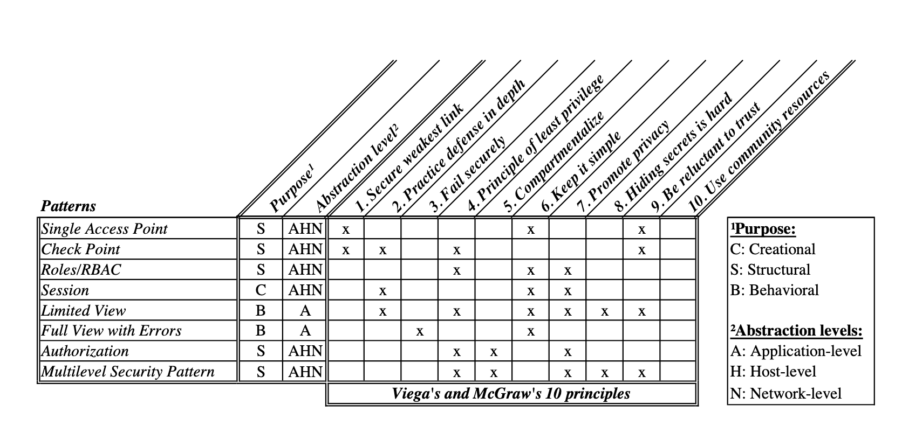

### 2.3 Vorteile

Die wesentlichen Vorteile der Nutzung von Security Patterns sind [[4](https://www.cse.msu.edu/~cse870/Materials/security-patterns.pdf)]:

- Die Lösung des Musters gilt als gut, weil sie bereits mehrfach angewendet wurde (zeitgeprüft, wann war das?).
- Die Vor- und Nachteile der Verwendung eines Musters sind im Voraus bekannt und können bei den Entwurfstätigkeiten berücksichtigt werden.
- Die Kommunikation zwischen verschiedenen Stakeholdern (z.B. zwischen dem Softwarearchitekten und dem Entwickler) kann durch die Verwendung des durch das Muster festgelegten Vokabulars für Entwurfskonzepte erleichtert werden.
- Die Muster fangen die Erfahrungen von Experten über gute oder bewährte Praktiken ein und dokumentieren diese Weisheiten in einem leicht verständlichen Format.


## 3 Security $$\subset$$ Software Engineering


> If it’s provably secure, it probably isn’t.
>
> – LARS KNUDSEN

Viele Systeme haben kritische Sicherheitsanforderungen. Ihr Ausfall kann Menschenleben und die Umwelt gefährden. Als Beispiel wäre in dieser Hinsicht der terroristische Angriff vom 11. September 2001 zu nennen, bei dem es den Angreifern möglich war Messer durch die Flughafensicherheit zu schleusen. Dies ist dabei kein Fehler des Sicherheitsmechanismus selbst, sondern der damaligen Sicherheitspolitik, da es erlaubt war Messer bis zu einer bestimmten Größe mit an Board zu nehmen.

Sicherheitsingenieure müssen all dies verstehen, sie müssen in der Lage sein, Risiken und Bedrohungen in einen Kontext zu stellen, realistische Einschätzungen dessen vornehmen, was schiefgehen könnte, um den Kunden einen guten Rat geben können. Das erfordert ein hohes Maß an Know-how, um die Risiken und Bedrohungen des Systems realistisch einschätzen zu können.

Ein weit verbreitetes Beispiel ist `Alice authenticates herself to Bob`. Diese Beispiele werden oft verwendet, um Sicherheitsmechanismen beispielhaft zu beschreiben. Für ein Leihen kann der Satz `Alice authenticates herself to Bob` eine ausreichende Beschreibung sein, für einen Sicherheitsexperten verstecken sich dort jedoch einige Ungenauigkeiten.

- Ist gemeint das Alice Bob beweist das ihr Name wirklich Alice ist, oder ist sie vielleicht Charlie?
- Ist gemeint das Alice eine menschliche Person ist, oder ist Alice vielleicht eine SmartCard, die so tut, als ob sie Alice wäre?

Wenn Alice Charlie ihre Karte leiht, ist Alice dem System zwar vertraut, aber noch lange nicht vertrauenswürdig. Solche Details spielen im heutigen Softwareengineering eine sehr große Rolle. Wenn früher ein Softwareentwickler neben dem Anwendungsdesign sich auch um Sicherheitsfragen bemüht hat, ist es heute nahezu in jedem Softwaresystem wichtig Sicherheitsexperten mit einzubeziehen. [[5](https://www.cl.cam.ac.uk/~rja14/book.html)]

### 3.1 Beispiele

#### 3.1.1 Authorization Pattern

[6]

**Context**

- Jede rechnerische Umgebung, in der es aktive Entitäten gibt, die Ressourcen anfordern, deren Zugriff kontrolliert werden muss.

**Problem**

- Wie man zulässige Arten von Zugriffen (Berechtigungen) durch aktive Recheneinheiten (Subjekte) auf passive Ressourcen (Schutzobjekte) beschreibt.

**Motivation**

- Die Berechtigungsstruktur muss unabhängig von der Art der Ressourcen sein, d. h. sie sollte z. B. den Zugriff von Benutzern auf konzeptionelle Einheiten, den Zugriff von Programmen auf Betriebssystemressourcen usw. in einheitlicher Weise beschreiben.
- Wächter können die Verwendung der Genehmigung nach bestimmten Bedingungen einschränken.
- Einige der Ermächtigungen können von ihren Inhabern an andere Subjekte delegiert werden.

**Solution**

- Die Elemente einer Berechtigungsregel als Klassen und Assoziationen darstellen. 
- Die Klasse *Subject* beschreibt die aktiven Entitäten, während die Klasse *ProtectionObject* die angeforderte Ressource beschreibt. 
- Eine Berechtigungsregel wird durch eine Assoziation zwischen diesen beiden Klassen definiert. Eine Assoziationsklasse *Right* enthält die Art des erlaubten Zugriffs (Lesen, Schreiben,...), ein Prädikat, das für die zu haltende Berechtigung wahr sein muss, und ein Kopierkennzeichen, das wahr oder falsch sein kann und angibt, ob das Recht übertragen werden kann oder nicht.
- Eine *operationcheck_rights* kann im Subjekt oder Objekt verwendet werden, um die Gültigkeit einer Anforderung zu prüfen. 

**Example**

In diesem UML Diagramm werden die beteiligten Objekte dargestellt. Das anschließende Sequenzdiagramm zeigt eine Anforderungsvalidierung. *ActiveSubject* ist ein Akteur, z.B. ein ausführender Prozess, der eine Ressource anfordert. Diese Anforderung wird von einem Referenzmonitor abgefangen.

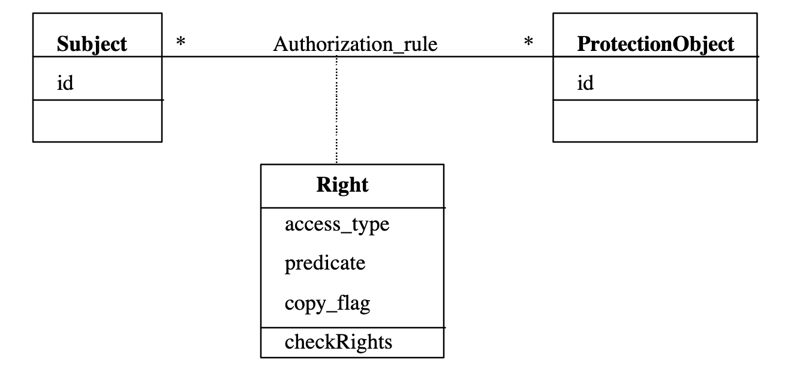


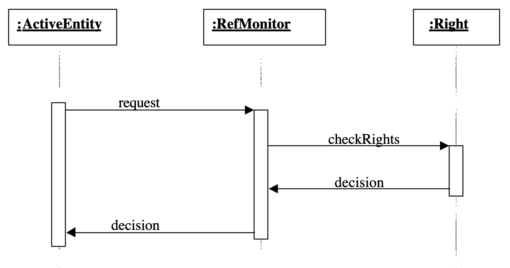

**Consequences**

- Das Muster gilt für jede Art von Ressource. Subjekte können ausführende Prozesse, Benutzer, Rollen, Benutzergruppen sein. Schutzobjekte können Transaktionen, Speicherbereiche, E/A-Geräte, Dateien oder andere OS-Ressourcen sein. Zugriffsarten können Lesen, Schreiben, Ausführen oder Methoden in übergeordneten Objekten sein.
- Die Prädikate in den Regeln sind eine allgemeine Darstellung aller Bedingungen, die die Anwendung einer Regel einschränken können.
- Das Kopierkennzeichen in der Regel steuert die Übertragung von Rechten. Einige Systeme trennen die administrativen Berechtigungen von den Benutzerberechtigungen, um die Sicherheit zu erhöhen (Prinzip der Aufgabentrennung)
- Die Anfrage muss möglicherweise nicht das genaue Objekt in der Regel angeben, dieses Objekt kann durch ein bereits vorhandenes geschütztes Objekt impliziert sein. Subjekte und Zugriffsarten können auch impliziert sein. Dies verbessert die Flexibilität auf Kosten zusätzlicher Bearbeitungszeit (zur Ableitung der benötigten spezifischen Regel).

**Know uses**

- Dieses Modell entspricht den Komponenten der Zugriffsmatrix, einem grundlegenden Sicherheitsmodell. In der Folgezeit ist es in verschiedenen anderen Papieren und Produkten erschienen. Es ist die Grundlage für die Zugangskontrollsysteme der meisten kommerziellen Produkte, z. B. Unix, Windows, Oracle und vieler anderer.

**Related Pattern**

- Das RBAC-Muster ist z. B. eine Spezialisierung dieses Musters und dient der Zugriffskontrolle auf Dateien in Betriebssystemen.

#### 3.1.2 Roles/RBAC Pattern

[6]

**Context**

- Die meisten Institutionen haben eine Vielzahl von Arbeitsaufgaben, die unterschiedliche Fähigkeiten und Verantwortlichkeiten erfordern. Aus Sicherheitsgründen sollten die Benutzer Rechte auf der Grundlage ihrer beruflichen Funktionen erhalten. Dies entspricht der Anwendung des Need-to-know-Prinzips, einer grundlegenden Sicherheitspolitik. Berufliche Funktionen können als Rollen interpretiert werden, die Menschen bei der Erfüllung ihrer Pflichten spielen. Insbesondere webbasierte Systeme haben eine Vielzahl von Benutzern: Mitarbeiter des Unternehmens, Kunden, Partner, Suchmaschinen usw.

**Problem**

- Wie man Benutzern entsprechend ihrer Rolle in einer Institution Rechte zuweist.

**Motivation**

- Die Menschen in Institutionen haben je nach ihrer Funktion unterschiedliche Bedürfnisse für den Zugang zu Informationen.
- Wir möchten der Institution helfen, genaue Zugriffsrechte für ihre Mitglieder gemäß der Need-to-know-Politik zu definieren.
- Die Vergabe von Rechten an einzelne Benutzer würde die Speicherung vieler Autorisierungsregeln erfordern, und es wäre auch für die Administratoren schwierig, den Überblick über diese Regeln zu behalten. 
- Es kann sein, dass Benutzer mehr als eine Rolle haben, und es kann sein, dass wir Richtlinien wie z. B. die Trennung von Aufgaben durchsetzen wollen, bei denen ein Benutzer nicht zwei bestimmte Rollen in derselben Sitzung innehaben kann.
- Es kann sein, dass wir Hierarchien von Rollen mit vererbten Rechten benötigen.
- Eine Rolle kann einzelnen Benutzern oder Benutzergruppen zugewiesen werden.

**Solution**

- Erweiterung des Autorisation Pattern, dadurch Rollen als Subjekte zu interpretieren. 
- Die Klassen *Benutzer* und *Rolle* beschreiben die registrierten Benutzer bzw. die vordefinierten Rollen. Benutzer werden Rollen zugewiesen, Rollen erhalten Rechte entsprechend ihren Funktionen.
- Die Zuordnungsklasse Recht definiert die Zugriffsarten, zu deren Anwendung auf das Schutzobjekt ein Benutzer innerhalb einer Rolle berechtigt ist. 
- Tatsächlich ist die Kombination Rolle, Schutzobjekt und Recht eine Instanz des Autorisation Pattern. Dementsprechend weist das Prädikat auf inhaltsabhängige Einschränkungen hin, die zur Auswahl bestimmter Objekte verwendet werden können. 

**Example**

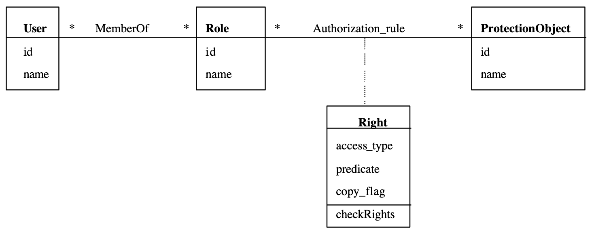


**Consequences**

- Zu den Vorteilen dieses Musters gehören:
  - Es ermöglicht Administratoren, die Komplexität der Sicherheit zu reduzieren, es gibt viel mehr Benutzer als Rollen.
  - Einrichtungsrichtlinien über Arbeitsfunktionen können direkt in der Definition von Rollen und der Zuordnung von Benutzern zu Rollen widergespiegelt werden.
  - Rollen können für weitere Flexibilität und die Reduzierung von Regeln strukturiert werden.
  - Benutzer können für funktionale Flexibilität mehr als eine Sitzung gleichzeitig aktivieren (einige Aufgaben können mehrere Ansichten oder verschiedene Arten von Aktionen erfordern). Wir können UML-Einschränkungen hinzufügen, um anzuzeigen, dass einige Rollen nicht in derselben Sitzung verwendet werden können, die demselben Benutzer zugeordnet ist (Aufgabentrennung).
  - Gruppen von Benutzern können als Rollenmitglieder verwendet werden, wodurch die Anzahl der Berechtigungsregeln und die Anzahl der Rollenzuweisungen weiter reduziert wird.
- Zu den möglichen Nachteilen gehören:
  - Zusätzliche konzeptionelle Komplexität (neues Rollenkonzept, Zuweisungen an mehrere Rollen,...).
  - Es gibt andere mögliche Strukturen von Rollen, die für bestimmte Umgebungen nützlich sein können.

**Know uses**

- Dieses Modell bildete die Grundlage der meisten Forschungsarbeiten und Implementierungen.
- RBAC ist in einer Vielzahl kommerzieller Systeme implementiert, darunter J2EE von Sun, Windows 2000 von Microsoft, WebSphere von IBM und Oracle, um nur einige zu nennen. Es hat sich gezeigt, dass die grundlegenden Sicherheitseinrichtungen von JavasJDK 1.2 in der Lage sind, eine Vielzahl von RBAC-Richtlinien zu unterstützen.

**Related Pattern**

- Das Muster in Beispiel umfasst das Authoristation Pattern und das Composite Pattern. Weitere verwandte Muster sind das Rollenmuster und die abstrakte Sitzung.

#### 3.1.2 Authenticator Pattern

[10]

**Context**

- Computer Systeme enthalten oft Ressourcen die wertvolle Informationen eines Unternehmens enthalten. Es sollen dann nur Subjekte Zugang zu diesen Informationen erhalten, die berechtigt sind, bestimmte Ressourcen abzurufen. 

**Problem**

- Wie kann verhindert werden, dass Betrüger auf das System zugreifen? Ein böswilliger Angreifer könnte versuchen, sich als legitimer Benutzer auszugeben, um Zugang zu seiner Ressource zu erhalten. Dies könnte besonders schwerwiegend sein, wenn der Benutzer, der sich als solcher ausgibt, über ein hohes Maß an Privilegien verfügt. Wie kann überprüft werden, ob ein Benutzer, der auf das System zugreifen will, legitim ist?

**Solution**

- Verwenden Sie einen einzigen Zugangspunkt, um die Interaktionen eines Subjekts mit dem System zu empfangen, und wenden Sie ein Protokoll an, um die Identität des Subjekts zu überprüfen. Das verwendete Protokoll kann einfach oder komplex sein, je nach den Bedürfnissen der Anwendung.

**Example**

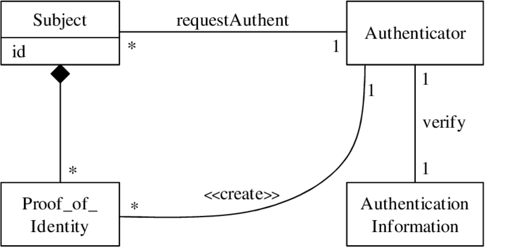

**Known Uses**

- SAML, ein Webdienst-Standard für Sicherheit, definiert eine seiner Hauptverwendungen als eine Möglichkeit, Authentifizierung in Webdiensten zu implementieren.

**Related Pattern**

- Single-Sign-On (SSO) ist ein Prozess, bei dem ein Subjekt seine Identität verifiziert, und das Ergebnis dieser Verifizierung kann über mehrere Domänen und für eine bestimmte Zeitspanne verwendet werden. Das Ergebnis der Authentisierung ist ein Authentisierungstoken, mit dem alle zukünftigen Zugriffe des Benutzers qualifiziert werden können.

#### 3.1.3 Zusammenfassung

Die tatsächliche Umsetzung dieser Muster hängt von der architektonischen Ebene ab, auf der sie angewendet werden. Ein wichtiger Punkt ist hier die Frage, wie der Zugang mit geringem Overhead kontrolliert werden kann. Das Autorisierungsmuster kann unter Verwendung von Zugriffskontrolllisten (ACLs) implementiert, wie es in den meisten Betriebssystemen geschieht. Ein weiterer Implementierungsansatz ist der Einsatz von Fähigkeiten, wie er auf der Hardware- und Betriebssystemebene zur Steuerung von Ressourcen erfolgt ist. Die Verwendung von Metaklassen und Reflexion ist eine weitere interessante Möglichkeit, diese Modelle zu implementieren. Anfragen nach Ressourcen müssen abgefangen und mit den Informationen in den ACLs oder Fähigkeiten validiert werden, dies erfordert ein spezielles Programm, das als ReferenceMonitor bekannt ist. Eine mögliche Implementierung des Referenzmonitors ist das Abfangmuster. [[6]](https://hillside.net/plop/plop2001/accepted_submissions/PLoP2001/ebfernandezandrpan0/PLoP2001_ebfernandezandrpan0_1.pdf)

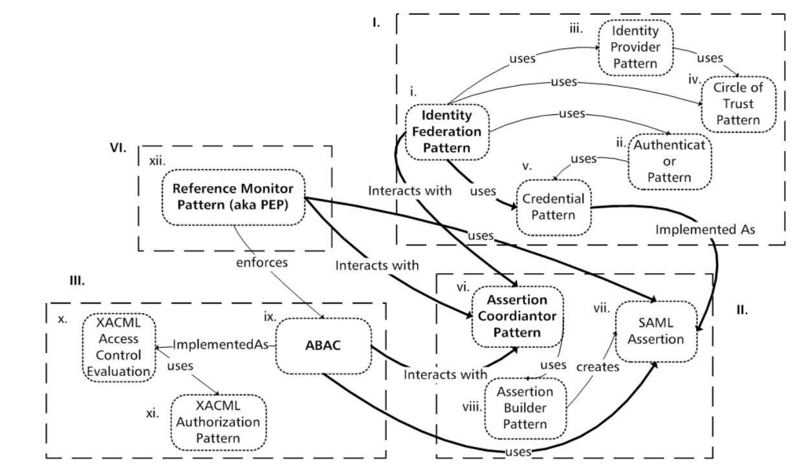

Die obere Abbildung zeigt eine *Authorization und Authentication Infrastructure* die eine Vielzahl an Entwurfsmustern beinhaltet, die miteinander interagieren. Dies soll verdeutlichen wie sich Entwurfsmuster auf einen kleinen und überschaubaren (handhabbaren) Teil reduzieren lassen. Wie in dem Beispiel von Christopher Alexander (vom Entwurf einer Stadt bis zum Entwurf eines einzelnen Raums), lassen sich auch hier die Muster vom Entwurf einer Cloudumgebung bis zu einem einzelnen Objektzugriff beschreiben. [11]

## 4 Cloud Security

Mit der *Cloud* wurde in der Informationstechnologie ein Begriff eingeführt, der so ziemlich alle Elemente der Informatik abdeckt und die darunterliegende Komplexität verschleiert. 

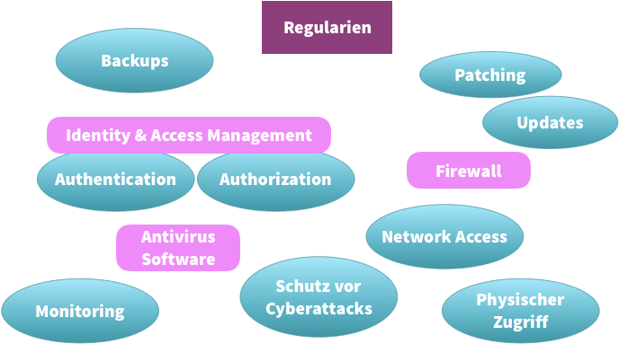

[12]

Für die Umsetzung einer Cloudumgebung müssen viele Disziplinen der Softwareentwicklung gemeistert werden, dabei spielen Sicherheitsmechanismen eine zentrale Rolle. Personen müssen autorisiert und authentifiziert werden, der Dateizugriff muss gemanagt werden, genauso wie Netzwerk- und Datenbankzugriff.

Hinter dem Begriff der Cloud haben sich, auf der nächsten Abstraktionsebene, die Begriffe der Services etabliert. *IaaS*, *PaaS* und *SaaS* sind Bezeichnungen, die eine Cloud nach ihrer Funktion kategorisieren. Für diese Kategorien existieren ebenfalls Entwurfsmuster, die im nächsten Abschnitt in Kurzform mit Lösung und Beispiel vorgestellt werden.

### 4.1 Cloud Services

#### 4.1.1 IaaS Pattern

**Solution**

- Die Lösung für dieses Problem ist eine Struktur, die aus vielen Servern, Storage und einem Netzwerk besteht, die von mehreren Benutzern gemeinsam genutzt werden kann und über das Internet zugänglich ist. Diese Ressourcen werden den Benutzern in Form von Infrastructure-as-a-Service (IaaS) zur Verfügung gestellt. IaaS basiert auf der Virtualisierungstechnologie, die einheitliche Ressourcen schafft, die von verschiedenen Anwendungen gemeinsam genutzt werden können. Diese Basisschicht - IaaS - kann als Referenz für nicht-funktionale Anforderungen verwendet werden. [7]

**Example**

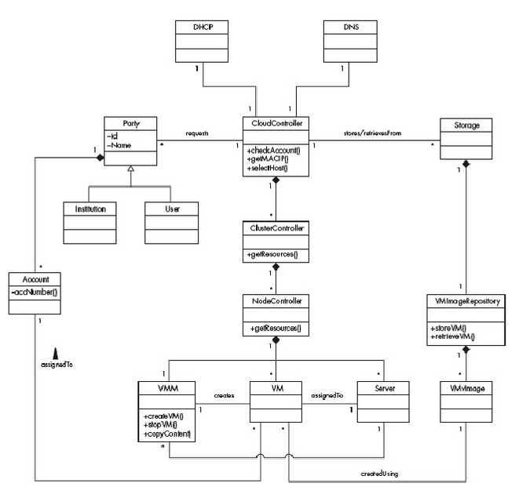

#### 4.1.2 PaaS Pattern

**Solution**

- PaaS bietet virtuelle Ausführungsumgebungen mit gemeinsam genutzten Tools und Bibliotheken für die Anwendungsentwicklung und den Einsatz in der Cloud. PaaS verwendet IaaS als Basisschicht (Server, Speicher und Netzwerk) und verbirgt die Komplexität der Verwaltung der darunter liegenden Infrastruktur. [7]

**Example**

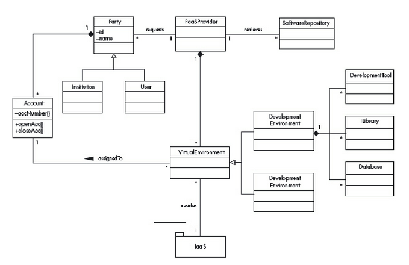

#### 4.1.3 SaaS Pattern

**Solution**

- SaaS-Anwendungen werden als Service für Benutzer in der Regel über das Internet mittels Webbrowser oder APIs bereitgestellt. SaaS in der Cloud ermöglicht es den Nutzern, auf Anwendungen auf Abruf zuzugreifen, bei denen sowohl die Berechnung als auch die Speicherung in der Cloud gehostet werden, ohne dass sie Software auf ihren lokalen Rechnern installieren müssen. SaaS kann mithilfe von zugrundeliegenden Platform-as-a-Service (PaaS)- oder Infrastructure-as-a-Service (IaaS)-Angeboten entwickelt und eingesetzt werden. [7]


**Example**

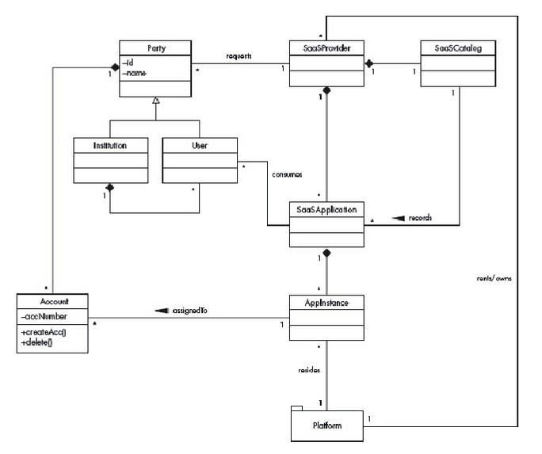

### 4.2 Authentifikation und Autorisierung

Wenn Sicherheitstechnik ein Kernthema hat, kann es die Untersuchung von Sicherheitsprotokollen sein. Sie spezifizieren die Schritte, die Prinzipien verwenden, um Vertrauensbeziehungen aufzubauen. 

Wenn wir zum Beispiel in einem Restaurant eine Flasche guten Wein bestellen, lautet das Standardprotokoll, dass der Weinkellner uns die Speisekarte gibt (damit wir die Preise sehen, unsere Gäste aber nicht); er bringt die Flasche mit, damit wir das Etikett, das Siegel und die Temperatur überprüfen können; er öffnet sie, damit wir sie probieren können; und dann serviert er sie. Dies hat sich entwickelt, um ein wenig Privatsphäre (unsere Gäste erfahren nicht den Preis), eine gewisse Integrität (wir können sicher sein, dass wir die richtige Flasche bekommen haben und dass sie nicht mit billigem Fusel nachgefüllt wurde) und Unleugbarkeit (wir können uns im Nachhinein nicht beschweren, dass der Wein in Ordnung war) zu gewährleisten. [8]

Hierfür wurden in der Vergangenheit Protokolle entwickelt, die die Authentifizierung von Nutzern gewährleisten und bekannte Authentifizierungsformen erweitern oder modernisieren. Zu nennen sind aktuell z. B. neben der Standardform (Basic Auth) mit *username* und *password*, die modernen Protokolle *OAuth2* und *Open ID Connect*.

Die nachfolgende Abbildung zeigt anschaulich welche Protokolle bei der Kommunikation moderner API's umgesetzt werden, anschließend werden die State-of-the-Art Mechanismen und Protokolle kurz vorgestellt.


[9]

**OAuth2**

OAuth2 ist zum Defacto-Standard bei der Sicherung von APIs durch Zugangsdelegationsmechanismen geworden. Mit OAuth2 können Sie Anwendungen die Erlaubnis erteilen (autorisieren), in Ihrem Namen auf einen bestimmten Satz von Ressourcen zuzugreifen, um Ihnen einen wertvollen Service zu bieten, ohne dass Sie Ihre Anmeldedaten angeben müssen. [9]

- Rollen in OAuth2

  - Resource Owner (User-Agent: Browser, App, PC, ..)
  - Resource Server (Datenbank, User-Informationen, Mail-Server, ...)
  - Authoritzation Server (IdP, Benutzerverwaltung)
  - Client (API Gateway) 

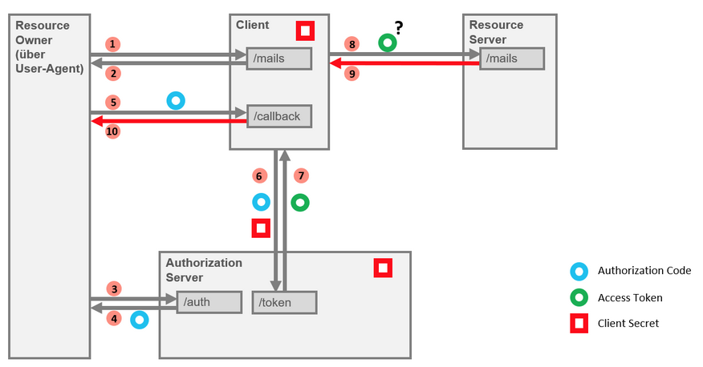

Voraussetzung für dieses Beispiel ist, das der Authorization Server und der Client zuvor ein Vertrauensverhältnis aufgebaut haben (Client Secret).

1. Der User möchte seine E-Mails abrufen

2. Der Client stellt fest das für den User noch keine Autorisierung vorliegt und leitet den User (Browser-Redirect) an den Autorisierungsserver weiter

3. Der User-Agent des Users (Browser) folgt der Weiterleitung zum Autorisierungsservers.

   - Die Authentifizierung ist dabei nicht Teil der OAuth2-Spezification. (Nur Autorisierung)

4. Nach erfolgreichem Login erhält der User-Agent einen *Authorization Code*

   - Der *Authorization Code* ist eine zufällige und schwer zu erratene Zeichenkette

5. Mit dem Erhalt des *Authorization Code* wir der User-Agent zurück zum Client geleitet

6. Der Client kann nun mit dem *Authorization Code* und seinem *Client Secret* einen dauerhaften (mit Lebensdauer) *Access Token* für Ressourcenanfragen anfordern. Dieser Token enthält, außer dem Token selbst, weitere Informationen:

   - `access_token` - Der *Access Token* selbst.
   - `token_type` - Gibt die Art und die Verwendungsmöglichkeiten des Access Tokens an
   - `expires_in` - Gültigkeit des *Access Token*
   - `scope` - Gültigkeitsbereich für den *Access Token* (Autorisierung)
   - `id_token` - Nicht Teil der OAuth2 Spezifikation --> OpenID Connect
   - `refresh_token` - Ermöglich die Erneuerung des *Access Token*, falls dieser abgelaufen ist oder seine Gültigkeit verloren hat

7. Der Client erhält den *Access Token* und kann damit die Ressourcen anfordern. Nach dem Erhalt des *Access Token* endet die Spezifikation von OAuth2, der Aufruf des Ressource-Servers mit dem *Access Token* wird nicht beschrieben

   ```
   {
   "access_token":"tl9jckcemkk4t3mrcujkj41260",
   "token_type":"Bearer",
   "expires_in":900,
   "scope":"openid mail",
   "id_token":"eyJraWQiOiJsdXRhYXVxMGE2ajdlOXI1Zm1lYWR…KfBHxRqpAlpfC3i2SmLxEev2SynrDqxmw",
   "refresh_token":"pc2movr8gls98er4e66ghhjpqi"
   }
   ```

[13]

**OIDC / JWT**

OpenID Connect ist eine Schicht, die auf dem OAuth2-Protokoll aufbaut und es um die Möglichkeit ergänzt den User mit einem *ID Token* zu Authentifizieren. Der *ID Token* enthält Informationen die in einem sogenannten *JSON WEB Token* (JWT) verpackt sind und durch den Client extrahiert werden können. Mit diesen Informationen lässt sich z. B. ein Single-Sign-On Mechanismus (SSO) umsetzen, bei dem Anfragen an verschiedene Ressourcenquellen nicht nur die Erlaubnis enthalten, sondern auch den Anfragesteller identifizieren können.

**Weitere Protokolle**

- Kerberos
- SAML2

## 5 Quellen

[1] - [Wikipedia - Pattern Language](https://en.wikipedia.org/wiki/Pattern_language)

[2] - [OSA - IT Security Patterns](https://www.opensecurityarchitecture.org/cms/definitions/security_patterns)

[3] - [Dissertation Bunke - Uni Bremen, (Kapitel 2.5)](http://www.informatik.uni-bremen.de/~sohr/papers/DissertationBunke.pdf)

[4] - [Security Patterns, R.Wassermann u. B.H,C Cheng, MSU](https://www.cse.msu.edu/~cse870/Materials/security-patterns.pdf)

[5] - [Security Engineering](https://www.cl.cam.ac.uk/~rja14/book.html)

[6] - [Understanding Security with Patterns, Eduardo Fernandez-Buglioni](https://hillside.net/plop/plop2001/accepted_submissions/PLoP2001/ebfernandezandrpan0/PLoP2001_ebfernandezandrpan0_1.pdf)

[7] - [Security Pattern in Practice, Eduardo Fernandez-Buglioni ](https://ebookcentral.proquest.com/lib/fhbielefeld/detail.action?docID=1245159)

[8] - [Security Engineering — Third Edition](https://www.cl.cam.ac.uk/~rja14/book.html)

[9] - [API Security](https://medium.com/solutions-architecture-patterns/api-security-pattern-8967c58bb386)

[10] - [Security Pattern Catalog](https://people.cs.kuleuven.be/~koen.yskout/icse15/catalog.pdf)

[11] - [Authentication and Authorisation Infrastructures, R. Erber, C. Schläger, G. Pernul](https://core.ac.uk/download/pdf/11536504.pdf)

[12] - [Informatik Aktuell Artikel, Cloud Security Grundlagen](https://www.informatik-aktuell.de/betrieb/sicherheit/cloud-security-grundlagen.html?utm_source=CleverReach&utm_medium=email&utm_campaign=Newsletter+2020%2F9&utm_content=Mailing_7525364)

[13] - [OAuth2 in Bildern](https://www.predic8.de/oauth2-beispiel.htm)